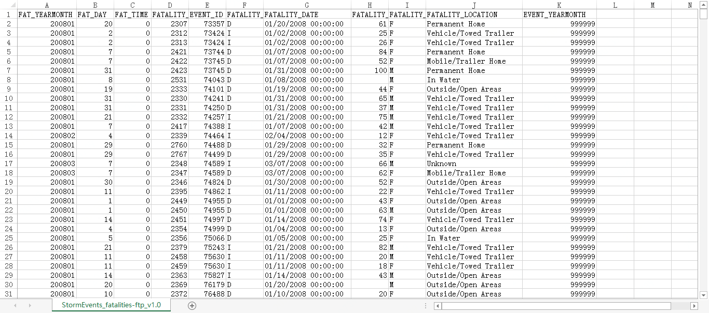

### DDL

```sql
CREATE DATABASE accumulo;

use accumulo;
```


### Dataset

All CSV  from National Oceanic and Atmospheric Administration’s (NOAA)   [National Climatic Data Center website](https://www1.ncdc.noaa.gov/pub/data/swdi/stormevents/csvfiles/).

```shell
wget https://www1.ncdc.noaa.gov/pub/data/swdi/stormevents/csvfiles/StormEvents_locations-ftp_v1.0_d2011_c20170519.csv.gz
```

#### Dataset preview

)

### Hive

Four configuration parameters must specified :    

- [x] accumulo.instance.name 
- [x] accumulo.zookeepers 
- [x] accumulo.user.name 
- [x] accumulo.user.pass    

```sql
hive>use accumulo;

hive>CREATE TABLE storm_fatalities (
  fat_yearmonth INT,
  fat_day INT,
  fat_time INT,
  fatality_id STRING,
  event_id STRING,
  fatality_type STRING,
  fatality_date DATE,
  fatality_age INT,
  fatality_sex STRING,
  fatality_location STRING,
  event_yearmonth INT)
ROW FORMAT DELIMITED 
    DS TERMINATED BY ',' 
STORED AS textfile 
TBLPROPERTIES('skip.header.line.count'='1'); 

hive>LOAD DATA LOCAL INPATH '/export/app_sdk/StormEvents_locations-ftp_v1.0_d2011_c20170519.csv.gz' INTO TABLE accumulo.storm_fatalities;
```


```shell
hive -hiveconf accumulo.instance.name=hdp-accumulo-instance \
-hiveconf accumulo.zookeepers=host-10-182-93-202 -hiveconf accumulo.user.name=root \
-hiveconf accumulo.user.pass=AccumuloRoot01
```


```sql
hive>CREATE TABLE acc_storm_fatalities (
  fat_yearmonth INT,
  fat_day INT,
  fat_time INT,
  fatality_id STRING,
  event_id STRING,
  fatality_type STRING,
  fatality_date DATE,
  fatality_age INT,
  fatality_sex STRING,
  fatality_location STRING,
  event_yearmonth INT
) STORED BY 'org.apache.hadoop.hive.accumulo.AccumuloStorageHandler' WITH SERDEPROPERTIES (
  'accumulo.columns.mapping' = 'time:yearmonth,time:day,time:time,:rowid,event:id,fatality:type,
time:date,person:age,person:sex,fatality:location,event:yearmonth'
);
```


```sql
CREATE TABLE `acc_storm_fatalities`(
  `fat_yearmonth` int COMMENT 'from deserializer', 
  `fat_day` int COMMENT 'from deserializer', 
  `fat_time` int COMMENT 'from deserializer', 
  `fatality_id` string COMMENT 'from deserializer', 
  `event_id` string COMMENT 'from deserializer', 
  `fatality_type` string COMMENT 'from deserializer', 
  `fatality_date` date COMMENT 'from deserializer', 
  `fatality_age` int COMMENT 'from deserializer', 
  `fatality_sex` string COMMENT 'from deserializer', 
  `fatality_location` string COMMENT 'from deserializer', 
  `event_yearmonth` int COMMENT 'from deserializer')
ROW FORMAT SERDE 
  'org.apache.hadoop.hive.accumulo.serde.AccumuloSerDe' 
STORED BY 
  'org.apache.hadoop.hive.accumulo.AccumuloStorageHandler' 
WITH SERDEPROPERTIES ( 
  'accumulo.columns.mapping'='time:yearmonth,time:day,time:time,:rowid,event:id,fatality:type,\ntime:date,person:age,person:sex,fatality:location,event:yearmonth', 
  'serialization.format'='1')
TBLPROPERTIES (
  'COLUMN_STATS_ACCURATE'='{\"BASIC_STATS\":\"true\"}', 
  'numFiles'='0', 
  'numRows'='0', 
  'rawDataSize'='0', 
  'totalSize'='0', 
  'transient_lastDdlTime'='1531905095')
```

**Tips**:

Table `storm_fatalities`  namespace is `accumulo`,  but  **`acc_storm_fatalities`** in **`default`** namespace.

### Login Accumulo

```shell
accumulo shell -u root -p AccumuloRoot01

>tables ;
 ---------------------------------
 acc_storm_fatalities

```


### Copy data to Accumulo table

```sql
hive> INSERT OVERWRITE TABLE acc_storm_fatalities SELECT * FROM accumulo.storm_fatalities;
Query ID = hive_20180719104640_57a2cc82-f69f-4631-b5cb-4eee37e8c69f
Total jobs = 1
Launching Job 1 out of 1
Tez session was closed. Reopening...
Session re-established.
Status: Running (Executing on YARN cluster with App id application_1531893888158_0006)

--------------------------------------------------------------------------------
        VERTICES      STATUS  TOTAL  COMPLETED  RUNNING  PENDING  FAILED  KILLED
--------------------------------------------------------------------------------
Map 1 ..........   SUCCEEDED      1          1        0        0       0       0
--------------------------------------------------------------------------------
VERTICES: 01/01  [==========================>>] 100%  ELAPSED TIME: 10.67 s    
--------------------------------------------------------------------------------
OK
Time taken: 21.4 seconds
```

