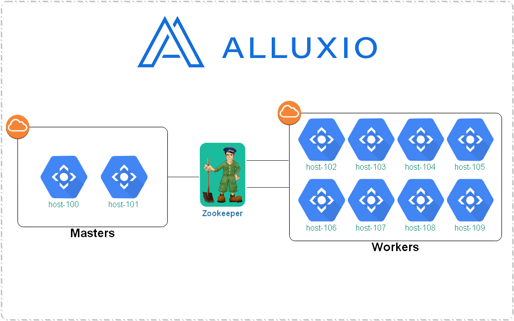

### Overview

> Deploy Diagram




### Install

1. Download and install

   ```shell
   tar xvzf alluxio-{VERSION}-bin.tar.gz -C $ALLUXIO_HOME
   ```

   

2. Add **root** user to **hadoop** group

   ```shell
   sudo usermod -a -G root,hadoop root
   ```

3. d


### Hadoop

1. hadoop-env.sh

   ```ini
   export HADOOP_CLASSPATH=/<PATH_TO_ALLUXIO>/client/alluxio-1.8.1-client.jar:${HADOOP_CLASSPATH}
   ```

2. core-site.xml

   Add the following two properties to the `core-site.xml` file of your Hadoop installation:

   ```xml
   <property>
     <name>fs.alluxio.impl</name>
     <value>alluxio.hadoop.FileSystem</value>
   </property>
   <property>
     <name>fs.AbstractFileSystem.alluxio.impl</name>
     <value>alluxio.hadoop.AlluxioFileSystem</value>
   </property>
   ```

   

3. Copy `alluxio-client-{VERSION}.jar` to `HADOOP_CLASSPATH`

   ```ini
   tree lib | grep alluxio       
   |-- alluxio-1.8.1-client.jar
   ```

   

### Spark

1. spark-defaults.conf

   Alternatively, add the following lines to `spark/conf/spark-defaults.conf`:

   ```ini
   spark.driver.extraClassPath /<PATH_TO_ALLUXIO>/client/alluxio-1.8.1-client.jar
   spark.executor.extraClassPath
   /<PATH_TO_ALLUXIO>/client/alluxio-1.8.1-client.jar
   ```

   When running Alluxio with fault tolerant mode with zookeeper, add the following line to `${SPARK_HOME}/conf/spark-defaults.conf`:

   ```ini
   spark.driver.extraJavaOptions -Dalluxio.zookeeper.address=zookeeperHost1:2181,zookeeperHost2:2181 -Dalluxio.zookeeper.enabled=true
   spark.executor.extraJavaOptions -Dalluxio.zookeeper.address=zookeeperHost1:2181,zookeeperHost2:2181  -Dalluxio.zookeeper.enabled=true
   ```

   

2. alluxio-client

   Copy `alluxio-client-{VERSION}.jar` to `SPARK_CLASSPATH`

   ```shell
   tree jars | grep alluxio
   |-- alluxio-1.8.1-client.jar
   
   cp #ALLUXIO_HOME/client/alluxio-1.8.1-client.jar $SPARK_HOME/jars
   ```

3. 

   ```ini
   
   ```

   

### Alluxio

1. alluxio-site.properties

   ```ini
   # HDFS namenode HA mode
   alluxio.underfs.hdfs.configuration=/export/cloud/alluxio-1.8.1/conf/core-site.xml:/export/cloud/alluxio-1.8.1/conf/hdfs-site.xml
   
   # Alluxio HA Cluster
   alluxio.zookeeper.enabled=true
   alluxio.zookeeper.address=host-192-168-45-209:2181,host-192-168-45-210:2181,host-192-168-45-211:2181
   alluxio.underfs.address=hdfs://flyedw/alluxio/root/
   alluxio.master.journal.folder=hdfs://flyedw/alluxio/journal/
   ```

   

   - [x] masters configuration

   > host-192-168-58-100

   `alluxio-site.properties`

   ```ini
   alluxio.master.hostname=host-192-168-58-100
   ```

   

   > host-192-168-58-101

   `alluxio-site.properties`

   ```ini
   alluxio.master.hostname=host-192-168-58-101
   ```

   

2. masters

   ```ini
   host-192-168-58-100
   host-192-168-58-101
   ```

   

3. workers

   ```ini
   host-192-168-58-102
   host-192-168-58-103
   host-192-168-58-104
   host-192-168-58-105
   host-192-168-58-106
   host-192-168-58-107
   host-192-168-58-108
   host-192-168-58-109
   ```

   

4. hadoop

   Copy `core-site.xml` and `hdfs-site.xml` from `HADOOP_CONF` to `ALLUXIO_CONF`

   ```ini
   conf/
   |-- alluxio-env.sh.template
   |-- alluxio-site.properties
   |-- alluxio-site.properties.template
   |-- core-site.xml -> /etc/hadoop/3.1.0.0/core-site.xml
   |-- core-site.xml.template
   |-- hdfs-site.xml -> /etc/hadoop/3.1.0.0/hdfs-site.xml
   |-- log4j.properties
   |-- masters
   |-- metrics.properties.template
   `-- workers
   ```

   

5. mkdir -- hdfs

   ```sh
   hdfs dfs -p ${alluxio.underfs.address}
   
   hdfs dfs -chown -R root:hadoop ${alluxio.underfs.address}
   ```
   
   

6. mkdir -- local

   ```sh
   mkdir -p /mnt/ramdisk
   chmod 777 /mnt/ramdisk
   ```

   

7. Test

   ```sh
   ./spark-shell
   >var s = spark.read.load("alluxio://zk@host-192-168-45-209:2181,host-192-168-45-210:2181,host-192-168-45-211:2181/airline_ontime/2018_1.parquet")
   ```

   

8. 