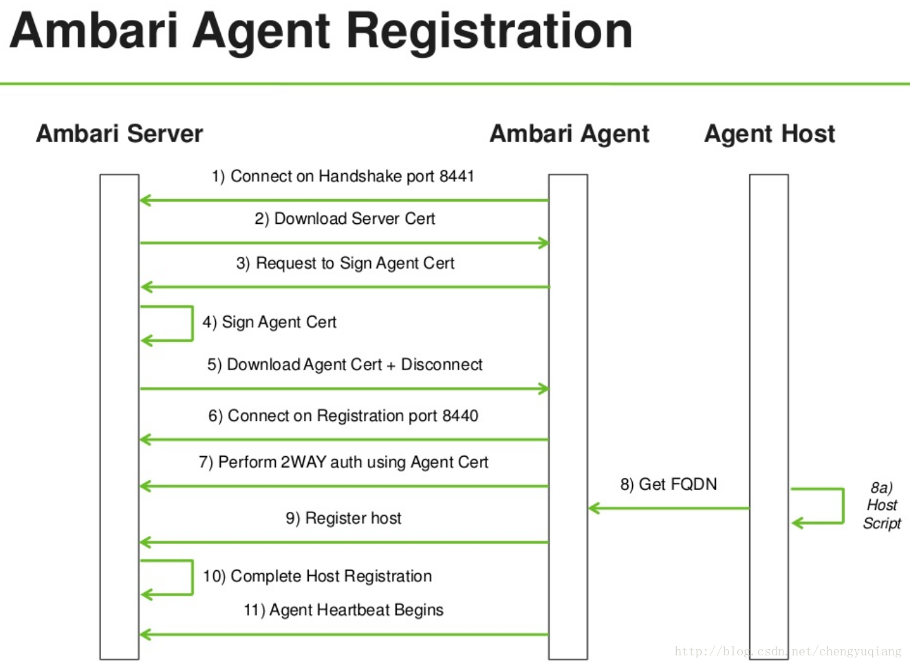

## 1.Ambari介绍

Ambari是hadoop分布式集群配置管理工具，是由hortonworks主导的开源项目。它已经成为apache基金会的孵化器项目，已经成为hadoop运维系统中的得力助手，引起了业界和学术界的关注。

### 1.1 基本概念

1. Resource：Ambari把可以被管理的资源的抽象为一个Resource实例，资源可以包括服务、组件、主机节点等，一个resource实例中包含了一系列该资源的属性； 

2. Property：服务组件的指标名称； 
3. ResourceProvider和PropertyProvider分别对应Resource和Property的提供方，获取指标需要先获取Resource，然后获取Property对应的metric； 
4. Query:Query是Resource的内部对象，代表了对该资源的操作； 
5. Request：一个Request代表了对Resource的操作请求，包含http信息及要操作的Resource的实例，Request按照http的请求方式分为四种：GET、PUT、DELETE、POST； 
6. Predicate：一个Predicate代表了一系列表达式，如and、or等；

### 1.2 基本组件

Ambari 可以分为 5个大的组件,分别是是 **Ambari-server 、 Ambari-web 、 Ambari-agent 、 Ambari-metrics-collector 和 Ambari-metrics-monitor** 。 
1. 在集群的每一台机器上都会部署 Ambari-agent 程序。 Agent 主要负责接收来着 Server 端的命令, 
这些命令可以是安装、启动、停止 Hadoop 集群上的某一服务。同时, agent 端需要向 Ambari-server 端上 
报命令执行的结果,是执行成功还是失败。 
2. Ambari-Server 提供 REST 接口给Agent 和 Web 访问。用户甚至可以不用界面,而是通过 curl 命令来操控集群。 
3. Ambari-metric-collector和 Ambari-metrics-monitor 是收集群中组件 metrics 的模块。 关于Ambari Metrics ，请参考：<https://www.ibm.com/developerworks/cn/opensource/os-cn-ambari-metrics/index.html>

### 1.3 相关技术

Ambari充分利用了一些已有的优秀开源软件，巧妙地把它们结合起来，使其在分布式环境中做到了集群式服务管理能力、监控能力、展示能力，这些优秀的开源软件有： 
（1）agent端，采用了puppet管理节点。 
（2）在web端，采用ember.js作为前端MVC框架和NodeJS相关工具，用handlebars.js作为页面渲染引擎，在CSS/HTML方面还用了Bootstrap框架。 
（3）在Server端，采用了Jetty、Spring、JAX-RS等。 
（4）同时利用了Ganglia、Nagios的分布式监控能力。

Ambari架构采用的是Server/Client的模式，主要由两部分组成：**ambari-agent和ambari-server**。ambari依赖其它已经成熟的工具，例如其ambari-server 就依赖python，而ambari-agent还同时依赖ruby, puppet，facter等工具，还有它也依赖一些监控工具nagios和ganglia用于监控集群状况。 
其中： 
1. puppet是分布式集群配置管理工具，也是典型的Server/Client模式，能够集中式管理分布式集群的安装配置部署，主要语言是ruby。 
2. facter是用python写的一个节点资源采集库，用于采集节点的系统信息，例如OS信息，主机信息等。由于ambari-agent主要是用python写的，因此用facter可以很好地采集到节点信息。

**Technology Stack技术堆栈** 
来源：<https://cwiki.apache.org/confluence/display/AMBARI/Technology+Stack>

**Ambari Server**

- Server code: Java 1.7 / 1.8
- Agent scripts: Python
- Database: Postgres, Oracle, MySQL
- ORM: EclipseLink
- Security: Spring Security with remote LDAP integration and local database
- REST server: Jersey (JAX-RS)
- Dependency Injection: Guice
- Unit Testing: JUnit
- Mocks: EasyMock
- Configuration management: Python

**Ambari Web**

- Frontend code: JavaScript
- Client-side MVC framework: Ember.js / AngularJS
- Templating: Handlebars.js (integrated with Ember.js)
- DOM manipulation: jQuery
- Look and feel: Bootstrap 2
- CSS preprocessor: LESS
- Unit Testing: Mocha
- Mocks: Sinon.js
- Application assembler/tester: Brunch / Grunt / Gulp 

## 2 Ambari项目目录结构

### 2.1 总体目录

| 目录           | 描述                                                       |
| -------------- | ---------------------------------------------------------- |
| ambari-server  | Ambari的Server程序，主要管理部署在每个节点上的管理监控程序 |
| Ambari-agent   | 部署在监控节点上运行的管理监控程序                         |
| ambari-web     | Ambari页面UI的代码，作为用户与Ambari server交互的。        |
| ambari-views   | 用于扩展Ambari Web UI中的框架                              |
| ambari-common  | Ambari-server 和Ambari-agent 共用的代码                    |
| ambari-metrics | 在Ambari所管理的集群中用来收集、聚合和服务Hadoop和系统计量 |
| Contrib        | 自定义第三方库                                             |
| Docs           | 文档                                                       |


### 2.2 Ambari-server目录

| 目录                                         | 描述                                                         |
| -------------------------------------------- | ------------------------------------------------------------ |
| org.apache.ambari.server.api.services        | 对web接口的入口方法，处理/api/v1/* 的请求                    |
| org.apache.ambari.server.controller          | 对Ambari中cluster的管理处理，如新增host，更service、删除component等 |
| org.apache.ambari.server.controller.internal | 主要存放ResourceProvider和PropertyProvider；                 |
| org.apache.ambari.service.orm.*              | 对数据库的操作                                               |
| org.apache.ambari.server.agent.rest          | 处理与Agent的接口的入口方法                                  |
| org.apache.ambari.security                   | 使用Spring Security来做权限管理                              |

其中，每一种Resource都对应一个ResourceProvider，对应关系如下： 
（<http://blog.csdn.net/j2eelamp/article/details/25695045>）

| Resource.Type            | ResourceProvider                         |
| ------------------------ | ---------------------------------------- |
| Workflow                 | WorkflowResourceProvider                 |
| Job                      | JobResourceProvider                      |
| TaskAttempt              | TaskAttemptResourceProvider              |
| View                     | ViewResourceProvider                     |
| ViewInstance             | ViewInstanceResourceProvider             |
| Blueprint                | BlueprintResourceProvider                |
| Cluster                  | ClusterResourceProvider                  |
| Service                  | ServiceResourceProvider                  |
| Component                | ComponentResourceProvider                |
| Host                     | HostResourceProvider                     |
| HostComponent            | HostComponentResourceProvider            |
| Configuration            | ConfigurationResourceProvider            |
| Action                   | ActionResourceProvider                   |
| Request                  | RequestResourceProvider                  |
| Task                     | TaskResourceProvider                     |
| User                     | UserResourceProvider                     |
| Stack                    | StackResourceProvider                    |
| StackVersion             | StackVersionResourceProvider             |
| StackService             | StackServiceResourceProvider             |
| StackServiceComponent    | StackServiceComponentResourceProvider    |
| StackConfiguration       | StackConfigurationResourceProvider       |
| OperatingSystem          | OperatingSystemResourceProvider          |
| Repository               | RepositoryResourceProvider               |
| RootService              | RootServiceResourceProvider              |
| RootServiceComponent     | RootServiceComponentResourceProvider     |
| RootServiceHostComponent | RootServiceHostComponentResourceProvider |
| ConfigGroup              | ConfigGroupResourceProvider              |
| RequestSchedule          | RequestScheduleResourceProvider          |

### 2.3 Ambari-agent目录


### 2.4 Ambari-web目录

**1）Ambari-web 目录结构**

| 目录或文件    | 描述                                                         |
| ------------- | ------------------------------------------------------------ |
| app/          | 主要应用程序代码。包括Ember中的view、templates、controllers、models、routes |
| config.coffee | Brunch应用程序生成器的配置文件                               |
| package.json  | Npm包管理配置文件                                            |
| test/         | 测试文件                                                     |
| vendor/       | Javascript库和样式表适用第三方库。                           |

**2） Ambari-web/app/**

| 目录或文件   | 描述                              |
| ------------ | --------------------------------- |
| assets/      | 静态文件                          |
| controllers/ | 控制器                            |
| data/        | 数据                              |
| mappers/     | JSON数据到Client的Ember实体的映射 |
| models       | MVC中的Model                      |
| routes/      | 路由器                            |
| styles       | 样式文件                          |
| views        | 视图文件                          |
| templates/   | 页面模板                          |
| app.js       | Ember主程序文件                   |
| config.js    | 配置文件                          |

**3）Ambari-web/app/templates 模版目录** 


| 目录或文件             | 描述                       |
| ---------------------- | -------------------------- |
| commom                 | 公用模板（可以不动）       |
| main                   | 模板的主体部分             |
| utils                  | 工具模板                   |
| wizard ambari          | 部署子模板                 |
| application.hbs ambari | 主体模板                   |
| experimental.hbs       | 实验性模板，用于测试新模板 |
| installer.hbs ambari   | 部署入口模板               |
| login.hbs              | 登陆模板                   |
| main.hbs               | 顶上的导航条模板(?)        |

**4）Ambari-web/app/templates/main** 


```
    --|dashboard                              Dashboard标签模板
        --|widgets                            组件模板
            --|cluster_metrics.hbs            生成显示集群资源信息的图表
            --|hbase_links.hbs                生成Hbase的监控图表
            --|hdfs_links.hbs                 生成HDFS的监控图表
            --|pie_chart.hbs                  生成显示饼状图的监控图表
            --|simple_text.hbs                生成显示简单文字的监控图表
            --|uptime.hbs                     生成集群启动信息的监控图表
            --|yarn_links.hbs                 生成Yarn的监控图表
        --|config_history.hbs                 Config History标签模板
        --|edit_widget_popup.hbs              编辑组件弹出模板
        --|plus_button_filter.hbs             按下后的反应过滤器(?)
        --|widgets.hbs                        用于生成操作和生成监控图表
    --|service                                services标签模板
    --|hosts                                  hosts标签模板
    --|alerts                                 alerts标签模板
    --|admim                                  admin标签模板
    --|charts                                 图表模板
    --|service.hbs                            services标签入口模板
    --|hosts.hbs                              hosts标签入口模板
    --|alerts .hbs                            alerts标签入口模板
    --|admin.hbs                              admin标签入口模板
    --|charts.hbs                             图表入口模板
    --|memu.hbs                               菜单栏入口模板
    --|memu_item.hbs                          菜单栏入口模板
    --|views.hbs                              生成组件列表(?)

```

## 3.Ambari-server

### 3.1ambari-server结构

ambari-server是一个有状态的，它维护着自己的一个有限状态机FSM。同时这些状态机存储在数据库中，前期数据库主要采用postgres。 
 
1. 对外，**Ambarii-Server提供ambari web，rest api，ambari shell三大方式操作机群**； 
2. ambari将集群的配置、各个服务的配置等信息存在ambari server端的DB中(比如可以是postgresql)； 
3. ambari server与ambari agent的交流走RPC，即agent向server报告心跳，server将command通过respons发回给agent，agent本地执行命令，比如：agent端执行相应的python脚本； 
4. ambari有自己的一套监控、告警、镜像服务，以可插拔的形式供上层服务调用； 

Ambari-Server是一个WEB Server，提供统一的REST API接口，同时向web和agent开放了两个不同的端口（默认前者是8080, 后者是8440或者8441）。它是由Jetty Server容器构建起来的，通过Spring Framework构建出来的WEB服务器，其中大量采用了google提供的Guice注解完成spring框架所需要的注入功能（想一想，之前spring框架需要加载一个applicationcontext.xml文件来把bean注入进来，现在可以用Guice注解的方式就可以轻松完成）。 REST框架由JAX-RS标准来构建。

------

如下图所示，server端主要维护三类状态： 
1. Live Cluster State：集群现有状态，各个节点汇报上来的状态信息会更改该状态; 
2. Desired State：用户希望该节点所处状态，是用户在页面进行了一系列的操作，需要更改某些服务的状态，这些状态还没有在节点上产生作用; 
3. Action State：操作状态，是状态改变时的请求状态，也可以看作是一种中间状态，这种状态可以辅助Live Cluster State向Desired State状态转变。

Ambari-server的Heartbeat Handler模块用于接收各个agent的心跳请求（心跳请求里面主要包含两类信息：**节点状态信息和返回的操作结果**），把节点状态信息传递给FSM状态机去维护着该节点的状态，并且把返回的操作结果信息返回给Action Manager去做进一步的处理。 
Coordinator模块又可以称为API handler，主要在接收WEB端操作请求后，会检查它是否符合要求，stage planner分解成一组操作，最后提供给Action Manager去完成执行操作。 
 
因此，从上图就可以看出，Ambari-Server的所有状态信息的维护和变更都会记录在数据库中，用户做一些更改服务的操作都会在数据库上做一些相应的记录，同时，agent通过心跳来获得数据库的变更历史。

------

**另一篇参考** <https://www.ibm.com/developerworks/cn/opensource/os-cn-bigdata-ambari/index.html>

 
Ambari Server 会读取 Stack 和 Service 的配置文件。当用 Ambari 创建集群的时候，Ambari Server 传送 Stack 和 Service 的配置文件以及 Service 生命周期的控制脚本到 Ambari Agent。Agent 拿到配置文件后，会下载安装公共源里软件包（Redhat，就是使用 yum 服务）。安装完成后，Ambari Server 会通知 Agent 去启动 Service。之后 Ambari Server 会定期发送命令到 Agent 检查 Service 的状态，Agent 上报给 Server，并呈现在 Ambari 的 GUI 上。 
Ambari Server 支持 Rest API，这样可以很容易的扩展和定制化 Ambari。甚至于不用登陆 Ambari 的 GUI，只需要在命令行通过 curl 就可以控制 Ambari，以及控制 Hadoop 的 cluster。具体的 API 可以参见 Apache Ambari 的官方网页 API reference。 

## 4. Ambari-agent

### 4.1ambari-agent结构

ambari-agent是一个无状态的。其功能主要分两部分：

- 采集所在节点的信息并且汇总发心跳汇报给ambari-server;
- 处理ambari-server的执行请求。

因此它有两种队列：

- 消息队列MessageQueue，或为ResultQueue。包括节点状态信息（包括注册信息）和执行结果信息，并且汇总后通过心跳发送给ambari-server;
- 操作队列ActionQueue。用于接收ambari-server返回过来的状态操作，然后能过执行器按序调用puppet或python脚本等模块完成任务。 
  

### 4.2 Ambari-agent引导流程

图片来源于<https://www.slideshare.net/hortonworks/ambari-agentregistrationflow-17041261>

分别是用SSH和人工手动的非SSH 
步骤： 
1. Ambari Server通过调用bootstrap.py来初始化整个bootstrap进程 
2. Server端通过SSH Keys在Agent上配置Ambari Repo：利用Ambari Server上的ambari.repo文件，并且scp到Agent Host上。 
3. 复制Ambari Agent Setup script：利用scp命令将setupAgent.py脚本复制到Agent host上。 
4. 在各个Agent上执行Ambari Agent Setup script：SSH到各个Agent Host上然后执行setupAgent.py。 
5. 在Agent上安装epel-release：用apt-get/yum/zypper工具来安装epel-release包 
6. 在Agent上安装Ambari-agent：用apt-get/yum/zypper工具来安装Ambari-Agent包 
7. 配置Ambari-agent.ini：修改/etc/ambari-agent/conf/ambari-agent.ini，并设置agent host上的hostname 
8. 启动Ambari-agent:启动Ambari-agent进程 
9. 开始Ambari Agent注册：agent开始registration进程


**人工手动引导** 
具体步骤内容基本同上 


### 4.3 Agent注册流程

图片来源于<https://www.slideshare.net/hortonworks/ambari-agentregistrationflow-17041261>

步骤 
1. 连接握手端口8441：Ambari Agent连接到Ambari Server的握手端口8441。 
2. 下载Server Certification：Ambari Agent下载Server Certification。 
3. 请求签署Agent Certification：Ambari Agent请求Ambari Server来签署Agent证书。 
4. 签署Agent Cert：Ambari Server通过密码签署Agent证书。 
5. 下载Agent Cert并断掉连接：Ambari Agent下载Agent证书，然后断掉之前的连接。 
6. 连接注册端口8440：Ambari Agent连接到Ambari Server的注册端口8441 
7. 用Agent Cert执行2WAY auth：在Agent和Server之间完成2WAY权限认证。 
8. 获取FQDN：Ambari Agent host获取Fully Qualified Domain Name（FQDN） 
9. 注册Host：利用FQDN，host向Ambari Server提出注册。 
10. 完成Host注册：Ambari Server完成host的注册过程，把host加入到Ambari数据库 
11. Agent心跳程序启动：Ambari Agent向Ambari Server开启心跳程序，确认各种命令的执行 




## 5 Ambari-web内部架构

Ambari-web使用了一个流行的前端Embar.js MVC框架实现，Embar.js是一个TodoMVC框架，它涵盖了现今典型的单页面应用（single page application）几乎所有的行为。

使用了nodejs

使用brunch 作为项目的构建管理工具

Brunch ,是一个超快的HTML5构建工具。它有如下功能：

（1）、编译你的脚本、模板、样式、链接它们。

（2）、将脚本和模板封装进common.js/AMD模块里，链接脚本和样式。

（3）、为链接文件生成源地图，复制资源和静态文件。

（4）、通过缩减代码和优化图片来收缩输出，看管你的文件更改。

（5）、并通过控制台和系统提示通知你错误。

Nodejs 是一个基于Chrome JavaScript运行时建立的一个平台，用来方便的搭建快速的易于扩展的网络应用，NodeJS借助事件驱动，非阻塞I/O模型变得轻量和高效，非常适合运行在分布式设备的数据密集型的实时应用。

## 6 源码分析

### 6.1 Ambari-Server处理Ambari-Agent请求

Agent发送过来的心跳请求由org.apache.ambari.server.agent.HeartBeatHandler.handleHeartBeat(HeartBeat)来处理，执行完后，同时会返回org.apache.ambari.server.agent.HeartBeatResponse给agent。 org.apache.ambari.server.agent.HeartBeat里面主要含了两类信息：节点的状态信息nodeStatus和服务状态信息componentStatus。

```java
public class HeartBeatHandler {
  ...
    public HeartBeatResponse handleHeartBeat(HeartBeat heartbeat)
      throws AmbariException {
    long now = System.currentTimeMillis();
    if (heartbeat.getAgentEnv() != null && heartbeat.getAgentEnv().getHostHealth() != null) {
      heartbeat.getAgentEnv().getHostHealth().setServerTimeStampAtReporting(now);
    }

    String hostname = heartbeat.getHostname();
    Long currentResponseId = hostResponseIds.get(hostname);
    HeartBeatResponse response;

    if (currentResponseId == null) {
      //Server restarted, or unknown host.
      LOG.error("CurrentResponseId unknown for " + hostname + " - send register command");
      // 无responseId, 新请求，就进行注册, responseId ＝0
      return createRegisterCommand();
    }

    LOG.debug("Received heartbeat from host"
        + ", hostname=" + hostname
        + ", currentResponseId=" + currentResponseId
        + ", receivedResponseId=" + heartbeat.getResponseId());

    if (heartbeat.getResponseId() == currentResponseId - 1) {
      LOG.warn("Old responseId received - response was lost - returning cached response");
      return hostResponses.get(hostname);
    } else if (heartbeat.getResponseId() != currentResponseId) {
      LOG.error("Error in responseId sequence - sending agent restart command");
      // 心跳是历史记录，那么就要求其重启，重新注册,responseId 不变
      return createRestartCommand(currentResponseId);
    }

    response = new HeartBeatResponse();
    //responseId 加 1 , 返回一个新的responseId，下次心跳又要把这个responseId带回来。
    response.setResponseId(++currentResponseId);

    Host hostObject;
    try {
      hostObject = clusterFsm.getHost(hostname);
    } catch (HostNotFoundException e) {
      LOG.error("Host: {} not found. Agent is still heartbeating.", hostname);
      if (LOG.isDebugEnabled()) {
        LOG.debug("Host associated with the agent heratbeat might have been " +
          "deleted", e);
      }
      // For now return empty response with only response id.
      return response;
    }
    //失去心跳，要求重新注册, responseId=0
    if (hostObject.getState().equals(HostState.HEARTBEAT_LOST)) {
      // After loosing heartbeat agent should reregister
      LOG.warn("Host is in HEARTBEAT_LOST state - sending register command");
      return createRegisterCommand();
    }

    hostResponseIds.put(hostname, currentResponseId);
    hostResponses.put(hostname, response);

    // If the host is waiting for component status updates, notify it
    //如果主机正在等待组件状态更新，请通知它
    //节点已经进行了注册，但是该节点还没有汇报相关状态信息,等待服务状态更新
    if (heartbeat.componentStatus.size() > 0
        && hostObject.getState().equals(HostState.WAITING_FOR_HOST_STATUS_UPDATES)) {
      try {
        LOG.debug("Got component status updates");
        //更新服务状态机
        hostObject.handleEvent(new HostStatusUpdatesReceivedEvent(hostname, now));
      } catch (InvalidStateTransitionException e) {
        LOG.warn("Failed to notify the host about component status updates", e);
      }
    }

    if (heartbeat.getRecoveryReport() != null) {
      RecoveryReport rr = heartbeat.getRecoveryReport();
      processRecoveryReport(rr, hostname);
    }

    try {
      if (heartbeat.getNodeStatus().getStatus().equals(HostStatus.Status.HEALTHY)) {
        //向状态机发送更新事件，更新节点至正常状态
        hostObject.handleEvent(new HostHealthyHeartbeatEvent(hostname, now,
            heartbeat.getAgentEnv(), heartbeat.getMounts()));
      } else { // 把节点列入不健康
        hostObject.handleEvent(new HostUnhealthyHeartbeatEvent(hostname, now, null));
      }
    } catch (InvalidStateTransitionException ex) {
      LOG.warn("Asking agent to re-register due to " + ex.getMessage(), ex);
      hostObject.setState(HostState.INIT);
      return createRegisterCommand();
    }

    /**
     * A host can belong to only one cluster. Though getClustersForHost(hostname)
     * returns a set of clusters, it will have only one entry.
     *主机只能属于一个集群。 通过getClustersForHost(hostname)返回一组集群，它只有一个条目。
     *
     * TODO: Handle the case when a host is a part of multiple clusters.
     * 处理 主机是多个集群的一部分时的 情况。
     */
    Set<Cluster> clusters = clusterFsm.getClustersForHost(hostname);

    if (clusters.size() > 0) {
      String clusterName = clusters.iterator().next().getClusterName();

      if (recoveryConfigHelper.isConfigStale(clusterName, hostname, heartbeat.getRecoveryTimestamp())) {
        RecoveryConfig rc = recoveryConfigHelper.getRecoveryConfig(clusterName, hostname);
        response.setRecoveryConfig(rc);

        if (response.getRecoveryConfig() != null) {
          LOG.info("Recovery configuration set to {}", response.getRecoveryConfig().toString());
        }
      }
    }

    heartbeatProcessor.addHeartbeat(heartbeat);

    // Send commands if node is active
    if (hostObject.getState().equals(HostState.HEALTHY)) {
      sendCommands(hostname, response);
      annotateResponse(hostname, response);
    }

    return response;
  }

  ...
}123456789101112131415161718192021222324252627282930313233343536373839404142434445464748495051525354555657585960616263646566676869707172737475767778798081828384858687888990919293949596979899100101102103104105106107108109110111112113114115116117118119120121122123124125126127128129
```

### 6.2 Ambari-Agent执行流程

安装ambari-agent 服务时会把相应在的python代码置于python执行的环境上下文中，例如其入口代码可能是/usr/lib/python2.6/site-packages/ambari_agent/main.py，并且进行相关初始化工作（例如验证参数，与server建立连接，初始化安全验证证书），最后会产生一个新的控制器Controller子线程来统一管理节点的状态。Controller线程里面有一个动作队列ActionQueue线程，并且开启向Server注册和发心跳服务。可以看出来，ambari-agent主要由两个线程组成，Controller线程向Server发送注册或心跳请求，请求到的Action数据放到ActionQueue线程里面，ActionQueue线程维护着两个队列：commandQueue和resultQueue。ActionQueue线程会监听commandQueue的状况。

```
class Controller(threading.Thread):    
  def __init__(self, config, range=30):  
  // 在初始化Controller之前，ambari-agent就会在main.py里面进行判断：ambari-server是否正常，正常才会初始化Controller  
  // 省略初始化代码
  def run(self):
    try:
      // 初始化队列线程
      self.actionQueue = ActionQueue(self.config, controller=self)
      self.actionQueue.start()
      // 初始化注册类
      self.register = Register(self.config)
      // 初始化心跳类
      self.heartbeat = Heartbeat(self.actionQueue, self.config, self.alert_scheduler_handler.collector())

      opener = urllib2.build_opener()
      urllib2.install_opener(opener)

      while True:
        self.repeatRegistration = False
        //开始注册 并且 定时发心跳 
        self.registerAndHeartbeat()
        if not self.repeatRegistration:
          logger.info("Finished heartbeating and registering cycle")
          break
    except:
      logger.exception("Controller thread failed with exception:")
      raise

    logger.info("Controller thread has successfully finished")1234567891011121314151617181920212223242526272829
```

CommandQueue队列主要有3类command: 
1. REGISTER_COMMAND：该类命令主要通知agent重新向server发送注册请求。 
2. STATUS_COMMAND：该类命令主要告诉agent需要向server发送某组件的状态信息。 
3. EXECUTION_COMMAND：要求agent执行puppet或者软件集升级任务

## 7 其他


## 三、获取指标流程：

1. jersy接口接收到请求，创建一个ResourceInstance实例；
2. 解析http请求构造一个Request对象，然后交给reques的process()方法来处理；
3. reques解析url或http_body得到一个Predicate对象；
4. 根据http类型获取handler，GET请求对应ReadHandler；
5. handler向Query对象中添加分页、Render、Predicate等属性后，然后让query.execute()；
6. 根据Resource.Type获得对应的ResourceProvider对象，调用其getResources方法得到Set；
7. 调用对应的PropertyProvider填充Resource；
8. 处理结果，放回json结果

------

## 

### Ambari-Server启动

Ambari-Server接受来自两处的REST请求，Agent过来的请求处理逻辑由包org.apache.ambari.server.agent处理， 而API所的处理逻辑来自org.apache.ambari.server.api。详见如下代码：

“`

“`

Ambari-Server有一个状态机管理模块，所有节点的状态信息更改都最终提供给状态机进行更改操作，因此状态机是一个很忙的组件。在Ambari-Server里面，把每一次更改操作都把它当作是一类事件，采用事件驱动机制完成对应的任务。这种思想有点借鉴已经运用在hadoop 2.x YARN里面的事件驱动机制。事件驱动机制能够一种高效的异步RPC请求方式，直接调用需要执行相应的代码逻辑，而事件驱动只需要产生事件统一提交给事件处理器，因此事件驱动需要一个更复杂的有限状态机结合起来一同使用。