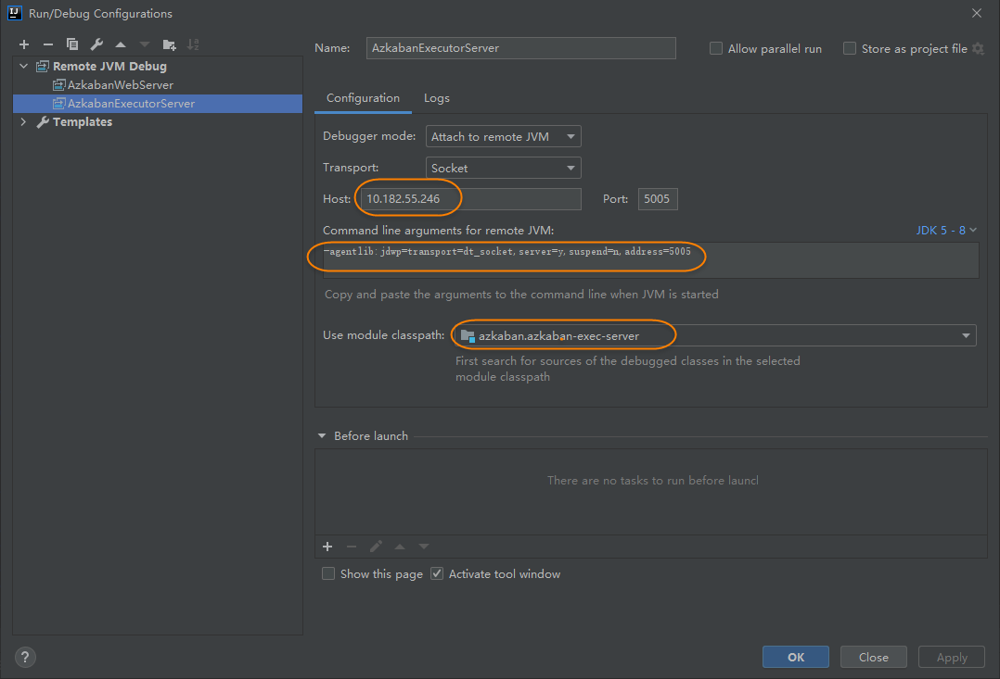
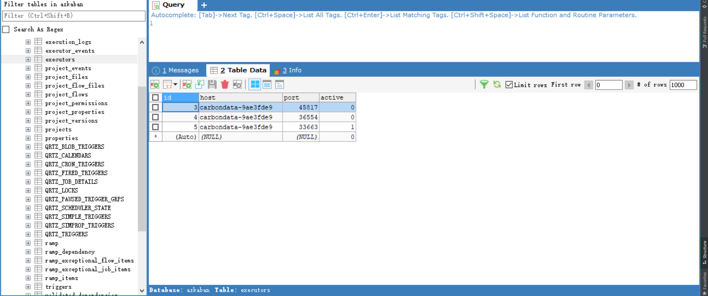
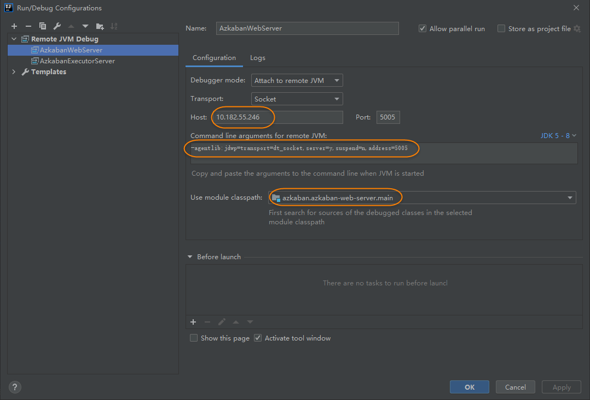
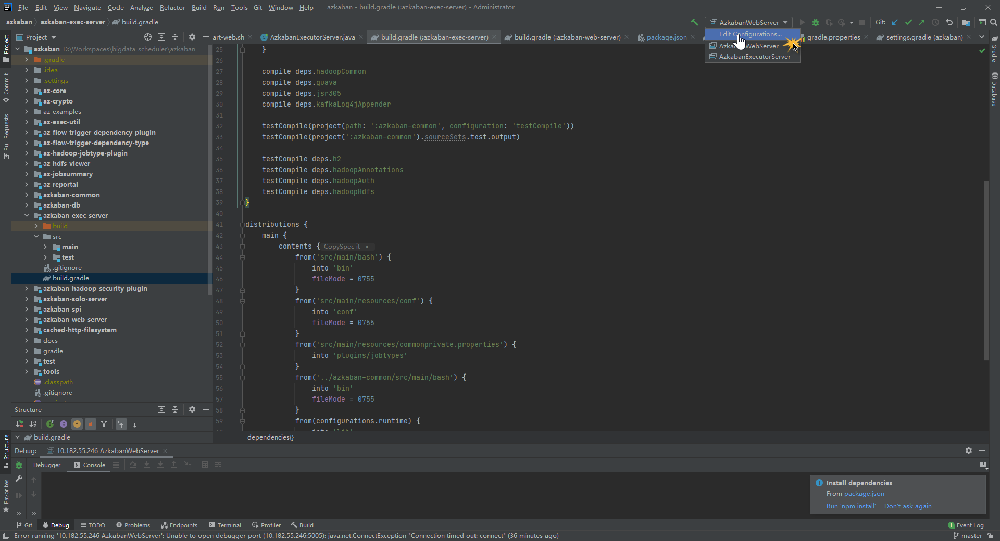

#### 运行azkaban Exec节点

编译后的压缩包路径: azkaban-exec-server/build/distributions/azkaban-exec-server-0.1.0-SNAPSHOT.zip

1.更改配置文件
上传 azkaban-exec-server-0.1.0-SNAPSHOT.zip 到 centos 服务器上，解压。修改 azkaban-exec-server/conf/azkaban.properties 配置文件:

```
# 数据库信息
mysql.port=3306
mysql.host=192.168.3.25
mysql.database=azkaban
mysql.user=root
mysql.password=123456

# 执行节点信息
executor.port=12321
azkaban.use.multiple.executors=true
azkaban.executorselector.filters=StaticRemainingFlowSize,MinimumFreeMemory,CpuStatus
azkaban.executorselector.comparator.NumberOfAssignedFlowComparator=1
azkaban.executorselector.comparator.Memory=1
azkaban.executorselector.comparator.LastDispatched=1
azkaban.executorselector.comparator.CpuUsage=1
```

2.设置远程debug
2.1 编辑文件 azkaban-exec-server/bin/internal/internal-start-executor.sh， **增加**一个 AZKABAN_OPTS 值

```
......
AZKABAN_OPTS="$AZKABAN_OPTS -agentlib:jdwp=transport=dt_socket,server=y,suspend=n,address=5554"
java $AZKABAN_OPTS $JAVA_LIB_PATH -cp $CLASSPATH azkaban.execapp.AzkabanExecutorServer -conf $conf $@ &
```

2.2 IDEA中配置
点击编辑运行时配置 -> 点击左上角的 `+` ，选择 Remote 选项。配置如下图:
[
说明:

- Host: 为az执行节点的IP
- Port: 为 上面我们配置的那个远程debug端口
- Use module classpath: 为az-exec模块的main

点击OK即可, 需要远程服务先启动,才能进行远程debug操作。

3.运行并激活az-exec
运行:

```
cd azkaban-exec-server
bin/start-exec.sh
```

激活:

```
curl -G "http://192.168.3.25:12321/executor?action=activate" && echo
```

- 192.168.3.25:12321 为 az执行节点的地址

  此时, 可以发现azkaban库 executors 表中已经有执行节点的记录
  

#### 运行azkaban Web节点

编译后的压缩包路径:
azkaban-web-server/build/distributions/azkaban-web-server-0.1.0-SNAPSHOT.zip

1.更改配置文件
上传 azkaban-web-server-0.1.0-SNAPSHOT.zip 到 centos 服务器上，解压。修改 azkaban-web-server/conf/azkaban.properties 配置文件:

```ini
# 数据库信息
mysql.port=3306
mysql.host=192.168.3.25
mysql.database=azkaban
mysql.user=root
mysql.password=123456
```

2.设置远程debug
2.1 编辑文件 azkaban-web-server/bin/internal/internal-start-web.sh， **增加**一个 AZKABAN_OPTS 值

```shell
......
AZKABAN_OPTS="$AZKABAN_OPTS -agentlib:jdwp=transport=dt_socket,server=y,suspend=n,address=5555"
java $AZKABAN_OPTS $JAVA_LIB_PATH -cp $CLASSPATH azkaban.webapp.AzkabanWebServer -conf $conf $@ &
```

2.2 IDEA中配置


3.运行az-web

```
cd azkaban-web-server
bin/start-web.sh
```

4.登录
Azkaban默认使用的xml来管理用户。配置文件目录: azkaban-web-server/conf/azkaban-users.xml
访问 [http://192.168.3.25:8081](http://192.168.3.25:8081/), 使用azkaban/azkaban 即可登录。

- 192.168.3.25: 为 az-web的ip
- 8081: 为az-web的端口

#### 远程调试

在 az-web 和 az-exec 都启动之后, 先确保所有端口都能正常访问, 我这儿配置的是

- az-exec服务端口: 12321
- az-exec远程debug端口: 5554
- az-web服务端口: 8091
- az-web远程debug端口: 5555

然后在IDEA中运行下图中的这两项即可。
