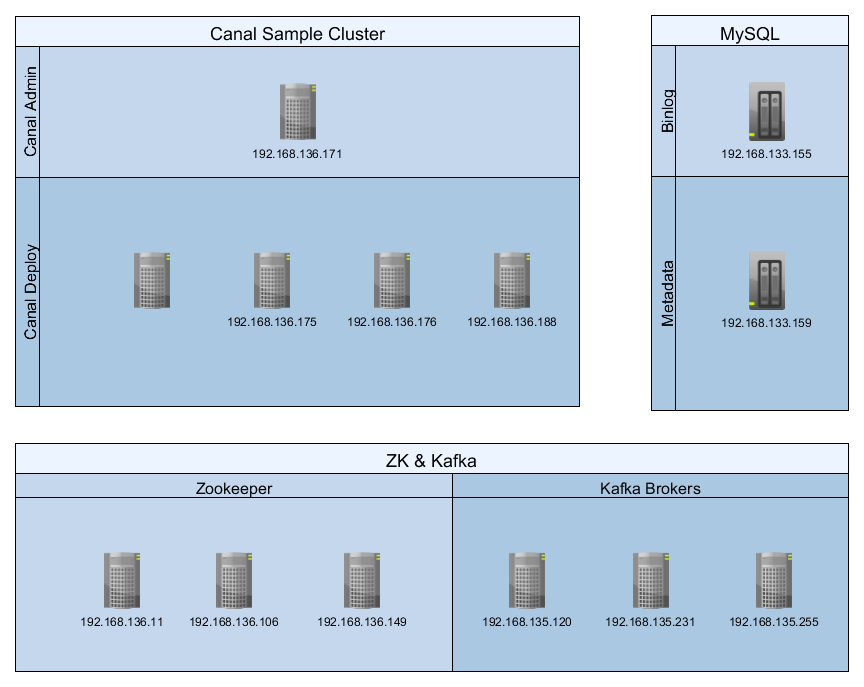

## Overview





## Prepared


#### Canal Hosts

```ini
192.168.136.171 host-192-168-136-171
192.168.136.175 host-192-168-136-175
192.168.136.176 host-192-168-136-176
192.168.136.188 host-192-168-136-188
```


#### Zookeeper

```ini
192.168.136.11	host-192-168-136-11
192.168.136.106 host-192-168-136-106
192.168.136.149 host-192-168-136-149
```

```ini
host-192-168-136-11:2181,host-192-168-136-106:2181,host-192-168-136-149:2181
```


#### Kafka

```ini
192.168.135.120 host-192-168-135-120
192.168.135.231 host-192-168-135-231
192.168.135.255 host-192-168-135-255
```

> Brokers 

```ini
192.168.135.120:9092,192.168.135.231:9092,192.168.135.255:9092
```


> List Topics

```shell
bin/kafka-topics.sh --list --zookeeper host-192-168-136-11:2181,host-192-168-136-106:2181,host-192-168-136-149:2181
```


> Consume Message

```shell
./bin/kafka-console-consumer.sh --bootstrap-server 192.168.135.120:9092,192.168.135.231:9092,192.168.135.255:9092  --topic example --from-beginning
```


#### Kafka Manager (Optional)

```html
http://192.168.134.21:8787/
```


### Enable Binglog

The MySQL server must be configured to use a *row-level* binary log, which is described in more detail in the [MySQL documentation](http://dev.mysql.com/doc/refman/5.7/en/replication-options.html). This is most often done in the MySQL server configuration file, and will look similar to the following fragment:

```ini
server-id         = 133155
log_bin           = mysql-bin
binlog_format     = row
binlog_row_image  = full
expire_logs_days  = 10
```

where:

- the value for [`server-id`](http://dev.mysql.com/doc/refman/5.7/en/server-system-variables.html#sysvar_server_id) must be unique for each server and replication client within the MySQL cluster. When we set up the connector, we’ll also assign the connector a unique server ID.
- the value for [`log_bin`](http://dev.mysql.com/doc/refman/5.7/en/replication-options-binary-log.html#sysvar_log_bin) is the base name for the sequence of binlog files.
- the value for [`binlog_format`](http://dev.mysql.com/doc/refman/5.7/en/replication-options-binary-log.html#sysvar_binlog_format) must be set to `row` or `ROW`.
- the value for [`binlog_row_image`](https://dev.mysql.com/doc/refman/5.7/en/replication-options-binary-log.html#sysvar_binlog_row_image) must be set to `full` or `FULL`.
- the value for [`expire_log_days`](http://dev.mysql.com/doc/refman/5.7/en/server-system-variables.html#sysvar_expire_logs_days) is the number of days for automatic binary log file removal. The default is 0, which means "no automatic removal," so be sure to set a value that is appropriate for your environment.


> 192.168.133.155

```ini
mysql> show master status;
+------------------+----------+--------------+------------------+-------------------+
| File             | Position | Binlog_Do_DB | Binlog_Ignore_DB | Executed_Gtid_Set |
+------------------+----------+--------------+------------------+-------------------+
| mysql-bin.000004 |     1348 |              |                  |                   |
+------------------+----------+--------------+------------------+-------------------+
1 row in set (0.00 sec)
```


> Tables

```sql
-- Create Database
CREATE DATABASE /*!32312 IF NOT EXISTS*/ `kafka_conn` /*!40100 DEFAULT CHARACTER SET utf8 COLLATE utf8_bin */;

CREATE TABLE `orders` (
  `product` varchar(256) NOT NULL,
  `quantity` int(11) NOT NULL,
  `price` float NOT NULL,
  `id` varchar(32) NOT NULL,
  PRIMARY KEY (`id`)
) ENGINE=InnoDB DEFAULT CHARSET=utf8;

CREATE TABLE `student` (
  `id` int(11) NOT NULL AUTO_INCREMENT,
  `name` varchar(100) NOT NULL,
  `password` varchar(100) NOT NULL,
  `birthday` date NOT NULL,
  PRIMARY KEY (`id`)
) ENGINE=InnoDB AUTO_INCREMENT=4 DEFAULT CHARSET=utf8


insert into orders (product, quantity, price, id) values ('Clothes', 700, 700, 700);
insert into orders (product, quantity, price, id) values ('Clothes', 701, 701, 701);
insert into orders (product, quantity, price, id) values ('Clothes', 702, 702, 702);
insert into orders (product, quantity, price, id) values ('Clothes', 703, 703, 703);
insert into orders (product, quantity, price, id) values ('Clothes', 704, 704, 704);
insert into orders (product, quantity, price, id) values ('Clothes', 705, 705, 705);

INSERT INTO student (name, password, birthday) VALUES ('Hefei Li','123456','19831010');
INSERT INTO student (name, password, birthday) VALUES ('Hefei Li1','123456','19831011');
INSERT INTO student (name, password, birthday) VALUES ('Hefei Li2','123456','19831012');


```


## Canal Admin

### Create Databases

> Create DB and User

​	Create a user to  connect to the MySQL database. And ensure that the user has permission to get binglog.

- [x] MySQL Server:  192.168.133.155

```sql
CREATE USER 'canal'@'localhost' IDENTIFIED BY 'Canal_1473';

-- GRANT ALL ON canal_manager.* TO 'canal'@'192.168.133.155' IDENTIFIED BY 'Canal_1473';
GRANT ALL ON canal_manager.* TO 'canal'@'%' IDENTIFIED BY 'Canal_1473';
GRANT SELECT, RELOAD, SHOW DATABASES, REPLICATION SLAVE, REPLICATION CLIENT ON *.* TO 'canal' IDENTIFIED BY 'Canal_1473';

FLUSH PRIVILEGES;
```


​	Create a user for `Canal Manager` and `Canal Admin`.

- [x] MySQL: 192.168.133.159

```sql
-- Create DB
CREATE DATABASE IF NOT EXISTS canal_manager;
CREATE DATABASE IF NOT EXISTS canal_tsdb;

CREATE USER 'canal'@'localhost' IDENTIFIED BY 'Canal_1473';

GRANT ALL ON canal_manager.* TO 'canal'@'%' IDENTIFIED BY 'Canal_1473';
GRANT ALL ON canal_tsdb.* TO 'canal'@'%' IDENTIFIED BY 'Canal_1473';

FLUSH PRIVILEGES;
```


> Init DB: 192.168.133.159

```sql
use canal_manager;

source  ${canal.admin_HOME}/conf/canal_manager.sql
```


### Install

#### Downlaod

```shell
wget https://github.com/alibaba/canal/releases/download/canal-1.1.4/canal.admin-1.1.4.tar.gz
```


#### Configuration

​	Edit the canal.properties file and fill in the configuration information according to the actual installation environment.

```shel
cd ${canal.admin_HOME}/conf

cp canal-template.properties canal.properties
```

The example information is as follows：

```ini
#################################################
#########   common argument         #############
#################################################
# tcp bind ip
canal.ip =192.168.136.171
# register ip to zookeeper
canal.register.ip =192.168.136.171
canal.port = 11111
canal.metrics.pull.port = 11112
# canal instance user/passwd
canal.user = canal
canal.passwd = E3619321C1A937C46A0D8BD1DAC39F93B27D4458

# canal admin config
canal.admin.manager = 127.0.0.1:8089
canal.admin.port = 11110
canal.admin.user = admin
canal.admin.passwd = 4ACFE3202A5FF5CF467898FC58AAB1D615029441

canal.zkServers = host-192-168-136-11:2181,host-192-168-136-106:2181,host-192-168-136-149:2181
# flush data to zk
canal.zookeeper.flush.period = 1000
canal.withoutNetty = false
# tcp, kafka, RocketMQ
canal.serverMode = kafka
# flush meta cursor/parse position to file
canal.file.data.dir = ${canal.conf.dir}
canal.file.flush.period = 1000
## memory store RingBuffer size, should be Math.pow(2,n)
canal.instance.memory.buffer.size = 16384
## memory store RingBuffer used memory unit size , default 1kb
canal.instance.memory.buffer.memunit = 1024 
## meory store gets mode used MEMSIZE or ITEMSIZE
canal.instance.memory.batch.mode = MEMSIZE
canal.instance.memory.rawEntry = true

## detecing config
canal.instance.detecting.enable = false
#canal.instance.detecting.sql = insert into retl.xdual values(1,now()) on duplicate key update x=now()
canal.instance.detecting.sql = select 1
canal.instance.detecting.interval.time = 3
canal.instance.detecting.retry.threshold = 3
canal.instance.detecting.heartbeatHaEnable = false

# support maximum transaction size, more than the size of the transaction will be cut into multiple transactions delivery
canal.instance.transaction.size =  1024
# mysql fallback connected to new master should fallback times
canal.instance.fallbackIntervalInSeconds = 60

# network config
canal.instance.network.receiveBufferSize = 16384
canal.instance.network.sendBufferSize = 16384
canal.instance.network.soTimeout = 30

# binlog filter config
canal.instance.filter.druid.ddl = true
canal.instance.filter.query.dcl = false
canal.instance.filter.query.dml = false
canal.instance.filter.query.ddl = false
canal.instance.filter.table.error = false
canal.instance.filter.rows = false
canal.instance.filter.transaction.entry = false

# binlog format/image check
canal.instance.binlog.format = ROW,STATEMENT,MIXED 
canal.instance.binlog.image = FULL,MINIMAL,NOBLOB

# binlog ddl isolation
canal.instance.get.ddl.isolation = false

# parallel parser config
canal.instance.parser.parallel = true
## concurrent thread number, default 60% available processors, suggest not to exceed Runtime.getRuntime().availableProcessors()
#canal.instance.parser.parallelThreadSize = 16
## disruptor ringbuffer size, must be power of 2
canal.instance.parser.parallelBufferSize = 256

# table meta tsdb info
canal.instance.tsdb.enable = true
canal.instance.tsdb.dir = ${canal.file.data.dir:../conf}/${canal.instance.destination:}
canal.instance.tsdb.url = jdbc:h2:${canal.instance.tsdb.dir}/h2;CACHE_SIZE=1000;MODE=MYSQL;
canal.instance.tsdb.dbUsername = canal
canal.instance.tsdb.dbPassword = canal
# dump snapshot interval, default 24 hour
canal.instance.tsdb.snapshot.interval = 24
# purge snapshot expire , default 360 hour(15 days)
canal.instance.tsdb.snapshot.expire = 360

# aliyun ak/sk , support rds/mq
canal.aliyun.accessKey =
canal.aliyun.secretKey =

#################################################
#########         destinations      #############
#################################################
canal.destinations =
# conf root dir
canal.conf.dir = ../conf
# auto scan instance dir add/remove and start/stop instance
canal.auto.scan = true
canal.auto.scan.interval = 5

#canal.instance.tsdb.spring.xml = classpath:spring/tsdb/h2-tsdb.xml
canal.instance.tsdb.spring.xml = classpath:spring/tsdb/mysql-tsdb.xml

canal.instance.global.mode = manager
canal.instance.global.lazy = false
canal.instance.global.manager.address = ${canal.admin.manager}
#canal.instance.global.spring.xml = classpath:spring/memory-instance.xml
canal.instance.global.spring.xml = classpath:spring/file-instance.xml
#canal.instance.global.spring.xml = classpath:spring/default-instance.xml

##################################################
#########            MQ              #############
##################################################
canal.mq.servers = 192.168.135.120:9092,192.168.135.231:9092,192.168.135.255:9092
#canal.mq.servers = 127.0.0.1:6667
canal.mq.retries = 0
canal.mq.batchSize = 16384
canal.mq.maxRequestSize = 1048576
canal.mq.lingerMs = 100
canal.mq.bufferMemory = 33554432
canal.mq.canalBatchSize = 50
canal.mq.canalGetTimeout = 100
canal.mq.flatMessage = true
canal.mq.compressionType = none
canal.mq.acks = all
#canal.mq.properties. =
canal.mq.producerGroup = test
# Set this value to "cloud", if you want open message trace feature in aliyun.
canal.mq.accessChannel = local
# aliyun mq namespace
#canal.mq.namespace =

##################################################
#########     Kafka Kerberos Info    #############
##################################################
canal.mq.kafka.kerberos.enable = false
canal.mq.kafka.kerberos.krb5FilePath = "../conf/kerberos/krb5.conf"
canal.mq.kafka.kerberos.jaasFilePath = "../conf/kerberos/jaas.conf"
```


## Canal Deploy

### canal.properties

```ini
#################################################
#########               common argument         #############
#################################################
# tcp bind ip
canal.ip =
# register ip to zookeeper
canal.register.ip =
canal.port = 11111
canal.metrics.pull.port = 11112
# canal instance user/passwd
# canal.user = canal
# canal.passwd = E3619321C1A937C46A0D8BD1DAC39F93B27D4458

# canal admin config
canal.admin.manager = 192.168.136.171:8089
canal.admin.port = 11110
canal.admin.user = admin
canal.admin.passwd = 4ACFE3202A5FF5CF467898FC58AAB1D615029441

canal.zkServers =host-192-168-136-11:2181,host-192-168-136-106:2181,host-192-168-136-149:2181
# flush data to zk
canal.zookeeper.flush.period = 1000
canal.withoutNetty = false
# tcp, kafka, RocketMQ
canal.serverMode = kafka 
# flush meta cursor/parse position to file
canal.file.data.dir = ${canal.conf.dir}
canal.file.flush.period = 1000
## memory store RingBuffer size, should be Math.pow(2,n)
canal.instance.memory.buffer.size = 16384
## memory store RingBuffer used memory unit size , default 1kb
canal.instance.memory.buffer.memunit = 1024 
## meory store gets mode used MEMSIZE or ITEMSIZE
canal.instance.memory.batch.mode = MEMSIZE
canal.instance.memory.rawEntry = true

## detecing config
canal.instance.detecting.enable = false
#canal.instance.detecting.sql = insert into retl.xdual values(1,now()) on duplicate key update x=now()
canal.instance.detecting.sql = select 1
canal.instance.detecting.interval.time = 3
canal.instance.detecting.retry.threshold = 3
canal.instance.detecting.heartbeatHaEnable = false

# support maximum transaction size, more than the size of the transaction will be cut into multiple transactions delivery
canal.instance.transaction.size =  1024
# mysql fallback connected to new master should fallback times
canal.instance.fallbackIntervalInSeconds = 60

# network config
canal.instance.network.receiveBufferSize = 16384
canal.instance.network.sendBufferSize = 16384
canal.instance.network.soTimeout = 30

# binlog filter config
canal.instance.filter.druid.ddl = true
canal.instance.filter.query.dcl = false
canal.instance.filter.query.dml = false
canal.instance.filter.query.ddl = false
canal.instance.filter.table.error = false
canal.instance.filter.rows = false
canal.instance.filter.transaction.entry = false

# binlog format/image check
canal.instance.binlog.format = ROW,STATEMENT,MIXED 
canal.instance.binlog.image = FULL,MINIMAL,NOBLOB

# binlog ddl isolation
canal.instance.get.ddl.isolation = false

# parallel parser config
canal.instance.parser.parallel = true
## concurrent thread number, default 60% available processors, suggest not to exceed Runtime.getRuntime().availableProcessors()
#canal.instance.parser.parallelThreadSize = 16
## disruptor ringbuffer size, must be power of 2
canal.instance.parser.parallelBufferSize = 256

# table meta tsdb info
canal.instance.tsdb.enable = true
canal.instance.tsdb.dir = ${canal.file.data.dir:../conf}/${canal.instance.destination:}
canal.instance.tsdb.url = jdbc:mysql://192.168.133.159:3306/canal_manager
canal.instance.tsdb.dbUsername = canal
canal.instance.tsdb.dbPassword = Canal_1473
# dump snapshot interval, default 24 hour
canal.instance.tsdb.snapshot.interval = 24
# purge snapshot expire , default 360 hour(15 days)
canal.instance.tsdb.snapshot.expire = 360

# aliyun ak/sk , support rds/mq
canal.aliyun.accessKey =
canal.aliyun.secretKey =

#################################################
#########               destinations            #############
#################################################
canal.destinations = example
# conf root dir
canal.conf.dir = ../conf
# auto scan instance dir add/remove and start/stop instance
canal.auto.scan = true
canal.auto.scan.interval = 5

#canal.instance.tsdb.spring.xml = classpath:spring/tsdb/h2-tsdb.xml
canal.instance.tsdb.spring.xml = classpath:spring/tsdb/mysql-tsdb.xml

canal.instance.global.mode = spring
canal.instance.global.lazy = false
canal.instance.global.manager.address = ${canal.admin.manager}
#canal.instance.global.spring.xml = classpath:spring/memory-instance.xml
canal.instance.global.spring.xml = classpath:spring/file-instance.xml
#canal.instance.global.spring.xml = classpath:spring/default-instance.xml

##################################################
#########                    MQ                      #############
##################################################
canal.mq.servers = 192.168.135.120:9092,192.168.135.231:9092,192.168.135.255:9092 
canal.mq.retries = 0
canal.mq.batchSize = 16384
canal.mq.maxRequestSize = 1048576
canal.mq.lingerMs = 100
canal.mq.bufferMemory = 33554432
canal.mq.canalBatchSize = 50
canal.mq.canalGetTimeout = 100
canal.mq.flatMessage = true
canal.mq.compressionType = none
canal.mq.acks = all
#canal.mq.properties. =
canal.mq.producerGroup = test
# Set this value to "cloud", if you want open message trace feature in aliyun.
canal.mq.accessChannel = local
# aliyun mq namespace
#canal.mq.namespace =

##################################################
#########     Kafka Kerberos Info    #############
##################################################
canal.mq.kafka.kerberos.enable = false
canal.mq.kafka.kerberos.krb5FilePath = "../conf/kerberos/krb5.conf"
canal.mq.kafka.kerberos.jaasFilePath = "../conf/kerberos/jaas.conf"
```

### instances.properties

```ini
#################################################
## mysql serverId , v1.0.26+ will autoGen
# canal.instance.mysql.slaveId=0

# enable gtid use true/false
canal.instance.gtidon=false

# position info
canal.instance.master.address=192.168.133.155:3306
canal.instance.master.journal.name=mysql-bin.000004
canal.instance.master.position=154
canal.instance.master.timestamp=
canal.instance.master.gtid=

# rds oss binlog
canal.instance.rds.accesskey=
canal.instance.rds.secretkey=
canal.instance.rds.instanceId=

# table meta tsdb info
canal.instance.tsdb.enable=true
canal.instance.tsdb.url=jdbc:mysql://192.168.133.159:3306/canal_tsdb
canal.instance.tsdb.dbUsername=canal
canal.instance.tsdb.dbPassword=Canal_1473

#canal.instance.standby.address =
#canal.instance.standby.journal.name =
#canal.instance.standby.position =
#canal.instance.standby.timestamp =
#canal.instance.standby.gtid=

# username/password
canal.instance.dbUsername=canal
canal.instance.dbPassword=Canal_1473
canal.instance.connectionCharset = UTF-8
# enable druid Decrypt database password
canal.instance.enableDruid=false
#canal.instance.pwdPublicKey=MFwwDQYJKoZIhvcNAQEBBQADSwAwSAJBALK4BUxdDltRRE5/zXpVEVPUgunvscYFtEip3pmLlhrWpacX7y7GCMo2/JM6LeHmiiNdH1FWgGCpUfircSwlWKUCAwEAAQ==

# table regex
canal.instance.filter.regex=.*\\..*
# table black regex
canal.instance.filter.black.regex=
# table field filter(format: schema1.tableName1:field1/field2,schema2.tableName2:field1/field2)
#canal.instance.filter.field=test1.t_product:id/subject/keywords,test2.t_company:id/name/contact/ch
# table field black filter(format: schema1.tableName1:field1/field2,schema2.tableName2:field1/field2)
#canal.instance.filter.black.field=test1.t_product:subject/product_image,test2.t_company:id/name/contact/ch

# mq config
canal.mq.topic=example
# dynamic topic route by schema or table regex
#canal.mq.dynamicTopic=mytest1.user,mytest2\\..*,.*\\..*
canal.mq.partition=0
# hash partition config
#canal.mq.partitionsNum=3
#canal.mq.partitionHash=test.table:id^name,.*\\..*
#################################################
```


## Test


> Create table

```json
{
    "data": null,
    "database": "kafka_conn",
    "es": 1570525735000,
    "id": 3,
    "isDdl": true,
    "mysqlType": null,
    "old": null,
    "pkNames": null,
    "sql": "CREATE TABLE `student` (\r\n  `id` int(11) NOT NULL AUTO_INCREMENT,\r\n  `name` varchar(100) NOT NULL,\r\n  `password` varchar(100) NOT NULL,\r\n  `birthday` date NOT NULL,\r\n  PRIMARY KEY (`id`)\r\n) ENGINE=InnoDB AUTO_INCREMENT=4 DEFAULT CHARSET=utf8",
    "sqlType": null,
    "table": "student",
    "ts": 1570525735994,
    "type": "CREATE"
}
```


> Insert 

```json
{
    "data": [
        {
            "id": "4",
            "name": "Hefei Li",
            "password": "123456",
            "birthday": "1983-10-10"
        }
    ],
    "database": "kafka_conn",
    "es": 1570526565000,
    "id": 4,
    "isDdl": false,
    "mysqlType": {
        "id": "int(11)",
        "name": "varchar(100)",
        "password": "varchar(100)",
        "birthday": "date"
    },
    "old": null,
    "pkNames": [
        "id"
    ],
    "sql": "",
    "sqlType": {
        "id": 4,
        "name": 12,
        "password": 12,
        "birthday": 91
    },
    "table": "student",
    "ts": 1570526565527,
    "type": "INSERT"
}
```


> Delete

```json
{
    "data": [
        {
            "id": "4",
            "name": "Hefei Li",
            "password": "123456",
            "birthday": "1983-10-10"
        }
    ],
    "database": "kafka_conn",
    "es": 1570526633000,
    "id": 5,
    "isDdl": false,
    "mysqlType": {
        "id": "int(11)",
        "name": "varchar(100)",
        "password": "varchar(100)",
        "birthday": "date"
    },
    "old": null,
    "pkNames": [
        "id"
    ],
    "sql": "",
    "sqlType": {
        "id": 4,
        "name": 12,
        "password": 12,
        "birthday": 91
    },
    "table": "student",
    "ts": 1570526633680,
    "type": "DELETE"
}
```


> Update

```json
{
    "data": [
        {
            "id": "8",
            "name": "Hefei Li1",
            "password": "012345",
            "birthday": "1983-10-11"
        }
    ],
    "database": "kafka_conn",
    "es": 1570585895000,
    "id": 6,
    "isDdl": false,
    "mysqlType": {
        "id": "int(11)",
        "name": "varchar(100)",
        "password": "varchar(100)",
        "birthday": "date"
    },
    "old": [
        {
            "password": "2345678"
        }
    ],
    "pkNames": [
        "id"
    ],
    "sql": "",
    "sqlType": {
        "id": 4,
        "name": 12,
        "password": 12,
        "birthday": 91
    },
    "table": "student",
    "ts": 1570585895760,
    "type": "UPDATE"
}
```


