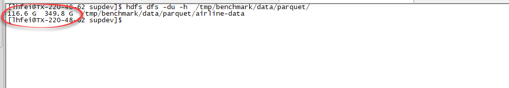
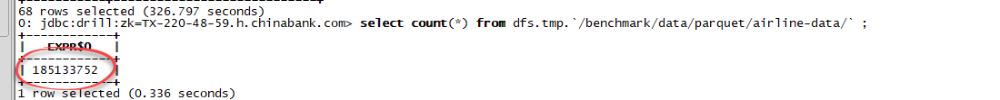

### Getting Airline On-Time Performance Data

As indicated above, the Airline Io-Time Performance data is available at [the Bureau of Transportation Statistics website](http://www.transtats.bts.gov/DL_SelectFields.asp?Table_ID=236&DB_Short_Name=On-Time). The challenge with downloading the data is that you can only download one month at a time. Therefore, to download 10 years worth of data, you would have to adjust the selection month and download 120 times. This is time consuming. But I went ahead and downloaded eleven years worth of data so you don’t have to. You can download it here:


[Data Repository](https://www.transtats.bts.gov/Tables.asp?DB_ID=120&DB_Name=Airline%20On-Time%20Performance%20Data&DB_Short_Name=On-Time)


### Dataset Profile

|            |                                 |
| ---------: | :------------------------------ |
| Date Range | 1987 ~ 2018                     |
|      Items | 375	(1987: 3, 1988~2018: 12) |
|       Size | 6.6 G                           |


### Download

> All Datasets

```sh
for s in `seq 1987 2018`
do
for m in `seq 1 12`
do
wget https://transtats.bts.gov/PREZIP/On_Time_Reporting_Carrier_On_Time_Performance_1987_present_${s}_${m}.zip
done
done
```


```sh
#!/bin/bash

for s in $(seq 1987 2018)
do
    for m in $(seq 1 12)
    do
        echo "https://transtats.bts.gov/PREZIP/On_Time_Reporting_Carrier_On_Time_Performance_1987_present_${s}_${m}.zip" >> ontime_data_urls.txt
    done
done

mkdir -p /export/app_benchmark/ontime/airline_data/ 
cat ontime_data_urls.txt | xargs -n 1 -P 6 sudo wget -c -P /export/app_benchmark/ontime/airline_data/
```


### Batch Unzip Files

```sh
for i in *.zip; do unzip -o $i -d ./csv_files/; done
```


### Batch Rename Files

```sh
for i in *.csv; do mmv '*(*)*' '#1#3'; done
```


> From 2005-2015

```sh
wget http://diybigdata.net/downloads/data/airline-data.2005-2015.tar.gz
```


```sql
SELECT 
	columns[0  ] as `Year`                 ,
	columns[1  ] as `Quarter`              ,
	columns[2  ] as `Month`                ,
	columns[3  ] as `DayofMonth`           ,
	columns[4  ] as `DayOfWeek`            ,
	columns[5  ] as `FlightDate`           ,
	columns[6  ] as `UniqueCarrier`        ,
	columns[7  ] as `AirlineID`            ,
	columns[8  ] as `Carrier`              ,
	columns[9  ] as `TailNum`              ,
	columns[10 ] as `FlightNum`            ,
	columns[11 ] as `OriginAirportID`      ,
	columns[12 ] as `OriginAirportSeqID`   ,
	columns[13 ] as `OriginCityMarketID`   ,
	columns[14 ] as `Origin`               ,
	columns[15 ] as `OriginCityName`       ,
	columns[16 ] as `OriginState`          ,
	columns[17 ] as `OriginStateFips`      ,
	columns[18 ] as `OriginStateName`      ,
	columns[19 ] as `OriginWac`            ,
	columns[20 ] as `DestAirportID`        ,
	columns[21 ] as `DestAirportSeqID`     ,
	columns[22 ] as `DestCityMarketID`     ,
	columns[23 ] as `Dest`                 ,
	columns[24 ] as `DestCityName`         ,
	columns[25 ] as `DestState`            ,
	columns[26 ] as `DestStateFips`        ,
	columns[27 ] as `DestStateName`        ,
	columns[28 ] as `DestWac`              ,
	columns[29 ] as `CRSDepTime`           ,
	columns[30 ] as `DepTime`              ,
	columns[31 ] as `DepDelay`             ,
	columns[32 ] as `DepDelayMinutes`      ,
	columns[33 ] as `DepDel15`             ,
	columns[34 ] as `DepartureDelayGroups` ,
	columns[35 ] as `DepTimeBlk`           ,
	columns[36 ] as `TaxiOut`              ,
	columns[37 ] as `WheelsOff`            ,
	columns[38 ] as `WheelsOn`             ,
	columns[39 ] as `TaxiIn`               ,
	columns[40 ] as `CRSArrTime`           ,
	columns[41 ] as `ArrTime`              ,
	columns[42 ] as `ArrDelay`             ,
	columns[43 ] as `ArrDelayMinutes`      ,
	columns[44 ] as `ArrDel15`             ,
	columns[45 ] as `ArrivalDelayGroups`   ,
	columns[46 ] as `ArrTimeBlk`           ,
	columns[47 ] as `Cancelled`            ,
	columns[48 ] as `CancellationCode`     ,
	columns[49 ] as `Diverted`             ,
	columns[50 ] as `CRSElapsedTime`       ,
	columns[51 ] as `ActualElapsedTime`    ,
	columns[52 ] as `AirTime`              ,
	columns[53 ] as `Flights`              ,
	columns[54 ] as `Distance`             ,
	columns[55 ] as `DistanceGroup`        ,
	columns[56 ] as `CarrierDelay`         ,
	columns[57 ] as `WeatherDelay`         ,
	columns[58 ] as `NASDelay`             ,
	columns[59 ] as `SecurityDelay`        ,
	columns[60 ] as `LateAircraftDelay`    ,
	columns[61 ] as `FirstDepTime`         ,
	columns[62 ] as `TotalAddGTime`        ,
	columns[63 ] as `LongestAddGTime`      ,
	columns[64 ] as `DivAirportLandings`   ,
	columns[65 ] as `DivReachedDest`       ,
	columns[66 ] as `DivActualElapsedTime` ,
	columns[67 ] as `DivArrDelay`          ,
	columns[68 ] as `DivDistance`          ,
	columns[69 ] as `Div1Airport`          ,
	columns[70 ] as `Div1AirportID`        ,
	columns[71 ] as `Div1AirportSeqID`     ,
	columns[72 ] as `Div1WheelsOn`         ,
	columns[73 ] as `Div1TotalGTime`       ,
	columns[74 ] as `Div1LongestGTime`     ,
	columns[75 ] as `Div1WheelsOff`        ,
	columns[76 ] as `Div1TailNum`          ,
	columns[77 ] as `Div2Airport`          ,
	columns[78 ] as `Div2AirportID`        ,
	columns[79 ] as `Div2AirportSeqID`     ,
	columns[80 ] as `Div2WheelsOn`         ,
	columns[81 ] as `Div2TotalGTime`       ,
	columns[82 ] as `Div2LongestGTime`     ,
	columns[83 ] as `Div2WheelsOff`        ,
	columns[84 ] as `Div2TailNum`          ,
	columns[85 ] as `Div3Airport`          ,
	columns[86 ] as `Div3AirportID`        ,
	columns[87 ] as `Div3AirportSeqID`     ,
	columns[88 ] as `Div3WheelsOn`         ,
	columns[89 ] as `Div3TotalGTime`       ,
	columns[90 ] as `Div3LongestGTime`     ,
	columns[91 ] as `Div3WheelsOff`        ,
	columns[92 ] as `Div3TailNum`          ,
	columns[93 ] as `Div4Airport`          ,
	columns[94 ] as `Div4AirportID`        ,
	columns[95 ] as `Div4AirportSeqID`     ,
	columns[96 ] as `Div4WheelsOn`         ,
	columns[97 ] as `Div4TotalGTime`       ,
	columns[98 ] as `Div4LongestGTime`     ,
	columns[99 ] as `Div4WheelsOff`        ,
	columns[100] as `Div4TailNum`          ,
	columns[101] as `Div5Airport`          ,
	columns[102] as `Div5AirportID`        ,
	columns[103] as `Div5AirportSeqID`     ,
	columns[104] as `Div5WheelsOn`         ,
	columns[105] as `Div5TotalGTime`       ,
	columns[106] as `Div5LongestGTime`     ,
	columns[107] as `Div5WheelsOff`        ,
	columns[108] as `Div5TailNum`

FROM dfs.`/benchmark/ontime/airline-data/*.csv` limit 20;
```


>  Count CSV  files Records


### Check Store format


```sql
select val from sys.options where name = 'store.format'; 
```


> If not `parquet`, you cat set it as below: 

```sql
alter session set `store.format` = 'parquet' ;
```


> Make directory to store the parquet files.

```sh
hdfs dfs -mkdir -p /tmp/benchmark/data/parquet/
```


> Skip `Header` in read `csv` files.

Update `Drill` storage of `dfs`,   selected the `csv` section and edit it as below: 

```json
"csv": {
  "type": "text",
  "extensions": [
    "csv2"
  ],
  "skipFirstLine": true,
  "delimiter": ","
},
```


We are now ready to create our Parquet files using the “Create Table As Select” (aka [CTAS](http://drill.apache.org/docs/create-table-as-ctas-command/))

```sql
CREATE TABLE dfs.tmp.`/benchmark/data/parquet/airline-data/` AS 

  SELECT 
	columns[0  ] as `Year`                 ,
	columns[1  ] as `Quarter`              ,
	columns[2  ] as `Month`                ,
	columns[3  ] as `DayofMonth`           ,
	columns[4  ] as `DayOfWeek`            ,
	columns[5  ] as `FlightDate`           ,
	columns[6  ] as `UniqueCarrier`        ,
	columns[7  ] as `AirlineID`            ,
	columns[8  ] as `Carrier`              ,
	columns[9  ] as `TailNum`              ,
	columns[10 ] as `FlightNum`            ,
	columns[11 ] as `OriginAirportID`      ,
	columns[12 ] as `OriginAirportSeqID`   ,
	columns[13 ] as `OriginCityMarketID`   ,
	columns[14 ] as `Origin`               ,
	columns[15 ] as `OriginCityName`       ,
	columns[16 ] as `OriginState`          ,
	columns[17 ] as `OriginStateFips`      ,
	columns[18 ] as `OriginStateName`      ,
	columns[19 ] as `OriginWac`            ,
	columns[20 ] as `DestAirportID`        ,
	columns[21 ] as `DestAirportSeqID`     ,
	columns[22 ] as `DestCityMarketID`     ,
	columns[23 ] as `Dest`                 ,
	columns[24 ] as `DestCityName`         ,
	columns[25 ] as `DestState`            ,
	columns[26 ] as `DestStateFips`        ,
	columns[27 ] as `DestStateName`        ,
	columns[28 ] as `DestWac`              ,
	columns[29 ] as `CRSDepTime`           ,
	columns[30 ] as `DepTime`              ,
	columns[31 ] as `DepDelay`             ,
	columns[32 ] as `DepDelayMinutes`      ,
	columns[33 ] as `DepDel15`             ,
	columns[34 ] as `DepartureDelayGroups` ,
	columns[35 ] as `DepTimeBlk`           ,
	columns[36 ] as `TaxiOut`              ,
	columns[37 ] as `WheelsOff`            ,
	columns[38 ] as `WheelsOn`             ,
	columns[39 ] as `TaxiIn`               ,
	columns[40 ] as `CRSArrTime`           ,
	columns[41 ] as `ArrTime`              ,
	columns[42 ] as `ArrDelay`             ,
	columns[43 ] as `ArrDelayMinutes`      ,
	columns[44 ] as `ArrDel15`             ,
	columns[45 ] as `ArrivalDelayGroups`   ,
	columns[46 ] as `ArrTimeBlk`           ,
	columns[47 ] as `Cancelled`            ,
	columns[48 ] as `CancellationCode`     ,
	columns[49 ] as `Diverted`             ,
	columns[50 ] as `CRSElapsedTime`       ,
	columns[51 ] as `ActualElapsedTime`    ,
	columns[52 ] as `AirTime`              ,
	columns[53 ] as `Flights`              ,
	columns[54 ] as `Distance`             ,
	columns[55 ] as `DistanceGroup`        ,
	columns[56 ] as `CarrierDelay`         ,
	columns[57 ] as `WeatherDelay`         ,
	columns[58 ] as `NASDelay`             ,
	columns[59 ] as `SecurityDelay`        ,
	columns[60 ] as `LateAircraftDelay`    ,
	columns[61 ] as `FirstDepTime`         ,
	columns[62 ] as `TotalAddGTime`        ,
	columns[63 ] as `LongestAddGTime`      ,
	columns[64 ] as `DivAirportLandings`   ,
	columns[65 ] as `DivReachedDest`       ,
	columns[66 ] as `DivActualElapsedTime` ,
	columns[67 ] as `DivArrDelay`          ,
	columns[68 ] as `DivDistance`          ,
	columns[69 ] as `Div1Airport`          ,
	columns[70 ] as `Div1AirportID`        ,
	columns[71 ] as `Div1AirportSeqID`     ,
	columns[72 ] as `Div1WheelsOn`         ,
	columns[73 ] as `Div1TotalGTime`       ,
	columns[74 ] as `Div1LongestGTime`     ,
	columns[75 ] as `Div1WheelsOff`        ,
	columns[76 ] as `Div1TailNum`          ,
	columns[77 ] as `Div2Airport`          ,
	columns[78 ] as `Div2AirportID`        ,
	columns[79 ] as `Div2AirportSeqID`     ,
	columns[80 ] as `Div2WheelsOn`         ,
	columns[81 ] as `Div2TotalGTime`       ,
	columns[82 ] as `Div2LongestGTime`     ,
	columns[83 ] as `Div2WheelsOff`        ,
	columns[84 ] as `Div2TailNum`          ,
	columns[85 ] as `Div3Airport`          ,
	columns[86 ] as `Div3AirportID`        ,
	columns[87 ] as `Div3AirportSeqID`     ,
	columns[88 ] as `Div3WheelsOn`         ,
	columns[89 ] as `Div3TotalGTime`       ,
	columns[90 ] as `Div3LongestGTime`     ,
	columns[91 ] as `Div3WheelsOff`        ,
	columns[92 ] as `Div3TailNum`          ,
	columns[93 ] as `Div4Airport`          ,
	columns[94 ] as `Div4AirportID`        ,
	columns[95 ] as `Div4AirportSeqID`     ,
	columns[96 ] as `Div4WheelsOn`         ,
	columns[97 ] as `Div4TotalGTime`       ,
	columns[98 ] as `Div4LongestGTime`     ,
	columns[99 ] as `Div4WheelsOff`        ,
	columns[100] as `Div4TailNum`          ,
	columns[101] as `Div5Airport`          ,
	columns[102] as `Div5AirportID`        ,
	columns[103] as `Div5AirportSeqID`     ,
	columns[104] as `Div5WheelsOn`         ,
	columns[105] as `Div5TotalGTime`       ,
	columns[106] as `Div5LongestGTime`     ,
	columns[107] as `Div5WheelsOff`        ,
	columns[108] as `Div5TailNum`

FROM dfs.`/benchmark/ontime/airline-data/*.csv` ;

```


```sql
CREATE TABLE dfs.tmp.`/benchmark/data/parquet/airline-data/` AS SELECT columns[0 ] as `Year` , columns[1 ] as `Quarter` , columns[2 ] as `Month` , columns[3 ] as `DayofMonth` , columns[4 ] as `DayOfWeek` , columns[5 ] as `FlightDate` , columns[6 ] as `UniqueCarrier` , columns[7 ] as `AirlineID` , columns[8 ] as `Carrier` , columns[9 ] as `TailNum` , columns[10 ] as `FlightNum` , columns[11 ] as `OriginAirportID` , columns[12 ] as `OriginAirportSeqID` , columns[13 ] as `OriginCityMarketID` , columns[14 ] as `Origin` , columns[15 ] as `OriginCityName` , columns[16 ] as `OriginState` , columns[17 ] as `OriginStateFips` , columns[18 ] as `OriginStateName` , columns[19 ] as `OriginWac` , columns[20 ] as `DestAirportID` , columns[21 ] as `DestAirportSeqID` , columns[22 ] as `DestCityMarketID` , columns[23 ] as `Dest` , columns[24 ] as `DestCityName` , columns[25 ] as `DestState` , columns[26 ] as `DestStateFips` , columns[27 ] as `DestStateName` , columns[28 ] as `DestWac` , columns[29 ] as `CRSDepTime` , columns[30 ] as `DepTime` , columns[31 ] as `DepDelay` , columns[32 ] as `DepDelayMinutes` , columns[33 ] as `DepDel15` , columns[34 ] as `DepartureDelayGroups` , columns[35 ] as `DepTimeBlk` , columns[36 ] as `TaxiOut` , columns[37 ] as `WheelsOff` , columns[38 ] as `WheelsOn` , columns[39 ] as `TaxiIn` , columns[40 ] as `CRSArrTime` , columns[41 ] as `ArrTime` , columns[42 ] as `ArrDelay` , columns[43 ] as `ArrDelayMinutes` , columns[44 ] as `ArrDel15` , columns[45 ] as `ArrivalDelayGroups` , columns[46 ] as `ArrTimeBlk` , columns[47 ] as `Cancelled` , columns[48 ] as `CancellationCode` , columns[49 ] as `Diverted` , columns[50 ] as `CRSElapsedTime` , columns[51 ] as `ActualElapsedTime` , columns[52 ] as `AirTime` , columns[53 ] as `Flights` , columns[54 ] as `Distance` , columns[55 ] as `DistanceGroup` , columns[56 ] as `CarrierDelay` , columns[57 ] as `WeatherDelay` , columns[58 ] as `NASDelay` , columns[59 ] as `SecurityDelay` , columns[60 ] as `LateAircraftDelay` , columns[61 ] as `FirstDepTime` , columns[62 ] as `TotalAddGTime` , columns[63 ] as `LongestAddGTime` , columns[64 ] as `DivAirportLandings` , columns[65 ] as `DivReachedDest` , columns[66 ] as `DivActualElapsedTime` , columns[67 ] as `DivArrDelay` , columns[68 ] as `DivDistance` , columns[69 ] as `Div1Airport` , columns[70 ] as `Div1AirportID` , columns[71 ] as `Div1AirportSeqID` , columns[72 ] as `Div1WheelsOn` , columns[73 ] as `Div1TotalGTime` , columns[74 ] as `Div1LongestGTime` , columns[75 ] as `Div1WheelsOff` , columns[76 ] as `Div1TailNum` , columns[77 ] as `Div2Airport` , columns[78 ] as `Div2AirportID` , columns[79 ] as `Div2AirportSeqID` , columns[80 ] as `Div2WheelsOn` , columns[81 ] as `Div2TotalGTime` , columns[82 ] as `Div2LongestGTime` , columns[83 ] as `Div2WheelsOff` , columns[84 ] as `Div2TailNum` , columns[85 ] as `Div3Airport` , columns[86 ] as `Div3AirportID` , columns[87 ] as `Div3AirportSeqID` , columns[88 ] as `Div3WheelsOn` , columns[89 ] as `Div3TotalGTime` , columns[90 ] as `Div3LongestGTime` , columns[91 ] as `Div3WheelsOff` , columns[92 ] as `Div3TailNum` , columns[93 ] as `Div4Airport` , columns[94 ] as `Div4AirportID` , columns[95 ] as `Div4AirportSeqID` , columns[96 ] as `Div4WheelsOn` , columns[97 ] as `Div4TotalGTime` , columns[98 ] as `Div4LongestGTime` , columns[99 ] as `Div4WheelsOff` , columns[100] as `Div4TailNum` , columns[101] as `Div5Airport` , columns[102] as `Div5AirportID` , columns[103] as `Div5AirportSeqID` , columns[104] as `Div5WheelsOn` , columns[105] as `Div5TotalGTime` , columns[106] as `Div5LongestGTime` , columns[107] as `Div5WheelsOff` , columns[108] as `Div5TailNum` FROM dfs.`/benchmark/ontime/airline-data/*.csv` ; 
```


And the console will out put like this:


#### Valiedate Parquet Files:

```sh
hdfs dfs -du -h  /tmp/benchmark/data/parquet/
```





```sh
hdfs dfs -du -h  /tmp/benchmark/data/parquet/airline-data
```


### Query Parquet Files

Now that you have created your Parquet files you can use them in any of your Hadoop processes, but you can also use them in Drill, as follow:

```sql
select count(*) from dfs.tmp.`/benchmark/data/parquet/airline-data/` ;
```





> Group By Year


```sql
select count(*)  from dfs.tmp.`v_airline_parquet` ;  

+------------+
|   EXPR$0   |
+------------+
| 185133752  |
+------------+
```


```sql
select `Year`, count(*) as Total  from dfs.tmp.`v_airline_parquet` group by `Year` order by `Year` asc ;

+-------+----------+
| Year  |  Total   |
+-------+----------+
| 1987  | 1311826  |
| 1988  | 5202096  |
| 1989  | 5041200  |
| 1990  | 5270893  |
| 1991  | 5076925  |
| 1992  | 5092157  |
| 1993  | 5070501  |
| 1994  | 5180048  |
| 1995  | 5327435  |
| 1996  | 5351983  |
| 1997  | 5411843  |
| 1998  | 5384721  |
| 1999  | 5527884  |
| 2000  | 5683047  |
| 2001  | 5967780  |
| 2002  | 5271359  |
| 2003  | 6488540  |
| 2004  | 7129270  |
| 2005  | 7140596  |
| 2006  | 7141922  |
| 2007  | 7455458  |
| 2008  | 7009726  |
| 2009  | 6450285  |
| 2010  | 6450117  |
| 2011  | 6085281  |
| 2012  | 6096762  |
| 2013  | 6369482  |
| 2014  | 5819811  |
| 2015  | 5819079  |
| 2016  | 5617658  |
| 2017  | 5674621  |
| 2018  | 7213446  |
+-------+----------+
```

