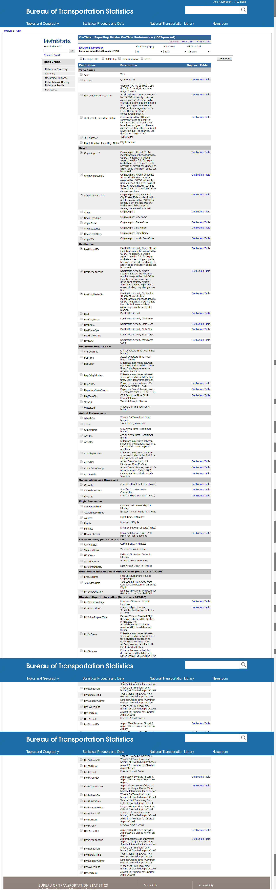

## Table Profile

[On-Time](https://www.transtats.bts.gov/Fields.asp?Cur_Row=-89&Cur_Col=&apply_rate=No&sort_column=&Search_Lookup=&find=&sort_order=)

| Field Name                                                   | Description                                                  | Support Table                                                |
| ------------------------------------------------------------ | ------------------------------------------------------------ | ------------------------------------------------------------ |
| Time Period                                                  |                                                              |                                                              |
| Year                                                         | Year                                                         |                                                              |
| Quarter                                                      | Quarter (1-4)                                                | [Get Lookup Table](https://www.transtats.bts.gov/Download_Lookup.asp?Lookup=L_QUARTERS) |
| Month                                                        | Month                                                        | [Get Lookup Table](https://www.transtats.bts.gov/Download_Lookup.asp?Lookup=L_MONTHS) |
| DayofMonth                                                   | Day of Month                                                 |                                                              |
| DayOfWeek                                                    | Day of Week                                                  | [Get Lookup Table](https://www.transtats.bts.gov/Download_Lookup.asp?Lookup=L_WEEKDAYS) |
| FlightDate                                                   | Flight Date (yyyymmdd)                                       |                                                              |
| Airline                                                      |                                                              |                                                              |
| Reporting_Airline                                            | Unique Carrier Code. When the same code has been used by multiple carriers, a numeric suffix is used for earlier users, for example, PA, PA(1), PA(2). Use this field for analysis across a range of years. | [Get Lookup Table](https://www.transtats.bts.gov/Download_Lookup.asp?Lookup=L_UNIQUE_CARRIERS) |
| DOT_ID_Reporting_Airline                                     | An identification number assigned by US DOT to identify a unique airline (carrier). A unique airline (carrier) is defined as one holding and reporting under the same DOT certificate regardless of its Code, Name, or holding company/corporation. | [Get Lookup Table](https://www.transtats.bts.gov/Download_Lookup.asp?Lookup=L_AIRLINE_ID) |
| IATA_CODE_Reporting_Airline                                  | Code assigned by IATA and commonly used to identify a carrier. As the same code may have been assigned to different carriers over time, the code is not always unique. For analysis, use the Unique Carrier Code. | [Get Lookup Table](https://www.transtats.bts.gov/Download_Lookup.asp?Lookup=L_CARRIER_HISTORY) |
| Tail_Number                                                  | Tail Number                                                  |                                                              |
| Flight_Number_Reporting_Airline                              | Flight Number                                                |                                                              |
| Origin                                                       |                                                              |                                                              |
| OriginAirportID                                              | Origin Airport, Airport ID. An identification number assigned by US DOT to identify a unique airport. Use this field for airport analysis across a range of years because an airport can change its airport code and airport codes can be reused. | [Get Lookup Table](https://www.transtats.bts.gov/Download_Lookup.asp?Lookup=L_AIRPORT_ID) |
| OriginAirportSeqID                                           | Origin Airport, Airport Sequence ID. An identification number assigned by US DOT to identify a unique airport at a given point of time. Airport attributes, such as airport name or coordinates, may change over time. | [Get Lookup Table](https://www.transtats.bts.gov/Download_Lookup.asp?Lookup=L_AIRPORT_SEQ_ID) |
| OriginCityMarketID                                           | Origin Airport, City Market ID. City Market ID is an identification number assigned by US DOT to identify a city market. Use this field to consolidate airports serving the same city market. | [Get Lookup Table](https://www.transtats.bts.gov/Download_Lookup.asp?Lookup=L_CITY_MARKET_ID) |
| Origin                                                       | Origin Airport                                               | [Get Lookup Table](https://www.transtats.bts.gov/Download_Lookup.asp?Lookup=L_AIRPORT) |
| OriginCityName                                               | Origin Airport, City Name                                    |                                                              |
| OriginState                                                  | Origin Airport, State Code                                   | [Get Lookup Table](https://www.transtats.bts.gov/Download_Lookup.asp?Lookup=L_STATE_ABR_AVIATION) |
| OriginStateFips                                              | Origin Airport, State Fips                                   | [Get Lookup Table](https://www.transtats.bts.gov/Download_Lookup.asp?Lookup=L_STATE_FIPS) |
| OriginStateName                                              | Origin Airport, State Name                                   |                                                              |
| OriginWac                                                    | Origin Airport, World Area Code                              | [Get Lookup Table](https://www.transtats.bts.gov/Download_Lookup.asp?Lookup=L_WORLD_AREA_CODES) |
| Destination                                                  |                                                              |                                                              |
| DestAirportID                                                | Destination Airport, Airport ID. An identification number assigned by US DOT to identify a unique airport. Use this field for airport analysis across a range of years because an airport can change its airport code and airport codes can be reused. | [Get Lookup Table](https://www.transtats.bts.gov/Download_Lookup.asp?Lookup=L_AIRPORT_ID) |
| DestAirportSeqID                                             | Destination Airport, Airport Sequence ID. An identification number assigned by US DOT to identify a unique airport at a given point of time. Airport attributes, such as airport name or coordinates, may change over time. | [Get Lookup Table](https://www.transtats.bts.gov/Download_Lookup.asp?Lookup=L_AIRPORT_SEQ_ID) |
| DestCityMarketID                                             | Destination Airport, City Market ID. City Market ID is an identification number assigned by US DOT to identify a city market. Use this field to consolidate airports serving the same city market. | [Get Lookup Table](https://www.transtats.bts.gov/Download_Lookup.asp?Lookup=L_CITY_MARKET_ID) |
| Dest                                                         | Destination Airport                                          | [Get Lookup Table](https://www.transtats.bts.gov/Download_Lookup.asp?Lookup=L_AIRPORT) |
| DestCityName                                                 | Destination Airport, City Name                               |                                                              |
| DestState                                                    | Destination Airport, State Code                              | [Get Lookup Table](https://www.transtats.bts.gov/Download_Lookup.asp?Lookup=L_STATE_ABR_AVIATION) |
| DestStateFips                                                | Destination Airport, State Fips                              | [Get Lookup Table](https://www.transtats.bts.gov/Download_Lookup.asp?Lookup=L_STATE_FIPS) |
| DestStateName                                                | Destination Airport, State Name                              |                                                              |
| DestWac                                                      | Destination Airport, World Area Code                         | [Get Lookup Table](https://www.transtats.bts.gov/Download_Lookup.asp?Lookup=L_WORLD_AREA_CODES) |
| Departure Performance                                        |                                                              |                                                              |
| CRSDepTime                                                   | CRS Departure Time (local time: hhmm)                        |                                                              |
| DepTime                                                      | Actual Departure Time (local time: hhmm)                     |                                                              |
| DepDelay                                                     | Difference in minutes between scheduled and actual departure time. Early departures show negative numbers. |                                                              |
| DepDelayMinutes                                              | Difference in minutes between scheduled and actual departure time. Early departures set to 0. |                                                              |
| DepDel15                                                     | Departure Delay Indicator, 15 Minutes or More (1=Yes)        | [Get Lookup Table](https://www.transtats.bts.gov/Download_Lookup.asp?Lookup=L_YESNO_RESP) |
| DepartureDelayGroups                                         | Departure Delay intervals, every (15 minutes from <-15 to >180) | [Get Lookup Table](https://www.transtats.bts.gov/Download_Lookup.asp?Lookup=L_ONTIME_DELAY_GROUPS) |
| DepTimeBlk                                                   | CRS Departure Time Block, Hourly Intervals                   | [Get Lookup Table](https://www.transtats.bts.gov/Download_Lookup.asp?Lookup=L_DEPARRBLK) |
| TaxiOut                                                      | Taxi Out Time, in Minutes                                    |                                                              |
| WheelsOff                                                    | Wheels Off Time (local time: hhmm)                           |                                                              |
| Arrival Performance                                          |                                                              |                                                              |
| WheelsOn                                                     | Wheels On Time (local time: hhmm)                            |                                                              |
| TaxiIn                                                       | Taxi In Time, in Minutes                                     |                                                              |
| CRSArrTime                                                   | CRS Arrival Time (local time: hhmm)                          |                                                              |
| ArrTime                                                      | Actual Arrival Time (local time: hhmm)                       |                                                              |
| ArrDelay                                                     | Difference in minutes between scheduled and actual arrival time. Early arrivals show negative numbers. |                                                              |
| ArrDelayMinutes                                              | Difference in minutes between scheduled and actual arrival time. Early arrivals set to 0. |                                                              |
| ArrDel15                                                     | Arrival Delay Indicator, 15 Minutes or More (1=Yes)          | [Get Lookup Table](https://www.transtats.bts.gov/Download_Lookup.asp?Lookup=L_YESNO_RESP) |
| ArrivalDelayGroups                                           | Arrival Delay intervals, every (15-minutes from <-15 to >180) | [Get Lookup Table](https://www.transtats.bts.gov/Download_Lookup.asp?Lookup=L_ONTIME_DELAY_GROUPS) |
| ArrTimeBlk                                                   | CRS Arrival Time Block, Hourly Intervals                     | [Get Lookup Table](https://www.transtats.bts.gov/Download_Lookup.asp?Lookup=L_DEPARRBLK) |
| Cancellations and Diversions                                 |                                                              |                                                              |
| Cancelled                                                    | Cancelled Flight Indicator (1=Yes)                           | [Get Lookup Table](https://www.transtats.bts.gov/Download_Lookup.asp?Lookup=L_YESNO_RESP) |
| CancellationCode                                             | Specifies The Reason For Cancellation                        | [Get Lookup Table](https://www.transtats.bts.gov/Download_Lookup.asp?Lookup=L_CANCELLATION) |
| Diverted                                                     | Diverted Flight Indicator (1=Yes)                            | [Get Lookup Table](https://www.transtats.bts.gov/Download_Lookup.asp?Lookup=L_YESNO_RESP) |
| Flight Summaries                                             |                                                              |                                                              |
| CRSElapsedTime                                               | CRS Elapsed Time of Flight, in Minutes                       |                                                              |
| ActualElapsedTime                                            | Elapsed Time of Flight, in Minutes                           |                                                              |
| AirTime                                                      | Flight Time, in Minutes                                      |                                                              |
| Flights                                                      | Number of Flights                                            |                                                              |
| Distance                                                     | Distance between airports (miles)                            |                                                              |
| DistanceGroup                                                | Distance Intervals, every 250 Miles, for Flight Segment      | [Get Lookup Table](https://www.transtats.bts.gov/Download_Lookup.asp?Lookup=L_DISTANCE_GROUP_250) |
| Cause of Delay (Data starts 6/2003)                          |                                                              |                                                              |
| CarrierDelay                                                 | Carrier Delay, in Minutes                                    |                                                              |
| WeatherDelay                                                 | Weather Delay, in Minutes                                    |                                                              |
| NASDelay                                                     | National Air System Delay, in Minutes                        |                                                              |
| SecurityDelay                                                | Security Delay, in Minutes                                   |                                                              |
| LateAircraftDelay                                            | Late Aircraft Delay, in Minutes                              |                                                              |
| Gate Return Information at Origin Airport (Data starts 10/2008) |                                                              |                                                              |
| FirstDepTime                                                 | First Gate Departure Time at Origin Airport                  |                                                              |
| TotalAddGTime                                                | Total Ground Time Away from Gate for Gate Return or Cancelled Flight |                                                              |
| LongestAddGTime                                              | Longest Time Away from Gate for Gate Return or Cancelled Flight |                                                              |
| Diverted Airport Information (Data starts 10/2008)           |                                                              |                                                              |
| DivAirportLandings                                           | Number of Diverted Airport Landings                          | [Get Lookup Table](https://www.transtats.bts.gov/Download_Lookup.asp?Lookup=L_DIVERSIONS) |
| DivReachedDest                                               | Diverted Flight Reaching Scheduled Destination Indicator (1=Yes) | [Get Lookup Table](https://www.transtats.bts.gov/Download_Lookup.asp?Lookup=L_YESNO_RESP) |
| DivActualElapsedTime                                         | Elapsed Time of Diverted Flight Reaching Scheduled Destination, in Minutes. The ActualElapsedTime column remains NULL for all diverted flights. |                                                              |
| DivArrDelay                                                  | Difference in minutes between scheduled and actual arrival time for a diverted flight reaching scheduled destination. The ArrDelay column remains NULL for all diverted flights. |                                                              |
| DivDistance                                                  | Distance between scheduled destination and final diverted airport (miles). Value will be 0 for diverted flight reaching scheduled destination. |                                                              |
| Div1Airport                                                  | Diverted Airport Code1                                       |                                                              |
| Div1AirportID                                                | Airport ID of Diverted Airport 1. Airport ID is a Unique Key for an Airport | [Get Lookup Table](https://www.transtats.bts.gov/Download_Lookup.asp?Lookup=L_AIRPORT_ID) |
| Div1AirportSeqID                                             | Airport Sequence ID of Diverted Airport 1. Unique Key for Time Specific Information for an Airport | [Get Lookup Table](https://www.transtats.bts.gov/Download_Lookup.asp?Lookup=L_AIRPORT_SEQ_ID) |
| Div1WheelsOn                                                 | Wheels On Time (local time: hhmm) at Diverted Airport Code1  |                                                              |
| Div1TotalGTime                                               | Total Ground Time Away from Gate at Diverted Airport Code1   |                                                              |
| Div1LongestGTime                                             | Longest Ground Time Away from Gate at Diverted Airport Code1 |                                                              |
| Div1WheelsOff                                                | Wheels Off Time (local time: hhmm) at Diverted Airport Code1 |                                                              |
| Div1TailNum                                                  | Aircraft Tail Number for Diverted Airport Code1              |                                                              |
| Div2Airport                                                  | Diverted Airport Code2                                       |                                                              |
| Div2AirportID                                                | Airport ID of Diverted Airport 2. Airport ID is a Unique Key for an Airport | [Get Lookup Table](https://www.transtats.bts.gov/Download_Lookup.asp?Lookup=L_AIRPORT_ID) |
| Div2AirportSeqID                                             | Airport Sequence ID of Diverted Airport 2. Unique Key for Time Specific Information for an Airport | [Get Lookup Table](https://www.transtats.bts.gov/Download_Lookup.asp?Lookup=L_AIRPORT_SEQ_ID) |
| Div2WheelsOn                                                 | Wheels On Time (local time: hhmm) at Diverted Airport Code2  |                                                              |
| Div2TotalGTime                                               | Total Ground Time Away from Gate at Diverted Airport Code2   |                                                              |
| Div2LongestGTime                                             | Longest Ground Time Away from Gate at Diverted Airport Code2 |                                                              |
| Div2WheelsOff                                                | Wheels Off Time (local time: hhmm) at Diverted Airport Code2 |                                                              |
| Div2TailNum                                                  | Aircraft Tail Number for Diverted Airport Code2              |                                                              |
| Div3Airport                                                  | Diverted Airport Code3                                       |                                                              |
| Div3AirportID                                                | Airport ID of Diverted Airport 3. Airport ID is a Unique Key for an Airport | [Get Lookup Table](https://www.transtats.bts.gov/Download_Lookup.asp?Lookup=L_AIRPORT_ID) |
| Div3AirportSeqID                                             | Airport Sequence ID of Diverted Airport 3. Unique Key for Time Specific Information for an Airport | [Get Lookup Table](https://www.transtats.bts.gov/Download_Lookup.asp?Lookup=L_AIRPORT_SEQ_ID) |
| Div3WheelsOn                                                 | Wheels On Time (local time: hhmm) at Diverted Airport Code3  |                                                              |
| Div3TotalGTime                                               | Total Ground Time Away from Gate at Diverted Airport Code3   |                                                              |
| Div3LongestGTime                                             | Longest Ground Time Away from Gate at Diverted Airport Code3 |                                                              |
| Div3WheelsOff                                                | Wheels Off Time (local time: hhmm) at Diverted Airport Code3 |                                                              |
| Div3TailNum                                                  | Aircraft Tail Number for Diverted Airport Code3              |                                                              |
| Div4Airport                                                  | Diverted Airport Code4                                       |                                                              |
| Div4AirportID                                                | Airport ID of Diverted Airport 4. Airport ID is a Unique Key for an Airport | [Get Lookup Table](https://www.transtats.bts.gov/Download_Lookup.asp?Lookup=L_AIRPORT_ID) |
| Div4AirportSeqID                                             | Airport Sequence ID of Diverted Airport 4. Unique Key for Time Specific Information for an Airport | [Get Lookup Table](https://www.transtats.bts.gov/Download_Lookup.asp?Lookup=L_AIRPORT_SEQ_ID) |
| Div4WheelsOn                                                 | Wheels On Time (local time: hhmm) at Diverted Airport Code4  |                                                              |
| Div4TotalGTime                                               | Total Ground Time Away from Gate at Diverted Airport Code4   |                                                              |
| Div4LongestGTime                                             | Longest Ground Time Away from Gate at Diverted Airport Code4 |                                                              |
| Div4WheelsOff                                                | Wheels Off Time (local time: hhmm) at Diverted Airport Code4 |                                                              |
| Div4TailNum                                                  | Aircraft Tail Number for Diverted Airport Code4              |                                                              |
| Div5Airport                                                  | Diverted Airport Code5                                       |                                                              |
| Div5AirportID                                                | Airport ID of Diverted Airport 5. Airport ID is a Unique Key for an Airport | [Get Lookup Table](https://www.transtats.bts.gov/Download_Lookup.asp?Lookup=L_AIRPORT_ID) |
| Div5AirportSeqID                                             | Airport Sequence ID of Diverted Airport 5. Unique Key for Time Specific Information for an Airport | [Get Lookup Table](https://www.transtats.bts.gov/Download_Lookup.asp?Lookup=L_AIRPORT_SEQ_ID) |
| Div5WheelsOn                                                 | Wheels On Time (local time: hhmm) at Diverted Airport Code5  |                                                              |
| Div5TotalGTime                                               | Total Ground Time Away from Gate at Diverted Airport Code5   |                                                              |
| Div5LongestGTime                                             | Longest Ground Time Away from Gate at Diverted Airport Code5 |                                                              |
| Div5WheelsOff                                                | Wheels Off Time (local time: hhmm) at Diverted Airport Code5 |                                                              |
| Div5TailNum                                                  | Aircraft Tail Number for Diverted Airport Code5              |                                                              |

