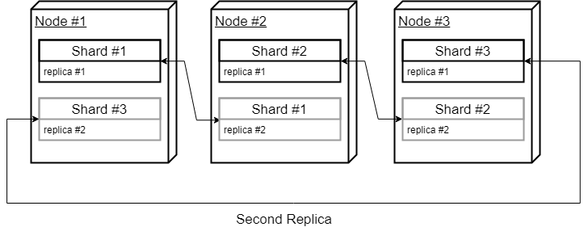
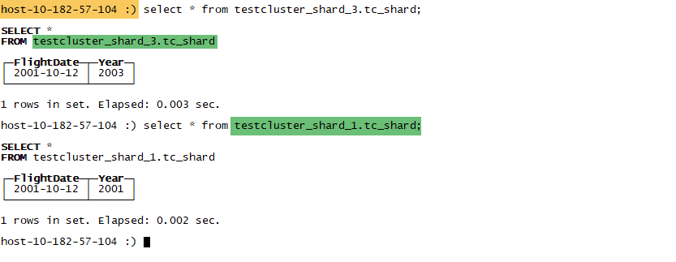
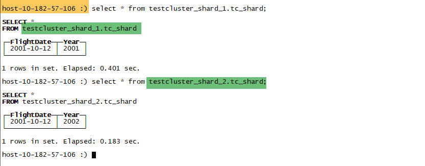
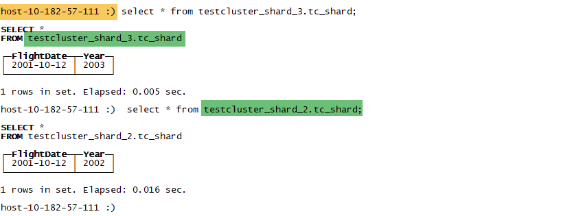

# Circular Replication Cluster Topology in ClickHouse


## Introduction

In some cases, there is a need to configure a distributed cluster with replication but there are not enough servers in order to place every replica on a separate node. It is better to have multiple replicas at the same nodes configured in a special way, that allows to continue executing queries even in the case of a node failure. Such replication configuration can be found in different distributed systems, it is often referred to as ‘circular’ or ‘ring’ replication. In this article, we will discuss how to set up circular replication in ClickHouse. If you are new to this topic, we suggest starting with an introductory article ["ClickHouse Data Distribution"](https://www.altinity.com/blog/2017/6/5/clickhouse-data-distribution). 


## Concept

Assume there are 3 servers and 1 table. The goal is to have data distributed in 3 shards and replicated twice. That requires 2 different shards located on every node. 




## Cluster Configuration

Let’s start with a straightforward cluster configuration that defines 3 shards and 2 replicas. Since we have only 3 nodes to work with, we will setup replica hosts in a “Circle” manner meaning we will use the first and the second node for the first shard, the second and the third node for the second shard and the third and the first node for the third shard. Just like so:

1. 1st shard, 1st replica, hostname: cluster_node_1
2. 1st shard, 2nd replica, hostname: cluster_node_2
3. 2nd shard, 1st replica, hostname: cluster_node_2
4. 2nd shard, 2nd replica, hostname: cluster_node_3
5. 3rd shard, 1st replica, hostname: cluster_node_3
6. 3rd shard, 2nd replica, hostname: cluster_node_1

The configuration section may look like this:

```xml
<shard>
    <internal_replication>false</internal_replication>
    <default_database>testcluster_shard_1</default_database>
    <replica>
        <host>host-10-182-57-104</host>
        <port>9000</port>
        <user>default</user>
        <password>Lhfei</password>
    </replica>
    <replica>
        <host>host-10-182-57-106</host>
        <port>9000</port>
        <user>default</user>
        <password>Lhfei</password>
    </replica>
</shard>
<shard>
    <internal_replication>false</internal_replication>
    <replica>
        <host>host-10-182-57-106</host>
        <port>9000</port>
        <user>default</user>
        <password>Lhfei</password>
    </replica>
    <replica>
        <host>host-10-182-57-111</host>
        <port>9000</port>
        <user>default</user>
        <password>Lhfei</password>
    </replica>
</shard>
<shard>
    <internal_replication>false</internal_replication>
    <replica>
        <host>host-10-182-57-111</host>
        <port>9000</port>
        <user>default</user>
        <password>Lhfei</password>
    </replica>
    <replica>
        <host>host-10-182-57-104</host>
        <port>9000</port>
        <user>default</user>
        <password>Lhfei</password>
    </replica>
</shard>
```

As you can see now we have the following storage schema:

1. **cluster_node_1** stores 1st shard, 1st replica and 3rd shard, 2nd replica
2. **cluster_node_2** stores 1st shard, 2nd replica and 2nd shard, 1st replica
3. **cluster_node_3** stores 2nd shard, 2nd replica and 3rd shard, 1st replica

That obviously does not work, since shards have the same table name and ClickHouse cannot distinguish one shard/replica from another when they are located at the same server. The trick here is to put every shard into a separate database! ClickHouse allows to define ‘default_database’ for each shard and then use it in query time in order to route the query for a particular table to the right database. It is defined as follows:

```xml
<shard>
    <internal_replication>false</internal_replication>
    <default_database>testcluster_shard_1</default_database>
    <replica>
        <host>host-10-182-57-104</host>
        <port>9000</port>
        <user>default</user>
        <password>Lhfei</password>
    </replica>
    <replica>
        <host>host-10-182-57-106</host>
        <port>9000</port>
        <user>default</user>
        <password>Lhfei</password>
    </replica>
</shard>
```

Now let’s try to define shard tables that correspond to this configuration.

## Database Schema

As discussed above, in order to separate shards between each other on the same node shard-specific databases are required.

1. Schemas of the 1st Node
   - testcluster_shard_1
   - testcluster_shard_3
2. Schemas of the 2nd Node
   - testcluster_shard_2
   - testcluster_shard_1
3. Schemas of the 3rd Node
   - testcluster_shard_3
   - testcluster_shard_2


## Replicated Table Schema

Now let’s setup replicated tables for shards. ReplicatedMergeTree table definition requires two important parameters:

- Table Shard path in Zookeeper
- Replica Tag

Zookeeper path should be unique for every shard, and Replica Tag should be unique within each particular shard:

### 1st Node:

```sql
CREATE DATABASE testcluster_shard_1;
CREATE DATABASE testcluster_shard_3;

CREATE TABLE testcluster_shard_1.tc_shard (FlightDate Date,Year UInt16) Engine=ReplicatedMergeTree('/clickhouse/tables/tc_shard_1/events', 'replica_1',  FlightDate, (Year, FlightDate), 8192);

CREATE TABLE testcluster_shard_3.tc_shard (FlightDate Date,Year UInt16) Engine=ReplicatedMergeTree('/clickhouse/tables/tc_shard_3/events', 'replica_2',  FlightDate, (Year, FlightDate), 8192);
```

### 2nd Node:

```sql
CREATE DATABASE testcluster_shard_1;
CREATE DATABASE testcluster_shard_2;

CREATE TABLE testcluster_shard_2.tc_shard (FlightDate Date,Year UInt16) Engine=ReplicatedMergeTree('/clickhouse/tables/tc_shard_2/events', 'replica_1',  FlightDate, (Year, FlightDate), 8192);

CREATE TABLE testcluster_shard_1.tc_shard (FlightDate Date,Year UInt16) Engine=ReplicatedMergeTree('/clickhouse/tables/tc_shard_1/events', 'replica_2',  FlightDate, (Year, FlightDate), 8192);
```

### 3nd Node:

```sql
CREATE DATABASE testcluster_shard_2;
CREATE DATABASE testcluster_shard_3;

CREATE TABLE testcluster_shard_3.tc_shard (FlightDate Date,Year UInt16) Engine=ReplicatedMergeTree('/clickhouse/tables/tc_shard_3/events', 'replica_1',  FlightDate, (Year, FlightDate), 8192);

CREATE TABLE testcluster_shard_2.tc_shard (FlightDate Date,Year UInt16) Engine=ReplicatedMergeTree('/clickhouse/tables/tc_shard_2/events', 'replica_2',  FlightDate, (Year, FlightDate), 8192);
```


### Distributed Table Schema

Restart the clusters. And check cluster info like so:

```sql
host-10-182-57-104 :) select * from system.clusters;

SELECT *
FROM system.clusters 

┌─cluster─────────────────────┬─shard_num─┬─shard_weight─┬─replica_num─┬─host_name──────────┬─host_address──┬─port─┬─is_local─┬─user────┬─default_database─┐
│ bip_ck_cluster              │         1 │            1 │           1 │ host-10-182-57-104 │ 10.182.57.104 │ 9000 │        1 │ default │                  │
│ bip_ck_cluster              │         1 │            1 │           2 │ host-10-182-57-106 │ 10.182.57.106 │ 9000 │        1 │ default │                  │
│ bip_ck_cluster              │         2 │            1 │           1 │ host-10-182-57-106 │ 10.182.57.106 │ 9000 │        0 │ default │                  │
│ bip_ck_cluster              │         2 │            1 │           2 │ host-10-182-57-111 │ 10.182.57.111 │ 9000 │        0 │ default │                  │
│ bip_ck_cluster              │         3 │            1 │           1 │ host-10-182-57-111 │ 10.182.57.111 │ 9000 │        1 │ default │                  │
│ bip_ck_cluster              │         3 │            1 │           2 │ host-10-182-57-104 │ 10.182.57.104 │ 9000 │        1 │ default │                  │
│ test_shard_localhost        │         1 │            1 │           1 │ localhost          │ ::1           │ 9000 │        1 │ default │                  │
│ test_shard_localhost_secure │         1 │            1 │           1 │ localhost          │ ::1           │ 9440 │        0 │ default │                  │
└─────────────────────────────┴───────────┴──────────────┴─────────────┴────────────────────┴───────────────┴──────┴──────────┴─────────┴──────────────────┘

8 rows in set. Elapsed: 0.004 sec. 
```


The only remaining thing is distributed table. In order ClickHouse to pick proper default databases for local shard tables, the distributed table needs to be created with an empty database. That triggers the use of default one.

#### 1st Node:

```sql
CREATE TABLE testcluster_shard_1.tc_distributed (FlightDate Date,Year UInt16) ENGINE = Distributed( 'bip_ck_cluster', 'testcluster_shard_1', tc_shard, rand() );
```


#### 2st Node:

```
CREATE TABLE testcluster_shard_2.tc_distributed (FlightDate Date,Year UInt16) ENGINE = Distributed( 'bip_ck_cluster', 'testcluster_shard_2', tc_shard, rand() );
```


#### 3st Node:

```
CREATE TABLE testcluster_shard_3.tc_distributed (FlightDate Date,Year UInt16) ENGINE = Distributed( 'bip_ck_cluster', 'testcluster_shard_3', tc_shard, rand() );
```


When query to the distributed table comes, ClickHouse automatically adds corresponding default database for every local tc_shard table.


It makes sense to have ‘load_balancing’ setting set to ‘in_order’, otherwise, ClickHouse may occasionally select second replicas for query execution, resulting in two shards queried from the same cluster node that is not optimal.

If one of the nodes is down, there is still enough data to run queries:


## Test

### Init sample data


- host-10-182-57-104

```
host-10-182-57-104 :) insert into testcluster_shard_1.tc_shard (FlightDate,Year) values('2001-10-12',2001);
```


- host-10-182-57-106

```
host-10-182-57-106 :) insert into testcluster_shard_2.tc_shard (FlightDate,Year) values('2001-10-12',2002);
```


- host-10-182-57-111 

```
host-10-182-57-111 :) insert into testcluster_shard_3.tc_shard (FlightDate,Year) values('2001-10-12',2003);
```


### Query

- host-10-182-57-104

  

- host-10-182-57-106

  


- host-10-182-57-111

  


> **1st Node**

- DDL

  ```
  CREATE TABLE lhfei.ontime_local (FlightDate Date,Year UInt16) ENGINE = ReplicatedMergeTree( '/clickhouse/tables/tc_shard_1/ontime_local', 'replica_1', FlightDate, (Year, FlightDate), 8192);
  CREATE TABLE ontime_all (FlightDate Date,Year UInt16) ENGINE = Distributed(bip_ck_cluster, lhfei, ontime_local, rand());
  insert into ontime_local (FlightDate,Year) values('2001-10-12',2001);
  ```

- Query

  ```sql
  SELECT *
  FROM ontime_all 
  
  ┌─FlightDate─┬─Year─┐
  │ 2001-10-12 │ 2001 │
  └────────────┴──────┘
  ┌─FlightDate─┬─Year─┐
  │ 2001-10-12 │ 2001 │
  └────────────┴──────┘
  ┌─FlightDate─┬─Year─┐
  │ 2003-10-12 │ 2003 │
  └────────────┴──────┘
  
  3 rows in set. Elapsed: 0.006 sec.
  ```

  


> **2nd Node**

- DDL

  ```sql
  CREATE TABLE lhfei.ontime_local (FlightDate Date,Year UInt16) ENGINE = ReplicatedMergeTree( '/clickhouse/tables/tc_shard_2/ontime_local', 'replica_2', FlightDate, (Year, FlightDate), 8192);
  CREATE TABLE ontime_all (FlightDate Date,Year UInt16) ENGINE = Distributed(bip_ck_cluster, lhfei, ontime_local, rand());
  insert into ontime_local (FlightDate,Year) values('2002-10-12',2002);
  ```

- Query

  ```
  SELECT *
  FROM ontime_all 
  
  ┌─FlightDate─┬─Year─┐
  │ 2003-10-12 │ 2003 │
  └────────────┴──────┘
  ┌─FlightDate─┬─Year─┐
  │ 2002-10-12 │ 2002 │
  └────────────┴──────┘
  ┌─FlightDate─┬─Year─┐
  │ 2002-10-12 │ 2002 │
  └────────────┴──────┘
  
  3 rows in set. Elapsed: 0.062 sec.
  ```

  

> **3rd Node**

- DDL

  ```sql
  CREATE TABLE lhfei.ontime_local (FlightDate Date,Year UInt16) ENGINE = ReplicatedMergeTree( '/clickhouse/tables/tc_shard_3/ontime_local', 'replica_1', FlightDate, (Year, FlightDate), 8192);
  CREATE TABLE ontime_all (FlightDate Date,Year UInt16) ENGINE = Distributed(bip_ck_cluster, lhfei, ontime_local, rand());
  insert into ontime_local (FlightDate,Year) values('2003-10-12',2003);
  ```

- Query

  ```sql
  SELECT *
  FROM ontime_all 
  
  ┌─FlightDate─┬─Year─┐
  │ 2003-10-12 │ 2003 │
  └────────────┴──────┘
  ┌─FlightDate─┬─Year─┐
  │ 2003-10-12 │ 2003 │
  └────────────┴──────┘
  ┌─FlightDate─┬─Year─┐
  │ 2002-10-12 │ 2002 │
  └────────────┴──────┘
  
  3 rows in set. Elapsed: 0.092 sec. 
  ```

  

## Conclusion

As shown above, it is possible to setup circular or ring replication topology in ClickHouse, though it is not straightforward, requires non-evident configuration and additional databases to separate shards and replicas. In addition to a complex configuration, such setup performs worse comparing to separate replica nodes due to double INSERT load for every cluster node. While it may seem attractive to re-use same nodes for replicas, the performance and configuration concerns need to be taken into account when considering circular replication deployment. 


[See](https://www.altinity.com/blog/2018/5/10/circular-replication-cluster-topology-in-clickhouse)