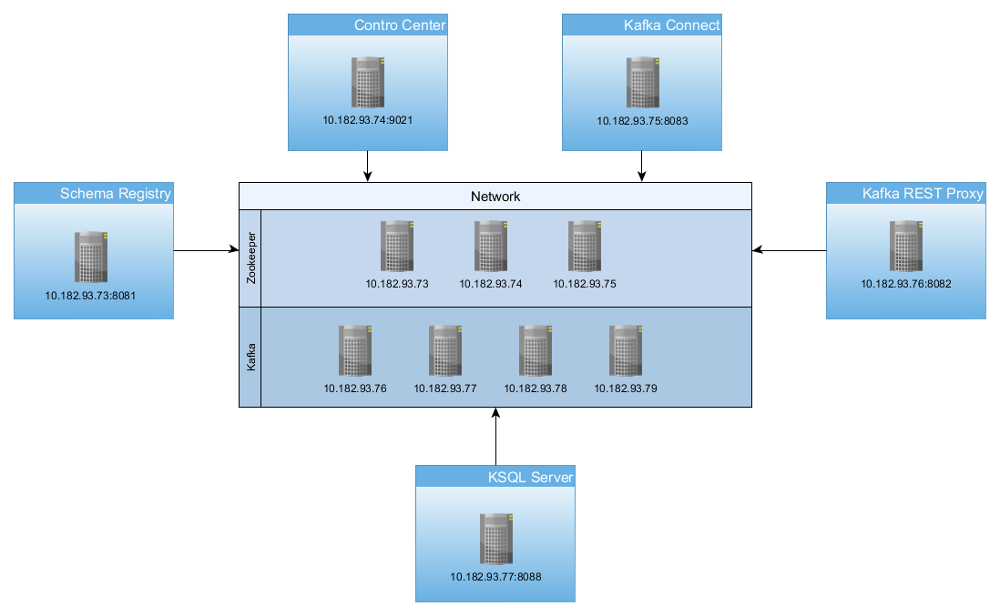

### Hosts

```ini
10.182.93.73	authserve-a9dedccb
10.182.93.74	authserve-49d827d8
10.182.93.75	authserve-a0e40d35
10.182.93.76	authserve-23119819
10.182.93.77	authserve-519d7886
10.182.93.78	authserve-d0f49892
10.182.93.79	authserve-ed0ad87d
```


### Zookeeper Cluster

```ini
10.182.93.73	authserve-a9dedccb
10.182.93.74	authserve-49d827d8
10.182.93.75	authserve-a0e40d35
```


Kafka Cluster

```ini
10.182.93.76	authserve-23119819
10.182.93.77	authserve-519d7886
10.182.93.78	authserve-d0f49892
10.182.93.79	authserve-ed0ad87d
```





# Manual Install using ZIP and TAR Archives

This topic provides instructions for installing a production-ready Confluent Platform configuration in a multi-node environment with a replicated ZooKeeper ensemble.

With this installation method, you connect to every node manually, download the archive, and run the Confluent Platform installation commands.

Important

You must complete these steps for each node in your cluster.

- Prerequisites

  Before installing Confluent Platform, your environment must have the following [software and hardware requirements](https://docs.confluent.io/current/installation/system-requirements.html#system-requirements).

## Get the Software

1. Go to the [downloads page](https://www.confluent.io/download/) and choose your archive package or download directly by using curl.

   - Confluent Platform

     ZIP`curl -O http://packages.confluent.io/archive/5.1/confluent-5.1.0-2.11.zip `CopyTAR`curl -O http://packages.confluent.io/archive/5.1/confluent-5.1.0-2.11.tar.gz `Copy

   - Confluent Platform using only Confluent Community components

     ZIP`curl -O http://packages.confluent.io/archive/5.1/confluent-community-5.1.0-2.11.zip `CopyTAR`curl -O http://packages.confluent.io/archive/5.1/confluent-community-5.1.0-2.11.tar.gz `Copy

   Tip

   The package name contains the Confluent Platform version followed by the Scala version. For example, `5.1.0-2.11.zip` denotes Confluent Platform version 5.1.0 and Scala version 2.11.

2. Decompress the file. You should have these directories:

   | Folder  | Description                                          |
   | ------- | ---------------------------------------------------- |
   | /bin/   | Driver scripts for starting and stopping services    |
   | /etc/   | Configuration files                                  |
   | /lib/   | Systemd services                                     |
   | /logs/  | Log files                                            |
   | /share/ | Jars and licenses                                    |
   | /src/   | Source files that require a platform-dependent build |

   

## Configure Confluent Platform

Configure Confluent Platform with the individual component properties files. By default these are located in `<path-to-confluent>/etc/`. You must minimally configure the following components.

### ZooKeeper

These instructions assume you are running ZooKeeper in replicated mode. A minimum of three servers are required for replicated mode, and you must have an odd number of servers for failover. For more information, see the [ZooKeeper documentation](https://zookeeper.apache.org/doc/current/zookeeperStarted.html#sc_RunningReplicatedZooKeeper).

1. Navigate to the ZooKeeper properties file (`/etc/kafka/zookeeper.properties`) file and modify as shown.

   ```ini
   tickTime=2000
   dataDir=/export/app_data/zookeeper/
   clientPort=2181
   initLimit=5
   syncLimit=2
   # Servers: 10.182.93.[73,, 74, 75]
   server.1=authserve-a9dedccb:2888:3888
   server.2=authserve-49d827d8:2888:3888
   server.3=authserve-a0e40d35:2888:3888
   autopurge.snapRetainCount=3
   autopurge.purgeInterval=24
   ```

   

   This configuration is for a three node ensemble. This configuration file should be identical across all nodes in the ensemble. `tickTime`, `dataDir`, and `clientPort` are all set to typical single server values. The `initLimit` and `syncLimit` govern how long following ZooKeeper servers can take to initialize with the current leader and how long they can be out of sync with the leader. In this configuration, a follower can take 10000 ms to initialize and can be out of sync for up to 4000 ms based on the `tickTime` being set to 2000ms.

   The `server.*` properties set the ensemble membership. The format is

   ```ini
   server.<myid>=<hostname>:<leaderport>:<electionport>
   ```

   - `myid` is the server identification number. There are three servers that each have a different `myid` with values `1`, `2`, and `3` respectively. The `myid`is set by creating a file named `myid` in the `dataDir` that contains a single integer in human readable ASCII text. This value must match one of the `myid` values from the configuration file. You will see an error if another ensemble member is already started with a conflicting `myid` value.
   - `leaderport` is used by followers to connect to the active leader. This port should be open between all ZooKeeper ensemble members.
   - `electionport` is used to perform leader elections between ensemble members. This port should be open between all ZooKeeper ensemble members.

   The `autopurge.snapRetainCount` and `autopurge.purgeInterval` have been set to purge all but three snapshots every 24 hours.

2. Navigate to the the ZooKeeper log directory (e.g., `/var/lib/zookeeper/`) and create a file named `myid`. The `myid` file consists of a single line that contains the machine ID in the format `'<machine-id>'`. When the ZooKeeper server starts up, it knows which server it is by referencing the `myid` file. For example, server 1 will have this myid value.

   ```
   '1'
   ```

   

### Kafka

In a production environment, multiple brokers are required. During startup brokers register themselves in ZooKeeper to become a member of the cluster.

Navigate to the Kafka properties file (`/etc/kafka/server.properties`) and customize the following:

- Connect to the same ZooKeeper ensemble by setting the `zookeeper.connect` in all nodes to the same value. Replace all instances of `localhost` to the hostname or FQDN (fully qualified domain name) of your node. For example, if your hostname is `zookeeper`:

  ```ini
  zookeeper.connect=authserve-a9dedccb:2181,authserve-49d827d8:2181,authserve-a0e40d35:2181
  
  delete.topic.enable=true
  ```

  

- Configure the broker IDs for each node in your cluster using one of these methods.

  - Dynamically generate the broker IDs: add `broker.id.generation.enable=true` and comment out `broker.id`. For example:

    ```ini
    ############################# Server Basics #############################
    
    # The ID of the broker. This must be set to a unique integer for each broker.
    #broker.id=0
    broker.id.generation.enable=true
    ```

    

  - Manually set the broker IDs: set a unique value for `broker.id` on each node.

- Configure how other brokers and clients communicate with the broker using `listeners`, and optionally `advertised.listeners`.

  - `listeners`: Comma-separated list of URIs and listener names to listen on.
  - `advertised.listeners`: Comma-separated list of URIs and listener names for other brokers and clients to use. The `advertised.listeners` parameter ensures that the broker advertises an address that is accessible from both local and external hosts.

### Control Center

1. Navigate to the Control Center properties file (`/etc/confluent-control-center/control-center.properties`) and customize the following:

   ```ini
   # host/port pairs to use for establishing the initial connection to the Kafka cluster
   # Servers: # Servers: 10.182.93.[76, 77, 78, 79]
   bootstrap.servers=authserve-23119819:9092,authserve-519d7886:9092,authserve-d0f49892:9092,authserve-ed0ad87d:9092
   # location for Control Center data
   confluent.controlcenter.data.dir=/export/app_data/confluent-control-center
   # the Confluent license
   confluent.license=<your-confluent-license>
   # ZooKeeper connection string with host and port of a ZooKeeper servers
   zookeeper.connect=authserve-a9dedccb:2181,authserve-49d827d8:2181,authserve-a0e40d35:2181
   
   # A comma separated list of Connect host names
   confluent.controlcenter.connect.cluster=http://10.182.93.75:8083
   
   # KSQL cluster URL
   confluent.controlcenter.ksql.url=http://10.182.93.77:8088
   ```

   

   This configuration is for a three node multi-node cluster. For more information, see [Control Center configuration details](https://docs.confluent.io/current/control-center/installation/configuration.html#controlcenter-configuration).

2. Navigate to the Kafka server configuration file (`/etc/kafka/server.properties`) and enable Confluent Metrics Reporter.

   ```ini
   ##################### Confluent Metrics Reporter #######################
   # Confluent Control Center and Confluent Auto Data Balancer integration
   #
   # Uncomment the following lines to publish monitoring data for
   # Confluent Control Center and Confluent Auto Data Balancer
   # If you are using a dedicated metrics cluster, also adjust the settings
   # to point to your metrics Kafka cluster.
   metric.reporters=io.confluent.metrics.reporter.ConfluentMetricsReporter
   confluent.metrics.reporter.bootstrap.servers=localhost:9092
   #
   # Uncomment the following line if the metrics cluster has a single broker
   confluent.metrics.reporter.topic.replicas=1
   ```

   

3. Add these lines to the Kafka Connect properties file (`/etc/kafka/connect-distributed.properties`) to add support for the interceptors.

   ```ini
   # Interceptor setup
   consumer.interceptor.classes=io.confluent.monitoring.clients.interceptor.MonitoringConsumerInterceptor
   producer.interceptor.classes=io.confluent.monitoring.clients.interceptor.MonitoringProducerInterceptor
   ```

4. Navigate to the schema registry configuration file (`/etc/schema-registry/schema-registry.properties`) and update zookeeper connect url.

   ```ini
   kafkastore.connection.url=authserve-a9dedccb:2181,authserve-49d827d8:2181,authserve-a0e40d35:2181
   ```

   Navigate to the schema registry configuration file (`/etc/schema-registry/connect-avro-distributed.properties `) and update bootstrap.servers.

   ```ini
   bootstrap.servers=authserve-23119819:9092,authserve-519d7886:9092,authserve-d0f49892:9092,authserve-ed0ad87d:9092
   
   key.converter.schema.registry.url=http://10.182.93.73:8081
   value.converter.schema.registry.url=http://10.182.93.73:8081
   ```

5. Navigate to the ksql server configuration file (`/etc/ksql/ksql-server.properties`) and update it as below:

   ```ini
   bootstrap.servers=authserve-23119819:9092,authserve-519d7886:9092,authserve-d0f49892:9092,authserve-ed0ad87d:9092
   listeners=http://0.0.0.0:8088
   ksql.schema.registry.url=http://10.182.93.73:8081
   
   # Set the retries to Integer.MAX_VALUE to ensure that transient failures
   # will not result in data loss.
   ksql.streams.producer.retries=2147483647
   
   # Set the batch expiry to Long.MAX_VALUE to ensure that queries will not
   # terminate if the underlying Kafka cluster is unavailable for a period of
   # time.
   ksql.streams.producer.confluent.batch.expiry.ms=9223372036854775807
   
   # Allows more frequent retries of requests when there are failures,
   # enabling quicker recovery.
   ksql.streams.producer.request.timeout.ms=300000
   
   # Set the maximum allowable time for the producer to block to
   # Long.MAX_VALUE. This allows KSQL to pause processing if the underlying
   # Kafka cluster is unavailable.
   ksql.streams.producer.max.block.ms=9223372036854775807
   
   # Set the replication factor for internal topics, the command topic, and
   # output topics to be 3 for better fault tolerance and durability. Note:
   # the value 3 requires at least 3 brokers in your Kafka cluster.
   ksql.streams.replication.factor=3
   ksql.sink.replicas=3
   
   # Set the storage directory for stateful operations like aggregations and
   # joins to be at a durable location. By default, they are stored in /tmp.
   ksql.streams.state.dir=/some/non-temporary-storage-path/
   
   # Bump the number of replicas for state storage for stateful operations
   # like aggregations and joins. By having two replicas (one main and one
   # standby) recovery from node failures is quicker since the state doesn't
   # have to be rebuilt from scratch.
   ksql.streams.num.standby.replicas=1
   ```

   


## Start Confluent Platform

Install Confluent Platform by using Kafka CLI commands.

Tip

ZooKeeper, Kafka, and Schema Registry must be started in this specific order, and must be started before any other components. You can start all Confluent Platform components in order by using the `start-cp.sh` script and stop all components using the `stop-cp.sh` script.

1. Start ZooKeeper. Run this command in all `zookeeper cluster nodes` terminal.

   > [10.182.93.73, 10.182.93.74, 10.182.93.75]:2181

   ```sh
   ${CONFLUENT_HOME}/bin/zookeeper-server-start ${CONFLUENT_HOME}/etc/kafka/zookeeper.properties &
   ```

   

2. Start Kafka. Run this command in all `kafka cluster nodes` 's terminal.

   > [10.182.93.76, 10.182.93.77, 10.182.93.78, 10.182.93.79]:9092

   ```sh
   ${CONFLUENT_HOME}/bin/kafka-server-start ${CONFLUENT_HOME}/etc/kafka/server.properties &
   ```

   

3. Start Schema Registry. Run this command in its own terminal.

   > 10.182.93.73:8081

   ```sh
   ${CONFLUENT_HOME}/bin/schema-registry-start ${CONFLUENT_HOME}/etc/schema-registry/schema-registry.properties > logs/schema-registry.log &
   ```

   

4. Start other Confluent Platform components as desired.

   - Control Center

     - > 10.182.93.74:9021

     ```sh
     ${CONFLUENT_HOME}/bin/control-center-start ${CONFLUENT_HOME}/etc/confluent-control-center/control-center.properties > logs/control-center.log &
     ```

   

   To use the Control Center interface, open your web browser and navigate to the host and port where Control Center is running. By default this runs at <http://localhost:9021/>. For details on how to configure, see [Control Center Parameter Reference](https://docs.confluent.io/5.1.0/control-center/installation/configuration.html#controlcenter-configuration).

   

   - Kafka Connect

     - > 10.182.93.75:8083

     ```sh
     ${CONFLUENT_HOME}/bin/connect-distributed ${CONFLUENT_HOME}/etc/schema-registry/connect-avro-distributed.properties > logs/connect.log &
     ```

     

   - Kafka REST Proxy

     - > 10.182.93.76:8082

     ```sh
     ${CONFLUENT_HOME}/bin/kafka-rest-start ${CONFLUENT_HOME}/etc/kafka-rest/kafka-rest.properties > logs/kafka-rest.log &
     ```

     

   - KSQL 

     - > 10.182.93.77:8088

     ```sh
     ${CONFLUENT_HOME}/bin/ksql-server-start ${CONFLUENT_HOME}/etc/ksql/ksql-server.properties > logs/ksql-server.log &
     ```

     

## Uninstall

1. Remove the Confluent directory. For example, if you have Confluent Platform 5.1.0 installed:

   ```
   rm -rf confluent-5.1.0
   ```

   Copy

2. Remove the Confluent Platform data files.

   ```
   rm -rf /var/lib/<confluent-platform-data-files>
   ```