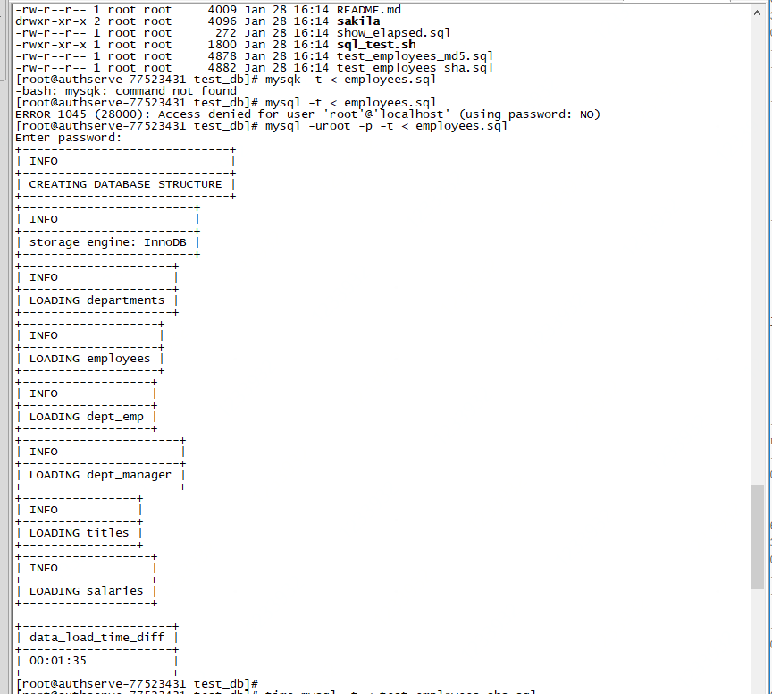
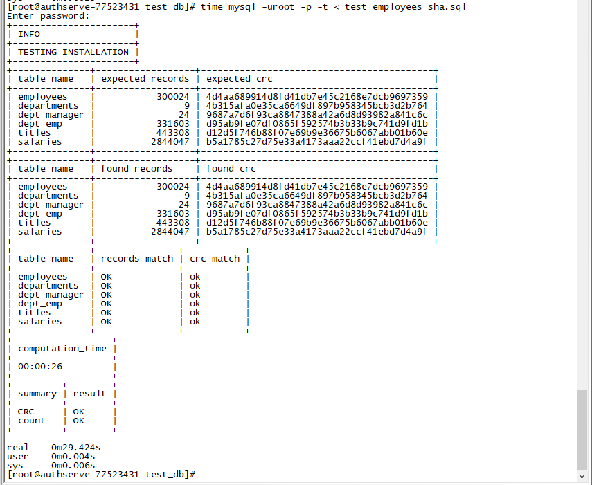
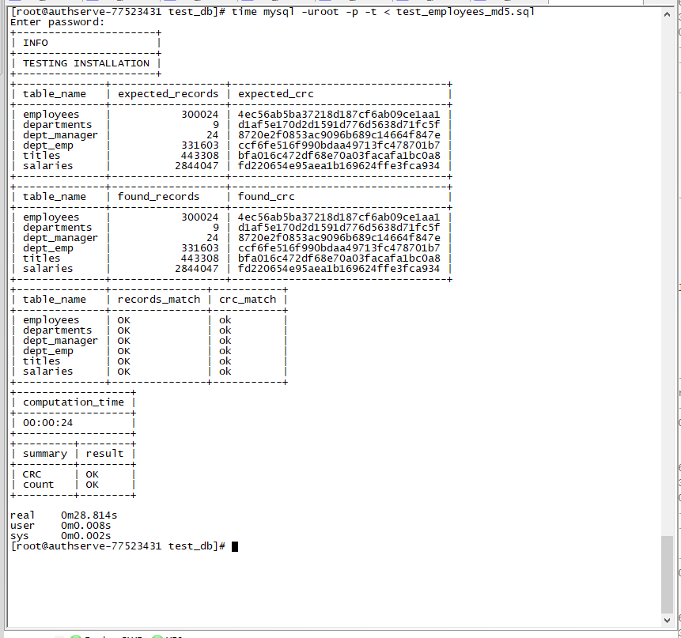

### MySQL Server

| Host         | User | Password      |
| ------------ | ---- | ------------- |
| 10.182.93.72 | root | Lhfeilaile@01 |
|              |      |               |
|              |      |               |


### Prepare


```sh
git clone --progress https://github.com/datacharmer/test_db.git

cd test_db 

mysql -uroot -p -t < employees.sql

time mysql -t < test_employees_sha.sql

time mysql -t < test_employees_md5.sql
```











### Create DB & Tables

```sql
-- mysql -uroot -p -t < employee.sql

CREATE TABLE `accounts` (
  `name` VARCHAR(64) DEFAULT NULL
) ENGINE=INNODB DEFAULT CHARSET=utf8
```


### Create Topic

```sql
${CONFLUENT_HOME}/bin/kafka-topics --create --zookeeper authserve-a9dedccb:2181,authserve-49d827d8:2181,authserve-a0e40d35:2181 \
--replication-factor 1 --partitions 1 --topic mysql-employees
```


### Configure Data Sink Properties

Navegate to `etc/kafka-connect-jdbc/sink-quickstart-mysql.properties`

```ini
# A simple example that copies from a topic to a SQLite database.
# The first few settings are required for all connectors:
# a name, the connector class to run, and the maximum number of tasks to create:
name=mysql-sink
connector.class=io.confluent.connect.jdbc.JdbcSinkConnector
tasks.max=1

# The topics to consume from - required for sink connectors like this one
topics=mysql-employees

# Configuration specific to the JDBC sink connector.
# We want to connect to a SQLite database stored in the file test.db and auto-create tables.
connection.url=jdbc:mysql://10.182.93.72:3306/kafka_conn
connection.user=root
connection.password=Lhfeilaile@01
auto.create=true
```


### Load `mysql-sink` Connector

`10.182.93.75:8083`

```sh
cd $CONFLUENT_HOME

confluent load mysql-sink -d etc/kafka-connect-jdbc/sink-quickstart-mysql.properties 

-----------------------------------------
{
  "type": null,
  "tasks": [],
  "config": {
    "name": "mysql-sink",
    "connector.class": "io.confluent.connect.jdbc.JdbcSinkConnector",
    "tasks.max": "1",
    "topics": "mysql-employees",
    "connection.url": "jdbc:mysql://10.182.93.72:3306/kafka_conn",
    "connection.user": "root",
    "connection.password": "Lhfeilaile@01",
    "auto.create": "true"
  },
  "name": "mysql-sink"
}
```


Validate it by `curl` on  host`10.182.93.75`

```sh
curl -s http://10.182.93.75:8083/connectors
["mysql-sink"]
```


### Add MySQL JDBC Driver


```sh
cp mysql-connector-java-5.1.47.jar share/java/kafka-connect-jdbc/
```


### Producer a record into the `mysql-employees` topic

Next, navigate to schema-registry-server[10.182.93.73] and start the Avro console producer to import a few records to Kafka:

```sh
./bin/kafka-avro-console-producer --broker-list authserve-23119819:9092,authserve-519d7886:9092,authserve-d0f49892:9092,authserve-ed0ad87d:9092 --topic mysql-employees \
    --property value.schema='{"type":"record","name":"employeerecord","fields":[{"name":"id","type":"int"}, {"name":"name","type":"string"}]}'
```


Then in the console producer, type in:

```json
{"id": 1, "name": "Alice"}
{"id": 2, "name": "Bob"}
{"id": 3, "name": "John"}
```

The three records entered are published to the Kafka topic test_hdfs in Avro format.


```
./bin/kafka-avro-console-consumer --bootstrap-server 10.182.93.76:9092  --topic mysql-employees --from-beginning
```

