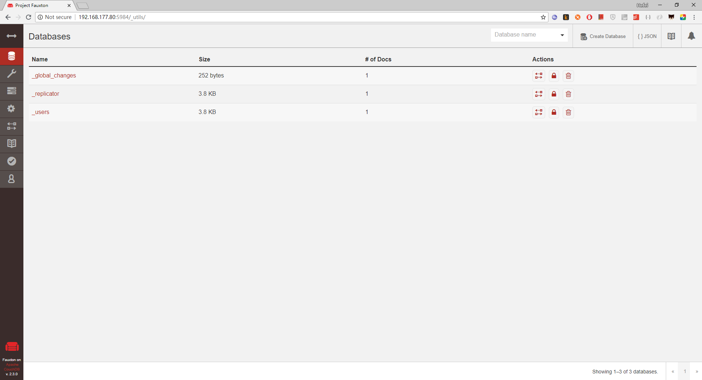

### Enable Remote Access

Once the firewall rule is in place, perform these additional steps:

- Stop your CouchDB server and edit the `/opt/bitnami/couchdb/etc/local.ini` file. Change the *bind_address* from 127.0.0.1 to 0.0.0.0:

  ```ini
  [chttpd]
  port = 5984
  bind_address = 0.0.0.0
  ...
  
  [httpd]
  bind_address = 0.0.0.0
  ...
  ```

- Restart your server for the changes to take effect.

  ```ini
  sudo /opt/bitnami/ctlscript.sh restart couchdb
  ```

You should now be able to connect to the CouchDB server from a different machine using the server’s IP address and receive a welcome message. This is shown in the example command and output below:

http://192.168.177.80:5984/_utils/

