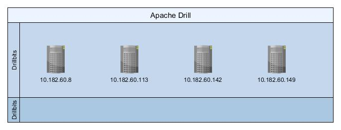

## Cluster




### Create View


```sql
CREATE OR REPLACE VIEW dfs.tmp.`V_TBL_1` AS
SELECT 
    columns[0 ] as L_ORDERKEY	,
    columns[1 ] as L_PARTKEY	,
    columns[2 ] as L_SUPPKEY	,
    columns[3 ] as L_LINENUMBER	,
    columns[4 ] as L_QUANTITY	,
    columns[5 ] as L_EXTENDEDPRICE ,
    columns[6 ] as L_DISCOUNT      ,
    columns[7 ] as L_TAX	        ,
    columns[8 ] as L_RETURNFLAG    ,
    columns[9 ] as L_LINESTATUS    ,
    columns[10] as L_SHIPDATE      ,
    columns[11] as L_COMMITDATE    ,
    columns[12] as L_RECEIPTDATE   ,
    columns[13] as L_SHIPINSTRUCT  ,
    columns[14] as L_SHIPMODE      ,
    columns[15] as L_COMMENT        
FROM dfs.`/user/druid/benchmark/data/lineitem_1.tbl.gz`;
```


Drop View

```sql
DROP VIEW dfs.tmp.`V_TBL_1`;
```


## Queries


### Count Star Interval

```sql
SELECT
  COUNT(*)
FROM
  dfs.tmp.`V_TBL_1`
WHERE L_SHIPDATE BETWEEN '1992-01-03'
  AND '1998-11-30';
```


### Sum Price

```sql
SELECT
  SUM(L_EXTENDEDPRICE)
FROM
  dfs.tmp.`V_TBL_1`;
```


### Sum All

```sql
SELECT
  SUM(L_EXTENDEDPRICE),
  SUM(L_DISCOUNT),
  SUM(L_TAX),
  SUM(L_QUANTITY)
FROM
  LINEITEM;
```


### Sum All by Year

```sql
SELECT
  YEAR(L_SHIPDATE),
  SUM(L_EXTENDEDPRICE),
  SUM(L_DISCOUNT),
  SUM(L_TAX),
  SUM(L_QUANTITY)
FROM
  dfs.tmp.`V_TBL_1`
GROUP BY YEAR(L_SHIPDATE);
```


### Sum All by Filter

```sql
SELECT
  SUM(L_EXTENDEDPRICE),
  SUM(L_DISCOUNT),
  SUM(L_TAX),
  SUM(L_QUANTITY)
FROM
  dfs.tmp.`V_TBL_1`
WHERE L_SHIPMODE LIKE '%AIR%';
```


### Top 100 Parts

```sql
SELECT
  L_PARTKEY,
  SUM(L_QUANTITY)
FROM
  dfs.tmp.`V_TBL_1`
GROUP BY L_PARTKEY
ORDER BY SUM(L_QUANTITY) DESC
LIMIT 100;
```


### Top 100 Parts with Details

```sql
SELECT
  L_PARTKEY,
  SUM(L_QUANTITY),
  SUM(L_EXTENDEDPRICE),
  MIN(L_DISCOUNT),
  MAX(L_DISCOUNT)
FROM
  dfs.tmp.`V_TBL_1`
GROUP BY L_PARTKEY
ORDER BY SUM(L_QUANTITY) DESC
LIMIT 100;
```


### Top 100 Parts by Filter

```sql
SELECT
  L_PARTKEY,
  SUM(L_QUANTITY),
  SUM(L_EXTENDEDPRICE),
  MIN(L_DISCOUNT),
  MAX(L_DISCOUNT)
FROM
  dfs.tmp.`V_TBL_1`
WHERE L_SHIPDATE BETWEEN '1996-01-15'
  AND '1998-03-15'
GROUP BY L_PARTKEY
ORDER BY SUM(L_QUANTITY) DESC
LIMIT 100;
```


### Top 100  by Commit date

```sql
SELECT
  L_COMMITDATE,
  SUM(L_QUANTITY)
FROM
  dfs.tmp.`V_TBL_1`
GROUP BY L_COMMITDATE
ORDER BY SUM(L_QUANTITY) DESC
LIMIT 100;
```

