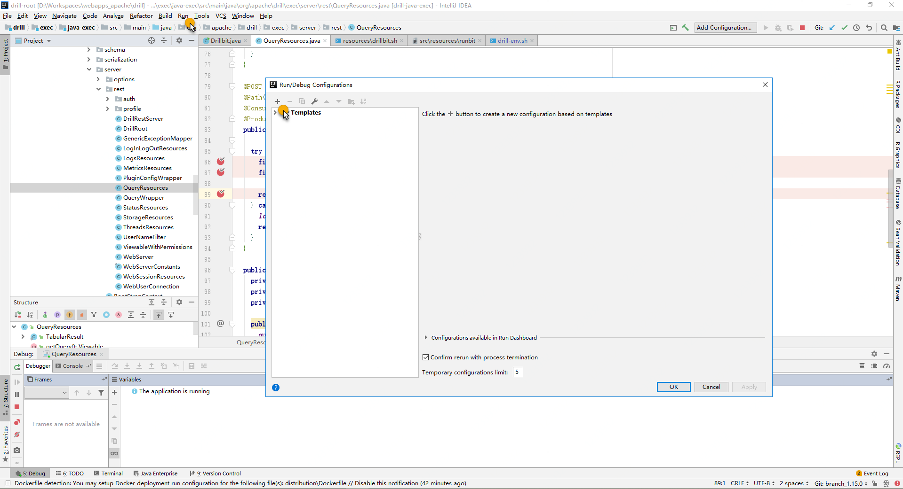
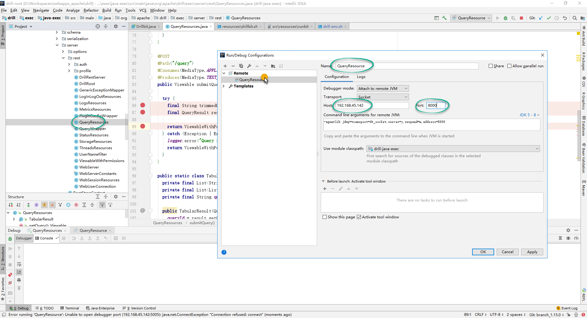
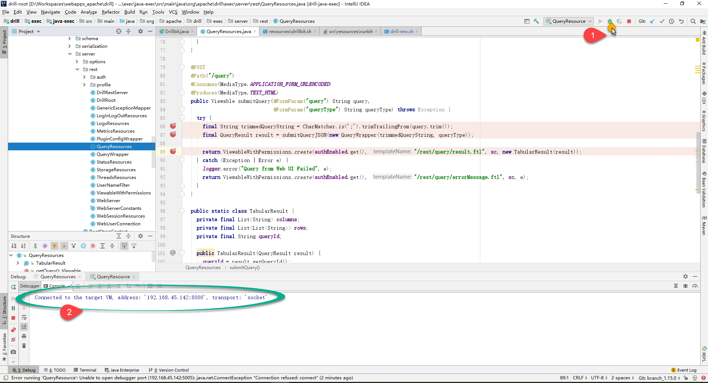
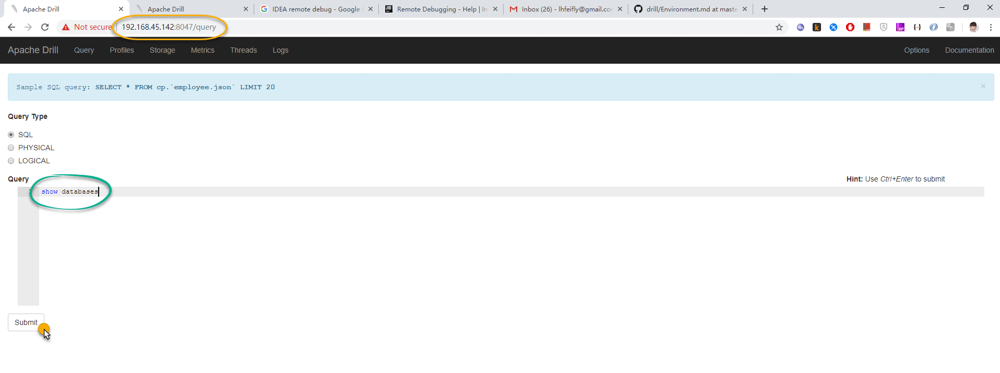
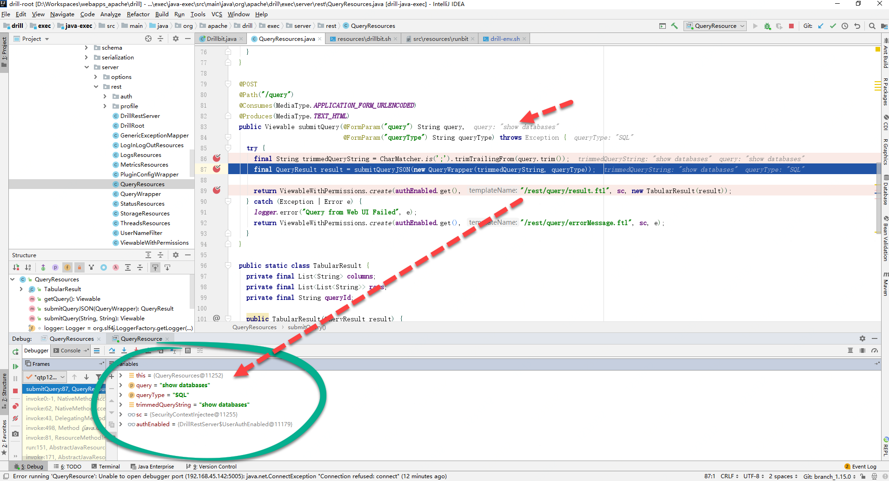

# Enable Remote Debug with IDEA 


### Prerequisites


- [x] Enable Development model

```sh
# add the following lines below to the end of ${DRILL_HOME}/conf/drill-env.sh
export DRILLBIT_JAVA_OPTS="$DRILLBIT_JAVA_OPTS -Xdebug -Xnoagent -Xrunjdwp:transport=dt_socket,server=y,suspend=n,address=8000"
```


### 1.Select the "run" menu, and choose "edit configuration".




### 2.Select the Remote Tab, and click on the plus sign to add a new configuration.




## 3.Click OK, and your IDE configuration is now complete.

Start Debug "QueryResource" :




### 4. Submit a query



### 5. Debug query 



