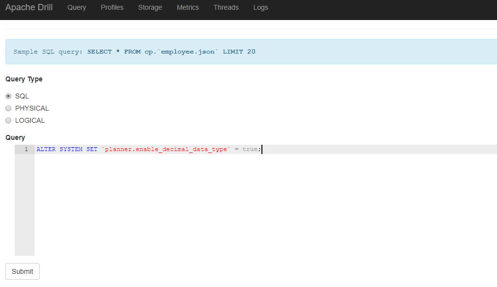
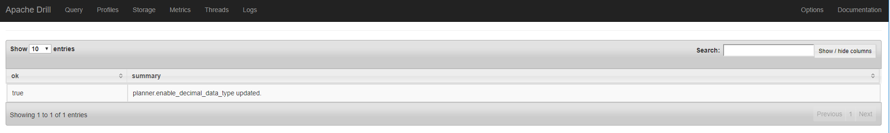

## Troubleshooting


> **UNSUPPORTED_OPERATION ERROR: Decimal data type is disabled.**

```ini
Error: UNSUPPORTED_OPERATION ERROR: Decimal data type is disabled. 
As of this release decimal data type is a beta level feature and should not be used in production 
Use option 'planner.enable_decimal_data_type' to enable decimal data type
```


set the `planner.enable_decimal_data_type`  param in terminal:

```shell
0: jdbc:drill:zk=host-10-182-60-8:2181,host-1> ALTER SYSTEM SET `planner.enable_decimal_data_type` = true;
+-------+--------------------------------------------+
|  ok   |                  summary                   |
+-------+--------------------------------------------+
| true  | planner.enable_decimal_data_type updated.  |
+-------+--------------------------------------------+
```


or use `Drill` web ui;







