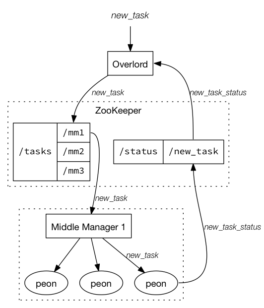

# Indexing Service

For Indexing Service Configuration, see [Indexing Service Configuration](http://druid.io/docs/latest/configuration/indexing-service.html).

The indexing service is a highly-available, distributed service that runs indexing related tasks. Indexing service [tasks](http://druid.io/docs/latest/ingestion/tasks.html) create (and sometimes destroy) Druid [segments](http://druid.io/docs/latest/design/segments.html). The indexing service has a master/slave like architecture.

The indexing service is composed of three main components: a peon component that can run a single task, a [Middle Manager](http://druid.io/docs/latest/design/middlemanager.html)component that manages peons, and an overlord component that manages task distribution to middle managers. Overlords and middle managers may run on the same node or across multiple nodes while middle managers and [Peons](http://druid.io/docs/latest/design/peons.html) always run on the same node.

## Indexing Service Overview



## Overlord Node

The overlord node is responsible for accepting tasks, coordinating task distribution, creating locks around tasks, and returning statuses to callers. Overlord can be configured to run in one of two modes - local or remote (local being default). In local mode overlord is also responsible for creating peons for executing tasks. When running the overlord in local mode, all middle manager and peon configurations must be provided as well. Local mode is typically used for simple workflows. In remote mode, the overlord and middle manager are run in separate processes and you can run each on a different server. This mode is recommended if you intend to use the indexing service as the single endpoint for all Druid indexing.

#### Leadership status

If you have multiple overlords, just one is leading at any given time. The others are on standby. To get the current leader overlord of the cluster, call:

```
http://<OVERLORD_IP>:<port>/druid/indexer/v1/leader

----------------
HTTP/1.1 200 OK
Server: nginx/1.10.2
Date: Mon, 07 May 2018 03:44:23 GMT
Content-Type: application/json
Content-Length: 47
Connection: keep-alive
Vary: Accept-Encoding, User-Agent

http://authserve-e857f6b0-2035558293-dzb6g:8090
```

To see if a given server is the current leader overlord of the cluster, call:

```
http://<OVERLORD_IP>:<port>/druid/indexer/v1/isLeader

----------------
HTTP/1.1 200 OK
Server: nginx/1.10.2
Date: Mon, 07 May 2018 03:44:55 GMT
Content-Type: application/json
Content-Length: 15
Connection: keep-alive
Vary: Accept-Encoding, User-Agent

{"leader":true}
```

This returns a JSON object with field "leader", either true or false. In addition, this call returns HTTP 200 if the server is the current leader and HTTP 404 if not. This is suitable for use as a load balancer status check if you only want the active leader to be considered in-service at the load balancer.

#### Submitting Tasks and Querying Task Status

Tasks are submitted to the overlord node in the form of JSON objects. Tasks can be submitted via POST requests to:

```
http://<OVERLORD_IP>:<port>/druid/indexer/v1/task
```

this will return the taskId of the submitted task.

Tasks can be shut down via POST requests to:

```
http://<OVERLORD_IP>:<port>/druid/indexer/v1/task/{taskId}/shutdown
```

Task statuses can be retrieved via GET requests to:

```
http://<OVERLORD_IP>:<port>/druid/indexer/v1/task/{taskId}/status
```

Task segments can be retrieved via GET requests to:

```
http://<OVERLORD_IP>:<port>/druid/indexer/v1/task/{taskId}/segments
```

#### Overlord Console

The overlord console can be used to view pending tasks, running tasks, available workers, and recent worker creation and termination. The console can be accessed at:

```
http://<OVERLORD_IP>:<port>/console.html
```

#### Blacklisted Workers

If the workers fail tasks above a threshold, the overlord will blacklist these workers. No more than 20% of the nodes can be blacklisted. Blacklisted nodes will be periodically whitelisted.

The following vairables can be used to set the threshold and blacklist timeouts.

```
druid.indexer.runner.maxRetriesBeforeBlacklist
druid.indexer.runner.workerBlackListBackoffTime
druid.indexer.runner.workerBlackListCleanupPeriod
druid.indexer.runner.maxPercentageBlacklistWorkers
```

#### Autoscaling

The Autoscaling mechanisms currently in place are tightly coupled with our deployment infrastructure but the framework should be in place for other implementations. We are highly open to new implementations or extensions of the existing mechanisms. In our own deployments, middle manager nodes are Amazon AWS EC2 nodes and they are provisioned to register themselves in a [galaxy](https://github.com/ning/galaxy) environment.

If autoscaling is enabled, new middle managers may be added when a task has been in pending state for too long. Middle managers may be terminated if they have not run any tasks for a period of time.

## Middle Managers

See [Middle Manager](http://druid.io/docs/latest/design/middlemanager.html).

## Peons

See [Peon](http://druid.io/docs/latest/design/peons.html).

## Tasks

See [Tasks](http://druid.io/docs/latest/ingestion/tasks.html).

## HTTP Endpoints

### GET

- `/status`

Returns the Druid version, loaded extensions, memory used, total memory and other useful information about the node.