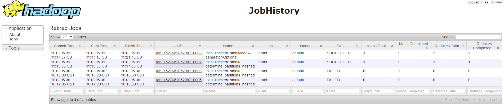
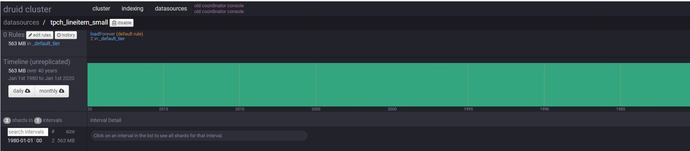

- small-task.json


```json
{
    "type": "index_hadoop",
    "spec": {
        "ioConfig": {
            "type": "hadoop",
            "inputSpec": {
                "type": "static",
                "paths": "hdfs://172.19.163.120:8020/user/druid/benchmark/data/lineitem.tbl.gz"
            }
        },
        "dataSchema": {
            "dataSource": "tpch_lineitem_small",
            "granularitySpec": {
                "type": "arbitrary",
                "intervals": [
                    "1980/2020"
                ]
            },
            "parser": {
                "type": "hadoopyString",
                "parseSpec": {
                    "format": "tsv",
                    "delimiter": "|",
                    "columns": [
                        "l_orderkey",
                        "l_partkey",
                        "l_suppkey",
                        "l_linenumber",
                        "l_quantity",
                        "l_extendedprice",
                        "l_discount",
                        "l_tax",
                        "l_returnflag",
                        "l_linestatus",
                        "l_shipdate",
                        "l_commitdate",
                        "l_receiptdate",
                        "l_shipinstruct",
                        "l_shipmode",
                        "l_comment"
                    ],
                    "dimensionsSpec": {
                        "dimensions": [
                            "l_orderkey",
                            "l_partkey",
                            "l_suppkey",
                            "l_linenumber",
                            "l_returnflag",
                            "l_linestatus",
                            "l_shipdate",
                            "l_commitdate",
                            "l_receiptdate",
                            "l_shipinstruct",
                            "l_shipmode",
                            "l_comment"
                        ]
                    },
                    "timestampSpec": {
                        "format": "yyyy-MM-dd",
                        "column": "l_shipdate"
                    }
                }
            },
            "metricsSpec": [
                {
                    "type": "count",
                    "name": "count"
                },
                {
                    "type": "longSum",
                    "fieldName": "L_QUANTITY",
                    "name": "L_QUANTITY"
                },
                {
                    "type": "doubleSum",
                    "fieldName": "L_EXTENDEDPRICE",
                    "name": "L_EXTENDEDPRICE"
                },
                {
                    "type": "doubleSum",
                    "fieldName": "L_DISCOUNT",
                    "name": "L_DISCOUNT"
                },
                {
                    "type": "doubleSum",
                    "fieldName": "L_TAX",
                    "name": "L_TAX"
                }
            ]
        },
        "tuningConfig": {
            "type": "hadoop",
            "partitionsSpec": {
                "type": "hashed",
                "targetPartitionSize": 5000000
            },
            "jobProperties": {}
        }
    }
}
```


- submit task


```sh
curl -H 'Content-Type:application/json' -X POST -d @task.json http://172.19.163.146/druid/indexer/v1/task

-----------------------
{"task":"index_hadoop_tpch_lineitem_small_2018-05-30T08:16:42.784Z"}
```


delete Datasource

```
curl -X DELETE http://172.19.163.146/druid/coordinator/v1/datasources/{dataSourceName}
```


- Check Log




- Check generated Segment




- query result


