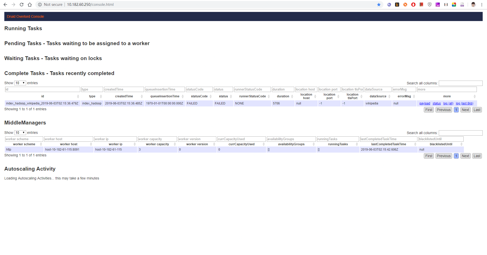
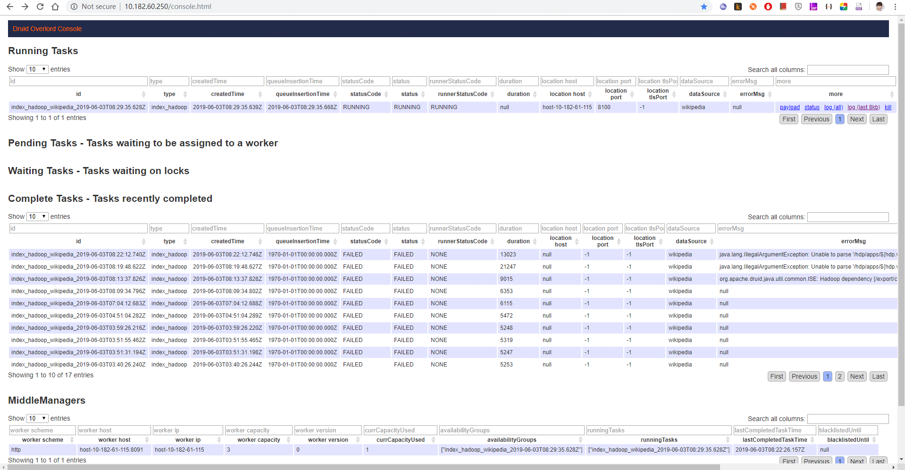
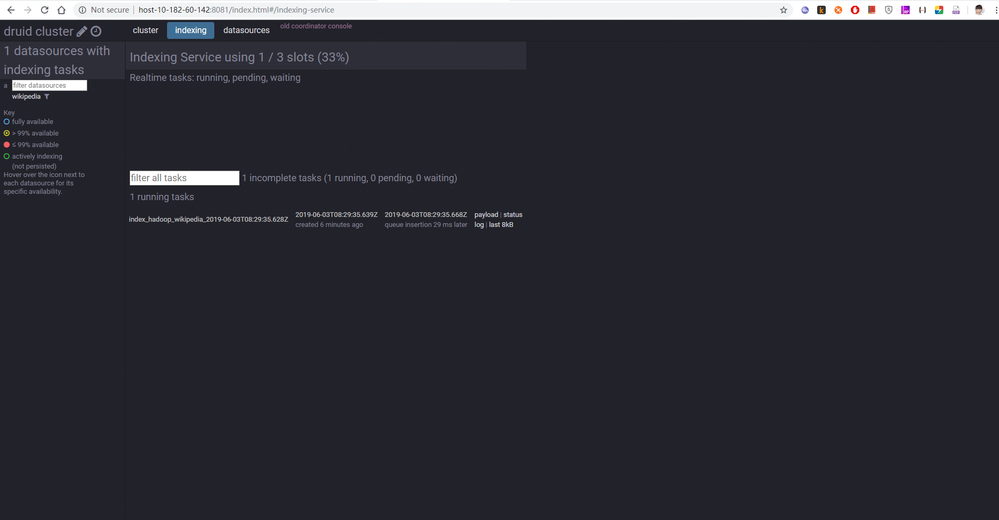
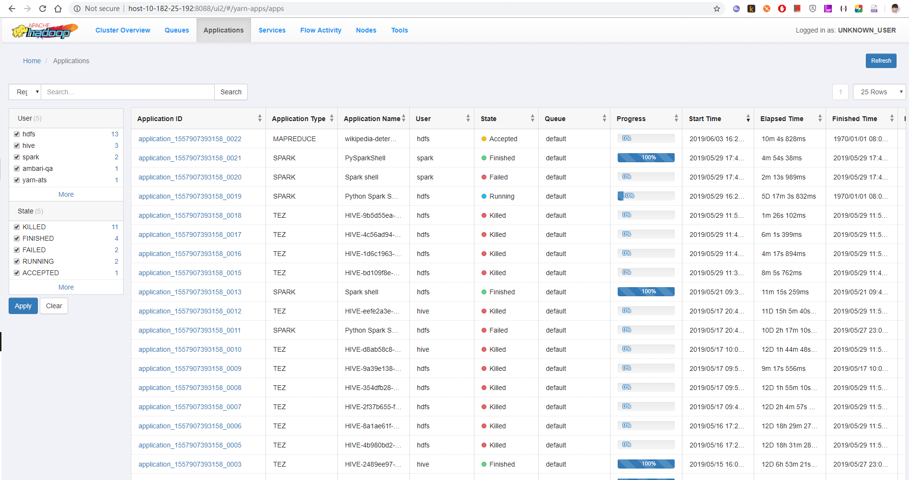

### Cluster

| Amp    | IP            | Service             | Port |
| ------ | ------------- | ------------------- | ---- |
| Master | 10.182.60.142 | Druid Coordinator   | 8081 |
|        | 10.182.60.250 | Druid Overlord      | 8090 |
|        |               |                     |      |
| Data   | 10.182.61.115 | Druid MiddleManager | 8091 |
|        | 10.182.61.125 | Druid Historical    | 8083 |
|        | 10.182.61.127 | Druid Historical    | 8083 |
|        | 10.182.61.148 | Druid Historical    | 8083 |
|        |               |                     |      |
| Query  | 10.182.61.158 | Druid Broker        | 8082 |
|        | 10.182.61.159 | Druid Router        | 8088 |


This should fetch a JAR file named similar to 'mysql-connector-java-x.x.xx.jar'.

Copy or symlink this file to `extensions/mysql-metadata-storage` under the distribution root directory.


```shell
s_ports=(8081 8090 8091 8083 8082 8088); for s_port in ${s_ports[@]:0}; do for pid in `lsof -i :$s_port | awk '{print $2}'` ; do kill -9 $pid ; done; done;
```


### Request to Druid Overlord

```shell
curl -X 'POST' -H 'Content-Type:application/json' -d @/export/app_sdk/wikiticker-index.json http://10.182.60.250:8090/druid/indexer/v1/task
```













