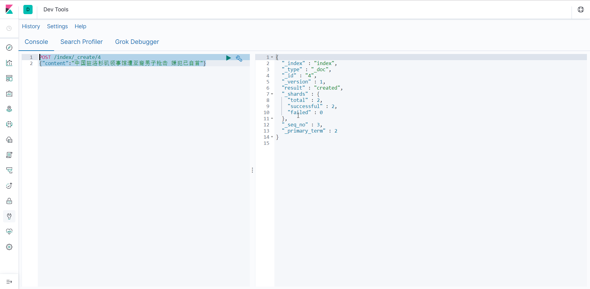

### Install 

1.  Download pre-build package from here: https://github.com/medcl/elasticsearch-analysis-ik/releases

   ```shell
   wget https://github.com/medcl/elasticsearch-analysis-ik/releases/download/v7.4.0/elasticsearch-analysis-ik-7.4.0.zip
   ```

    NOTE: replace `7.4.0` to your own `elasticsearch` version. 

2. Create plugin folder

   ```shell
   cd $ELASTICSEARCH_HOME
   mkdir -p plugins/analysis-ik
   ```

3. Unzip plugin to folder

   ```shell
   unzip elasticsearch-analysis-ik-7.4.0.zip -d plugins/analysis-ik
   ```

4. Restart ES

   ```shell
   for pid in `lsof -i :9200`; do kill -9 $pid; done
   
   ./bin/elasticsearch &
   ```

   

5. Verify

   ```shell
   tree plugins/analysis-ik/
   ```

   The output like below:

   ```ini
   plugins/analysis-ik/
   |-- commons-codec-1.9.jar
   |-- commons-logging-1.2.jar
   |-- config
   |   |-- IKAnalyzer.cfg.xml
   |   |-- extra_main.dic
   |   |-- extra_single_word.dic
   |   |-- extra_single_word_full.dic
   |   |-- extra_single_word_low_freq.dic
   |   |-- extra_stopword.dic
   |   |-- main.dic
   |   |-- preposition.dic
   |   |-- quantifier.dic
   |   |-- stopword.dic
   |   |-- suffix.dic
   |   `-- surname.dic
   |-- elasticsearch-analysis-ik-7.4.0.jar
   |-- httpclient-4.5.2.jar
   |-- httpcore-4.4.4.jar
   |-- plugin-descriptor.properties
   `-- plugin-security.policy
   ```

6. ...

### Quick Example

1. Create a index 

   ```shell
   PUT /index
   ```

   

   

2. Cretae a mapping

   ```shell
   POST /index/_mapping
   {
       "properties": {
           "content": {
               "type": "text",
               "analyzer": "ik_max_word",
               "search_analyzer": "ik_smart"
           }
       }
   }
   ```

   

   

3. Index some docs

   ```shell
   POST /index/_create/1
   {"content":"美国留给伊拉克的是个烂摊子吗"}
   ```

   

   ```shell
   POST /index/_create/2
   {"content":"公安部：各地校车将享最高路权"}
   ```

   

   ```shell
   
   ```

   

   ```shell
   POST /index/_create/4
   {"content":"中国驻洛杉矶领事馆遭亚裔男子枪击 嫌犯已自首"}
   ```

   

4. Query with highlighting

   ```shell
   POST /index/_search
   {  
      "query": {
         "match": {
             "content": "中国"
         }
      },
      "highlight": {
         "pre_tags": [
           "<tag1>",
           "<tag2>"
         ],
         "post_tags": [
           "</tag1>",
           "</tag2>"
         ],
         "fields": {
           "content": {}
         }
      }
   }
   ```

   

### Dictionary Configuration

 `IKAnalyzer.cfg.xml` can be located at `{conf}/analysis-ik/config/IKAnalyzer.cfg.xml` or `{plugins}/elasticsearch-analysis-ik-*/config/IKAnalyzer.cfg.xml` 

```xml
<?xml version="1.0" encoding="UTF-8"?>
<!DOCTYPE properties SYSTEM "http://java.sun.com/dtd/properties.dtd">
<properties>
	<comment>IK Analyzer 扩展配置</comment>
	<!--用户可以在这里配置自己的扩展字典 -->
	<entry key="ext_dict">custom/mydict.dic;custom/single_word_low_freq.dic</entry>
	<!--用户可以在这里配置自己的扩展停止词字典-->
	<entry key="ext_stopwords">custom/ext_stopword.dic</entry>
	<!--用户可以在这里配置远程扩展字典 -->
	<entry key="remote_ext_dict">location</entry>
	<!--用户可以在这里配置远程扩展停止词字典-->
	<entry key="remote_ext_stopwords">http://xxx.com/xxx.dic</entry>
</properties>
```


 目前该插件支持热更新 IK 分词，通过上文在 IK 配置文件中提到的如下配置 :

```xml
<!--用户可以在这里配置远程扩展字典 -->
<entry key="remote_ext_dict">location</entry>
<!--用户可以在这里配置远程扩展停止词字典-->
<entry key="remote_ext_stopwords">location</entry>
```

其中 `location` 是指一个 url，比如 `http://yoursite.com/getCustomDict`，该请求只需满足以下两点即可完成分词热更新。

1. 该 http 请求需要返回两个头部(header)，一个是 `Last-Modified`，一个是 `ETag`，这两者都是字符串类型，只要有一个发生变化，该插件就会去抓取新的分词进而更新词库。
2. 该 http 请求返回的内容格式是一行一个分词，换行符用 `\n` 即可。

满足上面两点要求就可以实现热更新分词了，不需要重启 ES 实例。

可以将需自动更新的热词放在一个 UTF-8 编码的 .txt 文件里，放在 nginx 或其他简易 http server 下，当 .txt 文件修改时，http server 会在客户端请求该文件时自动返回相应的 Last-Modified 和 ETag。可以另外做一个工具来从业务系统提取相关词汇，并更新这个 .txt 文件。