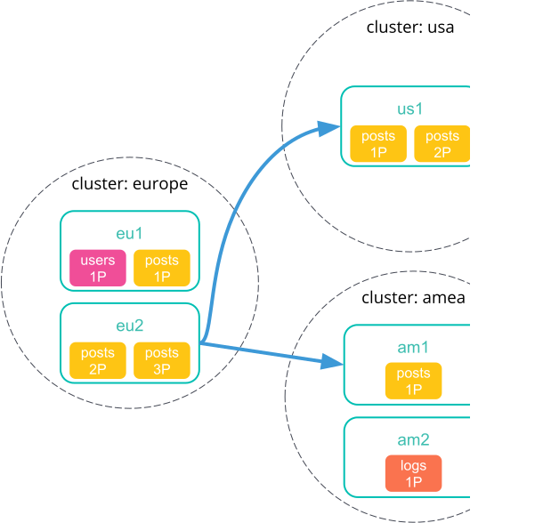
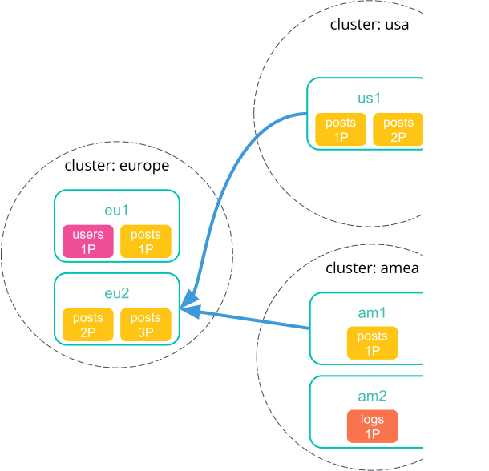
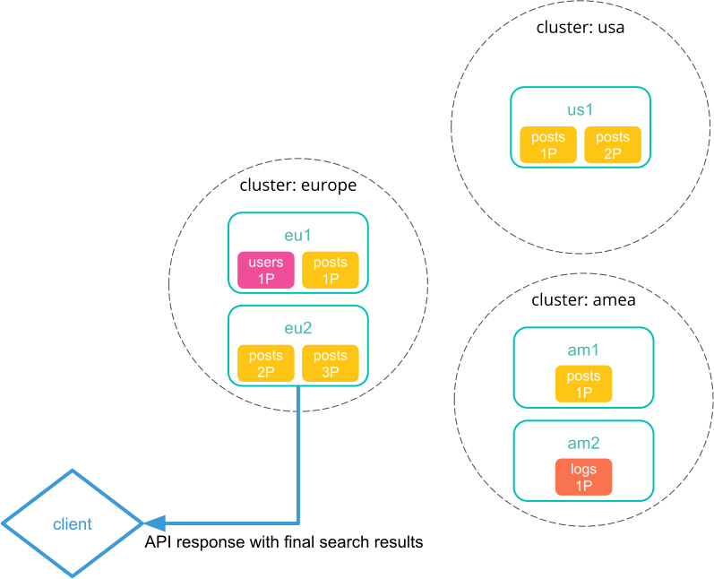
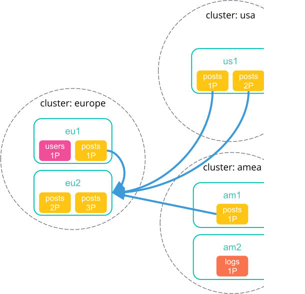

#  [Search across clusters](https://github.com/elastic/elasticsearch/edit/7.6/docs/reference/modules/cross-cluster-search.asciidoc)

**Cross-cluster search** lets you run a single search request against one or more [remote clusters](https://www.elastic.co/guide/en/elasticsearch/reference/current/modules-remote-clusters.html). For example, you can use a cross-cluster search to filter and analyze log data stored on clusters in different data centers.

### Prepared 

#### fly-es

```ini
192.168.135.124
192.168.135.205
192.168.135.224
192.168.135.226
192.168.135.236
```

#### fei-es

```ini
192.168.136.153
192.168.136.160
192.168.136.163
192.168.136.168
192.168.136.182
```


### Cross-cluster search examples

#### Remote cluster setup

To perform a cross-cluster search, you must have at least one remote cluster configured.

The following [cluster update settings](https://www.elastic.co/guide/en/elasticsearch/reference/current/cluster-update-settings.html) API request adds one remote clusters:`fei-es`.

```shell
PUT _cluster/settings
{
  "persistent": {
    "cluster": {
      "remote": {
        "fei-es": {
          "seeds": [
            "192.168.136.153:9300"
            "192.168.136.160:9300"
            "192.168.136.163:9300"
            "192.168.136.168:9300"
            "192.168.136.182:9300"
          ]
        }
      }
    }
  }
}
```


### [Search a single remote cluster](https://github.com/elastic/elasticsearch/edit/7.6/docs/reference/modules/cross-cluster-search.asciidoc)

The following [search](https://www.elastic.co/guide/en/elasticsearch/reference/current/search-search.html) API request searches the `twitter` index on a single remote cluster, `fei-es`.

```shell
GET /fei-es:dmbout/_search
```


#### Skip unavailiable clusters

By default, a cross-cluster search returns an error if **any** cluster in the request is unavailable.

To skip an unavailable cluster during a cross-cluster search, set the [`skip_unavailable`](https://www.elastic.co/guide/en/elasticsearch/reference/current/cluster-remote-info.html#skip-unavailable) cluster setting to `true`.

The following [cluster update settings](https://www.elastic.co/guide/en/elasticsearch/reference/current/cluster-update-settings.html) API request changes `cluster_two`'s `skip_unavailable` setting to `true`.

```console
PUT _cluster/settings
{
  "persistent": {
    "cluster.remote.cluster_two.skip_unavailable": true
  }
}
```


Copy as cURL[View in Console](http://localhost:5601/app/kibana#/dev_tools/console?load_from=https://www.elastic.co/guide/en/elasticsearch/reference/current/snippets/523.console) 

If `cluster_two` is disconnected or unavailable during a cross-cluster search, Elasticsearch won’t include matching documents from that cluster in the final results.

## How cross-cluster search works[edit](https://github.com/elastic/elasticsearch/edit/7.6/docs/reference/modules/cross-cluster-search.asciidoc)

Remote cluster connections work by configuring a remote cluster and connecting only to a limited number of nodes in that remote cluster. Each remote cluster is referenced by a name and a list of seed nodes. When a remote cluster is registered, its cluster state is retrieved from one of the seed nodes and up to three *gateway nodes* are selected to be connected to as part of remote cluster requests.

### Selecting gateway and seed nodes[edit](https://github.com/elastic/elasticsearch/edit/7.6/docs/reference/modules/cross-cluster-search.asciidoc)

Gateway and seed nodes need to be accessible from the local cluster via your network.

By default, any master-ineligible node can act as a gateway node. If wanted, you can define the gateway nodes for a cluster by setting `cluster.remote.node.attr.gateway` to `true`.

For cross-cluster search, we recommend you use gateway nodes that are capable of serving as [coordinating nodes](https://www.elastic.co/guide/en/elasticsearch/reference/current/modules-node.html#coordinating-node) for search requests. If wanted, the seed nodes for a cluster can be a subset of these gateway nodes.

### How cross-cluster search handles network delays[edit](https://github.com/elastic/elasticsearch/edit/7.6/docs/reference/modules/cross-cluster-search.asciidoc)

Because cross-cluster search involves sending requests to remote clusters, any network delays can impact search speed. To avoid slow searches, cross-cluster search offers two options for handling network delays:

- **[Minimize network roundtrips](https://www.elastic.co/guide/en/elasticsearch/reference/current/modules-cross-cluster-search.html#ccs-min-roundtrips)**

  By default, Elasticsearch reduces the number of network roundtrips between remote clusters. This reduces the impact of network delays on search speed. However, Elasticsearch can’t reduce network roundtrips for large search requests, such as those including a [scroll](https://www.elastic.co/guide/en/elasticsearch/reference/current/search-request-body.html#request-body-search-scroll) or [inner hits](https://www.elastic.co/guide/en/elasticsearch/reference/current/search-request-body.html#request-body-search-inner-hits).See [Minimize network roundtrips](https://www.elastic.co/guide/en/elasticsearch/reference/current/modules-cross-cluster-search.html#ccs-min-roundtrips) to learn how this option works.

- **[Don’t minimize network roundtrips](https://www.elastic.co/guide/en/elasticsearch/reference/current/modules-cross-cluster-search.html#ccs-unmin-roundtrips)**

  For search requests that include a scroll or inner hits, Elasticsearch sends multiple outgoing and ingoing requests to each remote cluster. You can also choose this option by setting the [`ccs_minimize_roundtrips`](https://www.elastic.co/guide/en/elasticsearch/reference/current/search-request-body.html#ccs-minimize-roundtrips) parameter to `false`. While typically slower, this approach may work well for networks with low latency.See [Don’t minimize network roundtrips](https://www.elastic.co/guide/en/elasticsearch/reference/current/modules-cross-cluster-search.html#ccs-unmin-roundtrips) to learn how this option works.

#### Minimize network roundtrips[edit](https://github.com/elastic/elasticsearch/edit/7.6/docs/reference/modules/cross-cluster-search.asciidoc)

Here’s how cross-cluster search works when you minimize network roundtrips.

1. You send a cross-cluster search request to your local cluster. A coordinating node in that cluster receives and parses the request.

   

2. The coordinating node sends a single search request to each cluster, including the local cluster. Each cluster performs the search request independently, applying its own cluster-level settings to the request.

   

3. Each remote cluster sends its search results back to the coordinating node.

   

4. After collecting results from each cluster, the coordinating node returns the final results in the cross-cluster search response.

   

#### Don’t minimize network roundtrips[edit](https://github.com/elastic/elasticsearch/edit/7.6/docs/reference/modules/cross-cluster-search.asciidoc)

Here’s how cross-cluster search works when you don’t minimize network roundtrips.

1. You send a cross-cluster search request to your local cluster. A coordinating node in that cluster receives and parses the request.

   

2. The coordinating node sends a [search shards](https://www.elastic.co/guide/en/elasticsearch/reference/current/search-shards.html) API request to each remote cluster.

   

3. Each remote cluster sends its response back to the coordinating node. This response contains information about the indices and shards the cross-cluster search request will be executed on.

   

4. The coordinating node sends a search request to each shard, including those in its own cluster. Each shard performs the search request independently.

   When network roundtrips aren’t minimized, the search is executed as if all data were in the coordinating node’s cluster. We recommend updating cluster-level settings that limit searches, such as `action.search.shard_count.limit`, `pre_filter_shard_size`, and `max_concurrent_shard_requests`, to account for this. If these limits are too low, the search may be rejected.

   

5. Each shard sends its search results back to the coordinating node.

   

6. After collecting results from each cluster, the coordinating node returns the final results in the cross-cluster search response.

   