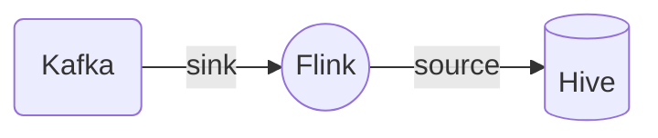

### Zookeeper

```ini
data-thinker-4:2181,data-thinker-6:2181,data-thinker-7:2181
```


### Kafka

```ini
data-thinker-04:6667,data-thinker-01:6667,data-thinker-10:6667
```


Flink Job

> Intro

- Flink 1.13.6
- Kafka 2.4.1
- Hive 3.1.0

> Dataflow



```java
public class Flink2Hive {
  public static void main(String[] args) {

    final StreamExecutionEnvironment env = StreamExecutionEnvironment.getExecutionEnvironment();
    env.setParallelism(2);

    EnvironmentSettings tableEnvSettings = EnvironmentSettings.newInstance()
        .inStreamingMode()
        .useBlinkPlanner()
        .build();
    
    StreamTableEnvironment tableEnv = StreamTableEnvironment.create(env, tableEnvSettings);

    tableEnv.getConfig().getConfiguration().set(ExecutionCheckpointingOptions.CHECKPOINTING_MODE,
        CheckpointingMode.EXACTLY_ONCE);

    tableEnv.getConfig().getConfiguration()
        .set(ExecutionCheckpointingOptions.CHECKPOINTING_INTERVAL, Duration.ofSeconds(20));

    String catalogName = "my_catalog";

    HiveCatalog catalog = new HiveCatalog(catalogName, // catalog name
        "default", // default database
        "/etc/hive/conf", // Hive config (hive-site.xml) directory
        "3.1.2" // Hive version
    );

    tableEnv.registerCatalog(catalogName, catalog);
    tableEnv.useCatalog(catalogName);

    tableEnv.executeSql("CREATE DATABASE IF NOT EXISTS stream_tmp");
    tableEnv.executeSql("DROP TABLE IF EXISTS stream_tmp.log_kafka");

    tableEnv.executeSql(
        "CREATE TABLE stream_tmp.log_kafka (\r\n"
        + "  user_id STRING,\r\n"
        + "  order_amount DOUBLE,\r\n"
        + "  log_ts TIMESTAMP (3),\r\n"
        + "  WATERMARK FOR log_ts AS log_ts - INTERVAL '5' SECOND\r\n"
        + ") WITH (\r\n"
        + "  'connector' = 'kafka',\r\n"
        + "  'topic' = 'spic_test',\r\n"
        + "  'properties.bootstrap.servers' = 'data-thinker-04:6667,data-thinker-01:6667,data-thinker-10:6667',\r\n"
        + "  'properties.group.id' = 'flink1',\r\n"
        + "  'scan.startup.mode' = 'earliest-offset',\r\n"
        + "  'format' = 'json',\r\n"
        + "  'json.fail-on-missing-field' = 'false',\r\n"
        + "  'json.ignore-parse-errors' = 'true'\r\n"
        + ")");
    tableEnv.getConfig().setSqlDialect(SqlDialect.HIVE);

    tableEnv.executeSql("CREATE DATABASE IF NOT EXISTS hive_tmp");
    tableEnv.executeSql("DROP TABLE IF EXISTS hive_tmp.log_hive");

    tableEnv.executeSql(
        "CREATE TABLE hive_tmp.log_hive (\r\n"
        + "  user_id STRING,\r\n"
        + "  order_amount DOUBLE\r\n"
        + ") PARTITIONED BY (dt STRING, hr STRING) STORED AS PARQUET TBLPROPERTIES (\r\n"
        + "  'sink.partition-commit.trigger' = 'partition-time',\r\n"
        + "  'sink.partition-commit.delay' = '1 min',\r\n"
        + "  'format' = 'json',\r\n"
        + "  'sink.partition-commit.policy.kind' = 'metastore,success-file',\r\n"
        + "  'partition.time-extractor.timestamp-pattern' = '$dt $hr:00:00'\r\n"
        + ")");
    tableEnv.getConfig().setSqlDialect(SqlDialect.DEFAULT);
    tableEnv.executeSql(
        "INSERT INTO hive_tmp.log_hive\r\n"
        + "SELECT\r\n"
        + "  user_id,\r\n"
        + "  order_amount,\r\n"
        + "  DATE_FORMAT (log_ts, 'yyyy-MM-dd'),\r\n"
        + "  DATE_FORMAT (log_ts, 'HH')\r\n"
        + "FROM\r\n"
        + "  stream_tmp.log_kafka");
  }
}
```

> Step 1: Create Topic

```ini
bin/kafka-topics.sh --create --zookeeper data-thinker-4:2181,data-thinker-6:2181,data-thinker-7:2181 --replication-factor 1 --partitions 1 --topic spic_test
```

> Step 2: List Topics

```ini
bin/kafka-topics.sh --list --zookeeper data-thinker-4:2181,data-thinker-6:2181,data-thinker-7:2181
```


>Step 4: Send some messages

```shell
bin/kafka-console-producer.sh --broker-list data-thinker-04:6667,data-thinker-01:6667,data-thinker-10:6667 --topic spic_test
```


```ini
{"user_id": "1", "order_amount":"124.5", "log_ts": "2020-08-24 10:20:15"}
{"user_id": "2", "order_amount":"38.4", "log_ts": "2020-08-24 11:20:15"}
{"user_id": "3", "order_amount":"176.9", "log_ts": "2020-08-25 13:20:15"}
{"user_id": "4", "order_amount":"302", "log_ts": "2020-08-25 14:20:15"}
{"user_id": "5", "order_amount":"124.5", "log_ts": "2020-08-26 14:26:15"}
{"user_id": "6", "order_amount":"38.4", "log_ts": "2020-08-26 15:20:15"}
{"user_id": "7", "order_amount":"176.9", "log_ts": "2020-08-27 16:20:15"}
{"user_id": "8", "order_amount":"302", "log_ts": "2020-08-27 17:20:15"}
{"user_id": "9", "order_amount":"124.5", "log_ts": "2020-08-24 10:20:15"}
{"user_id": "10", "order_amount":"124.6", "log_ts": "2020-08-24 10:21:15"}
{"user_id": "11", "order_amount":"124.7", "log_ts": "2020-08-24 10:22:15"}
{"user_id": "12", "order_amount":"124.8", "log_ts": "2020-08-24 10:23:15"}
{"user_id": "13", "order_amount":"124.9", "log_ts": "2020-08-24 10:24:15"}
{"user_id": "14", "order_amount":"125.5", "log_ts": "2020-08-24 10:25:15"}
{"user_id": "15", "order_amount":"126.5", "log_ts": "2020-08-24 10:26:15"}
```


>Step 5: Start a consumer

```shell
bin/kafka-console-consumer.sh --zookeeper data-thinker-4:2181,data-thinker-6:2181,data-thinker-7:2181 --topic spic_test --from-beginning


bin/kafka-console-consumer.sh --bootstrap-server data-thinker-04:6667,data-thinker-01:6667,data-thinker-10:6667 --topic spic_test --from-beginning
```


