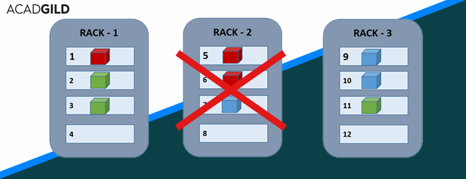

## How To Fix Corrupt Blocks in HDFS





The easiest way to determine how to fix corrupt blocks on HDFS is to run an **fsck** “file system consistency check” on the filesystem. If you have setup your [Hadoop](https://acadgild.com/big-data/big-data-development-training-certification) environment variables, you should be able to use a path of **/**, if not, use **hdfs://ip.or.hostname:50070/**

```sh
hdfs fsck /
```

Or,

```sh
hdfs fsck hdfs://ip.or.hostname:50070/
```

If the end of output looks something like this, then we have healthy blocks on the file system.


If the end of output looks something like this, we may have corrupted blocks on the file system.

So, How to rectify the corrupted blocks in the file?

The output of the **fsck** above will be very verbose, but it will mention which blocks are corrupt. We can do some grepping of the **fsck** above so that we aren’t “reading through a firehose”.

```shell
hdfs fsck {CORRUPT_PATH} | egrep -v '^\.+$' | grep -v replica | grep -v Replica
```


If it is not possible to replace! How to fix corrupt blocks in HDFS file.

Repairing might or might not be possible, but the first step would be to gather information of the file’s location, and blocks.

```shell
hdfs fsck /path/to/filename/fileextension -locations -blocks -files
```

From this data, you can track down the node where the corruption is present. On those nodes, you can look through logs and determine what the issue is. If a disk was replaced, i/o errors on the server, etc. If possible to recover on that machine and get the partition with the blocks online that would report back to Hadoop and the file would be healthy again. If that isn’t possible, you will unfortunately, have to find another way to regenerate.
We can also delete the corrupted file from Hadoop cluster:

How to remove the corrupted file from Hadoop cluster?

Use this command to move corrupted files to the trash directory:

```shell
hdfs dfs -rm /path/to/filename.fileextension
```

Use this command to delete corrupted file permanently:

```shell
hdfs dfs -rm -skipTrash /path/to/filename.fileextension
```