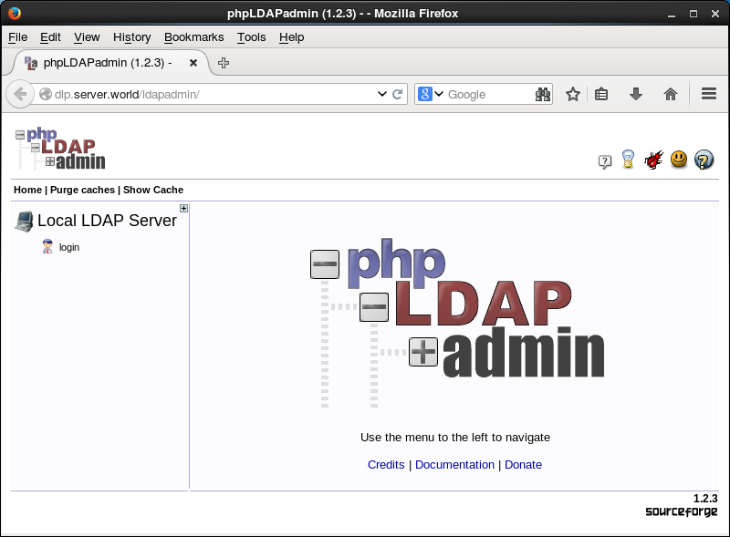
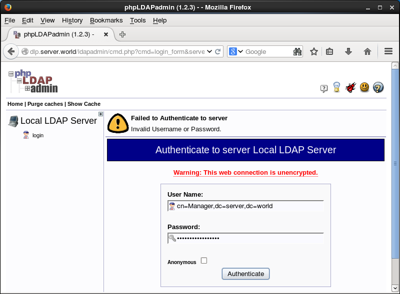
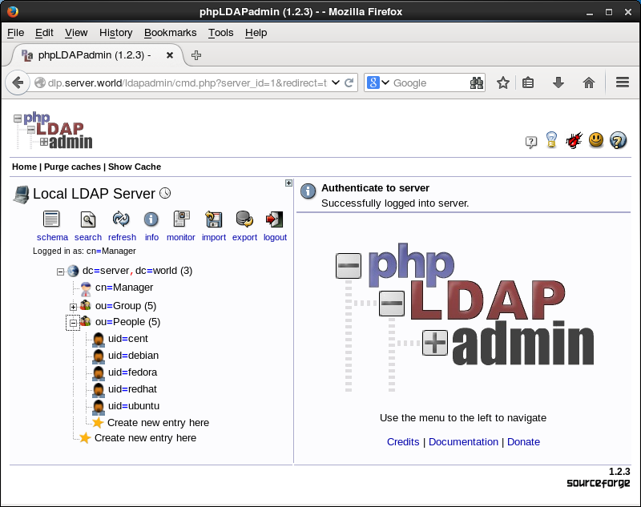

### Install Httpd

1. Install httpd

   ```shell
   yum -y install httpd
   
   # remove welcome page
   [root@www ~]# rm -f /etc/httpd/conf.d/welcome.conf
   
   # remove default error page
   [root@www ~]# rm -f /var/www/error/noindex.html
   ```

2. Configure httpd

   ```shell
   [root@www ~]# vi /etc/httpd/conf/httpd.conf
   # line 44: change
   ServerTokens Prod
   
   # line 76: change to ON
   KeepAlive On
   
   # line 262: Admin's address
   ServerAdmin root@lhfei.cn
   
   # line 338: change
   AllowOverride All
   
   # line 276: change to your server's name
   ServerName www.lhfei.cn:80
   
   # line 402: add file name that it can access only with directory's name
   DirectoryIndex index.html index.htm
   
   # line 536: change
   ServerSignature Off
   
   [root@www ~]# /etc/rc.d/init.d/httpd start 
   Starting httpd:     [ OK ]
   [root@www ~]# chkconfig httpd on 
   ```

   

3. If IPTables is running, allow HTTP port. HTTP uses 80/TCP.

   For "-I INPUT 5" section below, Replace it to your own environment.

   ```shell
   [root@www ~]# iptables -I INPUT 5 -p tcp -m state --state NEW -m tcp --dport 80 -j ACCEPT 
   ```

   

4. Create a HTML test page and access to it with a web browser on Client to make sure it works normally.

   ```shell
   [root@www ~]# vi /var/www/html/index.html
   ```

   ```html
   <html>
     <body>
       <div style="width: 100%; font-size: 40px; font-weight: bold; text-align: center;">
         Test Page
       </div>
     </body>
   </html>
   ```

   

### Install PHP

1. Install PHP

   ```shell
   [root@www ~]# yum -y install php php-mbstring php-pear
   [root@www ~]# vi /etc/php.ini
   
   # line 946: set your timezone
   date.timezone = "Asia/Shanghai"
   
   [root@www ~]# /etc/rc.d/init.d/httpd restart
   ```

   

2. Create a PHP test page

   ```shell
   [root@www ~]# vi /var/www/html/index.php
   ```

   

   ```php+HTML
   <html>
   <body>
   <div style="width: 100%; font-size: 40px; font-weight: bold; text-align: center;">
   <?php
      print "PHP Test Page";
   ?>
   </div>
   </body>
   </html>
   ```


### Install phpLDAPadmin

1. Install 

   > Install EPEL

   ```shell
   yum install -y epel-release
   ```

   

   > Install phpLDAPadmin

   ```shell
   yum install -y phpldapadmin
   ```

   

   > Configure 

   ```shell
   [root@dlp ~]# vi /etc/phpldapadmin/config.php
   # line 397: uncomment, line 398: comment out
   $servers->setValue('login','attr','dn');
   // $servers->setValue('login','attr','uid');
   [root@dlp ~]# vi /etc/httpd/conf.d/phpldapadmin.conf
   Alias /phpldapadmin /usr/share/phpldapadmin/htdocs
   Alias /ldapadmin /usr/share/phpldapadmin/htdocs
   <Directory /usr/share/phpldapadmin/htdocs>
     Order Deny,Allow
     Deny from all
     Allow from 127.0.0.1 10.0.0.0/24     # add access permission
     Allow from ::1
   </Directory>
   ```

   

   > Restart Apache Httpd

   ```shell
   [root@dlp ~]# /etc/rc.d/init.d/httpd restart 
   Stopping httpd:                     [  OK  ]
   Starting httpd:                     [  OK  ]
   ```

   

2. Access to the "http://(server's hostname or IP address)/ldapadmin/" from a client which is in the network allowed by http server and then Click "login".

   

   

3. Authenticate with Directory Manager account. Specify uname name like follows. By the way, it's possible to login with a common user, too.

   

4. Just logined. It's possible to manage LDAP server on here.

   

5. 