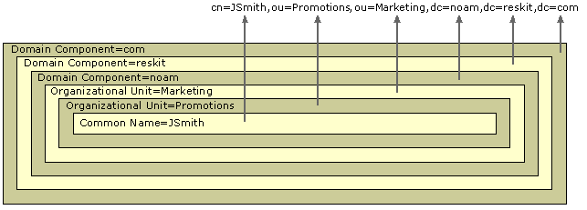

# Object Naming

Active Directory is an LDAP-compliant directory service, which means that all access to directory objects occurs through LDAP. LDAP requires that names of directory objects be formed according to RFC 1779 and RFC 2247, which define the standard for object names in an LDAP directory service.

### Distinguished Name

Objects are located within Active Directory domains according to a hierarchical path, which includes the labels of the Active Directory domain name and each level of container objects. The full path to the object is defined by the distinguished name (also known as a "DN"). The name of the object itself, separate from the path to the object, is defined by the relative distinguished name.

The distinguished name is unambiguous (identifies one object only) and unique (no other object in the directory has this name). By using the full path to an object, including the object name and all parent objects to the root of the domain, the distinguished name uniquely and unambiguously identifies an object within a domain hierarchy. It contains sufficient information for an LDAP client to retrieve the object's information from the directory.

For example, a user named James Smith works in the marketing department of a company as a promotions coordinator. Therefore, his user account is created in an organizational unit that stores the accounts for marketing department employees who are engaged in promotional activities. James Smith's user identifier is JSmith, and he works in the North American branch of the company. The root domain of the company is reskit.com, and the local domain is noam.reskit.com. The diagram in Figure 1.10 illustrates the components that make up the distinguished name of the user object JSmith in the noam.reskit.com domain.

**Figure 1.10 Distinguished Name for the User Object JSmith**

 

Note

Active Directory snap-in tools do not display the LDAP abbreviations for the naming attributes domain component (dc=), organizational unit (ou=), common name (cn=), and so forth. These abbreviations are shown only to illustrate how LDAP recognizes the portions of the distinguished name. Most Active Directory tools display object names in canonical form, as described later in this chapter. Because distinguished names are difficult to remember, it is useful to have other means for retrieving objects. Active Directory supports querying by attribute (for example, the building number where you have to find a printer), so an object can be found without having to know the distinguished name. (For more information about searching Active Directory, see ["Name Resolution in Active Directory"](https://technet.microsoft.com/en-us/library/cc978018.aspx) in this book.)

[Top of page](https://technet.microsoft.com/en-us/library/cc977992.aspx?f=255&MSPPError=-2147217396#mainSection) 

### Relative Distinguished Name

The relative distinguished name (also known as the "RDN") of an object is the part of the name that is an attribute of the object itself — the part of the object name that identifies this object as unique from its siblings at its current level in the naming hierarchy. In Figure 1.10, in the preceding section, the relative distinguished name of the object is JSmith. The relative distinguished name of the parent object is Users. The maximum length allowed for a relative distinguished name is 255 characters, but attributes have specific limits imposed by the directory schema. For example, in the case of the common name, which is the attribute type often used for naming the relative distinguished name (cn), the maximum number of characters allowed is 64.

Active Directory relative distinguished names are unique within a specific parent — that is, Active Directory does not permit two objects with the same relative distinguished name under the same parent container. However, two objects can have identical relative distinguished names but still be unique in the directory because within their respective parent containers, their distinguished names are not the same. (For example, the object cn=JSmith,dc=noam,dc=reskit,dc=com is recognized by LDAP as being different from cn=JSmith,dc=reskit,dc=com.)

The relative distinguished name for each object is stored in the Active Directory database. Each record contains a reference to the parent of the object. By following the references to the root, the entire distinguished name is constructed during an LDAP operation. (For more information about LDAP operations, see ["Name Resolution in Active Directory"](https://technet.microsoft.com/en-us/library/cc978018.aspx) in this book.)

[Top of page](https://technet.microsoft.com/en-us/library/cc977992.aspx?f=255&MSPPError=-2147217396#mainSection) 

### Naming Attributes

As illustrated earlier in this section, an object name consists of a series of relative distinguished names that represent the object itself and also every object in the hierarchy above it, up to the root object. Each portion of the distinguished name is expressed as *attribute_type=value* (for example, cn=JSmith). The attribute type that is used to describe the object's relative distinguished name (in this case, cn=) is called the naming attribute. If you were to create a new class in the Active Directory schema (that is, a new *classSchema *object), the optional *RdnAttID* attribute could be used to specify the naming attribute for the class. In Active Directory, instances of default objects that you create have a default mandatory naming attribute. For example, part of the definition of the class User is the attribute cn (Common-Name) as the naming attribute. For this reason, the relative distinguished name for user JSmith is expressed as cn=JSmith.

The naming attributes shown in Table 1.1 are used in Active Directory, as described in RFC 2253.

**Table**   **1.1 Default Active Directory Naming Attributes**

| Object Class         | Naming Attribute Display Name | Naming Attribute LDAP Name |
| -------------------- | ----------------------------- | -------------------------- |
| *user*               | Common-Name                   | cn                         |
| *organizationalUnit* | Organizational-Unit-Name      | ou                         |
| *domain*             | Domain-Component              | dc                         |

Other naming attributes described in RFC 2253, such as o= for organization name and c= for country/region name, are not used in Active Directory, although they are recognized by LDAP.

The use of distinguished names, relative distinguished names, and naming attributes is required only when you are programming for LDAP and using Active Directory Service Interfaces (ADSI) or other scripting or programming languages. The Windows 2000 user interface does not require you to enter such values.

For more information about creating new *classSchema* objects, see ["Active Directory Schema"](https://technet.microsoft.com/en-us/library/cc961581.aspx) in this book. For more information about using ADSI, see the Microsoft Platform SDK link on the Web Resources page at [http://windows.microsoft.com/windows2000/reskit/webresources](https://www.microsoft.com/isapi/redir.dll?PRD=WIN2000&sbp=reskit&ar=webresources) .

[Top of page](https://technet.microsoft.com/en-us/library/cc977992.aspx?f=255&MSPPError=-2147217396#mainSection) 

### Object Identity and Uniqueness

In addition to its distinguished name, every object in Active Directory has a unique identity. Active Directory is identity based — that is, objects are known internally by their identity, not by their current name. Objects might be moved or renamed, but their identity never changes. The identity of an object is defined by a globally unique identifier (GUID), a 128-bit number that is assigned by the directory system agent when the object is created. The GUID is stored in an attribute, *objectGUID* , that is present on every object. The *objectGUID* attribute is protected so that it cannot be altered or removed. When you store a reference to an Active Directory object in an external store (for example, a database such as Microsoft® SQL Server ™ ), the*objectGUID* value should be used. Unlike a distinguished name or a relative distinguished name, which can be changed, the GUID never changes.

[Top of page](https://technet.microsoft.com/en-us/library/cc977992.aspx?f=255&MSPPError=-2147217396#mainSection) 

### Active Directory Name Formats

Several formats for providing object names are supported by Active Directory. These formats accommodate the different forms a name can take, depending on its application of origin. Active Directory administrative tools display name strings in a default format, which is the canonical name. The following formats are supported by Active Directory and are based on the LDAP distinguished name:

*LDAP Distinguished Name.* LDAP v2 and LDAP v3 recognize the RFC 1779 and RFC 2247 naming conventions, which take the form cn=common name, ou=organizational unit, o=organization, c=country/region. Active Directory uses the domain component (dc) instead of o=organization and does not support c=country/region. In the LDAP distinguished name, the relative distinguished names appear in order beginning at the left with the name of the leaf and ending at the right with the name of the root, as shown here:

cn=jsmith,ou=promotions,ou=marketing,dc=noam,dc=reskit,dc=com

*LDAP Uniform Resource Locator (URL* ) *.* Active Directory supports access through the LDAP protocol from any LDAP-enabled client. LDAP URLs are used in scripting. An LDAP URL names the server holding Active Directory services and the attributed name of the object (the distinguished name). For example:

LDAP://server1.noam.reskit.com/cn=jsmith,ou=promotions, ou=marketing,dc=noam,dc=reskit,dc=com

*Active Directory Canonical Name* . By default, the Windows 2000 user interface displays object names that use the canonical name, which lists the relative distinguished names from the root downward and without the RFC 1779 naming attribute descriptors; it uses the DNS domain name (the form of the name where the domain labels are separated by periods). For the LDAP distinguished name in the previous example, the respective canonical name would appear as follows:

noam.reskit.com/marketing/promotions/jsmith

 

Note

If the name of an organizational unit contains a forward slash character (/), the system requires an escape character in the form of a backslash (\) to distinguish between forward slashes that separate elements of the canonical name and the forward slash that is part of the organizational unit name. The canonical name that appears in Active Directory Users and Computers properties pages displays the escape character immediately preceding the forward slash in the name of the organizational unit. For example, if the name of an organizational unit is Promotions/Northeast and the name of the domain is Reskit.com, the canonical name is displayed as Reskit.com/Promotions\/Northeast.

[Top of page](https://technet.microsoft.com/en-us/library/cc977992.aspx?f=255&MSPPError=-2147217396#mainSection) 

### DNS-to-LDAP Distinguished Name Mapping

Although DNS domain names match Active Directory domain names, they are not the same thing. Active Directory names have a different format, which is required by LDAP to identify directory objects. DNS domain names are therefore mapped to Active Directory domain names, and vice versa, as described in RFC 2247.

All access to Active Directory is carried out through LDAP. LDAP uses distinguished names to provide unique names to directory objects; every object in Active Directory has an LDAP distinguished name. A distinguished name is a naming structure that consists of a string of the hierarchical components that make up the complete object. Each distinguished name component is the relative distinguished name of an object in the hierarchy, beginning with the object itself and ending with the root object in the domain tree. An algorithm automatically provides an LDAP distinguished name for each DNS domain name.

The algorithm provides a domain component (dc) attribute-type label for each DNS label in the DNS domain name. Each DNS label corresponds to the relative distinguished name of an Active Directory domain. For example, the DNS domain noam.reskit.com is translated to the LDAP distinguished name that has the form dc=noam,dc=reskit,dc=com.

[Top of page](https://technet.microsoft.com/en-us/library/cc977992.aspx?f=255&MSPPError=-2147217396#mainSection) 

### Logon Names

A unique logon name is required by user security principals for gaining access to a domain and its resources. Security principals are objects to which Windows security is applied in the form of authentication and authorization. Users are security principals, and they are authenticated (their identity is verified) at the time they log on to the domain or local computer. They are authorized (allowed or denied access) when they use resources.

User security principals have two types of logon names:

*SAM Account Name* . A SAM account name is a name that is required for compatibility with Windows NT 4.0 and Windows NT 3. *x* domains. SAM account names are sometimes referred to as flat names (because there is no hierarchy in the naming, so every name must be unique in the domain). These terms serve to differentiate these names from DNS hierarchical names.

*User Principal Name* . A user principal name (also known as a "UPN") is a "friendly" name that is shorter than the distinguished name and easier to remember. The user principal name consists of a shorthand name that represents the user and usually the DNS name of the domain where the user object resides, or any other designated name.

The user principal name format consists of the user name, the "at" sign (@), and a user principal name suffix. For example, the user James Smith, who has a user account in the reskit.com domain, might have the user principal name JSmith@reskit.com. The user principal name is independent of the distinguished name of the user object, so a user object can be moved or renamed without affecting the user logon name.

The user principal name is an attribute ( *userPrincipalName* ) of the security principal object. If a user object's *userPrincipalName* attribute has no value, the user object has the default user principal name < *userName* >@< *DnsDomainName* >.

If you create no other user principal name, the user principal name suffix for a security principal is the domain in which the account is created (for example, @reskit.com). You can create additional user principal name suffixes and assign them to security principal accounts if you don't want to use the default domain name (for example, if the DNS domain name is extremely long and hard to remember). The e-mail name can also be used as the user principal name suffix. For example, in a large organization that has many domains, a user's e-mail address might be < *userName* >@<*companyName* >.com.

You can manage user principal name suffixes for a domain in the Active Directory Domains and Trusts console in MMC. To add or remove a user principal name suffix, open the properties for the Active Directory Domains and Trusts node. User principal names are assigned at the time a user or group is created. If you have created additional suffixes for the domain, you can select from the list of available suffixes when you create the user or group account.

The suffixes appear in the list in the following order:

- Alternate suffixes. If you have created additional suffixes, the last one that you created appears first.
- Root domain.
- The current domain.

For more information about creating user principal names, see Windows 2000 Server Help.