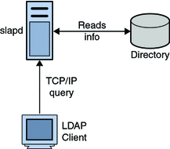
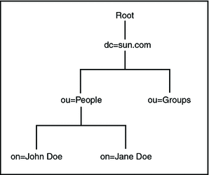
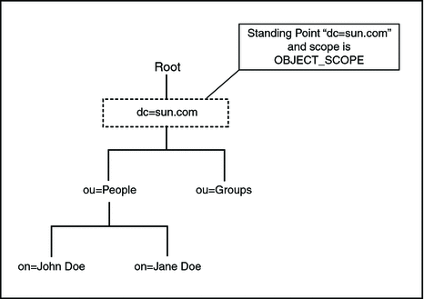
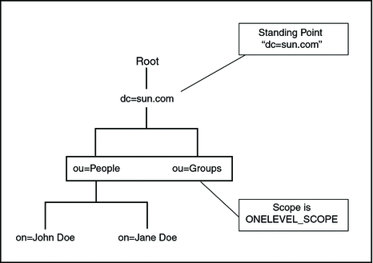
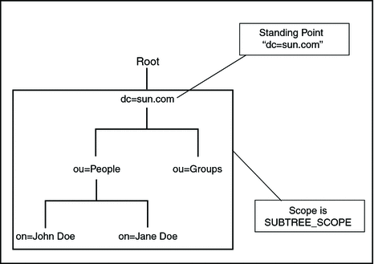

Understanding the LDAP Binding Component

The topics in this document provides information about the LDAP Binding Component.

**What You Need to Know**

These topics provide information about the functional behavior of LDAP Binding Component.

- [About LDAP](https://docs.oracle.com/cd/E19182-01/820-6573/ghuva/index.html).
- [About LDAP Binding Component](https://docs.oracle.com/cd/E19182-01/820-6573/ghvqw/index.html).
- [Supporting Features in LDAP Binding Component](https://docs.oracle.com/cd/E19182-01/820-6573/concepttopic2/index.html).

# About LDAP

Lightweight Directory Access Protocol (LDAP), is an Internet protocol used to access information directories. LDAP runs over TCP/IP. A directory service is a distributed database application designed to manage the entries and attributes in a directory.

LDAP allows clients to access different directory services based on entries. These LDAP entries are available to users and other applications based on access controls.



The Lightweight Directory Access Protocol (LDAP) Binding Component (BC) is a comprehensive solution for interacting with a LDAP Directory running on a LDAP server. The design time component of the LDAP Binding Component is a NetBeans module that allows configuration of the Binding Component. The runtime is based on Java EE and JBI. It implements all the necessary interfaces available in the JBI specification.

## Entries, Attributes and Values

An LDAP directory has entries that contain information pertaining to entities. Each attribute has a name and one or more values. The names of the attributes are mnemonic strings, such as cn for common name, or mail for email address.

For example, a company may have an employee directory. Each entry in the employee directory represents an employee. The employee entry contains such information as the name, email address, and phone number, as shown in the following example:

|                                  |
| -------------------------------- |
| cn: John Doe                     |
| mail: johndoe@sun.com            |
| mail: jdoe@stc.com               |
| telephoneNumber: 471-6000 x.1234 |

Each part of the descriptive information, such as an employee's name, is known as an attribute. In the example above, the Common Name (cn) attribute, represents the name of the employee. The other attributes are mail and telephoneNumber.

Each attribute can have one or more values. For example, an employee entry may contain a mail attribute whose values are johndoe@sun.com and jdoe@stc.com. In the previous example, the mail attribute contains two mail values.

## LDAP Directory Structure

The organization of a directory is a tree structure. The topmost entry in a directory is known as the root entry. This entry normally represents the organization that owns the directory.

Entries at the higher level of hierarchy, represent larger groupings or organizations. Entries under the larger organizations represent smaller organizations that make up the larger ones. The leaf nodes (or entries) of the tree structure represent the individuals or resources.

## Distinguished Names and Relative Distinguished Names

An entry is made up of a collection of attributes that have a unique identifier called a Distinguished Name (DN). A DN has a unique name that identifies the entry at the respective hierarchy. In the example above, John Doe and Jane Doe are different common names (cn) that identify different entries at that same level.

A DN is also a fully qualified path of names that trace the entry back to the root of the tree. For example, the distinguished name of the John Doe entry is:

```
cn=John Doe, ou=People, dc=sun.com
```


A Relative Distinguished Name (RDN) is a component of the distinguished name.

For example, **cn=John Doe**, **ou=People** is a RDN relative to the root RDN **dc=sun.com**.

------

Note –

DNs describe the fully qualified path to an entry

RDN describe the partial path to the entry relative to another entry in the tree.

------

The figure illustrates an example of an LDAP directory structure with distinguished names and relative distinguished names.

**LDAP Directory Structure**



## LDAP Service and LDAP Client

A Directory Service is a distributed database application designed to manage the entries and attributes in a directory. A directory service also makes the entries and attributes available to users and other applications. OpenLDAP server is an example of a directory service. Other directory services include Sun Active Directory Service (Sun Microsystems) and Microsoft Active Directory.

A directory client uses the LDAP protocol to access a directory service. A directory client may use one of several client APIs available in order to access the directory service.

## Terms and Definitions

1. Schema

   ​

   - Set of rules that describes the nature of data is stored

   - Helps maintain consistency and quality data

   - Reduces duplication of data

   - Object class attribute determines schema rules the entry must follow

   - Schema contains the following,

     ​

     - Required attributes
     - Allowed attributes
     - The method to compare attributes
     - Limit what the attribute can store, that is, restrict to integer
     - Restrict what information is stored, that is, stops duplication

2. Attribute Abbreviation

   ​

   - User id : uid
   - Common Name ; cn
   - Surname : sn
   - Location : l
   - Organizational Unit : ou
   - Organization : o
   - Domain Component : dc
   - State : st
   - Country : c
   - Street address : street

3. Search Filters

   ​

   - Criteria for attributes that must satisfy for entry on return

   - Base dn = base object entry search relative to

   - Prefix notation

   - Standards

     ​

     - LDAP String Representation of Search Filters
     - LDAPv3 Search Filters

   - Operators

     ​

     - AND : &
     - OR : |
     - NOT : !
     - Approximately equal : ~=
     - Greater than or equal : >=
     - Less than or equal : <=
     - Any : *

   - Example,

     ​

     - (objectclass=posixAccount)
     - (cn=Mickey M*)
     - (|(uid=fred)(uid=bill))
     - (&(|(uid=jack)(uid=jill)(objectclass=posixAccount))

# About LDAP Binding Component

LDAP (v3) is the Light weight directory Access protocol (RFC 3377). An Internet standard for accessing a directory (such as an address book) over TCP/IP. The Binding Component wraps the JBI interface. Users use this component to access operations that the LDAP provides to the open-esb world.

LDAP Binding Component provides the services to add, search, update, and delete on LDAP directory. The Binding Component conforms to the JBI specification and enables LDAP server integration in a JBI environment. The LDAP component consists of two modules: run-time JBI module and design-time NetBeans plugin.

LDAP Binding Component run-time module implements interfaces defined in the JBI framework and interacts with the external LDAP server for managing the directory services. The run-time uses LDAP v3 to interact with LDAP directory server.

Design time NetBeans modules provides visual configuration of the binding component. It also defines how other components can integrate within the JBI framework. Users can update properties for the component and incorporate LDAP components with others in deployable service assembly.

## Defining LDAP Binding Component

The LDAP Binding Component helps the JBI components to communicate with the LDAP server. The LDAP Binding Component provides a bunch of features for interacting with the LDAP server. LDAP Binding Component uses the JBI (Java Business Integration JSR 208) specification developed under the JCP (Java Community Process) for implementing Service Oriented Architecture (SOA) based Enterprise Service Bus (ESB). open-esb is the Sun's implementation of the JSR 208.

## What's Inside the LDAP Binding Component

The LDAP Binding Component provides a comprehensive solution for configuring and connecting to the LDAP server within a JBI environment. The design-time component is a NetBeans IDE 6.1 module that plugs into the NetBeans Enterprise Pack project system. The runtime component provides the physical connectivity between the Normalized Message Router in the JBI framework and the external LDAP server. This component implements all the required interfaces available in the JBI 1.0 specification. The runtime component can act as a service provider, supporting Outbound services sending requests to the LDAP server from the JBI framework.

# Supporting Features in LDAP Binding Component

LDAP Binding Component allows anonymous and authenticated connections. Users can perform numerous tasks when connected to an external LDAP system. These tasks include adding an entry, adding an attribute, and adding a value. Similarly, users have the privileges to modify, delete and search for a value, and attribute entry.

The following features are supported in the LDAP Binding Component.

1. **Standard JBI Binding Component**

   ​

   1. Component Installation
   2. Component lifecycle Management: Install, Start, Stop, Shutdown, and Un-install
   3. Service Unit lifecycle Management: Deploy, Start, Stop, Shutdown, and Un-deploy
   4. Service Assembly Generation
   5. Support Component Status Monitoring
   6. Installation Time Configuration
   7. Run-time Configuration
   8. Service Provisioner and Consumer

2. **LDAP Features**

   ​

   1. **Anonymous Connection**

      Anonymous Connections are those that are not categorized as authenticated, trusted, suspect, or blocked.

   2. **Add Entry Node**

      Use the AddEntry node to add entries to a directory. There are different options available when adding an entry. Specify the name of the entry to add (RDN relative to the initial context), an entry with its attributes and values for each attribute.

   3. **Add Attribute Value**

      Use the Add Attribute Value to modify the values or attributes.

   4. **Add Value**

      Use Add Value to add any value to any attribute of an entry.

   5. **Remove Attribute**

      Use the Remove Attribute to remove attributes from an entry.

   6. **Remove Value**

      Use Remove Value to remove values from any attribute of an entry.

   7. **Replace Value**

      Use the Replace Value to replace all the existing values of any attribute with any new value for an entry.

   8. **Search**

      Use Search to perform searches for an entry or multiple entries of the LDAP directory.

   9. **Search Referral**

      This feature helps you to search for an attribute among many LDAP servers. Set up the LDAP referral to another LDAP server. This means after the search fails to locate the search string on one server, it automatically searches over the referred server.

      ​

      1. Credential File

         A credential file contains the appropriate referral credentials. Use the RCF command line utility to generate the credential file.

      2. Ignore

         Use the Ignore attribute to ignore the referral server.

      3. Follow

         User the Follow attribute to connect to the referred system and continue the search operation.

      4. Throw

         Use this attribute to generate a referral exception, which the client can catch and initiate any action.

   10. **Search**

       The Search corresponds to performing searches for an entry or multiple entries of the LDAP directory.

       ​

       1. OBJECT_SCOPE

          The OBJECT_SCOPE method defines the search method only within the named object that is defined with ContextName. The object scope essentially compares the named object for some particular attribute and/or value.

          ​

          

          ​

       2. ONELEVEL_SCOPE

          The ONELEVEL_SCOPE method defines the search method for entries that are one level below the named object.

          ​

          

          ​

       3. SUBTREE_SCOPE

          The SUBTREE_SCOPE method defines the search method for all entries starting from the named object and all descendants below the named object.

          ​

          

          ​

       4. Search Filter

          Use the Search filter to specify the context or the first entry for the search, the scope of the search, or any other search criteria and the boundaries to which the search is limited.

       5. Page Control

          The Page control specifies a collection of control that are set.

       6. Sort

          Use Sort to request for the search values to be sorted as per the specified attributes. Set the Sort Attributes field with a pipe (|) separated character string consisting of attributes to use sort control.

          **Example**: Set SortAttributes with the string cn|mail to sort entries by cn and later by mail..

   11. **Security**

       ​

       1. The LDAP server stores user names and passwords. Hence all transactions have to be secure. The following are configured with the LDAP Binding Component:

       2. Secure Socket Layer (SSL)

          Secure Socket Layer (SSL) is a cryptographic protocol that provides privacy and data integrity for communications over TCP/IP networks such as the Internet.

       3. Transport Layer Security (TLS)

          Transport Layer Security (TLS) is a cryptographic protocol that provides privacy and data integrity for communications over TCP/IP networks such as the Internet.

       4. TLS on Demand

          ​

          Selecting this option allows users to establish an SSL connection on demand.

          - The startTLS

            Use the startTLS function to initiate a secure SMTP connection between two servers using the Secure Sockets Layer (SSL) (also known as TLS).

            Once the connection is established all future communication between the two servers is encrypted.

          - The stopTLS

            Use the stopTLS function to stop an SMTP connection between two servers using the Secure Sockets Layer (SSL) (also known as TLS).

       5. KeyStore and TrustStore Management

          The Keystore is used for key or certificate management when establishing SSL connections.

          The TrustStore is used for CA certificate management when establishing SSL connections.

       6. Credential File Management

          The Credential File Management feature allows users the credentials needed when authenticating log-ins other than anonymous log-in

   12. **WSDL 1.1 Wrapper Support in ME Normalizer and Denormalizer**

   13. **WSDL Extensibility Element**

   14. **Thread Management**

   15. **Connection Management**

   16. **Fault Handling**

   17. **Component Logging**

3. **NetBeans Plug-in**

   ​

   1. LDAP WSDL Extensibility Element Support
   2. Design-time WSDL Validation
   3. LDAP WSDL Generator/Wizard
   4. Composite Application Integration
   5. Code Completion

4. **Systemic Qualities**

   System requirements come in two basic forms: functional and nonfunctional. Functional requirements define what a system does. These include event driven capabilities which provide specific observable functions to users of the system. Nonfunctional requirements on the other hand, use pervasive nonfunctional qualities like reliability, availability, and security, to define a system functionality.

   ​

   1. **Application Variables**

   2. **Application Configuration**

      This feature is used when the application is deployed and configuration of the WSDL takes place. This can be done through Application Configuration without redeploying the application.

   3. **Custom GUI Configuration**

   4. **Logging**

      ​

      Logging varies based on the situation:

      - Administrators can use the log to monitor system state, monitor for errors, and troubleshoot errors
      - Application developers can use the log additionally to troubleshoot their own application code
      - Support, sustaining and development can use the log to troubleshoot the product code

   5. **Password Handling**

      Security often plays a role in interacting with various external systems, protocols, and implementations. Security may take the form of authorization, authentication, or encryption. The Password Handling feature also provides a common mechanism for components that need to handle authorization and authentication through the use of user names and passwords.

   6. **Common Fault, Error Strategy**

      Establish a common fault or error framework. This ensures consistency in fault behavior and content.

   7. **Runtime Monitoring**

      The user has the provision to monitor the component and the application. After deploying and starting the server, it provides statistics like endpoint statistics, component statistics and performance measurement.

   8. **Recovery**

      The recovery feature helps components to recover from failure gracefully. This includes failure of other components internally and externally. It can also deal with faults or errors in a manner that does not compromise message reliability.

   9. **Dynamic Addressing**

      Use Dynamic addressing to extend the scope of an application dynamically through dynamic addressing or invocation.

5. **New Features**

   ​

   1. Binding Configuration Panel

   2. LDAP Search Page Control

   3. LDAP Data Interchange Format (LDIF) File Parser

   4. LDAP Custom Control

   5. Wizard Re-factoring to describe Multiple Operations

   6. Fix Add Operation (wizard and runtime) to Return Results

   7. Multiple Operation Support

      The LDIF parser implementation allows creating a WSDL from a LDIF file, The WSDL can be created with all the four operations in the same WSDL.

## Platform Support

1. The following operating systems are supported:

2. Microsoft Windows XP Professional SP2 32–bit

3. Red Hat Linux AS4 64–bit

4. Sun Microsystems Solaris 10 SPARC 64–bit

5. Microsoft Windows XP SP3 32–bit

6. Microsoft Windows 2003 R2 SP2 32–bit

7. Microsoft Windows Vista Business SP1 32–bit

8. Microsoft Windows 2000 SP4 32–bit

9. Sun Microsystems Solaris 10 64–bit (X86)

10. Sun Microsystems Open Solaris 10 32–bit (X86)

11. Sun Microsystems Solaris 9 SPARC (64–bit)

12. Red Hat Linux AS4 32–bit

13. Open Solaris 2008

## Server Support

LDAP Binding Component is certified to work with the following servers-

- Windows Server 2003 Active Directory
- Sun Java System Directory Server v6.3
- OpenLDAP 2.3.39
- OpenDS 1.0.0.