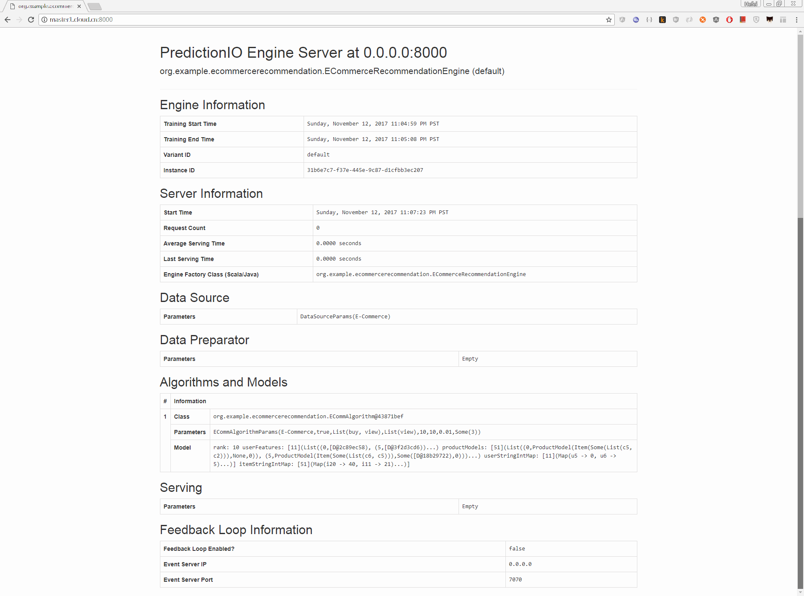

# E-Commerce Recommendation Engine Template

#### Create a new Engine from an Engine Template

```
git clone https://github.com/apache/incubator-predictionio-template-ecom-recommender.git
cd incubator-predictionio-template-ecom-recommender
```

#### Generate an App ID and Access Key

```
pio new app E-Commerce
```

You can list all of the apps created its corresponding ID and Access Key by running the following command:

```shell
pio app list
```

Your should see a list of apps created,  like below: 

```shell
pio app list
[INFO] [Pio$]                 Name |   ID |                                                       Access Key | Allowed Event(s)
[INFO] [Pio$]           E-Commerce |    3 | Y498FqXQiwkakOOp2kZ1TJkUilGKlsWGkQ81QdAoMs8bGDcvoIY0pbLY_G4A-KeP | (all)
[INFO] [Pio$]               MyApp1 |    2 | nhVdYBwxnRfZ7qSHJkt9IdUZ5wv-uXzhE1eyTNEaOzkCMRDVvN7R7OzAkKlYRZdW | (all)
[INFO] [Pio$]             handmade |    1 | QAToHQQkz0QMOkICIB223hsdKU_8yddx1ryzCCv5mYFkZ6biN4BJMBha4vE4O4zj | (all)
[INFO] [Pio$] Finished listing 3 app(s).
```

#### Export ```ACCESS_KEY``` in Current Session

```shell
export ACCESS_KEY=Y498FqXQiwkakOOp2kZ1TJkUilGKlsWGkQ81QdAoMs8bGDcvoIY0pbLY_G4A-KeP
```

#### Collecting Data

```shell
curl -i -X POST http://localhost:7070/events.json?accessKey=$ACCESS_KEY \
-H "Content-Type: application/json" \
-d '{
  "event" : "$set",
  "entityType" : "user",
  "entityId" : "u0",
  "eventTime" : "2014-11-02T09:39:45.618-08:00"
}'
```

```shell
curl -i -X POST http://localhost:7070/events.json?accessKey=$ACCESS_KEY \
-H "Content-Type: application/json" \
-d '{
  "event" : "$set",
  "entityType" : "item",
  "entityId" : "i0",
  "properties" : {
    "categories" : ["c1", "c2"]
  }
  "eventTime" : "2014-11-02T09:39:45.618-08:00"
}'
```

```shell
curl -i -X POST http://localhost:7070/events.json?accessKey=$ACCESS_KEY \
-H "Content-Type: application/json" \
-d '{
  "event" : "view",
  "entityType" : "user",
  "entityId" : "u0",
  "targetEntityType" : "item",
  "targetEntityId" : "i0",
  "eventTime" : "2014-11-10T12:34:56.123-08:00"
}'
```

#### Query Event Server

```
curl -i -X GET "http://localhost:7070/events.json?accessKey=$ACCESS_KEY"
```

#### Import More Sample Data

```shell
python data/import_eventserver.py --access_key $ACCESS_KEY
```

You should see the following output:

```shell
......
('User', 'u10', 'views item', 'i13')
('User', 'u10', 'views item', 'i10')
('User', 'u10', 'views item', 'i27')
('User', 'u10', 'buys item', 'i27')
('User', 'u10', 'views item', 'i14')
('User', 'u10', 'buys item', 'i14')
('User', 'u10', 'views item', 'i46')
('User', 'u10', 'buys item', 'i46')
('User', 'u10', 'views item', 'i30')
('User', 'u10', 'buys item', 'i30')
('User', 'u10', 'views item', 'i40')
('User', 'u10', 'buys item', 'i40')
204 events are imported.
```

#### Deploy the Engine as a Service

Under the directory, modify ```engine.json``` file, and make sure the **appName** parameter match your **App Name** you created earlier.

```
{
  "id": "default",
  "description": "Default settings",
  "engineFactory": "org.example.ecommercerecommendation.ECommerceRecommendationEngine",
  "datasource": {
    "params" : {
      "appName": "E-Commerce"
    }
  },
  "algorithms": [
    {
      "name": "ecomm",
      "params": {
        "appName": "E-Commerce",
        "unseenOnly": true,
        "seenEvents": ["buy", "view"],
        "similarEvents": ["view"],
        "rank": 10,
        "numIterations" : 20,
        "lambda": 0.01,
        "seed": 3
      }
    }
  ]
}
```

#### Building

```
pio build --verbose
```

Upon successful build, you should see a console message similar to the following.

```shell
[INFO] [Pio$] Your engine is ready for training.
```

#### Training the Predictive Model

```
pio train
```

When your engine is trained successfully, you should see a console message similar to the following.

```
......
[INFO] [CoreWorkflow$] Inserting persistent model
[INFO] [CoreWorkflow$] Updating engine instance
[INFO] [CoreWorkflow$] Training completed successfully.
[INFO] [ServerConnector] Stopped Spark@4ff8817e{HTTP/1.1}{0.0.0.0:4040}
......
```

#### Deploying the Engine

Now your engine is ready to deploy. Run:

```
pio deploy
```

When the engine is deployed successfully and running, you should see a console message similar to the following:

```
[INFO] [MasterActor] Undeploying any existing engine instance at http://0.0.0.0:8000
[WARN] [MasterActor] Nothing at http://0.0.0.0:8000
[INFO] [HttpListener] Bound to /0.0.0.0:8000
[INFO] [MasterActor] Engine is deployed and running. Engine API is live at http://0.0.0.0:8000.

```

Do not kill the deployed engine process.

By default, the deployed engine binds to [http://localhost:8000](http://localhost:8000/). You can visit that page in your web browser to check its status.




