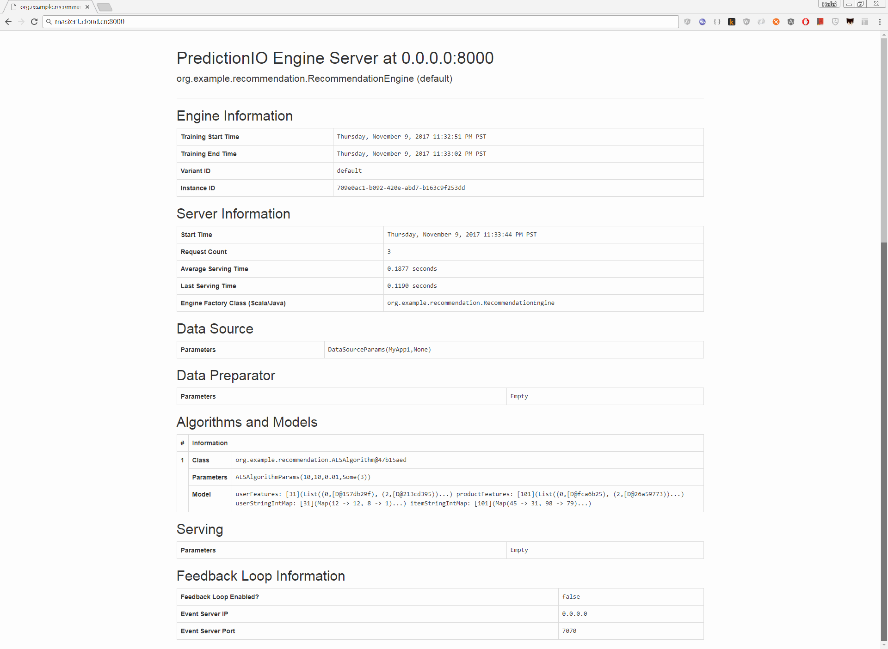

PredictionIO Examples
=====================

## 1. Recommendation Engine Template


#### Create a new Engine from an Engine Template

```shell
$ git clone https://github.com/apache/incubator-predictionio-template-recommender.git incubator-predictionio-template-recommender
$ cd incubator-predictionio-template-recommender
```

#### Generate an App ID and Access Key

```shell
pio app new MyApp1
```

You can list all of the apps created its corresponding ID and Access Key by running the following command:

```shell
pio app list
```

Your should see a list of apps created,  like below: 

```shell
[INFO] [Pio$]                 Name |   ID |                                                       Access Key | Allowed Event(s)
[INFO] [Pio$]               MyApp1 |    2 | nhVdYBwxnRfZ7qSHJkt9IdUZ5wv-uXzhE1eyTNEaOzkCMRDVvN7R7OzAkKlYRZdW | (all)
[INFO] [Pio$]             handmade |    1 | QAToHQQkz0QMOkICIB223hsdKU_8yddx1ryzCCv5mYFkZ6biN4BJMBha4vE4O4zj | (all)
[INFO] [Pio$] Finished listing 2 app(s).
```

#### Import More Sample Data

```shell
sudo pip install predictionio

curl https://raw.githubusercontent.com/apache/spark/master/data/mllib/sample_movielens_data.txt --create-dirs -o data/sample_movielens_data.txt

# Replace <ACCCESS_KEY> by the Access Key generated in above steps
python data/import_eventserver.py --access_key $ACCESS_KEY
```

You should see the following output:

```shell
Importing data...
1501 events are imported.
```

#### Edit Engine.json

Under the directory, modify ```engine.json``` file, and make sure the **appName** parameter match your **App Name** you created earlier.

```json
{
  "id": "default",
  "description": "Default settings",
  "engineFactory": "org.example.recommendation.RecommendationEngine",
  "datasource": {
    "params" : {
      "appName": "MyApp1"
    }
  },
  "algorithms": [
    {
      "name": "als",
      "params": {
        "rank": 10,
        "numIterations": 10,
        "lambda": 0.01,
        "seed": 3
      }
    }
  ]
}
```

#### Building

```shell
pio build --verbose

[INFO] [Console$] Your engine is ready for training.
```

#### Training the Predictive Model

```shell
pio train
[INFO] [CoreWorkflow$] Training completed successfully.
```

#### Deploying the Engine

```shell
[INFO] [HttpListener] Bound to /0.0.0.0:8000
[INFO] [MasterActor] Bind successful. Ready to serve.
```

Do not kill the deployed engine process.

By default, the deployed engine binds to [http://localhost:8000](http://localhost:8000/). You can visit that page in your web browser to check its status.



#### FAQs

###### Error 1

```shell
[WARN] [Executor] 1 block locks were not released by TID = 3:
[rdd_1_3]
[WARN] [BLAS] Failed to load implementation from: com.github.fommil.netlib.NativeSystemBLAS
[WARN] [BLAS] Failed to load implementation from: com.github.fommil.netlib.NativeRefBLAS
[WARN] [LAPACK] Failed to load implementation from: com.github.fommil.netlib.NativeSystemLAPACK
[WARN] [LAPACK] Failed to load implementation from: com.github.fommil.netlib.NativeRefLAPACK
[ERROR] [Executor] Exception in task 0.0 in stage 39.0 (TID 84)
[WARN] [TaskSetManager] Lost task 0.0 in stage 39.0 (TID 84, localhost, executor driver): java.lang.StackOverflowError
	at java.io.ObjectInputStream$BlockDataInputStream.peekByte(ObjectInputStream.java:2915)
	at java.io.ObjectInputStream.readClassDesc(ObjectInputStream.java:1700)
	...... ......
	at java.io.ObjectInputStream.defaultReadFields(ObjectInputStream.java:2245)
	at java.io.ObjectInputStream.readSerialData(ObjectInputStream.java:2169)
	at java.io.ObjectInputStream.readOrdinaryObject(ObjectInputStream.java:2027)
[ERROR] [TaskSetManager] Task 0 in stage 39.0 failed 1 times; aborting job
[ERROR] [SparkUncaughtExceptionHandler] Uncaught exception in thread Thread[Executor task launch worker for task 84,5,main]	
```

changed the ```numIterations``` parameter in ```engine.json``` file, and set a little smaller. (Default values is 20).

[Google Forum](https://groups.google.com/forum/#!topic/predictionio-user/GKuXO9_CNP0)

```json
{
  "id": "default",
  "description": "Default settings",
  "engineFactory": "org.example.recommendation.RecommendationEngine",
  "datasource": {
    "params" : {
      "appName": "MyApp1"
    }
  },
  "algorithms": [
    {
      "name": "als",
      "params": {
        "rank": 10,
        "numIterations": 10,
        "lambda": 0.01,
        "seed": 3
      }
    }
  ]
}
```