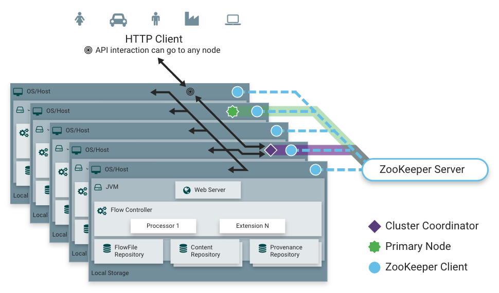

This section provides a quick overview of NiFi Clustering and instructions on how to set up a basic cluster. In the future, we hope to provide supplemental documentation that covers the NiFi Cluster Architecture in depth.



### Zero-Master Clustering

NiFi employs a Zero-Master Clustering paradigm. Each node in the cluster performs the same tasks on the data, but each operates on a different set of data. One of the nodes is automatically elected (via Apache ZooKeeper) as the Cluster Coordinator. All nodes in the cluster will then send heartbeat/status information to this node, and this node is responsible for disconnecting nodes that do not report any heartbeat status for some amount of time. Additionally, when a new node elects to join the cluster, the new node must first connect to the currently-elected Cluster Coordinator in order to obtain the most up-to-date flow. If the Cluster Coordinator determines that the node is allowed to join (based on its configured Firewall file), the current flow is provided to that node, and that node is able to join the cluster, assuming that the node’s copy of the flow matches the copy provided by the Cluster Coordinator. If the node’s version of the flow configuration differs from that of the Cluster Coordinator’s, the node will not join the cluster.

### Why Cluster?

NiFi Administrators or DataFlow Managers (DFMs) may find that using one instance of NiFi on a single server is not enough to process the amount of data they have. So, one solution is to run the same dataflow on multiple NiFi servers. However, this creates a management problem, because each time DFMs want to change or update the dataflow, they must make those changes on each server and then monitor each server individually. By clustering the NiFi servers, it’s possible to have that increased processing capability along with a single interface through which to make dataflow changes and monitor the dataflow. Clustering allows the DFM to make each change only once, and that change is then replicated to all the nodes of the cluster. Through the single interface, the DFM may also monitor the health and status of all the nodes.

### Terminology

NiFi Clustering is unique and has its own terminology. It’s important to understand the following terms before setting up a cluster:

**NiFi Cluster Coordinator**: A NiFi Cluster Coordinator is the node in a NiFi cluster that is responsible for carrying out tasks to manage which nodes are allowed in the cluster and providing the most up-to-date flow to newly joining nodes. When a DataFlow Manager manages a dataflow in a cluster, they are able to do so through the User Interface of any node in the cluster. Any change made is then replicated to all nodes in the cluster.

**Nodes**: Each cluster is made up of one or more nodes. The nodes do the actual data processing.

**Primary Node**: Every cluster has one Primary Node. On this node, it is possible to run "Isolated Processors" (see below). ZooKeeper is used to automatically elect a Primary Node. If that node disconnects from the cluster for any reason, a new Primary Node will automatically be elected. Users can determine which node is currently elected as the Primary Node by looking at the Cluster Management page of the User Interface.


## Basic Cluster Setup

For each instance, certain properties in the *nifi.properties* file will need to be updated. In particular, the Web and Clustering properties should be evaluated for your situation and adjusted accordingly. All the properties are described in the [System Properties](https://nifi.apache.org/docs/nifi-docs/html/administration-guide.html#system_properties) section of this guide; however, in this section, we will focus on the minimum properties that must be set for a simple cluster.

For all three instances, the [Cluster Common Properties](https://nifi.apache.org/docs/nifi-docs/html/administration-guide.html#cluster_common_properties) can be left with the default settings. Note, however, that if you change these settings, they must be set the same on every instance in the cluster.

For each Node, the minimum properties to configure are as follows:

- Under the *Web Properties* section, set either the HTTP or HTTPS port that you want the Node to run on. Also, consider whether you need to set the HTTP or HTTPS host property. All nodes in the cluster should use the same protocol setting.
- Under the *State Management section*, set the `nifi.state.management.provider.cluster` property to the identifier of the Cluster State Provider. Ensure that the Cluster State Provider has been configured in the *state-management.xml* file. See [Configuring State Providers](https://nifi.apache.org/docs/nifi-docs/html/administration-guide.html#state_providers) for more information.
- Under *Cluster Node Properties*, set the following:
  - `nifi.cluster.is.node` - Set this to *true*.
  - `nifi.cluster.node.address` - Set this to the fully qualified hostname of the node. If left blank, it defaults to `localhost`.
  - `nifi.cluster.node.protocol.port` - Set this to an open port that is higher than 1024 (anything lower requires root).
  - `nifi.cluster.node.protocol.threads` - The number of threads that should be used to communicate with other nodes in the cluster. This property defaults to `10`. A thread pool is used for replicating requests to all nodes, and the thread pool will never have fewer than this number of threads. It will grow as needed up to the maximum value set by the `nifi.cluster.node.protocol.max.threads` property.
  - `nifi.cluster.node.protocol.max.threads` - The maximum number of threads that should be used to communicate with other nodes in the cluster. This property defaults to `50`. A thread pool is used for replication requests to all nodes, and the thread pool will have a "core" size that is configured by the`nifi.cluster.node.protocol.threads` property. However, if necessary, the thread pool will increase the number of active threads to the limit set by this property.
  - `nifi.zookeeper.connect.string` - The Connect String that is needed to connect to Apache ZooKeeper. This is a comma-separated list of hostname:port pairs. For example, `localhost:2181,localhost:2182,localhost:2183`. This should contain a list of all ZooKeeper instances in the ZooKeeper quorum.
  - `nifi.zookeeper.root.node` - The root ZNode that should be used in ZooKeeper. ZooKeeper provides a directory-like structure for storing data. Each 'directory' in this structure is referred to as a ZNode. This denotes the root ZNode, or 'directory', that should be used for storing data. The default value is `/root`. This is important to set correctly, as which cluster the NiFi instance attempts to join is determined by which ZooKeeper instance it connects to and the ZooKeeper Root Node that is specified.
  - `nifi.cluster.flow.election.max.wait.time` - Specifies the amount of time to wait before electing a Flow as the "correct" Flow. If the number of Nodes that have voted is equal to the number specified by the `nifi.cluster.flow.election.max.candidates` property, the cluster will not wait this long. The default value is `5 mins`. Note that the time starts as soon as the first vote is cast.
  - `nifi.cluster.flow.election.max.candidates` - Specifies the number of Nodes required in the cluster to cause early election of Flows. This allows the Nodes in the cluster to avoid having to wait a long time before starting processing if we reach at least this number of nodes in the cluster.


#### Example

> Hosts

```ini
192.168.45.206    host-192-168-45-206
192.168.45.207    host-192-168-45-207
192.168.45.208    host-192-168-45-208
```


> host-192-168-45-206

`$NIFI_HOME/conf/nifi.properties`

```ini
# web properties #
nifi.web.http.host=192.168.45.206
nifi.web.http.port=10081
...
# cluster node properties (only configure for cluster nodes) #
nifi.cluster.is.node=true
nifi.cluster.node.address=host-192-168-45-206
nifi.cluster.node.protocol.port=6001
...
# zookeeper properties, used for cluster management #
nifi.zookeeper.connect.string=host-192-168-45-181:2181,host-192-168-45-182:2181,host-192-168-45-183:2181
...
```


> host-192-168-45-207

`$NIFI_HOME/conf/nifi.properties`

```ini
# web properties #
nifi.web.http.host=192.168.45.207
nifi.web.http.port=10081
...
# cluster node properties (only configure for cluster nodes) #
nifi.cluster.is.node=true
nifi.cluster.node.address=host-192-168-45-207
nifi.cluster.node.protocol.port=6001
...
# zookeeper properties, used for cluster management #
nifi.zookeeper.connect.string=host-192-168-45-181:2181,host-192-168-45-182:2181,host-192-168-45-183:2181
...
```


> host-192-168-45-208

`$NIFI_HOME/conf/nifi.properties`

```ini
# web properties #
nifi.web.http.host=192.168.45.208
nifi.web.http.port=10081
...
# cluster node properties (only configure for cluster nodes) #
nifi.cluster.is.node=true
nifi.cluster.node.address=host-192-168-45-208
nifi.cluster.node.protocol.port=6001
...
# zookeeper properties, used for cluster management #
nifi.zookeeper.connect.string=host-192-168-45-181:2181,host-192-168-45-182:2181,host-192-168-45-183:2181
...
```


Now, it is possible to start up the cluster. It does not matter which order the instances start up. Navigate to the URL for one of the nodes, and the User Interface should look similar to the following:


Now, then shut down **Nifi Services** on host `host-192-168-45-208`, and  you can verify it on host `host-192-168-45-207` :


#### Management Cluster Nodes


