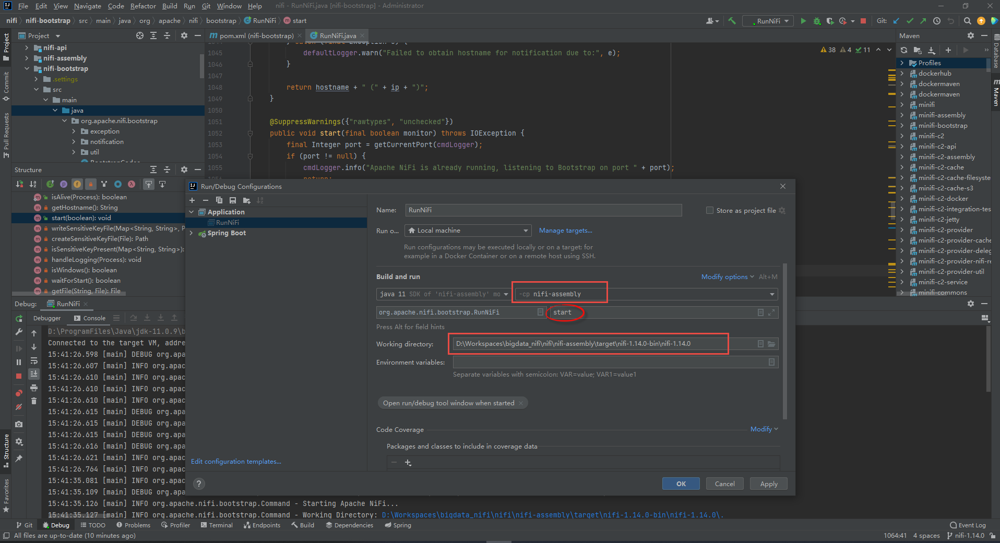
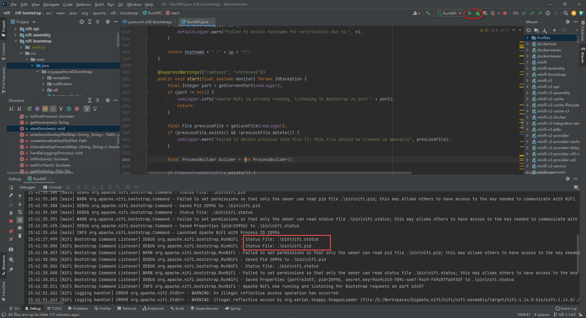
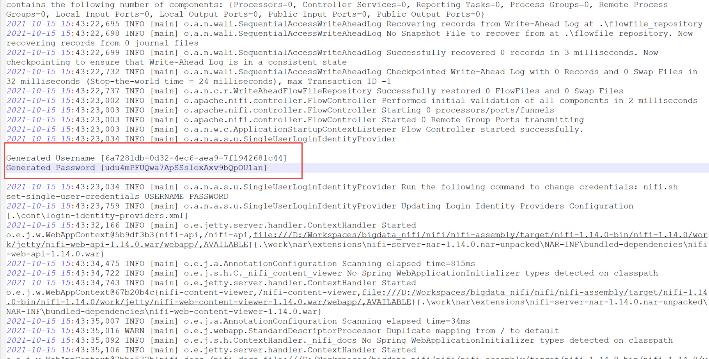

## Apache Nifi IDE Integration module

### Running Nifi in Debug mode

1. open intellij idea to git clone https://github.com/apache/nifi.git , the import configure as default, next... after opened the project, the nifi may get wrong message, just ignore it.

2. set maven build options:

   ```shell
   mvn -T 2 clean package -DskipTests -Dhive.version=3.1.0
   ```

3. configure debugger options

   

> Start as debug mode




> Default Username/Password

