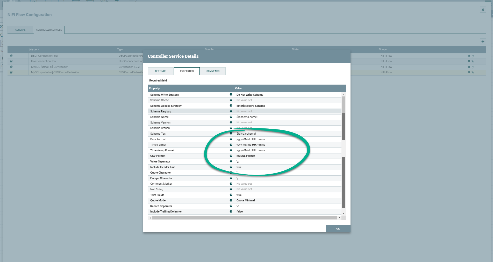

## ExecuteSQLRecord

### Description:

Executes provided SQL select query. Query result will be converted to the format specified by a Record Writer. Streaming is used so arbitrarily large result sets are supported. This processor can be scheduled to run on a timer, or cron expression, using the standard scheduling methods, or it can be triggered by an incoming FlowFile. If it is triggered by an incoming FlowFile, then attributes of that FlowFile will be available when evaluating the select query, and the query may use the ? to escape parameters. In this case, the parameters to use must exist as FlowFile attributes with the naming convention sql.args.N.type and sql.args.N.value, where N is a positive integer. The sql.args.N.type is expected to be a number indicating the JDBC Type. The content of the FlowFile is expected to be in UTF-8 format. FlowFile attribute 'executesql.row.count' indicates how many rows were selected.

### Properties

[More Info](<http://192.168.45.205:10081/nifi-docs/documentation?select=org.apache.nifi.dbcp.hive.HiveConnectionPool&group=org.apache.nifi&artifact=nifi-hive-nar&version=1.9.2>)

### Practices

>  Secnario

Select data from `db1.TABLE_A` to `db2.TABLE_B`. 

Processors will be used:

- [x] DBCPConnectionPool 	
- [x] ExecuteSQLRecord
- [x] RecordWriter
- [x] PutDatabaseRecord
- [x] RecordReader

> DBCPConnectionPool

> ExecuteSQLRecord

> RecordWriter

> PutDatabaseRecord

> RecordReader

