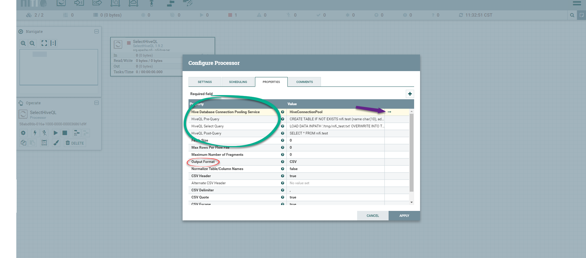

## SelectHiveQL

### Description

Execute provided HiveQL SELECT query against a Hive database connection. Query result will be converted to Avro or CSV format. Streaming is used so arbitrarily large result sets are supported. This processor can be scheduled to run on a timer, or cron expression, using the standard scheduling methods, or it can be triggered by an incoming FlowFile. If it is triggered by an incoming FlowFile, then attributes of that FlowFile will be available when evaluating the select query. FlowFile attribute 'selecthiveql.row.count' indicates how many rows were selected.

### Proterties

[More info.](<http://192.168.45.205:10081/nifi-docs/documentation?select=org.apache.nifi.dbcp.hive.HiveConnectionPool&group=org.apache.nifi&artifact=nifi-hive-nar&version=1.9.2>)

### Practices

#### Configure Processor

#### Configure HiveConnectionPool

