# 1、背景简介

HDFS通过把文件系统元数据全部加载到Namenode内存中，给客户端提供了低延迟的元数据访问。由于元数据需要全部加载到内存，所以一个HDFS集群能支持的最大文件数，受JAVA堆内存的限制，上限大概是4亿左右个文件。所以HDFS适合大量大文件（几百兆以上）的集群，如果集群中有非常多的小文件，HDFS的元数据访问性能会受到影响。 Ozone 是一个分布式、多副本的对象存储系统，并针对大数据场景进行了专门的优化。Ozone 主要围绕可扩展性进行设计，目标是十亿数量级以上的对象存储。

# 2、组件架构

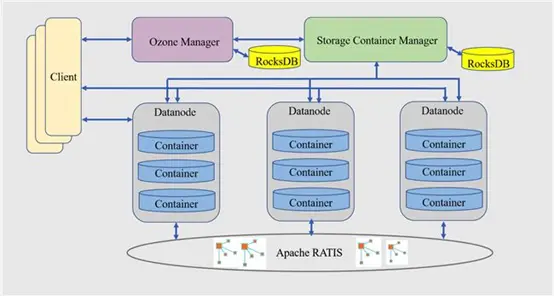

## 2.1 Ozone Manager

### 2.1.1 基本功能

Ozone Manager（OM）管理 Ozone 的命名空间，提供所有的 Volume, Bucket 和 Key 的新建，更新和删除操作。

Ozone Manager 只和 Ozone Client 和 Storage Container Manager 通信，并不直接和 Datanode 通信。

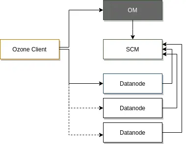

当向Ozone写入数据时，你需要向OM请求一个块，OM会返回一个块并记录下相关信息。当你想要读取那个文件时，你也需要先通过OM获取那个块的地址。


OM 允许用户在卷和桶下管理键，卷和桶都是命名空间的一部分，也由 OM 管理。

每个卷都是 OM 下的一个独立命名空间的根，这一点和 HDFS 不同，HDFS 提供的是单个根目录的文件系统。

与 HDFS 中单根的树状结构相比，Ozone 的命名空间是卷的集合，或者可以看作是个森林，因此可以非常容易地部署多个 OM 来进行扩展。

### 2.1.2. 元数据管理

OM 维护了卷、桶和键的列表。它为每个用户维护卷的列表，为每个卷维护桶的列表，为每个桶维护键的列表。

### 2.1.3. 单点及高可用

单点OM通过RocksDB来持久化元数据；

HA模式底层通过 Ratis（实现了Raft协议） 扩展元数据的副本数来实现元数据的HA。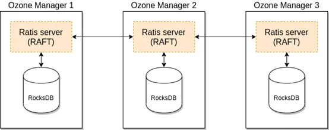

### 2.1.4. Key写

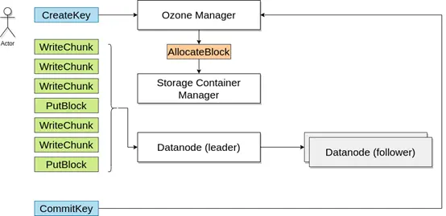

### 2.1.5. Key 读

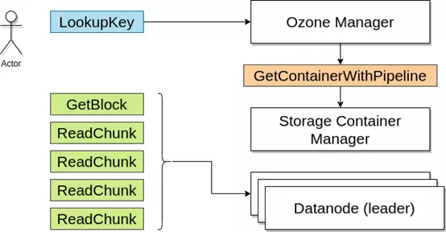

## 2.2. Storage Container Manager

SCM是Ozone的block空间管理的leader节点，主要职责是创建和管理container，container是Ozone的主要复制单元。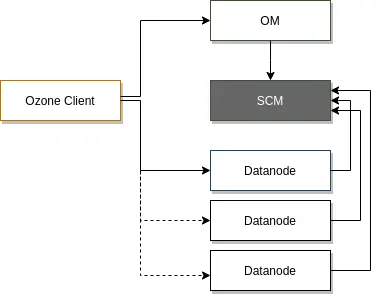

SCM为Ozone提供多个关键功能，集群管理、证书颁发、块管理和副本管理：

### 2.2.1. 集群管理

SCM负责创建Ozone集群，当通过init初始化集群时，SCM将创建证书授权所需的集群标识和根证书。 SCM管理着集群中数据节点datanode的生命周期。


### 2.2.2. 服务安全管理

SCM的证书授权为集群中每个服务颁发身份证书，这个基础证书让服务在网络层更容易启动mTLS(双向认证)，并且块的基础token也依赖于这个基础证书。

### 2.2.3. 块管理

SCM是块管理器，它分配块并将他们分配给数据节点，客户端可以直接对这些块进行读写操作。

### 2.2.4. 副本管理

SCM持续跟踪所有的块副本，如果数据节点或者磁盘损坏，SCM会检测到并会指示数据节点复制丢失的数据块以确保高可用性。

## 2.3 Containers

Block是数据块对象，真实存储用户的数据，不由SCM管理。

Container是一个逻辑概念，是由一些相互之间没有关系的 Block 组成的集合。

在Ozone中，数据是以Container的粒度进行副本复制的，默认大小为5G (ozone.scm.container.size)，由SCM服务管理。

Pipeline 来保证 Container 实现想要的副本数。SCM 中目前支持2种 Pipeline 方式实现多副本，单副本的 Standalone 模式和三副本的 Ratis 方式(ozone.replication)。


当Ozone Manager从SCM请求一个新的块分配时，SCM将识别合适的容器并生成一个包含ContainerId+LocalId的块id。客户端将连接到存储容器的Datanode，Datanode可以根据LocalId管理分离的块。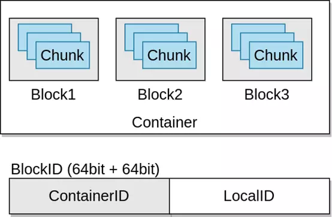

Container 有2种状态，OPEN 和 CLOSED：

当container创建时，它就开始了Open状态，当它写满时（默认5G），它就会关闭并且变成CLOSED的状态，之后便不可修改。 | OPEN | CLOSED | | :------------: | :------------: | | 可变 | 不可变 | |通过ratis复制 | 使用异步容器copy进行复制| | Raft leader节点用于数据读写| 所有节点都用于读 |

## 2.4 Datanodes

存储所有数据，客户端按block写入数据，数据节点将这些block聚合到存储container中, container中包含用户写入的数据块和这些块的元数据。

Ozone container存储容器是一个自包含的超级块，容器中包含一系列的Block，以及存储实际数据的磁盘文件，是默认的存储容器格式。


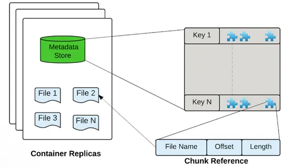

当客户端想从Ozone读取数据，客户端向OM发送数据文件的名字,OM会返回组成这个文件的块列表，一个Ozone块包含一个container ID 和一个local ID，container ID让客户端发现container的位置，container的相关信息由SCM提供，在大多数情况下，container位置由Ozone Manager缓存，并与Ozone块一起返回。

当客户端找到了container，也就是知道了哪些数据节点包含这些container，客户端会连接到数据节点并且读取由container ID:Local ID指定的数据流,换句话说，Local ID用作容器的索引，从container中读取想要的数据流。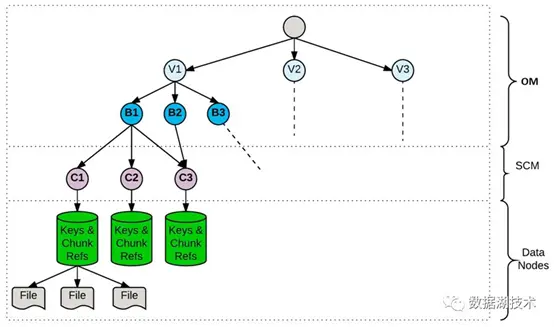

- 容器的位置发现

SCM 如何获得容器的位置？这一点和现有的 HDFS 十分相似。数据节点会定期发送类似于块报告的容器报告，容器报告比块报告的内容简洁的多，比如，对于一个存储容量为 196 TB 的集群，Ozone 大概会拥有四万个容器，相比于 HDFS 的一百五十万个块，块报告数量缩减为四十分之一。


这种间接管理的方式大大地提高了 Ozone 的扩展性，因为 SCM 需要处理的块数据大大减少，且命名服务（OM）作为一个独特的服务主体对于扩展 Ozone 具有重要意义。

## 2.5. Recon

Ozone的监控页面

## 2.6 S3G

Ozone的s3 compatible REST gateway

# 3. 基本介绍

## 3.1.组件架构

Ozone 的命名空间由volume组成，同时volume也用作存储账户管理。

Ozone Manager(OM) 管理命名空间，Storage Container Manager(SCM) 管理底层的数据，而 Recon 是 Ozone 的管理接口。

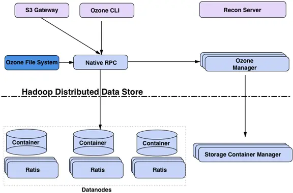

## 3.2.逻辑架构

Ozone数据的逻辑存储架构

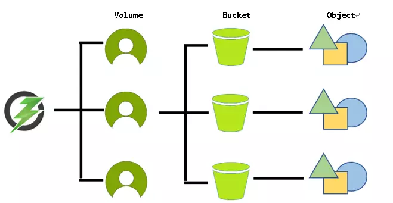

1. Volumes（卷）: 类似于用户账号，只有管理员可以创建volumes，可以做配额管理，用于存储buckets，一个volume下可以包含多个buckets。
2. Buckets（桶）: 类似于目录，用户可以在自己的卷下创建任意数量的桶，一个bucket可以包含无数个keys，buckets不能包含其他buckets，它们之间互不干扰。
3. Keys（键）: 类似于文件，位于bucket下，用于读写数据。

## 3.3. 端口说明

| 服务     | 端口 | 参数                        | 备注                                                         |
| :------- | :--- | :-------------------------- | :----------------------------------------------------------- |
| Datanode | 9858 | dfs.container.ratis.ipc     | Datanode节点                                                 |
| Datanode | 9859 | dfs.container.ipc           | Datanode节点                                                 |
| SCM      | 9860 | ozone.scm.client.address    |                                                              |
| SCM      | 9861 | ozone.scm.datanode.address  | scm和datanode通信端口                                        |
| OM       | 9862 | ozone.om.address            |                                                              |
| SCM      | 9863 | ozone.scm.block.client.port |                                                              |
| OM       | 9874 | ozone.om.http-address       | OM web页面                                                   |
| SCM      | 9876 | ozone.scm.http-address      | SCM web页面                                                  |
| S3G      | 9878 | ozone.s3g.http-address      | S3Gateway                                                    |
| Datanode | 9882 | hdds.datanode.http-address  | Datanode节点                                                 |
| Recon    | 9888 | ozone.recon.http-address    | Recon web页面                                                |
| Recon    | 9891 | ozone.recon.address         | 默认无，Datanode节点必配参数，以便Recon可以监测到Datanode服务 |

# 4.安装部署

> OZONE和HDFS不要部署在同一个节点上，因为OZONE的环境变量会和HADOOP共用，服务启动会冲突，可以修改环境变量相关脚本进行更改。

## 4.1.基础环境

### 4.1.1.配置/etc/hosts

```
# cat /etc/hosts
127.0.0.1   localhost localhost.localdomain localhost4 localhost4.localdomain4
::1         localhost localhost.localdomain localhost6 localhost6.localdomain6
172.16.40.21 ozom-1
172.16.40.22 ozom-2
172.16.40.23 ozom-3
172.16.40.11 ozdn-1
172.16.40.12 ozdn-2
172.16.40.13 ozdn-3
```

### 4.1.2.关闭防火墙

```
# systemctl stop firewalld && systemctl disable firewalld
```

### 4.1.3.关闭selinux

```
# setenforce 0 && sed -i "s/^SELINUX=enforcing/SELINUX=disabled/g" /etc/selinux/config
```

### 4.1.4.时间同步

ntpd

### 4.1.5.创建用户

```
# useradd hadoop
```

### 4.1.6.配置互信

略


### 4.1.6.配置数据库

1. 下载MySQL JDBC 驱动`mysql-connector-java-8.0.26.jar` 到 `share/ozone/lib/`目录；

2. 将JDBC Driver 追加到 `RECON_CLASSPATH`。

   ```shell
   # File location: $OZONE_HOME/shar/ozone/classpath/hadoop-ozone-recon.classpath
   
   # append to the file end
   :$HDDS_LIB_JARS_DIR/mysql-connector-java-8.0.26.jar
   
   ```

   


## 4.2.单点部署

| Hostname | Ip           | Service           |
| :------- | :----------- | :---------------- |
| ozom-1   | 172.16.40.21 | OM、SCM、DataNode |
| ozom-2   | 172.16.40.22 | DataNode          |
| ozom-3   | 172.16.40.23 | DataNode          |
| ozdn-1   | 172.16.40.11 | DataNode          |
| ozdn-2   | 172.16.40.12 | DataNode          |
| ozdn-3   | 172.16.40.13 | DataNode          |

### 4.2.1.创建目录

创建Datanode的数据目录 挂载到磁盘上

```
# mkdir -p /data/disk{1..2}
# chown -R hadoop:hadoop /data/disk{1..2}
```

创建ozone相关目录

```
# mkdir -p /opt/dlw/{conf,soft,logs,metadata,tmp}
# chown -R hadoop:hadoop /opt/dlw

$ mkdir -p /opt/dlw/logs/ozone
$ mkdir -p /opt/dlw/tmp/run

$ mkdir -p /opt/dlw/metadata/ozone/{om,node,recon,ratis,scm}
```

### 4.2.2.环境变量

#### 1、配置java

所有节点都需配置


配置ozone

```
export OZONE_HOME=/opt/dlw/soft/ozone
export PATH=$OZONE_HOME/sbin:$OZONE_HOME/bin:$PATH
export HADOOP_OPTS="-XX:ParallelGCThreads=8 -XX:+UseConcMarkSweepGC -XX:CMSInitiatingOccupancyFraction=75 -XX:+CMSParallelRemarkEnabled"
export HADOOP_PID_DIR=/opt/dlw/tmp/run
export HADOOP_LOG_DIR=/opt/dlw/logs/hadoop
```

### 4.2.3.拷贝软件

Ozone 下载的二进制包，直接解压使用，拷贝至所有节点

```
$ tar -zxvf hadoop-ozone-1.0.0.tar.gz -C /opt/dlw/soft/
$ cd /opt/dlw/soft/
$ mv ozone-1.0.0 ozone
```

### 4.2.4.修改配置

生成配置

```
$ ozone genconf $OZONE_HOME/etc/hadoop
```

修改配置

```xml
$ vim $OZONE_HOME/etc/hadoop/ozone-site.xml
<?xml version="1.0" encoding="UTF-8" standalone="yes"?>
<configuration>
    <property>
        <name>ozone.om.address</name>
        <value>ozom-1</value>
    </property>

    <property>
        <name>ozone.om.http-address</name>
        <value>ozom-1:9874</value>
    </property>

    <property>
       <name>ozone.om.db.dirs</name>
       <value>/opt/dlw/metadata/ozone/om</value>
    </property>

    <property>
        <name>ozone.metadata.dirs</name>
        <value>/opt/dlw/metadata/ozone</value>
    </property>

    <property>
        <name>ozone.om.ratis.enable</name>
        <value>false</value>
    </property>

    <property>
        <name>ozone.om.service.ids</name>
        <value>omdlw001</value>
    </property>

    <property>
       <name>ozone.om.nodes.omdlw001</name>
       <value>om1,om2,om3</value>
    </property>

    <property>
       <name>ozone.om.address.omdlw001.om1</name>
       <value>ozom-1</value>
    </property>

    <property>
       <name>ozone.om.address.omdlw001.om2</name>
       <value>ozom-2</value>
    </property>

    <property>
       <name>ozone.om.address.omdlw1.om3</name>
       <value>ozom-3</value>
    </property>

    <property>
        <name>ozone.scm.client.address</name>
        <value>ozom-1</value>
    </property>

    <property>
        <name>ozone.scm.names</name>
        <value>ozom-1</value>
    </property>

    <property>
        <name>ozone.scm.container.size</name>
        <value>5GB</value>
    </property>

    <property>
       <name>ozone.scm.db.dirs</name>
       <value>/opt/dlw/metadata/ozone/scm</value>
    </property>

    <property>
       <name>ozone.scm.pipeline.owner.container.count</name>
       <value>3</value>
    </property>

    <property>
        <name>ozone.scm.datanode.id.dir</name>
        <value>/opt/dlw/metadata/ozone/node</value>
    </property>

    <property>
       <name>ozone.scm.block.client.address</name>
       <value>ozom-1</value>
    </property>

    <property>
       <name>ozone.scm.datanode.address</name>
       <value>ozom-1</value>
    </property>

    <property>
       <name>hdds.datanode.dir</name>
       <value>/data/disk1,/data/disk2</value>
    </property>

    <property>
       <name>ozone.recon.db.dir</name>
       <value>/opt/dlw/metadata/ozone/recon</value>
    </property>

    <property>
       <name>ozone.recon.address</name>
       <value>ozom-1:9891</value>
    </property>

    <property>
       <name>recon.om.snapshot.task.interval.delay</name>
       <value>1m</value>
    </property>

    <property>
       <name>dfs.container.ratis.datanode.storage.dir</name>
       <value>/opt/dlw/metadata/ozone/ratis</value>
    </property>

</configuration>
$ vim $OZONE_HOME/etc/hadoop/workers
ozom-1
ozom-2
ozom-3
ozdn-1
ozdn-2
ozdn-3
```

### 4.2.5.启动服务


> SCM服务，不需要依赖其它服务，直接自身启动起来即可，为最底层服务。

> OM服务，需要依赖SCM服务，要配置SCM的通信地址。

> Datanode节点服务，需要依赖SCM，OM服务，二者通信地址都得配上。


- scm

```
$ ozone scm --init
$ ozone --daemon start scm
```

- om

```
$ ozone om --init
$ ozone --daemon start om
```

- datanode –所有datanode节点

```
$ ozone --daemon start datanode
```

- recon

```
$ ozone --daemon start recon
```

- s3g

```
$ ozone --daemon start s3g
```

### 4.2.6.校检验证

```
$ jps
6721 ReconServer
7589 Gateway
4934 StorageContainerManagerStarter
5479 OzoneManagerStarter
5705 HddsDatanodeService
7662 Jps
```

- scm

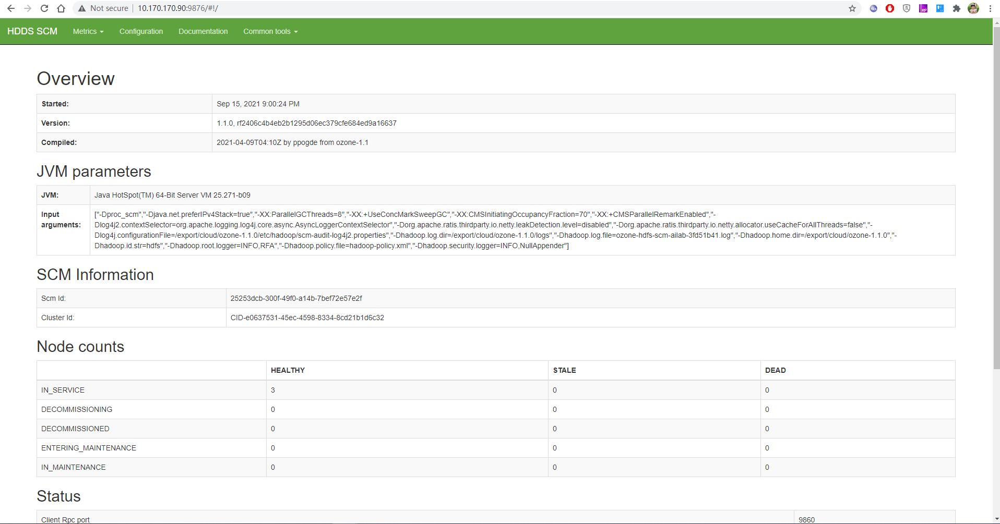

- om

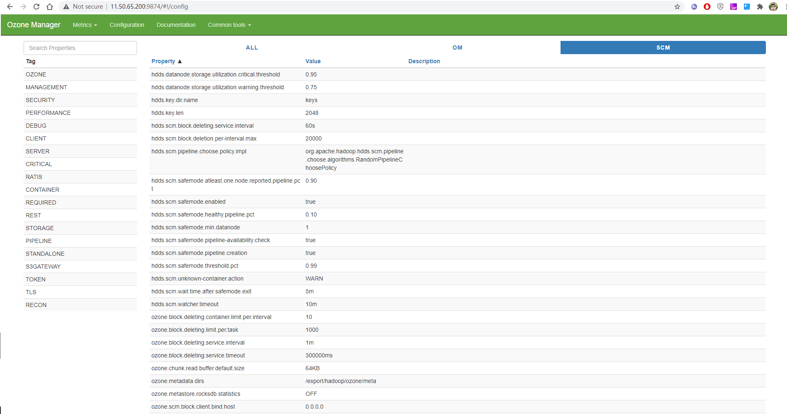

- s3g

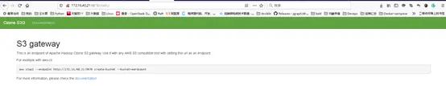

- recon

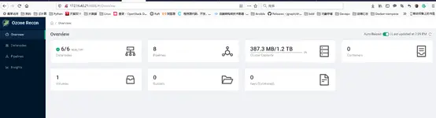

## 4.3.高可用部署

| Hostname | Ip           | Service           |
| :------- | :----------- | :---------------- |
| ozom-1   | 172.16.40.21 | OM、SCM、DataNode |
| ozom-2   | 172.16.40.22 | OM                |
| ozom-3   | 172.16.40.23 | OM                |
| ozdn-1   | 172.16.40.11 | DataNode          |
| ozdn-2   | 172.16.40.12 | DataNode          |
| ozdn-3   | 172.16.40.13 | DataNode          |

高可用目前只有OM服务支持HA，SCM尚不支持： 单点OM通过RocksDB来持久化元数据； 高可用模式底层通过 Ratis（实现了Raft协议） 扩展元数据的副本数来实现元数据的HA。

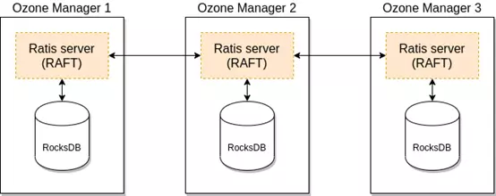

修改配置,开启OM的HA模式

```
    <property>
        <name>ozone.om.ratis.enable</name>
        <value>true</value>
    </property>
```

一个ozone-site.xml支持多个Ozone HA配置，为了在可用的HA集群之间进行选择，每个集群都需要一个逻辑名称，该名称可以解析为OM的IP地址（或域名）。

```
   <property>
       <name>ozone.om.service.ids</name>
       <value>cluster1,cluster2</value>
   </property>
```

此处只有一个集群，自定义一个集群名称**ozonecluster1**

```
    <property>
        <name>ozone.om.service.ids</name>
        <value>ozonecluster1</value>
    </property>
```

对于这个集群可以定义他的所有om，并对每个om的节点进行配置

```
    <property>
       <name>ozone.om.nodes.ozonecluster1</name>
       <value>om1,om2,om3</value>
    </property>

    <property>
       <name>ozone.om.address.ozonecluster1.om1</name>
       <value>ozom-1</value>
    </property>

    <property>
       <name>ozone.om.address.ozonecluster1.om2</name>
       <value>ozom-2</value>
    </property>

    <property>
       <name>ozone.om.address.ozonecluster1.om3</name>
       <value>ozom-3</value>
    </property>
```

在三个om节点上都启动om服务，但是必须得注意，高可用的om服务不能与datanode服务同处于同一个节点，因为2者都使用ratis会冲突。

```
$ ozone om --init
$ ozone --daemon start om
```