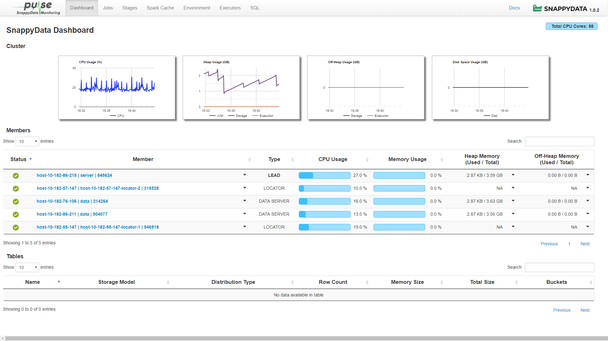
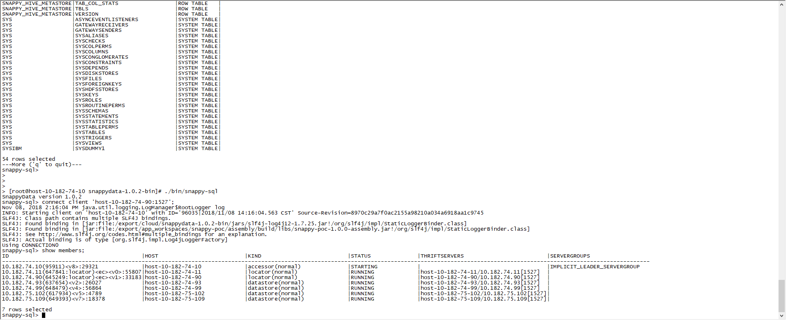

## Hosts

```ini
10.182.55.147	host-10-182-55-147
10.182.57.147	host-10-182-57-147
10.182.76.106	host-10-182-76-106
10.182.86.211	host-10-182-86-211
10.182.86.215	host-10-182-86-215
```


### Locators

- [x] host-10-182-55-147
- [x] host-10-182-57-147

```ini
host-10-182-55-147 -peer-discovery-port=9988 -locators=host-10-182-57-147:8899
host-10-182-57-147 -peer-discovery-port=8899 -locators=host-10-182-55-147:9988
```


### Leads

- [x] host-10-182-86-215

```ini
host-10-182-86-215   -dir=/export/snappydata/server -locators=host-10-182-57-147:8899,host-10-182-55-147:9988 -heap-size=8g
```


### Servers

- [x] host-10-182-76-106
- [x] host-10-182-86-211

```ini
host-10-182-76-106 -dir=/export/snappydata/data  -heap-size=4096m -memory-size=16g -locators=host-10-182-57-147:8899,host-10-182-55-147:9988
host-10-182-86-211 -dir=/export/snappydata/data  -heap-size=4096m -memory-size=16g -locators=host-10-182-57-147:8899,host-10-182-55-147:9988
```


## Start Components


### Locators

```shell
./sbin/snappy-locators.sh start
```


### Servers

```shell
./sbin/snappy-servers.sh start
```


### Leads

```shell
./sbin/snappy-leads.sh start./sb	
```


### Check Snappydata Status

```ini
./sbin/snappy-status-all.sh 

host-10-182-55-147: SnappyData Locator pid: 546918 status: running
host-10-182-57-147: SnappyData Locator pid: 315528 status: running
host-10-182-76-106: SnappyData Server pid: 214264 status: running
host-10-182-86-211: SnappyData Server pid: 504077 status: running
host-10-182-86-215: SnappyData Leader pid: 545624 status: running
```


## Managing and Monitoring

To access SnappyData Pulse, start your cluster and open **http://`{lead_host}`:5050/dashboard/ ** in the web browser.




## Using Snappydata Shell


```shell
snappy-sql> connect client 'host-10-182-74-90:1527';
Nov 08, 2018 2:16:04 PM java.util.logging.LogManager$RootLogger log
INFO: Starting client on 'host-10-182-74-10' with ID='96035|2018/11/08 14:16:04.563 CST' Source-Revision=8970c29a7f0ac2155a98210a034a6918aa1c9745
SLF4J: Class path contains multiple SLF4J bindings.
SLF4J: Found binding in [jar:file:/export/cloud/snappydata-1.0.2-bin/jars/slf4j-log4j12-1.7.25.jar!/org/slf4j/impl/StaticLoggerBinder.class]
SLF4J: Found binding in [jar:file:/export/app_workspaces/snappy-poc/assembly/build/libs/snappy-poc-1.0.0-assembly.jar!/org/slf4j/impl/StaticLoggerBinder.class]
SLF4J: See http://www.slf4j.org/codes.html#multiple_bindings for an explanation.
SLF4J: Actual binding is of type [org.slf4j.impl.Log4jLoggerFactory]
Using CONNECTION0
snappy-sql> show members;
ID                                        |HOST                          |KIND                          |STATUS              |THRIFTSERVERS                         |SERVERGROUPS                  
---------------------------------------------------------------------------------------------------------------------------------------------------------------------------------------------------
10.182.74.10(95911)<v8>:29321             |host-10-182-74-10             |accessor(normal)              |STARTING            |                                      |IMPLICIT_LEADER_SERVERGROUP   
10.182.74.11(647841:locator)<ec><v0>:55807|host-10-182-74-11             |locator(normal)               |RUNNING             |host-10-182-74-11/10.182.74.11[1527]  |                              
10.182.74.90(645249:locator)<ec><v1>:33183|host-10-182-74-90             |locator(normal)               |RUNNING             |host-10-182-74-90/10.182.74.90[1527]  |                              
10.182.74.93(637654)<v2>:26027            |host-10-182-74-93             |datastore(normal)             |RUNNING             |host-10-182-74-93/10.182.74.93[1527]  |                              
10.182.74.99(648479)<v4>:56864            |host-10-182-74-99             |datastore(normal)             |RUNNING             |host-10-182-74-99/10.182.74.99[1527]  |                              
10.182.75.102(617934)<v5>:4789            |host-10-182-75-102            |datastore(normal)             |RUNNING             |host-10-182-75-102/10.182.75.102[1527]|                              
10.182.75.109(649393)<v7>:18378           |host-10-182-75-109            |datastore(normal)             |RUNNING             |host-10-182-75-109/10.182.75.109[1527]|  
```


