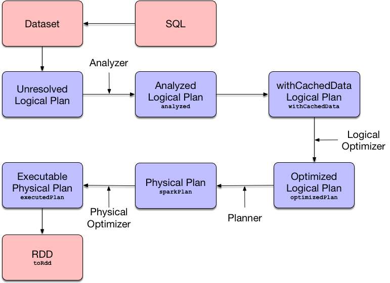

## QueryExecution — Structured Query Execution Pipeline

`QueryExecution` represents the [execution pipeline](https://jaceklaskowski.gitbooks.io/mastering-spark-sql/spark-sql-QueryExecution.html#execution-pipeline) of a structured query (as a [Dataset](https://jaceklaskowski.gitbooks.io/mastering-spark-sql/spark-sql-Dataset.html)) with execution stages (phases).



Figure 1. Query Execution — From SQL through Dataset to RDD

| Note | When you execute an operator on a `Dataset` it triggers [query execution](https://jaceklaskowski.gitbooks.io/mastering-spark-sql/spark-sql-QueryExecution.html#toRdd) that gives the good ol' `RDD` of [internal binary rows](https://jaceklaskowski.gitbooks.io/mastering-spark-sql/spark-sql-InternalRow.html), i.e. `RDD[InternalRow]`, that is Spark’s execution plan followed by executing an RDD action and so the result of the structured query. |
| ---- | ------------------------------------------------------------ |
|      |                                                              |

You can access the `QueryExecution` of a `Dataset` using [queryExecution](https://jaceklaskowski.gitbooks.io/mastering-spark-sql/spark-sql-Dataset.html#queryExecution) attribute.

```scala
val ds: Dataset[Long] = ...
val queryExec = ds.queryExecution
```

`QueryExecution` is the result of [executing a LogicalPlan in a SparkSession](https://jaceklaskowski.gitbooks.io/mastering-spark-sql/spark-sql-SessionState.html#executePlan) (and so you could create a `Dataset` from a [logical operator](https://jaceklaskowski.gitbooks.io/mastering-spark-sql/spark-sql-LogicalPlan.html) or use the `QueryExecution` after executing a logical operator).

```scala
val plan: LogicalPlan = ...
val qe = new QueryExecution(sparkSession, plan)
```

| Attribute / Phase | Description                                                  |
| ----------------- | ------------------------------------------------------------ |
| `analyzed`        | Analyzed [logical plan](https://jaceklaskowski.gitbooks.io/mastering-spark-sql/spark-sql-QueryExecution.html#logical) that has passed [Analyzer](https://jaceklaskowski.gitbooks.io/mastering-spark-sql/spark-sql-Analyzer.html#execute)'s check rules.TipBeside `analyzed`, you can use [Dataset.explain](https://jaceklaskowski.gitbooks.io/mastering-spark-sql/spark-sql-dataset-operators.html#explain) basic action (with `extended` flag enabled) or SQL’s `EXPLAIN EXTENDED` to see the analyzed logical plan of a structured query. |
| `withCachedData`  | [analyzed](https://jaceklaskowski.gitbooks.io/mastering-spark-sql/spark-sql-QueryExecution.html#analyzed) logical plan after `CacheManager` was requested to [replace logical query segments with cached query plans](https://jaceklaskowski.gitbooks.io/mastering-spark-sql/spark-sql-CacheManager.html#useCachedData).`withCachedData` makes sure that the logical plan [can be analyzed](https://jaceklaskowski.gitbooks.io/mastering-spark-sql/spark-sql-QueryExecution.html#assertAnalyzed) and [uses supported operations only](https://jaceklaskowski.gitbooks.io/mastering-spark-sql/spark-sql-QueryExecution.html#assertSupported). |
| `optimizedPlan`   | Optimized [logical plan](https://jaceklaskowski.gitbooks.io/mastering-spark-sql/spark-sql-LogicalPlan.html) that is the result of executing the [logical query plan optimizer](https://jaceklaskowski.gitbooks.io/mastering-spark-sql/spark-sql-SessionState.html#optimizer) on the [withCachedData](https://jaceklaskowski.gitbooks.io/mastering-spark-sql/spark-sql-QueryExecution.html#withCachedData) logical plan. |
| `sparkPlan`       | [Physical plan](https://jaceklaskowski.gitbooks.io/mastering-spark-sql/spark-sql-SparkPlan.html) (after [SparkPlanner](https://jaceklaskowski.gitbooks.io/mastering-spark-sql/spark-sql-SparkPlanner.html) has planned the [optimized logical plan](https://jaceklaskowski.gitbooks.io/mastering-spark-sql/spark-sql-QueryExecution.html#optimizedPlan)).Note`sparkPlan` is the first physical plan from the collection of all possible physical plans.NoteIt is guaranteed that Catalyst’s `QueryPlanner` (which `SparkPlanner` extends) [will always generate at least one physical plan](https://jaceklaskowski.gitbooks.io/mastering-spark-sql/spark-sql-catalyst-QueryPlanner.html#plan). |
| `executedPlan`    | Optimized [physical query plan](https://jaceklaskowski.gitbooks.io/mastering-spark-sql/spark-sql-SparkPlan.html) that is in the final optimized "shape" and therefore ready for execution, i.e. the [physical sparkPlan](https://jaceklaskowski.gitbooks.io/mastering-spark-sql/spark-sql-QueryExecution.html#sparkPlan) with [physical preparation rules applied](https://jaceklaskowski.gitbooks.io/mastering-spark-sql/spark-sql-QueryExecution.html#prepareForExecution).NoteAmongst the physical optimization rules that `executedPlan`phase triggers is the [CollapseCodegenStages](https://jaceklaskowski.gitbooks.io/mastering-spark-sql/spark-sql-CollapseCodegenStages.html) physical preparation rule that collapses physical operators that support code generation together as a [WholeStageCodegenExec](https://jaceklaskowski.gitbooks.io/mastering-spark-sql/spark-sql-SparkPlan-WholeStageCodegenExec.html)operator.Note`executedPlan` physical plan is used when:[Dataset.explain](https://jaceklaskowski.gitbooks.io/mastering-spark-sql/spark-sql-dataset-operators.html#explain) operator is used to show the logical and physical query plans of a structured query[Dataset.localCheckpoint](https://jaceklaskowski.gitbooks.io/mastering-spark-sql/spark-sql-dataset-operators.html#localCheckpoint) and [Dataset.checkpoint](https://jaceklaskowski.gitbooks.io/mastering-spark-sql/spark-sql-dataset-operators.html#checkpoint)operators are used (through [checkpoint](https://jaceklaskowski.gitbooks.io/mastering-spark-sql/spark-sql-Dataset-basic-actions.html#checkpoint-internal))[Dataset.foreach](https://jaceklaskowski.gitbooks.io/mastering-spark-sql/spark-sql-dataset-operators.html#foreach) and [Dataset.foreachPartition](https://jaceklaskowski.gitbooks.io/mastering-spark-sql/spark-sql-dataset-operators.html#foreachPartition) actions are used (through [withNewRDDExecutionId](https://jaceklaskowski.gitbooks.io/mastering-spark-sql/spark-sql-Dataset.html#withNewRDDExecutionId))`Dataset` is requested to [execute an action under a new execution ID](https://jaceklaskowski.gitbooks.io/mastering-spark-sql/spark-sql-Dataset.html#withAction) (e.g. for the Dataset operators: [collect](https://jaceklaskowski.gitbooks.io/mastering-spark-sql/spark-sql-dataset-operators.html#collect), [count](https://jaceklaskowski.gitbooks.io/mastering-spark-sql/spark-sql-dataset-operators.html#count), [head](https://jaceklaskowski.gitbooks.io/mastering-spark-sql/spark-sql-dataset-operators.html#head) and [toLocalIterator](https://jaceklaskowski.gitbooks.io/mastering-spark-sql/spark-sql-dataset-operators.html#toLocalIterator))`CacheManager` is requested to [cacheQuery](https://jaceklaskowski.gitbooks.io/mastering-spark-sql/spark-sql-CacheManager.html#cacheQuery) (e.g. for [Dataset.persist](https://jaceklaskowski.gitbooks.io/mastering-spark-sql/spark-sql-dataset-operators.html#persist) basic action) or [recacheByCondition](https://jaceklaskowski.gitbooks.io/mastering-spark-sql/spark-sql-CacheManager.html#recacheByCondition)`QueryExecution` is requested for the `RDD[InternalRow]`of a structured query (in the [toRdd](https://jaceklaskowski.gitbooks.io/mastering-spark-sql/spark-sql-QueryExecution.html#toRdd) query execution phase), [simpleString](https://jaceklaskowski.gitbooks.io/mastering-spark-sql/spark-sql-QueryExecution.html#simpleString), [toString](https://jaceklaskowski.gitbooks.io/mastering-spark-sql/spark-sql-QueryExecution.html#toString), [stringWithStats](https://jaceklaskowski.gitbooks.io/mastering-spark-sql/spark-sql-QueryExecution.html#stringWithStats), [codegenToSeq](https://jaceklaskowski.gitbooks.io/mastering-spark-sql/spark-sql-debugging-query-execution.html#codegenToSeq), and the [Hive-compatible output format](https://jaceklaskowski.gitbooks.io/mastering-spark-sql/spark-sql-QueryExecution.html#hiveResultString)`SQLExecution` is requested to [execute a Dataset action under a new execution id](https://jaceklaskowski.gitbooks.io/mastering-spark-sql/spark-sql-SQLExecution.html#withNewExecutionId)`PlanSubqueries` physical query optimization is [executed](https://jaceklaskowski.gitbooks.io/mastering-spark-sql/spark-sql-PlanSubqueries.html#apply)[AnalyzeColumnCommand](https://jaceklaskowski.gitbooks.io/mastering-spark-sql/spark-sql-LogicalPlan-AnalyzeColumnCommand.html) and [ExplainCommand](https://jaceklaskowski.gitbooks.io/mastering-spark-sql/spark-sql-LogicalPlan-ExplainCommand.html) logical commands are executed`DebugQuery` is requested for `debug` and `debugCodegen` |
| `toRdd`           | `RDD` of [internal binary rows](https://jaceklaskowski.gitbooks.io/mastering-spark-sql/spark-sql-InternalRow.html) (i.e. `RDD[InternalRow]`) after [executing](https://jaceklaskowski.gitbooks.io/mastering-spark-sql/spark-sql-SparkPlan.html#execute) the [executedPlan](https://jaceklaskowski.gitbooks.io/mastering-spark-sql/spark-sql-QueryExecution.html#executedPlan).The `RDD` is the top-level RDD of the DAG of RDDs (that represent physical operators).Note`toRdd` is a "boundary" between two Spark modules: Spark SQL and Spark Core.After you have executed `toRdd` (directly or not), you basically "leave" Spark SQL’s Dataset world and "enter" Spark Core’s RDD space.`toRdd` triggers a structured query execution (i.e. physical planning, but not execution of the plan) using [SparkPlan.execute](https://jaceklaskowski.gitbooks.io/mastering-spark-sql/spark-sql-SparkPlan.html#execute) that recursively triggers execution of every child physical operator in the physical plan tree.NoteYou can use [SparkSession.internalCreateDataFrame](https://jaceklaskowski.gitbooks.io/mastering-spark-sql/spark-sql-SparkSession.html#internalCreateDataFrame) to apply a [schema](https://jaceklaskowski.gitbooks.io/mastering-spark-sql/spark-sql-StructType.html) to an `RDD[InternalRow]`.NoteUse [Dataset.rdd](https://jaceklaskowski.gitbooks.io/mastering-spark-sql/spark-sql-dataset-operators.html#rdd) to access the `RDD[InternalRow]` with internal binary rows deserialized to a Scala type. |

You can access the lazy attributes as follows:

```scala
val dataset: Dataset[Long] = ...
dataset.queryExecution.executedPlan
```

`QueryExecution` uses the [Catalyst Query Optimizer](https://jaceklaskowski.gitbooks.io/mastering-spark-sql/spark-sql-Optimizer.html) and [Tungsten](https://jaceklaskowski.gitbooks.io/mastering-spark-sql/spark-sql-tungsten.html) for better structured query performance.

| Name      | Description                                                  |
| --------- | ------------------------------------------------------------ |
| `planner` | [SparkPlanner](https://jaceklaskowski.gitbooks.io/mastering-spark-sql/spark-sql-SparkPlanner.html) |

`QueryExecution` uses the input `SparkSession` to access the current [SparkPlanner](https://jaceklaskowski.gitbooks.io/mastering-spark-sql/spark-sql-SparkPlanner.html) (through [SessionState](https://jaceklaskowski.gitbooks.io/mastering-spark-sql/spark-sql-SessionState.html)) when [it is created](https://jaceklaskowski.gitbooks.io/mastering-spark-sql/spark-sql-QueryExecution.html#creating-instance). It then computes a [SparkPlan](https://jaceklaskowski.gitbooks.io/mastering-spark-sql/spark-sql-SparkPlan.html) (a `PhysicalPlan` exactly) using the planner. It is available as the [`sparkPlan` attribute](https://jaceklaskowski.gitbooks.io/mastering-spark-sql/spark-sql-QueryExecution.html#sparkPlan).

| Note | A variant of `QueryExecution` that Spark Structured Streaming uses for query planning is `IncrementalExecution`.Refer to [IncrementalExecution — QueryExecution of Streaming Datasets](https://jaceklaskowski.gitbooks.io/spark-structured-streaming/spark-sql-streaming-IncrementalExecution.html) in the Spark Structured Streaming gitbook. |
| ---- | ------------------------------------------------------------ |
|      |                                                              |

| Tip  | Use [explain](https://jaceklaskowski.gitbooks.io/mastering-spark-sql/spark-sql-dataset-operators.html#explain) operator to know about the logical and physical plans of a `Dataset`. |
| ---- | ------------------------------------------------------------ |
|      |                                                              |

```scala
val ds = spark.range(5)
scala> ds.queryExecution
res17: org.apache.spark.sql.execution.QueryExecution =
== Parsed Logical Plan ==
Range 0, 5, 1, 8, [id#39L]

== Analyzed Logical Plan ==
id: bigint
Range 0, 5, 1, 8, [id#39L]

== Optimized Logical Plan ==
Range 0, 5, 1, 8, [id#39L]

== Physical Plan ==
WholeStageCodegen
:  +- Range 0, 1, 8, 5, [id#39L]
```

| Note | `QueryExecution` belongs to `org.apache.spark.sql.execution` package. |
| ---- | ------------------------------------------------------------ |
|      |                                                              |

| Note | `QueryExecution` is a transient feature of a [Dataset](https://jaceklaskowski.gitbooks.io/mastering-spark-sql/spark-sql-Dataset.html), i.e. it is not preserved across serializations. |
| ---- | ------------------------------------------------------------ |
|      |                                                              |

### Text Representation With Statistics — `stringWithStats` Method

```scala
stringWithStats: String
```

`stringWithStats`…FIXME

| Note | `stringWithStats` is used exclusively when `ExplainCommand` logical command is [executed](https://jaceklaskowski.gitbooks.io/mastering-spark-sql/spark-sql-LogicalPlan-ExplainCommand.html#run)(with `cost` flag enabled). |
| ---- | ------------------------------------------------------------ |
|      |                                                              |

### debug Object

| Caution | FIXME |
| ------- | ----- |
|         |       |

### Building Complete Text Representation — `completeString` Internal Method

| Caution | FIXME |
| ------- | ----- |
|         |       |

### Creating QueryExecution Instance

`QueryExecution` takes the following when created:

- [SparkSession](https://jaceklaskowski.gitbooks.io/mastering-spark-sql/spark-sql-SparkSession.html)
- [Logical plan](https://jaceklaskowski.gitbooks.io/mastering-spark-sql/spark-sql-LogicalPlan.html)

### Physical Query Optimizations (Physical Plan Preparation Rules) — `preparations` Method

```scala
preparations: Seq[Rule[SparkPlan]]
```

`preparations` is the set of the physical query optimization rules that transform a [physical query plan](https://jaceklaskowski.gitbooks.io/mastering-spark-sql/spark-sql-SparkPlan.html) to be more efficient and optimized for execution (i.e. `Rule[SparkPlan]`).

The `preparations` physical query optimizations are applied sequentially (one by one) to a physical plan in the following order:

1. [ExtractPythonUDFs](https://jaceklaskowski.gitbooks.io/mastering-spark-sql/spark-sql-ExtractPythonUDFs.html)
2. [PlanSubqueries](https://jaceklaskowski.gitbooks.io/mastering-spark-sql/spark-sql-PlanSubqueries.html)
3. [EnsureRequirements](https://jaceklaskowski.gitbooks.io/mastering-spark-sql/spark-sql-EnsureRequirements.html)
4. [CollapseCodegenStages](https://jaceklaskowski.gitbooks.io/mastering-spark-sql/spark-sql-CollapseCodegenStages.html)
5. [ReuseExchange](https://jaceklaskowski.gitbooks.io/mastering-spark-sql/spark-sql-ReuseExchange.html)
6. [ReuseSubquery](https://jaceklaskowski.gitbooks.io/mastering-spark-sql/spark-sql-ReuseSubquery.html)

| Note | `preparations` rules are used when:`QueryExecution` is requested for the [executedPlan](https://jaceklaskowski.gitbooks.io/mastering-spark-sql/spark-sql-QueryExecution.html#executedPlan) physical plan (through [prepareForExecution](https://jaceklaskowski.gitbooks.io/mastering-spark-sql/spark-sql-QueryExecution.html#prepareForExecution))(Spark Structured Streaming) `IncrementalExecution` is requested for the physical optimization rules for streaming structured queries |
| ---- | ------------------------------------------------------------ |
|      |                                                              |

### Applying preparations Physical Query Optimization Rules to Physical Plan — `prepareForExecution` Method

```scala
prepareForExecution(plan: SparkPlan): SparkPlan
```

`prepareForExecution` takes [physical preparation rules](https://jaceklaskowski.gitbooks.io/mastering-spark-sql/spark-sql-QueryExecution.html#preparations) and applies them one by one to the input physical `plan`.

| Note | `prepareForExecution` is used exclusively when `QueryExecution` is requested to [prepare the physical plan for execution](https://jaceklaskowski.gitbooks.io/mastering-spark-sql/spark-sql-QueryExecution.html#executedPlan). |
| ---- | ------------------------------------------------------------ |
|      |                                                              |

### `assertSupported` Method

```scala
assertSupported(): Unit
```

`assertSupported` requests `UnsupportedOperationChecker` to [checkForBatch](https://jaceklaskowski.gitbooks.io/mastering-spark-sql/spark-sql-UnsupportedOperationChecker.html#checkForBatch) when…FIXME

| Note | `assertSupported` is used exclusively when `QueryExecution` is requested for [withCachedData](https://jaceklaskowski.gitbooks.io/mastering-spark-sql/spark-sql-QueryExecution.html#withCachedData) logical plan. |
| ---- | ------------------------------------------------------------ |
|      |                                                              |

### Creating Analyzed Logical Plan and Checking Correctness — `assertAnalyzed` Method

```scala
assertAnalyzed(): Unit
```

`assertAnalyzed` triggers initialization of [analyzed](https://jaceklaskowski.gitbooks.io/mastering-spark-sql/spark-sql-QueryExecution.html#analyzed) (which is almost like executing it).

| Note | `assertAnalyzed` executes [analyzed](https://jaceklaskowski.gitbooks.io/mastering-spark-sql/spark-sql-QueryExecution.html#analyzed) by accessing it and throwing the result away. Since `analyzed` is a lazy value in Scala, it will then get initialized for the first time and stays so forever. |
| ---- | ------------------------------------------------------------ |
|      |                                                              |

`assertAnalyzed` then requests `Analyzer` to [validate analysis of the logical plan](https://jaceklaskowski.gitbooks.io/mastering-spark-sql/spark-sql-Analyzer-CheckAnalysis.html#checkAnalysis) (i.e. `analyzed`).

| Note | `assertAnalyzed` uses [SparkSession](https://jaceklaskowski.gitbooks.io/mastering-spark-sql/spark-sql-QueryExecution.html#sparkSession) to [access the current `SessionState`](https://jaceklaskowski.gitbooks.io/mastering-spark-sql/spark-sql-SparkSession.html#sessionState) that it then uses to [access the `Analyzer`](https://jaceklaskowski.gitbooks.io/mastering-spark-sql/spark-sql-SessionState.html#analyzer).In Scala the access path looks as follows.`sparkSession.sessionState.analyzer` |
| ---- | ------------------------------------------------------------ |
|      |                                                              |

In case of any `AnalysisException`, `assertAnalyzed` creates a new `AnalysisException` to make sure that it holds [analyzed](https://jaceklaskowski.gitbooks.io/mastering-spark-sql/spark-sql-QueryExecution.html#analyzed) and reports it.

| Note | `assertAnalyzed` is used when:`Dataset` [is created](https://jaceklaskowski.gitbooks.io/mastering-spark-sql/spark-sql-Dataset.html#creating-instance)`QueryExecution` [is requested for `LogicalPlan` with cached data](https://jaceklaskowski.gitbooks.io/mastering-spark-sql/spark-sql-QueryExecution.html#withCachedData)[CreateViewCommand](https://jaceklaskowski.gitbooks.io/mastering-spark-sql/spark-sql-LogicalPlan-CreateViewCommand.html#run) and [AlterViewAsCommand](https://jaceklaskowski.gitbooks.io/mastering-spark-sql/spark-sql-LogicalPlan-AlterViewAsCommand.html#run) are executed |
| ---- | ------------------------------------------------------------ |
|      |                                                              |

### Building Text Representation with Cost Stats — `toStringWithStats` Method

```scala
toStringWithStats: String
```

`toStringWithStats` is a mere alias for [completeString](https://jaceklaskowski.gitbooks.io/mastering-spark-sql/spark-sql-QueryExecution.html#completeString) with `appendStats` flag enabled.

| Note | `toStringWithStats` is a custom [toString](https://jaceklaskowski.gitbooks.io/mastering-spark-sql/spark-sql-QueryExecution.html#toString) with [cost statistics](https://jaceklaskowski.gitbooks.io/mastering-spark-sql/spark-sql-Statistics.html). |
| ---- | ------------------------------------------------------------ |
|      |                                                              |

```scala
// test dataset
val dataset = spark.range(20).limit(2)

// toStringWithStats in action - note Optimized Logical Plan section with Statistics
scala> dataset.queryExecution.toStringWithStats
res6: String =
== Parsed Logical Plan ==
GlobalLimit 2
+- LocalLimit 2
   +- Range (0, 20, step=1, splits=Some(8))

== Analyzed Logical Plan ==
id: bigint
GlobalLimit 2
+- LocalLimit 2
   +- Range (0, 20, step=1, splits=Some(8))

== Optimized Logical Plan ==
GlobalLimit 2, Statistics(sizeInBytes=32.0 B, rowCount=2, isBroadcastable=false)
+- LocalLimit 2, Statistics(sizeInBytes=160.0 B, isBroadcastable=false)
   +- Range (0, 20, step=1, splits=Some(8)), Statistics(sizeInBytes=160.0 B, isBroadcastable=false)

== Physical Plan ==
CollectLimit 2
+- *Range (0, 20, step=1, splits=Some(8))
```

| Note | `toStringWithStats` is used exclusively when `ExplainCommand` [is executed](https://jaceklaskowski.gitbooks.io/mastering-spark-sql/spark-sql-LogicalPlan-ExplainCommand.html#run) (only when `cost`attribute is enabled). |
| ---- | ------------------------------------------------------------ |
|      |                                                              |

### Transforming SparkPlan Execution Result to Hive-Compatible Output Format — `hiveResultString` Method

```scala
hiveResultString(): Seq[String]
```

`hiveResultString` returns the result as a Hive-compatible output format.

```scala
scala> spark.range(5).queryExecution.hiveResultString
res0: Seq[String] = ArrayBuffer(0, 1, 2, 3, 4)

scala> spark.read.csv("people.csv").queryExecution.hiveResultString
res4: Seq[String] = ArrayBuffer(id	name	age, 0	Jacek	42)
```

Internally, `hiveResultString` [transformation](https://jaceklaskowski.gitbooks.io/mastering-spark-sql/spark-sql-QueryExecution.html#hiveResultString-transformations) the [SparkPlan](https://jaceklaskowski.gitbooks.io/mastering-spark-sql/spark-sql-QueryExecution.html#executedPlan).

| SparkPlan                                                    | Description                                                  |
| ------------------------------------------------------------ | ------------------------------------------------------------ |
| [ExecutedCommandExec](https://jaceklaskowski.gitbooks.io/mastering-spark-sql/spark-sql-SparkPlan-ExecutedCommandExec.html) for [DescribeTableCommand](https://jaceklaskowski.gitbooks.io/mastering-spark-sql/spark-sql-LogicalPlan-DescribeTableCommand.html) | Executes `DescribeTableCommand` and transforms every [Row](https://jaceklaskowski.gitbooks.io/mastering-spark-sql/spark-sql-Row.html) to a Hive-compatible output format. |
| [ExecutedCommandExec](https://jaceklaskowski.gitbooks.io/mastering-spark-sql/spark-sql-SparkPlan-ExecutedCommandExec.html) for [ShowTablesCommand](https://jaceklaskowski.gitbooks.io/mastering-spark-sql/spark-sql-LogicalPlan-ShowTablesCommand.html) | Executes `ExecutedCommandExec` and transforms the result to a collection of table names. |
| Any other [SparkPlan](https://jaceklaskowski.gitbooks.io/mastering-spark-sql/spark-sql-SparkPlan.html) | Executes `SparkPlan` and transforms the result to a Hive-compatible output format. |

| Note | `hiveResultString` is used exclusively when `SparkSQLDriver` (of ThriftServer) runs a command. |
| ---- | ------------------------------------------------------------ |
|      |                                                              |

### Extended Text Representation with Logical and Physical Plans — `toString` Method

```scala
toString: String
```

| Note | `toString` is part of Java’s `Object` Contract to…FIXME. |
| ---- | -------------------------------------------------------- |
|      |                                                          |

`toString` is a mere alias for [completeString](https://jaceklaskowski.gitbooks.io/mastering-spark-sql/spark-sql-QueryExecution.html#completeString) with `appendStats` flag disabled.

| Note | `toString` is on the "other" side of [toStringWithStats](https://jaceklaskowski.gitbooks.io/mastering-spark-sql/spark-sql-QueryExecution.html#toStringWithStats) which has `appendStats` flag enabled. |
| ---- | ------------------------------------------------------------ |
|      |                                                              |

### Simple (Basic) Text Representation — `simpleString` Method

```scala
simpleString: String
```

`simpleString` requests the [optimized SparkPlan](https://jaceklaskowski.gitbooks.io/mastering-spark-sql/spark-sql-QueryExecution.html#executedPlan) for the [text representation](https://jaceklaskowski.gitbooks.io/mastering-spark-sql/spark-sql-catalyst-TreeNode.html#treeString) (of all nodes in the query tree) with `verbose` flag turned off.

In the end, `simpleString` adds **== Physical Plan ==** header to the text representation and [redacts sensitive information](https://jaceklaskowski.gitbooks.io/mastering-spark-sql/spark-sql-QueryExecution.html#withRedaction).

```scala
import org.apache.spark.sql.{functions => f}
val q = spark.range(10).withColumn("rand", f.rand())
val output = q.queryExecution.simpleString

scala> println(output)
== Physical Plan ==
*(1) Project [id#5L, rand(6017561978775952851) AS rand#7]
+- *(1) Range (0, 10, step=1, splits=8)
```

| Note | `simpleString` is used when:`ExplainCommand` is [executed](https://jaceklaskowski.gitbooks.io/mastering-spark-sql/spark-sql-LogicalPlan-ExplainCommand.html#run)Spark Structured Streaming’s `StreamingExplainCommand` is executed |
| ---- | ------------------------------------------------------------ |
|      |                                                              |

### Redacting Sensitive Information — `withRedaction` Internal Method

```scala
withRedaction(message: String): String
```

`withRedaction` takes the value of [spark.sql.redaction.string.regex](https://jaceklaskowski.gitbooks.io/mastering-spark-sql/spark-sql-properties.html#spark.sql.redaction.string.regex) configuration property (as the regular expression to point at sensitive information) and requests Spark Core’s `Utils` to redact sensitive information in the input `message`.

| Note | Internally, Spark Core’s `Utils.redact` uses Java’s `Regex.replaceAllIn` to replace all matches of a pattern with a string. |
| ---- | ------------------------------------------------------------ |
|      |                                                              |

| Note | `withRedaction` is used when `QueryExecution` is requested for the [simple](https://jaceklaskowski.gitbooks.io/mastering-spark-sql/spark-sql-QueryExecution.html#simpleString), [extended](https://jaceklaskowski.gitbooks.io/mastering-spark-sql/spark-sql-QueryExecution.html#toString) and [with statistics](https://jaceklaskowski.gitbooks.io/mastering-spark-sql/spark-sql-QueryExecution.html#stringWithStats) text representations. |
| ---- | ------------------------------------------------------------ |
|      |                                                              |