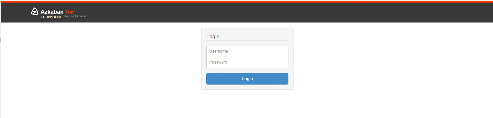
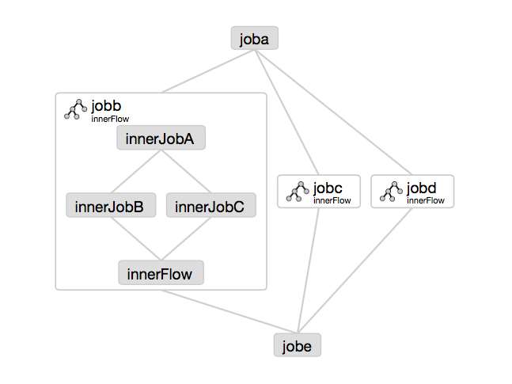
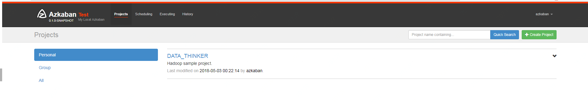
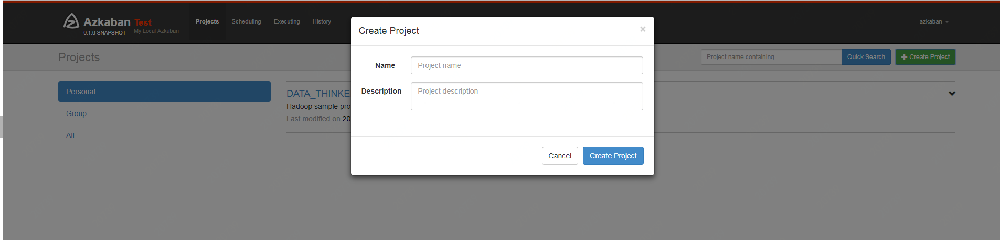
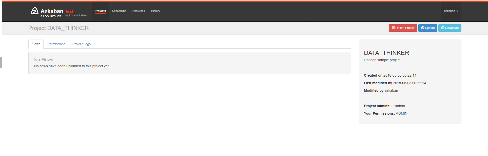

azkaban2overviewdesign.png


# Overview

Azkaban was implemented at LinkedIn to solve the problem of Hadoop job dependencies. We had jobs that needed to run in order, from ETL jobs to data analytics products.

Initially a single server solution, with the increased number of Hadoop users over the years, Azkaban has evolved to be a more robust solution.

Azkaban consists of 3 key components:

- Relational Database (MySQL)
- AzkabanWebServer
- AzkabanExecutorServer


### Relational Database (MySQL)

Azkaban uses MySQL to store much of its state. Both the AzkabanWebServer and the AzkabanExecutorServer access the DB.

#### How does AzkabanWebServer use the DB?

The web server uses the db for the following reasons:

- **Project Management** - The projects, the permissions on the projects as well as the uploaded files.
- **Executing Flow State** - Keep track of executing flows and which Executor is running them.
- **Previous Flow/Jobs** - Search through previous executions of jobs and flows as well as access their log files.
- **Scheduler** - Keeps the state of the scheduled jobs.
- **SLA** - Keeps all the sla rules

#### How does the AzkabanExecutorServer use the DB?

The executor server uses the db for the following reasons:

- **Access the project** - Retrieves project files from the db.
- **Executing Flows/Jobs** - Retrieves and updates data for flows and that are executing
- **Logs** - Stores the output logs for jobs and flows into the db.
- **Interflow dependency** - If a flow is running on a different executor, it will take state from the DB.

There is no reason why MySQL was chosen except that it is a widely used DB. We are looking to implement compatibility with other DB's, although the search requirement on historically running jobs benefits from a relational data store.

### AzkabanWebServer

The AzkabanWebServer is the main manager to all of Azkaban. It handles project management, authentication, scheduler, and monitoring of executions. It also serves as the web user interface.

Using Azkaban is easy. Azkaban uses `*.job` key-value property files to define individual tasks in a work flow, and the _dependencies_ property to define the dependency chain of the jobs. These job files and associated code can be archived into a `*.zip` and uploaded through the web server through the Azkaban UI or through curl.

### AzkabanExecutorServer

Previous versions of Azkaban had both the AzkabanWebServer and the AzkabanExecutorServer features in a single server. The Executor has since been separated into its own server. There were several reasons for splitting these services: we will soon be able to scale the number of executions and fall back on operating Executors if one fails. Also, we are able to roll our upgrades of Azkaban with minimal impact on the users. As Azkaban's usage grew, we found that upgrading Azkaban became increasingly more difficult as all times of the day became 'peak'.

# Getting Started

In version 3.0 we provide three modes: the stand alone "solo-server" mode, the heavier weight two server mode and distributed multiple-executor mode. The following describes the differences between the two modes.

In **solo server mode**, the DB is embedded H2 and both web server and executor server run in the same process. This should be useful if one just wants to try things out. It can also be used on small scale use cases.

1. [Download and Install Solo Server Package](http://azkaban.github.io/azkaban/docs/latest/#solo-setup)
2. [Install Azkaban Plugins](http://azkaban.github.io/azkaban/docs/latest/#plugin-setup)

The **two server mode** is for more serious production environment. Its DB should be backed by MySQL instances with master-slave set up. The web server and executor server should run in different processes so that upgrading and maintenance shouldn't affect users.

1. [Set up the database](http://azkaban.github.io/azkaban/docs/latest/#database-setup)
2. [Download and install the Web Server](http://azkaban.github.io/azkaban/docs/latest/#webserver-setup)
3. [Download and install the Executor Server](http://azkaban.github.io/azkaban/docs/latest/#executor-setup)
4. [Install Azkaban Plugins](http://azkaban.github.io/azkaban/docs/latest/#plugin-setup)

The **multiple executor mode** is for most serious production environment. Its DB should be backed by MySQL instances with master-slave set up. The web server and executor servers should ideally run in different hosts so that upgrading and maintenance shouldn't affect users. This multiple host setup brings in robust and scalable aspect to Azkaban.

1. [Set up the database](http://azkaban.github.io/azkaban/docs/latest/#database-setup)
2. [Download and install the Web Server](http://azkaban.github.io/azkaban/docs/latest/#webserver-setup)
3. [Configure database to use multiple executors](http://azkaban.github.io/azkaban/docs/latest/#multipleExecutors-config)
4. [Download and install the Executor Server for each executor configured in database](http://azkaban.github.io/azkaban/docs/latest/#executor-setup)
5. [Install Azkaban Plugins](http://azkaban.github.io/azkaban/docs/latest/#plugin-setup)

Below are instructions on how to set Azkaban up.

------

## Building from Source

Azkaban builds use [Gradle](https://gradle.org/) (downloads automatically when run using `gradlew` which is the Gradle wrapper) and requires Java 8 or higher.

The following commands run on *nix platforms like Linux, OS X.

```
  # Build Azkaban
  ./gradlew build

  # Clean the build
  ./gradlew clean

  # Build and install distributions
  ./gradlew installDist

  # Run tests
  ./gradlew test

  # Build without running tests
  ./gradlew build -x test
```

These are all standard Gradle commands. Please look at [Gradle documentation](https://gradle.org/documentation/) for more info.

 

```
.tar.gz
```

 

 

```
./azkaban-solo-server/build/distributions/azkaban-solo-server-0.1.0-SNAPSHOT.tar.gz
```

 

```
tar -xvzf path/to/azkaban-*.tar.gz
```

------

## Getting started with the Solo Server

The solo server is a standalone instance of Azkaban and the simplest to get started with. The solo server has the following advantages.

- **Easy to install** - No MySQL instance is needed. It packages H2 as its main persistence storage.
- **Easy to start up** - Both web server and executor server run in the same process.
- **Full featured** - It packages all Azkaban features. You can use it in normal ways and install plugins for it.

### Installing the Solo Server

1. **Clone the repo:** run `git clone https://github.com/azkaban/azkaban.git`
2. **Build Azkaban and create an installation:** run `cd azkaban; ./gradlew build installDist`
3. **Start the server:** run `cd azkaban-solo-server/build/install/azkaban-solo-server; bin/azkaban-solo-start.sh`
4. **Stop server:** run `bin/azkaban-solo-shutdown.sh` from within the azkaban-solo-server installation directory

Also see [building from source](http://azkaban.github.io/azkaban/docs/latest/#building-from-source).

The solo-server installation should contain the following directories.

| Folder  | Description                                                  |
| ------- | ------------------------------------------------------------ |
| bin     | The scripts to start/stop Azkaban jetty server               |
| conf    | The configuration files for Azkaban solo server              |
| lib     | The jar dependencies for Azkaban                             |
| extlib  | Additional jars that are added to extlib will be added to Azkaban's classpath |
| plugins | the directory where plugins can be installed                 |
| web     | The web (css, javascript, image) files for Azkaban web server. |

In the `conf` directory, there should be three files:

- `azkaban.private.properties` - Used by Azkaban for runtime parameters
- `azkaban.properties` - Used by Azkaban for runtime parameters
- `global.properties` - Global static properties that are passed as shared properties to every workflow and job.
- `azkaban-users.xml` - Used to add users and roles for authentication. This file is not used if the XmLUserManager is not set up to use it.

The `azkaban.properties` file will be the main configuration file.

### Getting KeyStore for SSL (Optional)

Azkaban solo server by default doesn't use SSL. But you could set it up the same way in a stand alone web server. Here is how:

Azkaban web server could use SSL socket connectors, which means a keystore will have to be available. You call follow the steps provided at this link ([http://docs.codehaus.org/display/JETTY/How+to+configure+SSL](http://docs.codehaus.org/display/JETTY/How+to+configure+SSL)) to create one. Once a keystore file has been created, Azkaban must be given its location and password. Within _azkaban.properties_, the following properties should be overridden.

```
jetty.keystore=keystore
jetty.password=password
jetty.keypassword=password
jetty.truststore=keystore
jetty.trustpassword=password
```

### Setting up the UserManager

Azkaban uses the UserManager to provide authentication and user roles. By default, Azkaban includes and uses the `XmlUserManager`which gets username/passwords and roles from the _azkaban-users.xml_ as can be seen in the `azkaban.properties` file.

- `user.manager.class=azkaban.user.XmlUserManager`
- `user.manager.xml.file=conf/azkaban-users.xml`

### Running Web Server

The following properties in `azkaban.properties` are used to configure jetty.

```
jetty.maxThreads=25
jetty.ssl.port=8081
```

Execute `bin/azkaban-solo-start.sh` to start the solo server. To shutdown, run `bin/azkaban-solo-shutdown.sh`

Open <http://localhost:8081/index> on your browser.

------

## Database Setup

Currently, Azkaban2 only uses MySQL as its data store, although we are evaluating other possible storage systems.

### 1. Install MySQL

Installation of MySQL DB won't be covered by these instructions, but you can access the instructions on [MySQL Documentation Site](http://dev.mysql.com/doc/index.html).

### 2. Setup the Database

[Create a database](http://dev.mysql.com/doc/refman/5.7/en/create-database.html) for Azkaban. For example:

```
# Example database creation command, although the db name doesn't need to be 'azkaban'
mysql> CREATE DATABASE azkaban;
```

[Create a database user](http://dev.mysql.com/doc/refman/5.7/en/create-user.html) for Azkaban. For example:

```
# Example database creation command. The user name doesn't need to be 'azkaban'
mysql> CREATE USER 'username'@'%' IDENTIFIED BY 'password';
```

[Set user permissions](http://dev.mysql.com/doc/refman/5.7/en/grant.html) on the database. Create a user for Azkaban if one hasn't been made, and give the user `INSERT`, `SELECT`, `UPDATE`, `DELETE` permission on all tables in the Azkaban db.

```
# Replace db, username with the ones created by the previous steps.
mysql> GRANT SELECT,INSERT,UPDATE,DELETE ON <database>.* to '<username>'@'%' WITH GRANT OPTION;
```

Configure Packet Size may need to be configured. MySQL may have, by default, a ridiculously low allowable packet size. To increase it, you'll need to have the property `max_allowed_packet` set to something higher, say 1024M.

To configure this in linux, open `/etc/my.cnf`. Somewhere after `mysqld`, add the following:

```
[mysqld]
...
max_allowed_packet=1024M
```

```
$ sudo /sbin/service mysqld restart
```

### 3. Creating the Azkaban Tables

Download the azkaban-sql-script tarball from the [download page](http://azkaban.github.io/downloads.html). Contained in this archive are table creation scripts.

Run individual table creation scripts on the MySQL instance to create your tables. Alternatively, simply run the `create-all-sql` script. Any script with `update` as a prefix can be ignored.

### 4. Get the JDBC Connector Jar

For various reasons, Azkaban does not distribute the MySQL JDBC connector jar. You can download the jar from [this link](http://www.mysql.com/downloads/connector/j/).

This jar will be needed for both the web server and the executor server and should be dropped into the /extlib directory for both servers.

------

## Set up Azkaban Web Server

Azkaban Web Server handles project management, authentication, scheduling and trigger of executions.

### Installing the Web Server

Grab the azkaban-web-server package from the [download page](http://azkaban.github.io/downloads.html)

Alternatively, you can clone the [GitHub repo](https://github.com/azkaban/azkaban2), you can build the latest version from the master branch. [See here](http://azkaban.github.io/azkaban/docs/latest/#building-from-source) for instructions on building from source.

Extract the package into a directory. The install path should be different from the AzkabanExecutorServer. After extraction, there should be the following directories:

| Folder  | Description                                                  |
| ------- | ------------------------------------------------------------ |
| bin     | The scripts to start Azkaban jetty server                    |
| conf    | The configurations for Azkaban solo server                   |
| lib     | The jar dependencies for Azkaban                             |
| extlib  | Additional jars that are added to extlib will be added to Azkaban's classpath |
| plugins | the directory where plugins can be installed                 |
| web     | The web (css, javascript, image) files for Azkaban web server. |

In the `conf` directory, there should be three files

- `azkaban.properties` - Used by Azkaban for runtime parameters
- `global.properties` - Global static properties that are passed as shared properties to every workflow and job.
- `azkaban-users.xml` - Used to add users and roles for authentication. This file is not used if the `XmLUserManager` is not set up to use it.

The `azkaban.properties` file will be the main configuration file that is necessary to setup Azkaban.

### Getting KeyStore for SSL

Azkaban uses SSL socket connectors, which means a keystore will have to be available. You call follow the steps provided at [this link](http://docs.codehaus.org/display/JETTY/How+to+configure+SSL) to create one.

Once a keystore file has been created, Azkaban must be given its location and password. Within `azkaban.properties`, the following properties should be overridden.

```
jetty.keystore=keystore
jetty.password=password
jetty.keypassword=password
jetty.truststore=keystore
jetty.trustpassword=password
```

### Setting up the DB

If you haven't gotten the MySQL JDBC driver, you can get it from [this link](http://www.mysql.com/downloads/connector/j/).

Drop this jar into the `extlib` directory. All external dependencies should be added to the extlib directory.

To point Azkaban web client to the MySQL instance, you will need to add the connection parameters to `azkaban.properties`.

```
database.type=mysql
mysql.port=3306
mysql.host=localhost
mysql.database=azkaban
mysql.user=azkaban
mysql.password=azkaban
mysql.numconnections=100
```

Currently MySQL is the only data store type supported in Azkaban. So `database.type` should always be `mysql`.

### Setting up the UserManager

Azkaban uses the `UserManager` to provide authentication and user roles.

By default, Azkaban includes and uses the `XmlUserManager` which gets username/passwords and roles from the `azkaban-users.xml` as can be seen in the `azkaban.properties` file.

```
user.manager.class=azkaban.user.XmlUserManager
user.manager.xml.file=conf/azkaban-users.xml
```

### Running Web Server

The following properties in `azkaban.properties` are used to configure jetty.

```
jetty.maxThreads=25
jetty.ssl.port=8443
```

Execute `bin/azkaban-web-start.sh` to start AzkabanWebServer.

To shutdown the AzkabanWebServer, run `bin/azkaban-web-shutdown.sh`.

You can test access by accessing the web server through a browser.

------

## Set up Azkaban Executor Server

Azkaban Executor Server handles the actual execution of the workflow and jobs.

### Installing the Executor Server

Grab the azkaban-exec-server package from the [downloads page](http://azkaban.github.io/downloads.html).

Alternatively, you can clone the [GitHub repo](https://github.com/azkaban/azkaban2), you can build the latest version from the master branch. [See here](http://azkaban.github.io/azkaban/docs/latest/#building-from-source) for instructions on building from source.

Extract the package into a directory. The install path should be different from the Azkaban Web Server. After extraction, there should be the following directories.

| Folder  | Description                                                  |
| ------- | ------------------------------------------------------------ |
| bin     | The scripts to start Azkaban jetty server                    |
| conf    | The configurations for Azkaban solo server                   |
| lib     | The jar dependencies for Azkaban                             |
| extlib  | Additional jars that are added to extlib will be added to Azkaban's classpath |
| plugins | the directory where plugins can be installed                 |

In the `conf` directory, we only need to configure the `azkaban.properties` file.

This file is the be the main configuration file that is necessary to setup Azkaban Executor.

### Setting up the DB

If you haven't gotten the MySQL JDBC driver, you can get it from [this link](http://www.mysql.com/downloads/connector/j/).

Drop this jar into the `extlib` directory. All external dependencies should be added to the extlib directory.

To point Azkaban web client to the MySQL instance, you will need to add the connection parameters to `azkaban.properties`.

```
database.type=mysql
mysql.port=3306
mysql.host=localhost
mysql.database=azkaban
mysql.user=azkaban
mysql.password=azkaban
mysql.numconnections=100
```

Currently MySQL is the only data store type supported in Azkaban. So `database.type` should always be `mysql`.

### Configuring AzabanWebServer and AzkabanExecutorServer clients

The Executor server needs to be setup with a port, and the AzabanWebServer will need to know what this port is.

The following properties need to be set on AzkabanExecutorServer's `azkaban.properties`.

```
# Azkaban Executor settings
executor.maxThreads=50
executor.port=12321
executor.flow.threads=30
```

#### Single Executor Mode

By default the `executor.port` is set to `12321`. The AzkabanWebServer will have to point to this port as well.

This is done by setting the following property in AzkabanWebServer's `azkaban.properties`.

```
executor.port=12321
```

#### Multiple Executor Mode

We need to enable multiple executor mode in webserver configuration if we want to run in multiple executor mode. Please verify that you have following properties in azkaban.properties. azkaban.use.multiple.executors and azkaban.executorselector.comparator.* are required properties. Please note that `azkaban.use.multiple.executors` is not honoured in multiple exeutor mode.

```
azkaban.use.multiple.executors=true
azkaban.executorselector.filters=StaticRemainingFlowSize,MinimumFreeMemory,CpuStatus
azkaban.executorselector.comparator.NumberOfAssignedFlowComparator=1
azkaban.executorselector.comparator.Memory=1
azkaban.executorselector.comparator.LastDispatched=1
azkaban.executorselector.comparator.CpuUsage=1
```

These changes are only picked up after restarting the servers.

### Running Executor Server

Execute `bin/azkaban-exec-start.sh` to start AzkabanExecutorServer.

To shutdown the AzkabanExecutorServer, run `bin/azkaban-exec-shutdown.sh`

------

## Configure executors for Multiple Executor Mode

We don't have a executor management UI at this point of Time. Executors need to be configured in database. For examples:-

Insert all executors into the mysql DB for executor setups. Verify that correct executors are active in executors table.`insert into executors(host,port) values("EXECUTOR_HOST",EXECUTOR_PORT);`

------

## Set up Azkaban Plugins

1. they can be selectively installed/upgraded in different environments without changing the core Azkaban, and
2. it makes Azkaban very easy to be extended for different systems.

Right now, Azkaban allows for a number of different plugins. On web server side, there are

- viewer plugins that enable custom web pages to add features to Azkaban. Some of the known implementations include HDFS filesystem viewer, and Reportal.
- trigger plugins that enable custom triggering methods.
- user manager plugin that enables custom user authentication methods. For instance, in LinkedIn we have LDAP based user authentication.
- alerter plugins that enable different alerting methods to users, in addition to email based alerting.

On executor server side

- pluggable job type executors on AzkabanExecutorServer, such as job types for hadoop ecosystem components.

We recommend installing these plugins for the best usage of Azkaban. A set of common plugins are available to download from the [download page](http://azkaban.github.io/downloads.html). Alternatively, by cloning the [GitHub repo](https://github.com/azkaban/azkaban-plugins), you can run `ant` in different plugin directories to create tar ball packages.

Below are instructions of how to install these plugins to work with Azkaban.

### User Manager Plugins

By default, Azkaban ships with the XMLUserManager class which authenticates users based on a xml file, which is located at `conf/azkaban-users.xml`.

This is not secure and doesn't serve many users. In real production deployment, you should rely on your own user manager class that suits your need, such as a LDAP based one. The `XMLUserManager` can still be used for special user accounts and managing user roles. You can find examples of these two cases in the default `azkaban-users.xml` file.

To install your own user manager class, specify in `Azkaban2-web-server-install-dir/conf/azkaban.properties`:

```
user.manager.class=MyUserManagerClass
```

and put the containing jar in `plugins` directory.

### Viewer Plugins

#### HDFS Viewer Plugins

HDFS Viewer Plugin should be installed in AzkabanWebServer plugins directory, which is specified in AzkabanWebServer's config file, for example, in `Azkaban2-web-server-install-dir/conf/azkaban.properties`:

```
viewer.plugins=hdfs
```

This tells Azkaban to load hdfs viewer plugin from `Azkaban2-web-server-install-dir/plugins/viewer/hdfs`.

Extract the `azkaban-hdfs-viewer` archive to the AzkabanWebServer `./plugins/viewer` directory. Rename the directory to `hdfs`, as specified above.

Depending on if the hadoop installation is turned on:

1. If the Hadoop installation does not have security turned on, the default config is good enough. One can simply restart `AzkabanWebServer` and start using the HDFS viewer.
2. If the Hadoop installation does have security turned on, the following configs should be set differently than their default values, in plugin's config file:

| Parameter                       | Description                                                  |
| ------------------------------- | ------------------------------------------------------------ |
| `azkaban.should.proxy`          | Whether Azkaban should proxy as another user to view the hdfs filesystem, rather than Azkaban itself, defaults to `true` |
| `hadoop.security.manager.class` | The security manager to be used, which handles talking to secure hadoop cluster, defaults to `azkaban.security.HadoopSecurityManager_H_1_0` (for hadoop 1.x versions) |
| `proxy.user`                    | The Azkaban user configured with kerberos and hadoop. Similar to how oozie should be configured, for secure hadoop installations |
| `proxy.keytab.location`         | The location of the keytab file with which Azkaban can authenticate with Kerberos for the specified `proxy.user` |

For more Hadoop security related information, see [HadoopSecurityManager](http://azkaban.github.io/azkaban/docs/latest/#hadoopsecuritymanager)

### Job Type Plugins

Azkaban has a limited set of built-in job types to run local unix commands and simple java programs. In most cases, you will want to install additional job type plugins, for example, hadoopJava, Pig, Hive, VoldemortBuildAndPush, etc. Some of the common ones are included in azkaban-jobtype archive. Here is how to install:

Job type plugins should be installed with AzkabanExecutorServer's plugins directory, and specified in AzkabanExecutorServer's config file. For example, in `Azkaban2-exec-server-install-dir/conf/azkaban.properties`:

```
azkaban.jobtype.plugin.dir=plugins/jobtypes
```

This tells Azkaban to load all job types from `Azkaban2-exec-server-install-dir/plugins/jobtypes`. Extract the archive into AzkabanExecutorServer `./plugins/` directory, rename it to `jobtypes` as specified above.

The following setting is often needed when you run Hadoop Jobs:

| Parameter                  | Description                                                  |
| -------------------------- | ------------------------------------------------------------ |
| `hadoop.home`              | Your `$HADOOP_HOME` setting.                                 |
| `jobtype.global.classpath` | The cluster specific hadoop resources, such as hadoop-core jar, and hadoop conf (e.g. `${hadoop.home}/hadoop-core-1.0.4.jar,${hadoop.home}/conf`) |

- If the hadoop installation does not have security turned on, you can likely rely on the default settings.
- If the Hadoop installation does have kerberos authentication turned on, you need to fill out the following hadoop settings:

| Parameter                       | Description                                                  |
| ------------------------------- | ------------------------------------------------------------ |
| `hadoop.security.manager.class` | The security manager to be used, which handles talking to secure hadoop cluster, defaults to `azkaban.security.HadoopSecurityManager_H_1_0` (for hadoop 1.x versions) |
| `proxy.user`                    | The Azkaban user configured with kerberos and hadoop. Similar to how oozie should be configured, for secure hadoop installations |
| `proxy.keytab.location`         | The location of the keytab file with which Azkaban can authenticate with Kerberos for the specified proxy.user |

For more Hadoop security related information, see [HadoopSecurityManager](http://azkaban.github.io/azkaban/docs/latest/#hadoopsecuritymanager)

------

## Property Overrides

Azkaban job is specified with a set of key-value pairs we call properties. There are multiple sources for deciding which properties will finally be a part of job execution. Following table lists out all the sources of properties and their priorities. Please note that if a property occur in multiple sources, then its value from high property source will be used

Following properties are visible to the users. These are the same properties which are merged to form `jobProps` in `AbstractProcessJob.java`

| PropertySource                                            | Description                                                  | Priority    |
| --------------------------------------------------------- | ------------------------------------------------------------ | ----------- |
| `global.properties` in `conf` directory                   | These are admin configured properties during Azkaban setup. Global to all jobtypes. | Lowest (0)  |
| `common.properties` in `jobtype` directory                | These are admin configured properties during Azkaban setup. Global to all jobtypes. | 1           |
| `plugin.properties` in `jobtype/{jobtype-name}` directory | These are admin configured properties during Azkaban setup. Restricted to a specific jobtype. | 2           |
| `common.properties` in project zip                        | These are user specified property which apply to all jobs in sibling or descendent directories | 3           |
| Flow properties specified while triggering flow execution | These are user specified property. These can be specified from UI or Ajax call but cannot be saved in project zip. | 4           |
| `{job-name}.job` job specification                        | These are user specified property in actual job file         | Highest (5) |

Following properties are not visible to the users. Depending on jobtype implementation these properties are used for constraining user jobs and properties. These are the same properties which are merged to form `sysProps` in `AbstractProcessJob.java`

| PropertySource                                             | Description                                                  | Priority    |
| ---------------------------------------------------------- | ------------------------------------------------------------ | ----------- |
| `commonprivate.properties` in `jobtype`directory           | These are admin configured properties during Azkaban setup. Global to all jobtypes. | Lowest (0)  |
| `private.properties` in `jobtype/{jobtype-name}` directory | These are admin configured properties during Azkaban setup. Restricted to a specific jobtype. | Highest (1) |

`azkaban.properties` is another type of properties which are only used for controlling Azkaban webserver and execserver configuration. Please note that `jobProps`, `sysProps` and `azkaban.properties` are 3 different types of properties and are not merged in general (depends on jobtype implementation).

------

## Upgrading DB from 2.1

If installing Azkaban from scratch, you can ignore this document. This is only for those who are upgrading from 2.1 to 2.5.

The `update_2.1_to_3.0.sql` needs to be run to alter all the tables. This includes several table alterations and a new table.

Here are the changes:

- Alter project_properties table'
  - Modify 'name' column to be 255 characters
- Create new table triggers

### Importing Existing Schedules from 2.1

In 3.0, the scheduling system is merged into the new triggering system. The information will be persisted in `triggers` table in DB. We have a simple tool to import your existing schedules into this new table.

After you download and install web server, please run this command **once** from web server install directory:

```
$ bash bin/schedule2trigger.sh
```

------

## Upgrading DB from 2.7.0

If installing Azkaban from scratch, you can ignore this document. This is only for those who are upgrading from 2.7 to 3.0.

The `create.executors.sql`, `update.active_executing_flows.3.0.sql`, `update.execution_flows.3.0.sql`, and `create.executor_events.sql` needs to be run to alter all the tables. This includes several table alterations and two new table.

Here are the changes:

- Alter active_executing_flows table'
  - Deleting 'port' column
  - Deleting 'host' column
- Alter execution_flows table'
  - Adding an 'executor_id' column
- Create new executors table
- Create new executor events table

# Configuration

Azkaban can be configured in many ways. The following describes the knobs and switches that can be set. For the most part, the there is no need to deviate from the default values.

------

## Azkaban Web Server Configurations

These are properties to configure the web server. They can be set in `azkaban.properties`.

### General Properties

| Parameter           | Description                                                  | Default             |
| ------------------- | ------------------------------------------------------------ | ------------------- |
| `azkaban.name`      | The name of the azkaban instance that will show up in the UI. Useful if you run more than one Azkaban instance. | Local               |
| `azkaban.label`     | A label to describe the Azkaban instance.                    | My Local Azkaban    |
| `azkaban.color`     | Hex value that allows you to set a style color for the Azkaban UI. | #FF3601             |
| `web.resource.dir`  | Sets the directory for the ui’s css and javascript files.    | web/                |
| `default.timezone`  | The timezone that will be displayed by Azkaban.              | America/Los_Angeles |
| `viewer.plugin.dir` | Directory where viewer plugins are installed.                | plugins/viewer      |
| `job.max.Xms`       | The maximum initial amount of memory each job can request. This validation is performed at project upload time | 1GB                 |
| `job.max.Xmx`       | The maximum amount of memory each job can request. This validation is performed at project upload time | 2GB                 |

### Multiple Executor Mode Parameters

| Parameter                                            | Description                                                  | Default |
| ---------------------------------------------------- | ------------------------------------------------------------ | ------- |
| azkaban.use.multiple.executors                       | Should azkaban run in multi-executor mode. Required for multiple executor mode. | false   |
| azkaban.executorselector.filters                     | A common separated list of hard filters to be used while dispatching. To be choosen from StaticRemaining, FlowSize, MinimumFreeMemory and CpuStatus. Order of filter do not matter. |         |
| azkaban.executorselector.comparator.{ComparatorName} | Integer weight to be used to rank available executors for a given flow. Currently, {ComparatorName} can be NumberOfAssignedFlowComparator, Memory, LastDispatched and CpuUsage as ComparatorName. For example:- azkaban.executorselector.comparator.Memory=2 |         |
| azkaban.queueprocessing.enabled                      | Hhould queue processor be enabled from webserver initialization | true    |
| azkaban.webserver.queue.size                         | Maximum flows that can be queued at webserver                | 100000  |
| azkaban.activeexecutor.refresh.milisecinterval       | Maximum time in milliseconds that can be processed without executor statistics refresh | 50000   |
| azkaban.activeexecutor.refresh.flowinterval          | Maximum number of queued flows that can be processed without executor statistics refresh | 5       |
| azkaban.executorinfo.refresh.maxThreads              | Maximum number of threads to refresh executor statistics     | 5       |

### Jetty Parameters

| Parameter           | Description         | Default |
| ------------------- | ------------------- | ------- |
| jetty.maxThreads    | Max request threads | 25      |
| jetty.ssl.port      | The ssl port        | 8443    |
| jetty.keystore      | The keystore file   |         |
| jetty.password      | The jetty password  |         |
| jetty.keypassword   | The keypassword     |         |
| jetty.truststore    | The trust store     |         |
| jetty.trustpassword | The trust password  |         |

### Project Manager Settings

| Parameter                 | Description                                                  | Default |
| ------------------------- | ------------------------------------------------------------ | ------- |
| project.temp.dir          | The temporary directory used when uploading projects         | temp    |
| project.version.retention | The number of unused project versions retained before cleaning | 3       |
| creator.default.proxy     | Auto add the creator of the projects as a proxy user to the project. | true    |
| lockdown.create.projects  | Prevents anyone except those with Admin roles to create new projects. | false   |
| lockdown.upload.projects  | Prevents anyone but admin users and users with permissions to upload projects. | false   |

### MySQL Connection Parameter

| Parameter            | Description                                                  | Default   |
| -------------------- | ------------------------------------------------------------ | --------- |
| database.type        | The database type. Currently, the only database supported is mysql. | mysql     |
| mysql.port           | The port to the mysql db                                     | 3306      |
| mysql.host           | The mysql host                                               | localhost |
| mysql.database       | The mysql database                                           |           |
| mysql.user           | The mysql user                                               |           |
| mysql.password       | The mysql password                                           |           |
| mysql.numconnections | The number of connections that Azkaban web client can open to the database | 100       |

### Executor Manager Properties

| Parameter                   | Description                                           | Default                |
| --------------------------- | ----------------------------------------------------- | ---------------------- |
| executor.port               | The port for the azkaban executor server              | 12321                  |
| executor.host               | The host for azkaban executor server                  | localhost              |
| execution.logs.retention.ms | Time in milliseconds that execution logs are retained | 7257600000L (12 weeks) |

### Notification Email Properties

| Parameter     | Description                                         | Default |
| ------------- | --------------------------------------------------- | ------- |
| mail.sender   | The email address that azkaban uses to send emails. |         |
| mail.host     | The email server host machine.                      |         |
| mail.user     | The email server user name.                         |         |
| mail.password | The email password user name.                       |         |

### User Manager Properties

| Parameter             | Description                                                  | Default                     |
| --------------------- | ------------------------------------------------------------ | --------------------------- |
| user.manager.class    | The user manager that is used to authenticate a user. The default is an XML user manager, but it can be overwritten to support other authentication methods, such as JDNI. | azkaban.user.XmlUserManager |
| user.manager.xml.file | Xml file for the XmlUserManager                              | conf/azkaban-users.xml      |

### User Session Properties

| Parameter            | Description                                               | Default  |
| -------------------- | --------------------------------------------------------- | -------- |
| session.time.to.live | The session time to live in ms seconds                    | 86400000 |
| max.num.sessions     | The maximum number of sessions before people are evicted. | 10000    |

------

## Azkaban Executor Server Configuration

### Executor Server Properties

| Parameter                                 | Description                                                  | Default    |
| ----------------------------------------- | ------------------------------------------------------------ | ---------- |
| `executor.port`                           | The port for azkaban executor server                         | 12321      |
| `executor.global.properties`              | A path to the properties that will be the parent for all jobs. | `none`     |
| `azkaban.execution.dir`                   | The folder for executing working directories                 | executions |
| `azkaban.project.dir`                     | The folder for storing temporary copies of project files used for executions | projects   |
| `executor.flow.threads`                   | The number of simulateous flows that can be run. These threads are mostly idle. | 30         |
| `job.log.chunk.size`                      | For rolling job logs. The chuck size for each roll over      | 5MB        |
| `job.log.backup.index`                    | The number of log chunks. The max size of each logs is then the index * chunksize | 4          |
| `flow.num.job.threads`                    | The number of concurrent running jobs in each flow. These threads are mostly idle. | 10         |
| `job.max.Xms`                             | The maximum initial amount of memory each job can request. If a job requests more than this, then Azkaban server will not launch this job | 1GB        |
| `job.max.Xmx`                             | The maximum amount of memory each job can request. If a job requests more than this, then Azkaban server will not launch this job | 2GB        |
| `azkaban.server.flow.max.running.minutes` | The maximum time in minutes a flow will be living inside azkaban after being executed. If a flow runs longer than this, it will be killed. If smaller or equal to 0, there's no restriction on running time. | -1         |

### MySQL Connection Parameter

| Parameter              | Description                                                  | Default   |
| ---------------------- | ------------------------------------------------------------ | --------- |
| `database.type`        | The database type. Currently, the only database supported is mysql. | mysql     |
| `mysql.port`           | The port to the mysql db                                     | 3306      |
| `mysql.host`           | The mysql host                                               | localhost |
| `mysql.database`       | The mysql database                                           |           |
| `mysql.user`           | The mysql user                                               |           |
| `mysql.password`       | The mysql password                                           |           |
| `mysql.numconnections` | The number of connections that Azkaban web client can open to the database | 100       |

------

## Plugin Configurations

### Execute-As-User

With a new security enhancement in Azkaban 3.0, Azkaban jobs can now run as the submit user or the user.to.proxy of the flow by default. This ensures that Azkaban takes advantage of the Linux permission security mechanism, and operationally this simplifies resource monitoring and visibility. Set up this behavior by doing the following:-

1. Execute.as.user is set to true by default. In case needed, it can also be configured to false in azkaban-plugin’s commonprivate.properties

2. Configure azkaban.native.lib= to the place where you are going to put the compiled execute-as-user.c file (see below)

3. Generate an executable on the Azkaban box for azkaban-common/src/main/c/execute-as-user.c. **it should be named execute-as-user** Below is a sample approach

4. - `scp ./azkaban-common/src/main/c/execute-as-user.c` onto the Azkaban box
   - run: `gcc execute-as-user.c -o execute-as-user`
   - run: `chown root execute-as-user (you might need root privilege)`
   - run: `chmod 6050 execute-as-user (you might need root privilege)`

# UserManager

When you start Azkaban, you may notice the login page. Azkaban makes you authenticate before you can use it. This is prevent seeing or executing workflows you shoudn't see or touch.

We also used authenticated users for auditing purposes. Whenever project files change, is modified, scheduled, etc. we often want to know which user performed that action.

[](images/login.png)

------

## XmlUserManager

The XmlUserManager is the default UserManager that is built into Azkaban. To explicitly set the parameters that configure the XmlUserManager, the following parameters can be set in the `azkaban.properties` file.

| Parameter             | Default                     |
| --------------------- | --------------------------- |
| user.manager.class    | azkaban.user.XmlUserManager |
| user.manager.xml.file | azkaban-users.xml           |

The other file that needs to be modified is the `azkaban-users.xml` file. The XmlUserManager will parse the user xml file once during startup to set up the users.

Everything must be enclosed in a `<azkaban-users>` tag.

```
<azkaban-users>
	...
</azkaban-users>
```

### Users

To add users, add the `<user>` tag.

```
<azkaban-users>
  <user username="myusername" password="mypassword" roles="a" groups="mygroup" / >
  <user username="myusername2" password="mypassword2" roles="a, b" groups="ga, gb" / >
  ...
</azkaban-users>
```

| Attributes | Values                                                       | Required? |
| ---------- | ------------------------------------------------------------ | --------- |
| username   | The login username.                                          | yes       |
| password   | The login password.                                          | yes       |
| roles      | Comma delimited list of roles that this user has.            | no        |
| groups     | Comma delimited list of groups that the users belongs to.    | no        |
| proxy      | Comma delimited list of proxy users that this users can give to a project | no        |

### Groups

To define each group, you can add the `<group>` tag.

```
<azkaban-users>
  <user username="a" ... groups="groupa" / >
  ...
  <group name="groupa" roles="myrole" / >
  ...
</azkaban-users>
```

In the previous example, user 'a' is in the group 'groupa'. User 'a' would also have the 'myrole' role. A regular user cannot add group permissions to a project unless they are members of that group.

The following are some group attributes that you can assign.

| Attributes | Values                                            | Required? |
| ---------- | ------------------------------------------------- | --------- |
| name       | The group name                                    | yes       |
| roles      | Comma delimited list of roles that this user has. | no        |

### Roles

Roles are different in that it assigns global permissions to users in Azkaban. You can set up roles with the `<roles>` tag.

```
<azkaban-users>
  <user username="a" ... groups="groupa" roles="readall" / >
  <user username="b" ... / >
  ...
  <group name="groupa" roles="admin" / >
  ...
  <role name="admin" permissions="ADMIN" / >
  <role name="readall" permissions="READ" / >
</azkaban-users>
```

In the above example, user 'a' has the role 'readall', which is defined as having the READ permission. This means that user 'a' has global READ access on all the projects and executions.

User 'a' also is in 'groupa', which has the role ADMIN. It's certainly redundant, but user 'a' is also granted the ADMIN role on all projects.

The following are some group attributes that you can assign.

| Attributes  | Values                                               | Required? |
| ----------- | ---------------------------------------------------- | --------- |
| name        | The group name                                       | yes       |
| permissions | Comma delimited list global permissions for the role | yes       |

The possible role permissions are the following:

| Permissions    | Values                                                       |
| -------------- | ------------------------------------------------------------ |
| ADMIN          | Grants all access to everything in Azkaban.                  |
| READ           | Gives users read only access to every project and their logs |
| WRITE          | Allows users to upload files, change job properties or remove any project |
| EXECUTE        | Allows users to trigger the execution of any flow            |
| SCHEDULE       | Users can add or remove schedules for any flows              |
| CREATEPROJECTS | Allows users to create new projects if project creation is locked down |

------

## Custom User Manager

Although the XmlUserManager is easy enough to get started with, you may want to integrate with an already established directory system, such as LDAP.

It should be fairly straight forward to implement a custom UserManager. The UserManager is a java interface. There are only a few methods needed to implement.

```
public interface UserManager {
	public User getUser(String username, String password) throws UserManagerException;
	public boolean validateUser(String username);
	public boolean validateGroup(String group);
	public Role getRole(String roleName);
	public boolean validateProxyUser(String proxyUser, User realUser);
}
```

The constructor should take an `azkaban.utils.Props` object. The contents of `azkaban.properties` will be available for the UserManager for configuration.

Package your new custom UserManager into a jar and drop it into the `./extlib` directory or alternatively into the plugins directory (i.e. `./plugins/ldap/linkedin-ldap.jar`).

Change the `azkaban.properties` configuration to point to the custom UserManager. Add additional parameters into `azkaban.properties` if needed by your custom user manager.

| Parameter            | Default                          |
| -------------------- | -------------------------------- |
| `user.manager.class` | `azkaban.user.CustomUserManager` |

# Creating Flows

A job is a process you want to run in Azkaban. Jobs can be set up to be dependent on other jobs. The graph created by a set of jobs and their dependencies are what make up a flow.

### Creating Jobs

Creating a job is very easy. We create a properties file with `.job` extension. This job file defines the type of job to be run, the dependencies and any parameters needed to set up your job correctly.

```
# foo.job
type=command
command=echo "Hello World"
```

In the example, the `type` of job is `command`. The `command` parameter is a parameter that the `command` job type understands. In this case, it will run the command to print "Hello World". Standard output and the standard error of the job are written to logs which are viewable in the Azkaban Web UI.

For more information about jobs, see the [jobs configuration](http://azkaban.github.io/azkaban/docs/latest/#job-configuration) page.

### Creating Flows

A flow is a set of jobs that depends on one another. The dependencies of a job always run before the job itself can run. To add dependencies to a job, add the `dependencies` property as shown in the following example.

```
# foo.job
type=command
command=echo foo
```

```
# bar.job
type=command
dependencies=foo
command=echo bar
```

The `dependencies` parameter takes a comma separated list of job names. Make sure that the job names exist and that there are no cyclical dependencies.

A flow is created for every job that has no job dependent on it, and the flow is given the same name as the job. For instance, in the above example, `bar` depends on `foo`, but nothing depends on `bar`. So a flow will be created with the name `bar`.

### Embedded Flows



A flow can also be included as a node in other flow as an **embedded flow**. To create an embedded flow, simply create a `.job` file with `type=flow` and `flow.name` set to the name of the name of the flow. For example:

```
# baz.job
type=flow
flow.name=bar
```

This also allows one to include the same flow multiple times but with different settings for each by adding parameters to each embedded flow's `.job` file.

### Uploading Flows

To upload the flow, all that is required is that all of your `.job` and any binaries that need to be executed are archived in a `.zip` file. Through the Azkaban UI, you can then deploy your workflow. The flow will be validated for missing or cyclical dependencies. See [project uploads](http://azkaban.github.io/azkaban/docs/latest/#project-uploads).

------

## Job Configurations

### Common Parameters

Besides the `type` and the `dependencies` parameters, there are several parameters that Azkaban reserves for all jobs. All of the parameters below are optional.

| Parameter      | Description                                                  |
| -------------- | ------------------------------------------------------------ |
| retries        | The number of retries that will be automatically attempted for failed jobs |
| retry.backoff  | The millisec time between each retry attempt                 |
| working.dir    | Override the working directory for the execution. This is by default the directory that contains the job file that is being run. |
| env.*property* | Set the environment variable with named *property*           |
| failure.emails | Comma delimited list of emails to notify during a failure. * |
| success.emails | Comma delimited list of emails to notify during a success. * |
| notify.emails  | Comma delimited list of emails to notify during either a success or failure. * |

#### Email properties

Note that for email properties, this property is retrieved from the last job in the flow and applied flow level. All other email properties of jobs in the flow are ignored.

### Runtime Properties

These properties are automatically added to Azkaban properties during runtime for a job to use.

| Parameter                       | Description                                                  |
| ------------------------------- | ------------------------------------------------------------ |
| azkaban.job.attempt             | The attempt number for the job. Starts with attempt 0 and increments with every retry. |
| azkaban.job.id                  | The job name.                                                |
| azkaban.flow.flowid             | The flow name that the job is running in.                    |
| azkaban.flow.execid             | The execution id that is assigned to the running flow.       |
| azkaban.flow.projectid          | The numerical project id.                                    |
| azkaban.flow.projectversion     | The project upload version.                                  |
| azkaban.flow.uuid               | A unique identifier assigned to a flow’s execution.          |
| azkaban.flow.start.timestamp    | The millisecs since epoch start time.                        |
| azkaban.flow.start.year         | The start year.                                              |
| azkaban.flow.start.month        | The start month of the year (1-12)                           |
| azkaban.flow.start.day          | The start day of the month.                                  |
| azkaban.flow.start.hour         | The start hour in the day.                                   |
| azkaban.flow.start.minute       | The start minute.                                            |
| azkaban.flow.start.second       | The start second in the minute.                              |
| azkaban.flow.start.milliseconds | The start millisec in the sec                                |
| azkaban.flow.start.timezone     | The start timezone that is set.                              |

### Inherited Parameters

Any included `.properties` files will be treated as properties that are shared amongst the individual jobs of the flow. The properties are resolved in a hierarchical manner by directory.

For instance, suppose you have the following directory structure in your zip file.

```
system.properties
baz.job
myflow/
   myflow.properties
   myflow2.properties
   foo.job
   bar.job
```

That directory structure will be preserved when running in Azkaban. The `baz` job will inherit only from `system.properties`. The jobs `foo` and `bar` will inherit from `myflow.properties` and `myflow2.properties`, which in turn will inherit from `system.properties`.

The hierarchical ordering of properties in the same directory is arbitrary.

### Parameter Substitution

Azkaban allows for replacing of parameters. Whenever a `${parameter}` is found in a properties or job file, Azkaban will attempt to replace that parameter. The resolution of the parameters is done late.

```
# shared.properties
replaceparameter=bar
```

```
# myjob.job
param1=mytest
foo=${replaceparameter}

param2=${param1}
```

In the previous example, before `myjob` is run, `foo` will equal `bar` and `param2` will equal `mytest`.

A parameter cannot contain spaces. Following `invalid.job` is an example of incorrect parameter name.

```
# invalid.job
type=command
command=${wh oa mi}
command.1=${whoami }
```

### Parameter Passing

There is often a desire to pass these parameters to the executing job code. The method of passing these parameters is dependent on the jobtype that is run, but usually Azkaban writes these parameters to a temporary file that is readable by the job.

The path of the file is set in `JOB_PROP_FILE` environment variable. The format is the same key value pair property files. Certain built-in job types do this automatically for you. The `java` type, for instance, will invoke your Runnable and given a proper constructor, Azkaban can pass parameters to your code automatically.

### Parameter Output

Properties can be exported to be passed to its dependencies. A second environment variable `JOB_OUTPUT_PROP_FILE` is set by Azkaban. If a job writes a file to that path, Azkaban will read this file and then pass the output to the next jobs in the flow.

The output file should be in json format. Certain built-in job types can handle this automatically, such as the `java` type.

------

## Built-in Job types

Azkaban allows custom job types to be added as [plugins](http://azkaban.github.io/azkaban/docs/latest/#plugins). However it also supplies several built-in job types. On top of the job parameters that can be set, each job type has additional properties that can be used.

### Command

Command type of job can be set with `type=command`. It is a barebones command line executor. Many of the other job types wrap the _command_ job type but constructs their own command lines.

| Parameter    | Description                                                  | Required? |
| ------------ | ------------------------------------------------------------ | --------- |
| command      | The command line string to execute. i.e. `ls -lh`            | yes       |
| command. *n* | Where *n* is a sequence of integers (i.e 1,2,3…). Defines additional commands that run in sequential order after the initial command. | no        |

### Java Process

Java process jobs are a convenient wrapper for kicking off Java-based programs. It is equivalent to running a class with a main method from the command line. The following properties are available in javaprocess jobs:

| Parameter  | Description                                                  | Required? |
| ---------- | ------------------------------------------------------------ | --------- |
| java.class | The class that contains the main function. i.e `azkaban.example.text.HelloWorld` | yes       |
| classpath  | Comma delimited list of jars and directories to be added to the classpath. Default is all jars in the current working directory. | no        |
| Xms        | The initial memory pool start size. The default is 64M       | no        |
| Xmx        | The initial maximum memory pool size. The default is 256M    | no        |
| main.args  | A list of comma delimited arguments to pass to the java main function | no        |
| jvm.args   | JVM args. This entire string is passed intact as a VM argument. `-Dmyprop=test -Dhello=world` | no        |

### Noop

A job that takes no parameters and is essentially a null operation. Used for organizing your graph.

# Using Azkaban

This section covers how to use Azkaban Web UI to create, view and execution your flows.

------

## Create Projects

After logging onto Azkaban, you will see the Projects page. This page will show you a list of all the projects that you have read permissions on. Projects where only group permissions as or those with a role with READ or ADMIN will not appear.

[

If you are just starting out, the project page may be empty. However you can see all the existing projects by clicking on **All Projects**.

Clicking on **Create Projects** will pop open a dialog box. Enter in a unique project name and description of the project. The description can be changed in the future, but the project name cannot be. If you don't see this button, it is likely that the ability to create new projects has been locked down except for users with the proper permissions.

[](images/createproject.png)

After creating your project, an empty project page will appear. You will automatically be given ADMIN status for this project. Add and remove permissions by clicking on the [Permissions Button](http://azkaban.github.io/azkaban/docs/latest/#project-permissions).

[](images/newprojectpage.png)

If you have the proper permissions (which you should if you created the project), you can delete the project, update the description, upload files and view the project logs from this page.

------

## Upload Projects

Click on the **Upload** button. You will see the following dialog.

[](http://azkaban.github.io/azkaban/docs/latest/images/uploadprojects.png)

Select the archive file of your workflow files that you want to upload. Currently Azkaban only supports `*.zip` files. The zip should contain the `*.job` files and any files needed to run your jobs. Job names must be unique in a project.

Azkaban will validate the contents of the zip to make sure that dependencies are met and that there's no cyclical dependencies detected. If it finds any invalid flows, the upload will fail.

Uploads overwrite all files in the project. Any changes made to jobs will be wiped out after a new zip file is uploaded.

After a successful upload, you should see all of your flows listed on the screen.

------

## Flow View

By clicking on the flow link, you can go to the Flow View page. From here, you'll be shown a graph representation of the flow. The left panel contains a list of jobs in your flow.

Right clicking on either the jobs in the right panel or the nodes in the graph will allow you to open individual jobs. You are also able to Schedule and Execute Flows from this page.

[](http://azkaban.github.io/azkaban/docs/latest/images/flowview.png)

Click on the Executions tab will show you all the previous executions of this flow.

[](http://azkaban.github.io/azkaban/docs/latest/images/flowviewexecutions.png)

------

## Project Permissions

When a project is created, the creator is automatically given an ADMIN status on the project. This allows the creator to view, upload, change jobs, run flows, delete and add user permissions to the project. An admin can remove other admins, but cannot remove themselves. This prevents projects from being admin-less except when admins are deleted by a user with an admin role.

The permission page is accessible from the project page. On the permissions page, admins can add other users, groups or proxy users to the project.

[](http://azkaban.github.io/azkaban/docs/latest/images/permission.png)

- Adding user permissions gives those users those specified permissions on the project. Remove user permissions by unchecking all of the permissions.
- Group permissions allow everyone in a particular group the specified permissions. Remove group permissions by unchecking all the group permissions.
- If proxy users are turned on, proxy users allows the project workflows to run as those users. This is useful for locking down which headless accounts jobs can proxy to. They are removed by clicking on the 'Remove' button once added.

Every user is validated through the UserManager to prevent invalid users from being added. Groups and Proxy users are also check to make sure they are valid and to see if the admin is allowed to add them to the project.

The following permissions can be set for users and groups:

| Permission | Description                                                  |
| ---------- | ------------------------------------------------------------ |
| ADMIN      | Allows the user to do anything with this project, as well as add permissions and delete the project |
| READ       | The user can view the job, the flows, the execution logs.    |
| WRITE      | Project files can be uploaded, and the job files can be modified. |
| EXECUTE    | The user is allowed to execute, pause, cancel jobs.          |
| SCHEDULE   | The user is allowed to add, modify and remove a flow from the schedule. |

------

## Executing Flow

 

Flow View

 

### Executing Flow View

[](http://azkaban.github.io/azkaban/docs/latest/images/executeflowpanel.png)

### Notification Options

The notification options allow users to change the flow's success or failure notification behavior.

#### Notify on Failure

- **First Failure** - Send failure emails after the first failure is detected.
- **Flow Finished** - If the flow has a job that has failed, it will send failure emails after all jobs in the flow have finished.

#### Email overrides

Azkaban will use the default notification emails set in the final job in the flow. If overridden, a user can change the email addresses where failure or success emails are sent. The list can be delimited by commas, whitespace or a semi-colon.

[](http://azkaban.github.io/azkaban/docs/latest/images/executeflownotify.png)

### Failure Options

When a job in a flow fails, you are able to control how the rest of the flow will succeed.

- **Finish Current Running** will finish the jobs that are currently running, but it will not start new jobs. The flow will be put in the `FAILED FINISHING` state and be set to FAILED once everything completes.
- **Cancel All** will immediately kill all running jobs and set the state of the executing flow to FAILED.
- **Finish All Possible** will keep executing jobs in the flow as long as its dependencies are met. The flow will be put in the `FAILED FINISHING` state and be set to FAILED once everything completes.

[](http://azkaban.github.io/azkaban/docs/latest/images/executeflowfailure.png)

### Concurrent Options

If the flow execution is invoked while the flow is concurrently executing, several options can be set.

- **Skip Execution** option will not run the flow if its already running.

- **Run Concurrently** option will run the flow regardless of if its running. Executions are given different working directories.

- Pipeline

   

  runs the the flow in a manner that the new execution will not overrun the concurrent execution.

  - Level 1: blocks executing **job A** until the the previous flow's **job A** has completed.
  - Level 2: blocks executing **job A** until the the children of the previous flow's **job A** has completed. This is useful if you need to run your flows a few steps behind an already executin flow.

[](http://azkaban.github.io/azkaban/docs/latest/images/executeflowconcurrent.png)

### Flow Parameters

Allows users to override flow parameters. The flow parameters override the global properties for a job, but not the properties of the job itself.

[](http://azkaban.github.io/azkaban/docs/latest/images/executeflowparameters.png)

------

## Executions

### Flow Execution Page

After [executing a flow](http://azkaban.github.io/azkaban/docs/latest/#executing-flows) you will be presented the Executing Flow page. Alternatively, you can access these flows from the [Flow View](http://azkaban.github.io/azkaban/docs/latest/#flow-view) page under the Executions tab, the History page, or the Executing page.

This page is similar to the Flow View page, except it shows status of running jobs.

[](http://azkaban.github.io/azkaban/docs/latest/images/executingflowpage.png)

Selecting the Job List will give a timeline of job executions. You can access the jobs and job logs directly from this list.

[](http://azkaban.github.io/azkaban/docs/latest/images/executingflowpagejobslist.png)

This page will auto update as long as the execution is not finished.

Some options that you are able to do on execution flows include the following:

- **Cancel** - kills all running jobs and fails the flow immediately. The flow state will be KILLED.
- **Pause** - prevents new jobs from running. Currently running jobs proceed as usual.
- **Resume** - resume a paused execution.
- **Retry Failed** - only available when the flow is in a FAILED FINISHING state. Retry will restart all FAILED jobs while the flow is still active. Attempts will appear in the Jobs List page.
- **Prepare Execution** - only available on a finished flow, regardless of success or failures. This will auto disable successfully completed jobs.

### Executing Page

Clicking on the Executing Tab in the header will show the Execution page. This page will show currently running executions as well as recently finished flows.

[](http://azkaban.github.io/azkaban/docs/latest/images/executingflowspage.png)

### History Page

Currently executing flows as well as completed executions will appear in the History page. Searching options are provided to find the execution you're looking for. Alternatively, you can view previous executions for a flow on the [Flow View](http://azkaban.github.io/azkaban/docs/latest/#flow-view) execution tab.

[](http://azkaban.github.io/azkaban/docs/latest/images/historypage.png)

------

## Schedule Flow

From the same panel that is used to [execute flows](http://azkaban.github.io/azkaban/docs/latest/#executing-flows), flows can be scheduled by clicking on the *Schedule* button.

[](http://azkaban.github.io/azkaban/docs/latest/images/flexible-scheduling.png)

Any flow options set will be preserved for the scheduled flow. For instance, if jobs are disabled, then the scheduled flow's jobs will also be disabled.

With new flexible scheduling feature in Azkaban 3.3, User are able to define a cron job following [Quartz syntax](http://www.quartz-scheduler.org/documentation/quartz-2.x/tutorials/crontrigger.html). One important change different from Quartz or cron is that Azkaban functions at the minute granularity at most. Therefore, second field in UI is labeled as a static "0". The [Flexible Schedule Wiki](https://github.com/azkaban/azkaban/wiki/New-Azkaban-Schedule-Introduction) explains the details how to use.

After scheduling, it should appear on the schedule page, where you can remove the scheduled job or set the SLA options.

[](http://azkaban.github.io/azkaban/docs/latest/images/schedulepage.png)

### SLA

To add SLA notification or pre-emption, click on the SLA button. From here you can set the SLA alert emails. Rules can be added and applied to individual jobs or the flow itself. If duration threshold is exceeded, then an alert email can be set or the flow or job can be auto killed. If a job is killed due to missing the SLA, it will be retried based on the retry configuration of that job.

[](http://azkaban.github.io/azkaban/docs/latest/images/slapanel.png)

------

## Job Page

Jobs make up individual tasks of a flow. To get to the jobs page, you can right click on a job in the Flow View, the Executing Flow view or the Project Page.

[](http://azkaban.github.io/azkaban/docs/latest/images/jobpage.png)

From this page you can see the dependencies and dependents for a job as well as the global properties that the job will use.

### Job Edit

Clicking on Job Edit will allow you to edit all the job properties except for certain reserved parameters, such as `type`, and `dependencies`. The changes to the parameters will affect an executing flow only if the job hasn't started to run yet. These overwrites of job properties will be overwritten by the next project upload.

[](http://azkaban.github.io/azkaban/docs/latest/images/jobedit.png)

### Job History

Any retries of a job will show as `executionid.attempt` number.[](http://azkaban.github.io/azkaban/docs/latest/images/jobhistorypage.png)Job DetailsFrom an execution page, after clicking "Job List" and then "Details" for one of the jobs, you will arrive at the job details page. This page contains tabs for the "Job Logs" and a "Summary".Job LogsThe job logs are stored in the database. They contain all the stdout and stderr output of the job.[](http://azkaban.github.io/azkaban/docs/latest/images/joblogs.png)Job SummaryThe **Job Summary** tab contains a summary of the information in the job logs. This includes:**Job Type** - the jobtype of the job**Command Summary** - the command that launched the job process, with fields such as the classpath and memory settings shown separately as well**Pig/Hive Job Summary** - custom stats specific to Pig and Hive jobs**Map Reduce Jobs** - a list of job ids of Map-Reduce jobs that were launched, linked to their job tracker pages[](http://azkaban.github.io/azkaban/docs/latest/images/jobsummary.png)AJAX APIOften there's a desire to interact with Azkaban without having to use the web UI. Azkaban has some exposed ajax calls accessible through curl or some other HTTP request clients. All API calls require a proper authentication first. 
Azkaban assumes the following request header in servlet's `isAjaxCall(HttpServletRequest request)` method:`  Content-Type:     application/x-www-form-urlencoded
  X-Requested-With: XMLHttpRequest
`However, currently for most of APIs in this version, it is not checking the request header. Many APIs still treat a request as an ajax call if `request` simply contains the parameter `ajax`. Or even, several APIs is implicitly assuming it is an ajax call even without this keyword. For ease of use though, it is recommended to always keep the correct request header.Authenticate**Method:** POST**Request URL:** /?action=login**Parameter Location:** Request Query StringThis API helps authenticate a user and provides a `session.id` in response.Once a `session.id` has been returned, until the session expires, this id can be used to do any API requests with a proper permission granted. A session expires if you log out, change machines, browsers or locations, if Azkaban is restarted, or if the session expires. The default session timeout is 24 hours (one day). You can re-login whether the session has expired or not. For the same user, a new session will always override old one.**Importantly,** `session.id` should be provided for almost all API calls (other than authentication). `session.id` can be simply appended as one of the request parameters, or set via the cookie: `azkaban.browser.session.id`. The two HTTP requests below are equivalent:`# a) Provide session.id parameter directly
curl -k --get --data "session.id=bca1d75d-6bae-4163-a5b0-378a7d7b5a91&ajax=fetchflowgraph&project=azkaban-test-project&flow=test" https://localhost:8443/manager
\# b) Provide azkaban.browser.session.id cookie
curl -k --get -b "azkaban.browser.session.id=bca1d75d-6bae-4163-a5b0-378a7d7b5a91" --data "ajax=fetchflowgraph&project=azkaban-test-project&flow=test" https://localhost:8443/manager
`**Request Parameters**ParameterDescriptionaction=loginThe fixed parameter indicating the login action.usernameThe Azkaban username.passwordThe corresponding password.**Response Object**ParameterDescriptionerrorReturn an error message if the login attempt fails.session.idReturn a session id if the login attempt succeeds.A sample call via curl:`curl -k -X POST --data "action=login&username=azkaban&password=azkaban" https://localhost:8443
`A sample response:`{
  "status" : "success",
  "session.id" : "c001aba5-a90f-4daf-8f11-62330d034c0a"
}
`Create a ProjectThe ajax API for creating a new project. 
**Notice:** before uploading any project zip files, the project should be created first via this API.**Method:** POST**Request URL:** /manager?action=create**Parameter Location:** Request Query**Request Parameters**ParameterDescriptionsession.idThe user session id.action=createThe fixed parameter indicating the create project action.nameThe project name to be uploaded.descriptionThe description for the project. This field cannot be empty.**Response Object 1. (if the request succeeds):**ParameterDescriptionstatusThe status of the creation attempt.pathThe url path to redirectactionThe action that is suggested for the frontend to execute. (This is designed for the usage of the Azkaban frontend javascripts, external users can ignore this field.)**Response Object 2. (if the request fails):**ParameterDescriptionmessageThe error message.errorThe error name.Here's a curl command sample:`curl -k -X POST --data "session.id=9089beb2-576d-47e3-b040-86dbdc7f523e&name=aaaa&description=11" https://localhost:8443/manager?action=create
`A sample response:`{
  "status":"success",
  "path":"manager?project=aaaa",
  "action":"redirect"
}
`Delete a ProjectThe ajax API for deleting an existing project. 
**Notice:** Currently no response message will be returned after finishing the delete operation.**Method:** GET**Request URL:** /manager?delete=true**Parameter Location:** Request Query**Request Parameters**ParameterDescriptionsession.idThe user session id.delete=trueThe fixed parameter to indicate the deleting project action.projectThe project name to be deleted.Here's a curl command sample:`curl -k --get --data "session.id=bca1d75d-6bae-4163-a5b0-378a7d7b5a91&delete=true&project=test-delete-project" https://localhost:8443/manager
`Upload a Project ZipThe ajax call to upload a project zip file. The zip file structure should follows the requirements described in [Upload Projects ](http://azkaban.github.io/docs/2.5/#upload-projects). 
**Notice:** This API should be called after a project is successfully created.**Method:** POST**Content-Type:** multipart/mixed**Request URL:** /manager?ajax=upload**Parameter Location:** Request Body**Request Parameters**ParameterDescriptionsession.idThe user session id.ajax=uploadThe fixed parameter to the upload action.projectThe project name to be uploaded.fileThe project zip file. The type should be set as `application/zip` or `application/x-zip-compressed`.**Response Object**ParameterDescriptionerrorThe error message if the upload attempt fails.projectIdThe numerical id of the projectversionThe version number of the uploadHere's a curl command sample:`curl -k -i -H "Content-Type: multipart/mixed" -X POST --form 'session.id=e7a29776-5783-49d7-afa0-b0e688096b5e' --form 'ajax=upload' --form 'file=@myproject.zip;type=application/zip' --form 'project=MyProject;type/plain' https://localhost:8443/manager
`A response sample:`{
  "error" : "Installation Failed.\nError unzipping file.",
  "projectId" : "192",
  "version" : "1"
}
`Fetch Flows of a ProjectGiven a project name, this API call fetches all flow ids of that project.**Method:** GET**Request URL:** /manager?ajax=fetchprojectflows**Parameter Location:** Request Query String**Request Parameters**ParameterDescriptionsession.idThe user session id.ajax=fetchprojectflowsThe fixed parameter indicating the fetchProjectFlows action.projectThe project name to be fetched.**Response Object**ParameterDescriptionprojectThe project name.projectIdThe numerical id of the project.flowsA list of flow ids.**Example values:** [{"flowId": "aaa"}, {"flowId": "bbb"}]Here's a curl command sample:`curl -k --get --data "session.id=6c96e7d8-4df5-470d-88fe-259392c09eea&ajax=fetchprojectflows&project=azkaban-test-project" https://localhost:8443/manager
`A response sample:`{
  "project" : "test-azkaban",
  "projectId" : 192,
  "flows" : [ {
    "flowId" : "test"
  }, {
    "flowId" : "test2"
  } ]
}
`Fetch Jobs of a FlowFor a given project and a flow id, this API call fetches all the jobs that belong to this flow. It also returns the corresponding graph structure of those jobs.**Method:** GET**Request URL:** /manager?ajax=fetchflowgraph**Parameter Location:** Request Query String**Request Parameters**ParameterDescriptionsession.idThe user session id.ajax=fetchflowgraphThe fixed parameter indicating the fetchProjectFlows action.projectThe project name to be fetched.flowThe project id to be fetched.**Response Object**ParameterDescriptionprojectThe project name.projectIdThe numerical id of the project.flowThe flow id fetched.nodesA list of job nodes belonging to this flow.**Structure:**`{
  "id": "job.id"
  "type": "job.type"
  "in": ["job.ids that this job is directly depending upon.
  Indirect ancestors is not included in this list"]
}
                  `**Example values:** [{"id": "first_job", "type": "java"}, {"id": "second_job", "type": "command", "in":["first_job"]}]Here's a curl command sample:`curl -k --get --data "session.id=bca1d75d-6bae-4163-a5b0-378a7d7b5a91&ajax=fetchflowgraph&project=texter-1-1&flow=test" https://localhost:8445/manager
`A response sample:`{
  "project" : "azkaban-test-project",
  "nodes" : [ {
    "id" : "test-final",
    "type" : "command",
    "in" : [ "test-job-3" ]
  }, {
    "id" : "test-job-start",
    "type" : "java"
  }, {
    "id" : "test-job-3",
    "type" : "java",
    "in" : [ "test-job-2" ]
  }, {
    "id" : "test-job-2",
    "type" : "java",
    "in" : [ "test-job-start" ]
  } ],
  "flow" : "test",
  "projectId" : 192
}
`Fetch Executions of a FlowGiven a project name, and a certain flow, this API call provides a list of corresponding executions. Those executions are sorted in descendent submit time order. Also parameters are expected to specify the start index and the length of the list. This is originally used to handle pagination.**Method:** GET**Request URL:** /manager?ajax=fetchFlowExecutions**Parameter Location:** Request Query String**Request Parameters**ParameterDescriptionsession.idThe user session id.ajax=fetchFlowExecutionsThe fixed parameter indicating the fetchFlowExecutions action.projectThe project name to be fetched.flowThe flow id to be fetched.startThe start index(inclusive) of the returned list.lengthThe max length of the returned list. For example, if the start index is 2, and the length is 10, then the returned list will include executions of indices: [2, 3, 4, 5, 6, 7, 8, 9, 10, 11].**Response Object**ParameterDescriptionexecutionsA list of execution objects, with the resquested start index and length.totalThe total number of all relevant executionprojectThe project name fetched.projectIdThe numerical project id fetched.flowThe flow id fetched.fromThe start index of the fetched executionslengthThe length of the fetched executions.Here's a curl command sample:`curl -k --get --data "session.id=6c96e7d8-4df5-470d-88fe-259392c09eea&ajax=fetchFlowExecutions&project=azkaban-test-project&flow=test&start=0&length=3" https://localhost:8443/manager
`A response sample:`{
  "executions" : [ {
    "startTime" : 1407779928865,
    "submitUser" : "1",
    "status" : "FAILED",
    "submitTime" : 1407779928829,
    "execId" : 306,
    "projectId" : 192,
    "endTime" : 1407779950602,
    "flowId" : "test"
  }, {
    "startTime" : 1407779877807,
    "submitUser" : "1",
    "status" : "FAILED",
    "submitTime" : 1407779877779,
    "execId" : 305,
    "projectId" : 192,
    "endTime" : 1407779899599,
    "flowId" : "test"
  }, {
    "startTime" : 1407779473354,
    "submitUser" : "1",
    "status" : "FAILED",
    "submitTime" : 1407779473318,
    "execId" : 304,
    "projectId" : 192,
    "endTime" : 1407779495093,
    "flowId" : "test"
  } ],
  "total" : 16,
  "project" : "azkaban-test-project",
  "length" : 3,
  "from" : 0,
  "flow" : "test",
  "projectId" : 192
}
`Fetch Running Executions of a FlowGiven a project name and a flow id, this API call fetches only executions that are currently running.**Method:** GET**Request URL:** /executor?ajax=getRunning**Parameter Location:** Request Query String**Request Parameters**ParameterDescriptionsession.idThe user session id.ajax=getRunningThe fixed parameter indicating the getRunning action.projectThe project name to be fetched.flowThe flow id to be fetched.**Response Object**ParameterDescriptionexecIdsA list of execution ids fetched.**Example values:** [301, 302, 111, 999]Here's a curl command sample:`curl -k --data "session.id=34ba08fd-5cfa-4b65-94c4-9117aee48dda&ajax=getRunning&project=azkaban-test-project&flow=test" https://localhost:8443/executor
`A response sample:`{
  "execIds": [301, 302]
}
`Execute a FlowThis API executes a flow via an ajax call, supporting a rich selection of different options. Running an individual job can also be achieved via this API by disabling all other jobs in the same flow.**Method:** GET**Request URL:** /executor?ajax=executeFlow**Parameter Location:** Request Query String**Request Parameters**ParameterDescriptionsession.idThe user session id.**Example Values:** 30d538e2-4794-4e7e-8a35-25a9e2fd5300ajax=executeFlowThe fixed parameter indicating the current ajax action is executeFlow.projectThe project name of the executing flow.**Example Values:** run-all-jobsflowThe flow id to be executed.**Example Values:** test-flowdisabled (optional)A list of job names that should be disabled for this execution. Should be formatted as a JSON Array String.**Example Values:** ["job_name_1", "job_name_2", "job_name_N"]successEmails (optional)A list of emails to be notified if the execution succeeds. All emails are delimitted with [,|;|\\s+].**Example Values:** foo@email.com,bar@email.comfailureEmails (optional)A list of emails to be notified if the execution fails. All emails are delimitted with [,|;|\\s+].**Example Values:** foo@email.com,bar@email.comsuccessEmailsOverride (optional)Whether uses system default email settings to override successEmails.**Possible Values:** true, falsefailureEmailsOverride (optional)Whether uses system default email settings to override failureEmails.**Possible Values:** true, falsenotifyFailureFirst (optional)Whether sends out email notifications as long as the first failure occurs.**Possible Values:** true, falsenotifyFailureLast (optional)Whether sends out email notifications as long as the last failure occurs.**Possible Values:** true, falsefailureAction (Optional)If a failure occurs, how should the execution behaves.**Possible Values:** finishCurrent, cancelImmediately, finishPossibleconcurrentOption (Optional)Concurrent choices. Use ignore if nothing specifical is required.**Possible Values:** ignore, pipeline, skipflowOverride[flowProperty] (Optional)Override specified flow property with specified value.**Example Values :** flowOverride[failure.email]=test@gmail.com**Response Object**ParameterDescriptionerrorError message if the call has failedflowThe executed flow idexecidThe execution idHere is a curl command example:`curl -k --get --data 'session.id=189b956b-f39f-421e-9a95-e3117e7543c9' --data 'ajax=executeFlow' --data 'project=azkaban-test-project' --data 'flow=test' https://localhost:8443/executor
`Sample response:`{
  message: "Execution submitted successfully with exec id 295",
  project: "foo-demo",
  flow: "test",
  execid: 295
}
`Cancel a Flow ExecutionGiven an execution id, this API call cancels a running flow. If the flow is not running, it will return an error message.**Method:** GET**Request URL:** /executor?ajax=cancelFlow**Parameter Location:** Request Query String**Request Parameters**ParameterDescriptionsession.idThe user session id.ajax=cancelFlowThe fixed parameter indicating the current ajax action is cancelFlow.execidThe execution id.Here's a curl command sample:`curl -k --data "session.id=34ba08fd-5cfa-4b65-94c4-9117aee48dda&ajax=cancelFlow&execid=302" https://localhost:8443/executor
`A response sample if succeeds:`{ }
`A response sample if fails:`{
  "error" : "Execution 302 of flow test isn't running."
}
`Schedule a period-based Flow (Deprecated)This API call schedules a period-based flow.**Method:** POST**Request URL:** /schedule?ajax=scheduleFlow**Parameter Location:** Request Query String**Request Parameters**ParameterDescriptionsession.idThe user session id.ajax=scheduleFlowThe fixed parameter indicating the action is to schedule a flow.projectNameThe name of the project.projectIdThe id of the project. You can find this with [Fetch Flows of a Project](http://azkaban.github.io/azkaban/docs/latest/#api-fetch-flows-of-a-project).flowNameThe name of the flow.scheduleTime(with timezone)The time to schedule the flow. Example: 12,00,pm,PDT (Unless UTC is specified, Azkaban will take current server's default timezone instead)scheduleDateThe date to schedule the flow. Example: 07/22/2014is_recurring=on (optional)Flags the schedule as a recurring schedule.period (optional)Specifies the recursion period. Depends on the "is_recurring" flag being set. Example: 5w**Possible Values:**MMonthswWeeksdDayshHoursmMinutessSecondsHere's a curl command sample:`  # a) One time schedule
  curl -k https://HOST:PORT/schedule -d "ajax=scheduleFlow&projectName=PROJECT_NAME&flow=FLOW_NAME&projectId=PROJECT_ID&scheduleTime=12,00,pm,PDT&scheduleDate=07/22/2014" -b azkaban.browser.session.id=SESSION_ID
  \# b) Recurring schedule
  curl -k https://HOST:PORT/schedule -d "ajax=scheduleFlow&is_recurring=on&period=5w&projectName=PROJECT_NAME&flow=FLOW_NAME&projectId=PROJECT_ID&scheduleTime=12,00,pm,PDT&scheduleDate=07/22/2014" -b azkaban.browser.session.id=SESSION_ID
`An example success response:`{
  "message" : "PROJECT_NAME.FLOW_NAME scheduled.",
  "status" : "success"
}
`An example failure response:`{
  "message" : "Permission denied. Cannot execute FLOW_NAME",
  "status" : "error"
}
`An example failure response for invalid schedule period:`{
  "message" : "PROJECT_NAME.FLOW_NAME scheduled.",
  "error" : "Invalid schedule period unit 'A",
  "status" : "success"
}
`Flexible scheduling using CronThis API call schedules a flow by a cron Expression. Cron is a UNIX tool that has been widely used for a long time, and we use [Quartz library](http://www.quartz-scheduler.org/) to parse cron Expression. All cron schedules follow the timezone defined in azkaban web server (the timezone ID is obtained by *java.util.TimeZone.getDefault().getID()*).**Method:** POST**Request URL:** /schedule?ajax=scheduleCronFlow**Parameter Location:** Request Query String**Request Parameters**ParameterDescriptionsession.idThe user session id.ajax=scheduleCronFlowThe fixed parameter indicating the action is to use cron to schedule a flow.projectNameThe name of the project.flowThe name of the flow.cronExpressionA CRON expression is a string comprising 6 or 7 fields separated by white space that represents a set of times. In azkaban, we use [Quartz Cron Format](http://www.quartz-scheduler.org/documentation/quartz-2.x/tutorials/crontrigger.html).Here's a curl command sample:`curl -k -d ajax=scheduleCronFlow -d projectName=wtwt -d flow=azkaban-training --data-urlencode cronExpression="0 23/30 5,7-10 ? * 6#3" -b "azkaban.browser.session.id=XXXXXXXXXXXXXX" http://localhost:8081/schedule
`An example success response:`{
  "message" : "PROJECT_NAME.FLOW_NAME scheduled.",
  "scheduleId" : SCHEDULE_ID,
  "status" : "success"
}
`An example failure response:`{
  "message" : "Cron expression must exist.",
  "status" : "error"
}
``{
  "message" : "Permission denied. Cannot execute FLOW_NAME",
  "status" : "error"
}
`An example failure response for invalid cron expression:`{
  "message" : "This expression <*****> can not be parsed to quartz cron.",
  "status" : "error"
}
`Fetch a ScheduleGiven a project id and a flow id, this API call fetches the schedule.**Method:** GET**Request URL:** /schedule?ajax=fetchSchedule**Parameter Location:** Request Query String**Request Parameters**ParameterDescriptionsession.idThe user session id.ajax=fetchScheduleThe fixed parameter indicating the schedule.projectIdThe id of the project.flowIdThe name of the flow.Here's a curl command sample:`curl -k --get --data "session.id=XXXXXXXXXXXXXX&ajax=fetchSchedule&projectId=1&flowId=test" http://localhost:8081/schedule
`An example success response:`{
  "schedule" : {
    "cronExpression" : "0 * 9 ? * *",
    "nextExecTime" : "2017-04-01 09:00:00",
    "period" : "null",
    "submitUser" : "azkaban",
    "executionOptions" : {
      "notifyOnFirstFailure" : false,
      "notifyOnLastFailure" : false,
      "failureEmails" : [ ],
      "successEmails" : [ ],
      "pipelineLevel" : null,
      "queueLevel" : 0,
      "concurrentOption" : "skip",
      "mailCreator" : "default",
      "memoryCheck" : true,
      "flowParameters" : {
      },
      "failureAction" : "FINISH_CURRENTLY_RUNNING",
      "failureEmailsOverridden" : false,
      "successEmailsOverridden" : false,
      "pipelineExecutionId" : null,
      "disabledJobs" : [ ]
    },
    "scheduleId" : "3",
    "firstSchedTime" : "2017-03-31 11:45:21"
  }
}
`If there is no schedule, empty response returns.`{}
`Unschedule a FlowThis API call unschedules a flow.**Method:** POST**Request URL:** /schedule?action=removeSched**Parameter Location:** Request Query String**Request Parameters**ParameterDescriptionsession.idThe user session id.action=removeSchedThe fixed parameter indicating the action is to unschedule a flow.scheduleIdThe id of the schedule. You can find this in the Azkaban UI on the /schedule page.Here's a curl command sample:`curl -k https://HOST:PORT/schedule -d "action=removeSched&scheduleId=SCHEDULE_ID" -b azkaban.browser.session.id=SESSION_ID
`An example success response:`{
  "message" : "flow FLOW_NAME removed from Schedules.",
  "status" : "success"
}
`An example failure response:`{
  "message" : "Schedule with ID SCHEDULE_ID does not exist",
  "status" : "error"
}
`Set a SLAThis API call sets a SLA.**Method:** POST**Request URL:** /schedule?ajax=setSla**Parameter Location:** Request Query String**Request Parameters**ParameterDescriptionsession.idThe user session id.ajax=setSlaThe fixed parameter indicating the action is to set a SLA.scheduleIdThe id of the shchedule. You can find this with [Fetch a Schedule](http://azkaban.github.io/azkaban/docs/latest/#api-fetch-schedule).slaEmailsA list of SLA alert emails.**Example:** slaEmails=a@example.com;b@example.comsettings[...]Rules of SLA. Format is settings[...]=[id],[rule],[duration],[emailAction],[killAction].**Example:** settings[0]=aaa,SUCCESS,5:00,true,falseHere's a curl command sample:`curl -k -d "ajax=setSla&scheduleId=1&slaEmails=a@example.com;b@example.com&settings[0]=aaa,SUCCESS,5:00,true,false&settings[1]=bbb,SUCCESS,10:00,false,true" -b "azkaban.browser.session.id=XXXXXXXXXXXXXX" "http://localhost:8081/schedule"
`An example success response:`{}
`An example failure response:`{
  "error" : "azkaban.scheduler.ScheduleManagerException: Unable to parse duration for a SLA that needs to take actions!"
}
`Fetch a SLAGiven a schedule id, this API call fetches the SLA.**Method:** GET**Request URL:** /schedule?ajax=slaInfo**Parameter Location:** Request Query String**Request Parameters**ParameterDescriptionsession.idThe user session id.ajax=slaInfoThe fixed parameter indicating the SLA.scheduleIdThe id of the shchedule. You can find this with [Fetch a Schedule](http://azkaban.github.io/azkaban/docs/latest/#api-fetch-schedule).Here's a curl command sample:`curl -k --get --data "session.id=XXXXXXXXXXXXXX&ajax=slaInfo&scheduleId=1" http://localhost:8081/schedule"
`An example success response:`{
  "settings" : [ {
    "duration" : "300m",
    "rule" : "SUCCESS",
    "id" : "aaa",
    "actions" : [ "EMAIL" ]
  }, {
    "duration" : "600m",
    "rule" : "SUCCESS",
    "id" : "bbb",
    "actions" : [ "KILL" ]
  } ],
  "slaEmails" : [ "a@example.com", "b@example.com" ],
  "allJobNames" : [ "aaa", "ccc", "bbb", "start", "end" ]
}
`Pause a Flow ExecutionGiven an execution id, this API pauses a running flow. If an execution has already been paused, it will not return any error; if an execution is not running, it will return an error message.**Method:** GET**Request URL:** /executor?ajax=pauseFlow**Parameter Location:** Request Query String**Request Parameters**ParameterDescriptionsession.idThe user session id.ajax=pauseFlowThe fixed parameter indicating the current ajax action is pauseFlow.execidThe execution id.Here's a curl command sample:`curl -k --data "session.id=34ba08fd-5cfa-4b65-94c4-9117aee48dda&ajax=pauseFlow&execid=303" https://localhost:8443/executor
`A response sample (if succeeds, or pauseFlow is called multiple times):`{ }
`A response sample (if fails, only when the flow is not actually running):`{
  "error" : "Execution 303 of flow test isn't running."
}
`Resume a Flow ExecutionGiven an execution id, this API resumes a paused running flow. If an execution has already been resumed, it will not return any errors; if an execution is not runnning, it will return an error message.**Method:** GET**Request URL:** /executor?ajax=resumeFlow**Parameter Location:** Request Query String**Request Parameters**ParameterDescriptionsession.idThe user session id.ajax=resumeFlowThe fixed parameter indicating the current ajax action is resumeFlow.execidThe execution id.Here's a curl command sample:`curl -k --data "session.id=34ba08fd-5cfa-4b65-94c4-9117aee48dda&ajax=resumeFlow&execid=303" https://localhost:8443/executor
`A response sample (if succeeds, or resumeFlow is called multiple times):`{ }
`A response sample (if fails, only when the flow is not actually running):`{
  "error" : "Execution 303 of flow test isn't running."
}
`Fetch a Flow ExecutionGiven an execution id, this API call fetches all the detailed information of that execution, including a list of all the job executions.**Method:** GET**Request URL:** /executor?ajax=fetchexecflow**Parameter Location:** Request Query String**Request Parameters**ParameterDescriptionsession.idThe user session id.ajax=fetchexecflowThe fixed parameter indicating the fetchexecflow action.execidThe execution id to be fetched.**Response Object**It returns a detailed information about the execution (check the example below). One thing to notice is that the field `nodes[i].in`actually indicates what are the dependencies of this node.Here's a curl command sample:`curl -k --data "session.id=34ba08fd-5cfa-4b65-94c4-9117aee48dda&ajax=fetchexecflow&execid=304" https://localhost:8443/executor
`A response sample:`{
  "attempt" : 0,
  "submitUser" : "1",
  "updateTime" : 1407779495095,
  "status" : "FAILED",
  "submitTime" : 1407779473318,
  "projectId" : 192,
  "flow" : "test",
  "endTime" : 1407779495093,
  "type" : null,
  "nestedId" : "test",
  "startTime" : 1407779473354,
  "id" : "test",
  "project" : "test-azkaban",
  "nodes" : [ {
    "attempt" : 0,
    "startTime" : 1407779495077,
    "id" : "test",
    "updateTime" : 1407779495077,
    "status" : "CANCELLED",
    "nestedId" : "test",
    "type" : "command",
    "endTime" : 1407779495077,
    "in" : [ "test-foo" ]
  }, {
    "attempt" : 0,
    "startTime" : 1407779473357,
    "id" : "test-bar",
    "updateTime" : 1407779484241,
    "status" : "SUCCEEDED",
    "nestedId" : "test-bar",
    "type" : "pig",
    "endTime" : 1407779484236
  }, {
    "attempt" : 0,
    "startTime" : 1407779484240,
    "id" : "test-foobar",
    "updateTime" : 1407779495073,
    "status" : "FAILED",
    "nestedId" : "test-foobar",
    "type" : "java",
    "endTime" : 1407779495068,
    "in" : [ "test-bar" ]
  }, {
    "attempt" : 0,
    "startTime" : 1407779495069,
    "id" : "test-foo",
    "updateTime" : 1407779495069,
    "status" : "CANCELLED",
    "nestedId" : "test-foo",
    "type" : "java",
    "endTime" : 1407779495069,
    "in" : [ "test-foobar" ]
  } ],
  "flowId" : "test",
  "execid" : 304
}
`Fetch Execution Job LogsGiven an execution id and a job id, this API call fetches the correponding job logs. The log text can be quite large sometimes, so this API call also expects the parameters `offset` and `length` to be specified.**Method:** GET**Request URL:** /executor?ajax=fetchExecJobLogs**Parameter Location:** Request Query String**Request Parameters**ParameterDescriptionsession.idThe user session id.ajax=fetchExecJobLogsThe fixed parameter indicating the fetchExecJobLogs action.execidThe unique id for an execution.jobIdThe unique id for the job to be fetched.offsetThe offset for the log data.lengthThe length of the log data. For example, if the offset set is 10 and the length is 1000, the returned log will starts from the 10th character and has a length of 1000 (less if the remaining log is less than 1000 long).**Response Object**ParameterDescriptiondataThe text data of the logs.offsetThe offset for the log data.lengthThe length of the log data.Here's a curl command sample:`curl -k --data "session.id=9089beb2-576d-47e3-b040-86dbdc7f523e&ajax=fetchExecJobLogs&execid=297&jobId=test-foobar&offset=0&length=100" https://localhost:8443/executor
`A response sample:`{
  "data" : "05-08-2014 16:53:02 PDT test-foobar INFO - Starting job test-foobar at 140728278",
  "length" : 100,
  "offset" : 0
}
`Fetch Flow Execution UpdatesThis API call fetches the updated information for an execution. It filters by `lastUpdateTime` which only returns job information updated afterwards.**Method:** GET**Request URL:** /executor?ajax=fetchexecflowupdate**Parameter Location:** Request Query String**Request Parameters**ParameterDescriptionsession.idThe user session id.ajax=fetchexecflowupdateThe fixed parameter indicating the fetch execution updates action.execidThe execution id.lastUpdateTimeThe criteria to filter by last update time. Set the value to be `-1` if all job information are needed.**Response Object**ParameterDescriptionidThe flow id.flowThe flow name.startTimeThe start time of this flow execution.updateTimeThe last updated time of this flow execution.endTimeThe end time of this flow execution (if it finishes).statusThe current status of the flow.attemptThe attempt number of this flow execution.nodesInformation for each execution job. Containing the following fields:`{
  "attempt": String,
  "startTime": Number,
  "id": String (the job id),
  "updateTime":Number,
  "status": String,
  "endTime": Number
}
        `Here's a curl command sample:`curl -k --data "execid=301&lastUpdateTime=-1&session.id=6668c180-efe7-46a-8dd2-e36508b440d8" https://localhost:8443/executor?ajax=fetchexecflowupdate
`A response sample:`{
  "id" : "test",
  "startTime" : 1407778382894,
  "attempt" : 0,
  "status" : "FAILED",
  "updateTime" : 1407778404708,
  "nodes" : [ {
    "attempt" : 0,
    "startTime" : 1407778404683,
    "id" : "test",
    "updateTime" : 1407778404683,
    "status" : "CANCELLED",
    "endTime" : 1407778404683
  }, {
    "attempt" : 0,
    "startTime" : 1407778382913,
    "id" : "test-job-1",
    "updateTime" : 1407778393850,
    "status" : "SUCCEEDED",
    "endTime" : 1407778393845
  }, {
    "attempt" : 0,
    "startTime" : 1407778393849,
    "id" : "test-job-2",
    "updateTime" : 1407778404679,
    "status" : "FAILED",
    "endTime" : 1407778404675
  }, {
    "attempt" : 0,
    "startTime" : 1407778404675,
    "id" : "test-job-3",
    "updateTime" : 1407778404675,
    "status" : "CANCELLED",
    "endTime" : 1407778404675
  } ],
  "flow" : "test",
  "endTime" : 1407778404705
}
`

## How Tos

#### Force execution to an executor

Only users with admin privileges can use this override. In flow params: set `"useExecutor" = EXECUTOR_ID `.

#### Setting flow priority in multiple executor mode

Only users with admin privileges can use this property. In flow params: set `"flowPriority" = PRIORITY `. Higher numbers get executed first.

#### Enabling and Disabling Queue in multiple executor mode

Only users with admin privileges can use this action. Use curl or simply visit following URL:-

- Enable: `WEBSERVER_URL/executor?ajax=disableQueueProcessor`
- Disable: `WEBSERVER_URL/executor?ajax=enableQueueProcessor`

#### Reloading executors in multiple executor mode

Only users with admin privileges can use this action. This action need at least one active executor to be successful. Use curl or simply visit following URL:- `WEBSERVER_URL/executor?ajax=reloadExecutors`

#### Logging job logs to a Kafka cluster

Azkaban supports sending job logs to a log ingestion (such as ELK) cluster via a Kafka appender. In order to enable this in Azkaban, you will need to set two exec server properties (shown here with sample values):

```
azkaban.server.logging.kafka.brokerList=localhost:9092
azkaban.server.logging.kafka.topic=azkaban-logging
```

These configure where Azkaban can find your Kafka cluster, and also which topic to put the logs under. Failure to provide these parameters will result in Azkaban refusing to create a Kafka appender upon requesting one.

In order to configure a job to send its logs to Kafka, the following job property needs to be set to true:

```
azkaban.job.logging.kafka.enable=true
```

Jobs with this setting enabled will broadcast its log messages in JSON form to the Kafka cluster. It has the following structure:

```
{
  "projectname": "Project name",
  "level": "INFO or ERROR",
  "submituser": "Someone",
  "projectversion": "Project version",
  "category": "Class name",
  "message": "Some log message",
  "logsource": "userJob",
  "flowid": "ID of flow",
  "execid": "ID of execution"
}
```

# Plugins

Azkaban is designed to be modular. We are able to plug in code to add viewer pages or execute jobs in a customizable manner. These pages will describe the azkaban-plugins that can be downloaded from [the download page](http://azkaban.github.io/downloads.html) and how to extend Azkaban by creating your own plugins or extending an existing one.

------

## Support for Hadoop Security

The most common adoption of Azkaban has been in the big data platforms such as Hadoop, etc. Azkaban's jobtype plugin system allows most flexible support to such systems.

Azkaban is able to support all Hadoop versions, with support for Hadoop security features; Azkaban is able to support various ecosystem components with all different versions, such as different versions of pig, hive, on the same instance.

A common pattern to achieve this is by using the `HadoopSecurityManager` class, which handles talking to a Hadoop cluster and take care of Hadoop security, in a secure way.

### Hadoop Security with Kerberos, Hadoop Tokens

When Hadoop is used in enterprise production environment, it is advisable to have its security feature turned on, to protect your data and guard against mistakes.

#### Kerberos Authentication

The most common authentication provided by Apache Hadoop is via Kerberos, which requires a KDC to authenticate users and services.

A user can authenticate with KDC via username/password or use a keytab. KDC distributes a tgt to authenticated users. Hadoop services, such as name node and job tracker, can use this tgt to verify this is authenticated user.

#### Hadoop Tokens

Once a user is authenticated with Hadoop services, Hadoop will issue tokens to the user so that its internal services won't flood KDC. For a description of tokens, see [here](http://hortonworks.com/blog/the-role-of-delegation-tokens-in-apache-hadoop-security/).

#### Hadoop SecurityManager

For human users, one authenticate with KDC with a kinit command. But for scheduler such as Azkaban that runs jobs on behalf as other users, it needs to acquire tokens that will be used by the users. Specific Azkaban job types should handle this, with the use of `HadoopSecurityManager` class.

For instance, when Azkaban loads the pig job type, it will initiate a HadoopSecurityManager that is authenticated with the desired KDC and Hadoop Cluster. The pig job type conf should specify which tokens are needed to talk to different services. At minimum it needs tokens from name node and job tracker. When a pig job starts, it will go to the HadoopSecurityManager to acquire all those tokens. When the user process finishes, the pig job type calls HadoopSecurityManager again to cancel all those tokens.

### Settings Common to All Hadoop Clusters

When a user program wants to talk to a Hadoop cluster, it needs to know where are the name node and job tracker. It also needs to know how to authenticate with them. These information are all in the Hadoop config files that are normally in `$HADOOP_HOME/conf`. For this reason, this conf directory as well as the hadoop-core jar need to be on azkaban executor server classpath.

If you are using Hive that uses HCat as its metastore, you also need relevant hive jars and hive conf on the classpath as well.

#### Native Library

Most likely your Hadoop platform depends on some native library, this should be specified in java.library.path in azkaban executor server.

#### temp dir

Besides those, many tools on Hadoop, such as Pig/Hive/Crunch write files into temporary directory. By default, they all go to `/tmp`. This could cause operations issue when a lot of jobs run concurrently. Because of this, you may want to change this by setting `java.io.tmp.dir` to a different directory.

### Settings To Talk to UNSECURE Hadoop Cluster

If you are just starting out with Hadoop, chances are you don't have kerberos authentication for your Hadoop. Depending on whether you want to run everything as azkaban user (or whatever user started the azkaban executor server), you can do the following settings:

- If you started the executor server with user named azkaban, and you want to run all the jobs as azkaban on Hadoop, just set `azkaban.should.proxy=false` and `obtain.binary.token=false`
- If you started the executor server with user named azkaban, but you want to run Hadoop jobs as their individual users, you need to set `azkaban.should.proxy=true` and `obtain.binary.token=false`

### Settings To Talk to SECURE Hadoop Cluster

For secure Hadoop clusters, Azkaban needs its own kerberos keytab to authenticate with KDC. Azkaban job types should acquire necessary Hadoop tokens before user job process starts, and should cancel the tokens after user job finishes.

All job type specific settings should go to their respective plugin conf files. Some of the common settings can go to commonprivate.properties and common.properties.

For instance, Hadoop job types usually require name node tokens and job tracker tokens. These can go to commonpriate.properties.

#### Azkaban as proxy user

The following settings are needed for HadoopSecurityManager to authenticate with KDC:

```
proxy.user=YOUR_AZKABAN_KERBEROS_PRINCIPAL
```

This principal should also be set in core-site.xml in Hadoop conf with corresponding permissions.

```
proxy.keytab.location=KEYTAB_LOCATION
```

One should verify if the proxy user and keytab works with the specified KDC.

#### Obtaining tokens for user jobs

Here are what's common for most Hadoop jobs

```
hadoop.security.manager.class=azkaban.security.HadoopSecurityManager_H_1_0
```

This implementation should work with Hadoop 1.x

```
azkaban.should.proxy=true
obtain.binary.token=true
obtain.namenode.token=true
obtain.jobtracker.token=true
```

Additionally, if your job needs to talk to HCat, for example if you have Hive installed with uses kerbrosed HCat, or your pig job needs to talk to HCat, you will need to set for those Hive job types

```
obtain.hcat.token=true
```

This makes HadoopSecurityManager acquire a HCat token as well.

### Making a New Job Type on Secure Hadoop Cluster

If you are making a new job type that will talk to Hadoop Cluster, you can use the HadoopSecurityManager to take care of security.

For unsecure Hadoop cluster, there is nothing special that is needed.

For secure Hadoop clusters, there are two ways inlcuded in the hadoopsecuritymanager package:

- give the key tab information to user job process. The hadoopsecuritymanager static method takes care of login from that common keytab and proxy to the user. This is convenient for prototyping as there will be a real tgt granted to the user job. The con side is that the user could potentially use the keytab to login and proxy as someone else, which presents a security hole.
- obtain Hadoop tokens prior to user job process start. The job wrapper will pick up these binary tokens inside user job process. The tokens should be explicitly cancelled after user job finishes.

By paring properly configured hadoopsecuritymanager with basic job types such as hadoopJava, pig, hive, one can make these job types work with different versions of Hadoop with various security settings.

Included in the azkaban-plugins is the hadoopsecuritymanager for Hadoop-1.x versions. It is not compatible with Hadoop-0.20 and prior versions as Hadoop UGI is not backwards compatible. However, it should not be difficult to implement one that works with them. Going forward, Hadoop UGI is mostly backwards compatible and one only needs to recompile hadoopsecuritymanager package with newer versions of Hadoop.

------

## Azkaban HDFS Browser

The Azkaban HDFS Browser is a plugin that allows you to view the HDFS FileSystem and decode several file types. It was originally created at LinkedIn to view Avro files, Linkedin's BinaryJson format and text files. As this plugin matures further, we may add decoding of different file types in the future.

[](http://azkaban.github.io/azkaban/docs/latest/images/hdfsbrowser.png)

### Setup

Download the HDFS plugin from [the download page](http://azkaban.github.io/downloads.html) and extract it into the web server's plugin's directory. This is often `azkaban_web_server_dir/plugins/viewer/`.

#### Users

By default, Azkaban HDFS browser does a do-as to impersonate the logged-in user. Often times, data is created and handled by a headless account. To view these files, if user proxy is turned on, then the user can switch to the headless account as long as its validated by the UserManager.

#### Settings

These are properties to configure the HDFS Browser on the AzkabanWebServer. They can be set in `azkaban_web_server_dir/plugins/viewer/hdfs/conf/plugin.properties`.

| Parameter                     | Description                                                  | Default  |
| ----------------------------- | ------------------------------------------------------------ | -------- |
| viewer.name                   | The name of this viewer plugin                               | HDFS     |
| viewer.path                   | The path to this viewer plugin inside viewer directory.      | hdfs     |
| viewer.order                  | The order of this viewer plugin amongst all viewer plugins.  | 1        |
| viewer.hidden                 | Whether this plugin should show up on the web UI.            | false    |
| viewer.external.classpath     | Extra jars this viewer plugin should load upon init.         | extlib/* |
| viewer.servlet.class          | The main servelet class for this viewer plugin. Use `azkaban.viewer.hdfs.HdfsBrowserServlet` for hdfs browser |          |
| hadoop.security.manager.class | The class that handles talking to hadoop clusters. Use `azkaban.security.HadoopSecurityManager_H_1_0` for hadoop 1.x |          |
| azkaban.should.proxy          | Whether Azkaban should proxy as individual user hadoop accounts on a secure cluster, defaults to false | false    |
| proxy.user                    | The Azkaban user configured with kerberos and hadoop. Similar to how oozie should be configured, for secure hadoop installations |          |
| proxy.keytab.location         | The location of the keytab file with which Azkaban can authenticate with Kerberos for the specified proxy.user |          |
| allow.group.proxy             | Whether to allow users in the same headless user group to view hdfs filesystem as that headless user | false    |

------

## Azkaban Jobtype Plugins Configurations

These are properties to configure the jobtype plugins that are installed with the AzkabanExecutorServer. Note that Azkaban uses the directory structure to infer global settings versus individual jobtype specific settings. Sub-directory names also determine the job type name for running Azkaban instances.

### Introduction

Jobtype plugins determine how individual jobs are actually run locally or on a remote cluster. It gives great benefits: one can add or change any job type without touching Azkaban core code; one can easily extend Azkaban to run on different hadoop versions or distributions; one can keep old versions around while adding new versions of the same types. However, it is really up to the admin who manages these plugins to make sure they are installed and configured correctly.

Upon AzkabanExecutorServer start up, Azkaban will try to load all the job type plugins it can find. Azkaban will do very simply tests and drop the bad ones. One should always try to run some test jobs to make sure the job types really work as expected.

### Global Properties

One can pass global settings to all job types, including cluster dependent settings that will be used by all job types. These settings can also be specified in each job type's own settings as well.

### Private settings

One can pass global settings that are needed by job types but should not be accessible by user code in `commonprivate.properties`. For example, the following settings are often needed for a hadoop cluster:

| Parameter                     | Description                                                  |
| ----------------------------- | ------------------------------------------------------------ |
| hadoop.security.manager.class | The hadoopsecuritymanager that handles talking to a hadoop cluseter. Use `azkaban.security.HadoopSecurityManager_H_1_0` for 1.x versions |
| azkaban.should.proxy          | Whether Azkaban should proxy as individual user hadoop accounts, or run as the Azkaban user itself, defaults to `true` |
| proxy.user                    | The Azkaban user configured with kerberos and hadoop. Similar to how oozie should be configured, for secure hadoop installations |
| proxy.keytab.location         | The location of the keytab file with which Azkaban can authenticate with Kerberos for the specified proxy.user |
| jobtype.global.classpath      | The jars or xml resources every job type should have on their classpath. (e.g. `${hadoop.home}/hadoop-core-1.0.4.jar,${hadoop.home}/conf`) |
| jobtype.global.jvm.args       | The jvm args that every job type should have to jvm.         |
| hadoop.home                   | The `$HADOOP_HOME` setting.                                  |

### Public settings

One can pass global settings that are needed by job types and can be visible by user code, in `common.properties`. For example, `hadoop.home` should normally be passed along to user programs.

### Settings for individual job types

In most cases, there is no extra settings needed for job types to work, other than variables like `hadoop.home`, `pig.home`, `hive.home`, etc. However, it is also where most of the customizations come from. For example, one can configure a two Java job types with the same jar resources but with different hadoop configurations, thereby submitting pig jobs to different clusters. One can also configure pig job with pre-registered jars and namespace imports for specific organizations. Also to be noted: in the list of common job type plugins, we have included different pig versions. The admin needs to make a soft link to one of them, such as

```
$ ln -s pig-0.10.1 pig
```

so that the users can use a default "pig" type.

# Jobtypes

Azkaban job type plugin design provides great flexibility for developers to create any type of job executors which can work with essentially all types of systems -- all managed and triggered by the core Azkaban work flow management.

Here we provide a common set of plugins that should be useful to most hadoop related use cases, as well as sample job packages. Most of these job types are being used in LinkedIn's production clusters, only with different configurations. We also give a simple guide how one can create new job types, either from scratch or by extending the old ones.

------

## Command Job Type (built-in)

The command job type is one of the basic built-in types. It runs multiple UNIX commands using java processbuilder. Upon execution, Azkaban spawns off a process to run the command.

### How To Use

One can run one or multiple commands within one command job. Here is what is needed:

| Type    | Command                 |
| ------- | ----------------------- |
| command | The full command to run |

For multiple commands, do it like `command.1, command.2`, etc.

#### Sample Job Package

Here is a sample job package, just to show how it works:

 Download command.zip

 

------

## HadoopShell Job Type

In large part, this is the same `Command` type. The difference is its ability to talk to a Hadoop cluster securely, via Hadoop tokens.

The HadoopShell job type is one of the basic built-in types. It runs multiple UNIX commands using java processbuilder. Upon execution, Azkaban spawns off a process to run the command.

### How To Use

The `HadoopShell` job type talks to a secure cluster via Hadoop tokens. The admin should specify `obtain.binary.token=true` if the Hadoop cluster security is turned on. Before executing a job, Azkaban will obtain name node token and job tracker tokens for this job. These tokens will be written to a token file, to be picked up by user job process during its execution. After the job finishes, Azkaban takes care of canceling these tokens from name node and job tracker.

Since Azkaban only obtains the tokens at the beginning of the job run, and does not requesting new tokens or renew old tokens during the execution, it is important that the job does not run longer than configured token life.

One can run one or multiple commands within one command job. Here is what is needed:

| Type    | Command                 |
| ------- | ----------------------- |
| command | The full command to run |

For multiple commands, do it like `command.1, command.2`, etc.

Here are some common configurations that make a `hadoopShell` job for a user:

| Parameter         | Description                                                  |
| ----------------- | ------------------------------------------------------------ |
| type              | The type name as set by the admin, e.g. `hadoopShell`        |
| dependencies      | The other jobs in the flow this job is dependent upon.       |
| user.to.proxy     | The Hadoop user this job should run under.                   |
| hadoop-inject.FOO | FOO is automatically added to the Configuration of any Hadoop job launched. |

Here are what's needed and normally configured by the admin:

| Parameter                     | Description                                                  |
| ----------------------------- | ------------------------------------------------------------ |
| hadoop.security.manager.class | The class that handles talking to Hadoop clusters.           |
| azkaban.should.proxy          | Whether Azkaban should proxy as individual user Hadoop accounts. |
| proxy.user                    | The Azkaban user configured with kerberos and Hadoop, for secure clusters. |
| proxy.keytab.location         | The location of the keytab file with which Azkaban can authenticate with Kerberos for the specified proxy.user |
| obtain.binary.token           | Whether Azkaban should request tokens. Set this to true for secure clusters. |

------

## Java Job Type

The `java` job type was widely used in the original Azkaban as a built-in type. It is no longer a built-in type in Azkaban2. The `javaprocess` is still built-in in Azkaban2. The main difference between `java` and `javaprocess` job types are:

1. `javaprocess` runs user program that has a "main" method, `java` runs Azkaban provided main method which invokes user program "run" method.
2. Azkaban can do the setup, such as getting Kerberos ticket or requesting Hadoop tokens in the provided main in `java` type, whereas in `javaprocess` user is responsible for everything.

As a result, most users use `java` type for running anything that talks to Hadoop clusters. That usage should be replaced by `hadoopJava`type now, which is secure. But we still keep `java` type in the plugins for backwards compatibility.

### How to Use

Azkaban spawns a local process for the java job type that runs user programs. It is different from the "javaprocess" job type in that Azkaban already provides a `main` method, called `JavaJobRunnerMain`. Inside `JavaJobRunnerMain`, it looks for the `run` method which can be specified by `method.run` (default is `run`). User can also specify a `cancel` method in the case the user wants to gracefully terminate the job in the middle of the run.

For the most part, using `java` type should be no different from `hadoopJava`.

#### Sample Job

Please refer to the [`hadoopJava` type](http://azkaban.github.io/azkaban/docs/latest/#hadoopjava-type).

------

## hadoopJava Type

In large part, this is the same `java` type. The difference is its ability to talk to a Hadoop cluster securely, via Hadoop tokens. Most Hadoop job types can be created by running a hadoopJava job, such as Pig, Hive, etc.

### How To Use

The `hadoopJava` type runs user java program after all. Upon execution, it tries to construct an object that has the constructor signature of `constructor(String, Props)` and runs its `run` method. If user wants to cancel the job, it tries the user defined `cancel` method before doing a hard kill on that process.

The `hadoopJava` job type talks to a secure cluster via Hadoop tokens. The admin should specify `obtain.binary.token=true` if the Hadoop cluster security is turned on. Before executing a job, Azkaban will obtain name node token and job tracker tokens for this job. These tokens will be written to a token file, to be picked up by user job process during its execution. After the job finishes, Azkaban takes care of canceling these tokens from name node and job tracker.

Since Azkaban only obtains the tokens at the beginning of the job run, and does not requesting new tokens or renew old tokens during the execution, it is important that the job does not run longer than configured token life.

If there are multiple job submissions inside the user program, the user should also take care not to have a single MR step cancel the tokens upon completion, thereby failing all other MR steps when they try to authenticate with Hadoop services.

In many cases, it is also necessary to add the following code to make sure user program picks up the Hadoop tokens in "conf" or "jobconf" like the following:

```
// Suppose this is how one gets the conf
Configuration conf = new Configuration();

if (System.getenv("HADOOP_TOKEN_FILE_LOCATION") != null) {
    conf.set("mapreduce.job.credentials.binary", System.getenv("HADOOP_TOKEN_FILE_LOCATION"));
}
```

Here are some common configurations that make a `hadoopJava` job for a user:

| Parameter                 | Description                                                  |
| ------------------------- | ------------------------------------------------------------ |
| type                      | The type name as set by the admin, e.g. `hadoopJava`         |
| job.class                 | The fully qualified name of the user job class.              |
| classpath                 | The resources that should be on the execution classpath, accessible to the local filesystem. |
| main.args                 | Main arguments passed to user program.                       |
| dependencies              | The other jobs in the flow this job is dependent upon.       |
| user.to.proxy             | The Hadoop user this job should run under.                   |
| method.run                | The run method, defaults to *run()*                          |
| method.cancel             | The cancel method, defaults to *cancel()*                    |
| getJobGeneratedProperties | The method user should implement if the output properties should be picked up and passed to the next job. |
| jvm.args                  | The `-D` for the new jvm process                             |
| hadoop-inject.FOO         | FOO is automatically added to the Configuration of any Hadoop job launched. |

Here are what's needed and normally configured by the admin:

| Parameter                     | Description                                                  |
| ----------------------------- | ------------------------------------------------------------ |
| hadoop.security.manager.class | The class that handles talking to Hadoop clusters.           |
| azkaban.should.proxy          | Whether Azkaban should proxy as individual user Hadoop accounts. |
| proxy.user                    | The Azkaban user configured with kerberos and Hadoop, for secure clusters. |
| proxy.keytab.location         | The location of the keytab file with which Azkaban can authenticate with Kerberos for the specified proxy.user |
| hadoop.home                   | The Hadoop home where the jars and conf resources are installed. |
| jobtype.classpath             | The items that every such job should have on its classpath.  |
| jobtype.class                 | Should be set to `azkaban.jobtype.HadoopJavaJob`             |
| obtain.binary.token           | Whether Azkaban should request tokens. Set this to true for secure clusters. |

Since Azkaban job types are named by their directory names, the admin should also make those naming public and consistent.

#### Sample Job Package

Here is a sample job package that does a word count. It relies on a Pig job to first upload the text file onto HDFS. One can also manually upload a file and run the word count program alone.The source code is in `azkaban-plugins/plugins/jobtype/src/azkaban/jobtype/examples/java/WordCount.java`

 Download java-wc.zip

 

------

## Pig Type

Pig type is for running Pig jobs. In the `azkaban-plugins` repo, we have included Pig types from pig-0.9.2 to pig-0.11.0. It is up to the admin to alias one of them as the `pig` type for Azkaban users.

Pig type is built on using hadoop tokens to talk to secure Hadoop clusters. Therefore, individual Azkaban Pig jobs are restricted to run within the token's lifetime, which is set by Hadoop admins. It is also important that individual MR step inside a single Pig script doesn't cancel the tokens upon its completion. Otherwise, all following steps will fail on authentication with job tracker or name node.

Vanilla Pig types don't provide all udf jars. It is often up to the admin who sets up Azkaban to provide a pre-configured Pig job type with company specific udfs registered and name space imported, so that the users don't need to provide all the jars and do the configurations in their specific Pig job conf files.

### How to Use

The Pig job runs user Pig scripts. It is important to remember, however, that running any Pig script might require a number of dependency libraries that need to be placed on local Azkaban job classpath, or be registered with Pig and carried remotely, or both. By using classpath settings, as well as `pig.additional.jars` and `udf.import.list`, the admin can create a Pig job type that has very different default behavior than the most basic "pig" type. Pig jobs talk to a secure cluster via hadoop tokens. The admin should specify `obtain.binary.token=true` if the hadoop cluster security is turned on. Before executing a job, Azkaban will obtain name node and job tracker tokens for this job. These tokens will be written to a token file, which will be picked up by user job process during its execution. For Hadoop 1 (`HadoopSecurityManager_H_1_0`), after the job finishes, Azkaban takes care of canceling these tokens from name node and job tracker. In Hadoop 2 (`HadoopSecurityManager_H_2_0`), due to issues with tokens being canceled prematurely, Azkaban does not cancel the tokens.

Since Azkaban only obtains the tokens at the beginning of the job run, and does not request new tokens or renew old tokens during the execution, it is important that the job does not run longer than configured token life. It is also important that individual MR step inside a single Pig script doesn't cancel the tokens upon its completion. Otherwise, all following steps will fail on authentication with hadoop services. In Hadoop 2, you may need to set `-Dmapreduce.job.complete.cancel.delegation.tokens=false` to prevent tokens from being canceled prematurely.

Here are the common configurations that make a Pig job for a *user*:

| Parameter         | Description                                                  |
| ----------------- | ------------------------------------------------------------ |
| type              | The type name as set by the admin, e.g. `pig`                |
| pig.script        | The Pig script location. e.g. `src/wordcountpig.pig`         |
| classpath         | The resources that should be on the execution classpath, accessible to the local filesystem. |
| dependencies      | The other jobs in the flow this job is dependent upon.       |
| user.to.proxy     | The hadoop user this job should run under.                   |
| pig.home          | The Pig installation directory. Can be used to override the default set by Azkaban. |
| param.SOME_PARAM  | Equivalent to Pig's `-param`                                 |
| use.user.pig.jar  | If true, will use the user-provided Pig jar to launch the job. If false, the Pig jar provided by Azkaban will be used. Defaults to false. |
| hadoop-inject.FOO | FOO is automatically added to the Configuration of any Hadoop job launched. |

Here are what's needed and normally configured by the admin:

| Parameter                     | Description                                                  |
| ----------------------------- | ------------------------------------------------------------ |
| hadoop.security.manager.class | The class that handles talking to hadoop clusters.           |
| azkaban.should.proxy          | Whether Azkaban should proxy as individual user hadoop accounts. |
| proxy.user                    | The Azkaban user configured with kerberos and hadoop, for secure clusters. |
| proxy.keytab.location         | The location of the keytab file with which Azkaban can authenticate with Kerberos for the specified proxy.user |
| hadoop.home                   | The hadoop home where the jars and conf resources are installed. |
| jobtype.classpath             | The items that every such job should have on its classpath.  |
| jobtype.class                 | Should be set to `azkaban.jobtype.HadoopJavaJob`             |
| obtain.binary.token           | Whether Azkaban should request tokens. Set this to true for secure clusters. |

Dumping MapReduce Counters: this is useful in the case where a Pig script uses UDFs, which may add a few custom MapReduce counters

| Parameter              | Description                                                  |
| ---------------------- | ------------------------------------------------------------ |
| pig.dump.hadoopCounter | Setting the value of this parameter to true will trigger the dumping of MapReduce counters for each of the generated MapReduce job generated by the Pig script. |

Since Pig jobs are essentially Java programs, the configurations for Java jobs could also be set.

Since Azkaban job types are named by their directory names, the admin should also make those naming public and consistent. For example, while there are multiple versions of Pig job types, the admin can link one of them as `pig` for default Pig type. Experimental Pig versions can be tested in parallel with a different name and can be promoted to default Pig type if it is proven stable. In LinkedIn, we also provide Pig job types that have a number of useful udf libraries, including datafu and LinkedIn specific ones, pre-registered and imported, so that users in most cases will only need Pig scripts in their Azkaban job packages.

#### Sample Job Package

Here is a sample job package that does word count. It assumes you have hadoop installed and gets some dependency jars from `$HADOOP_HOME`:

 Download pig-wc.zip

 

------

## Hive Type

The `hive` type is for running Hive jobs. In the [azkaban-plugins](https://github.com/azkaban/azkaban-plugins) repo, we have included hive type based on hive-0.8.1. It should work for higher version Hive versions as well. It is up to the admin to alias one of them as the `hive` type for Azkaban users.

The `hive` type is built using Hadoop tokens to talk to secure Hadoop clusters. Therefore, individual Azkaban Hive jobs are restricted to run within the token's lifetime, which is set by Hadoop admin. It is also important that individual MR step inside a single Pig script doesn't cancel the tokens upon its completion. Otherwise, all following steps will fail on authentication with the JobTracker or NameNode.

### How to Use

The Hive job runs user Hive queries. The Hive job type talks to a secure cluster via Hadoop tokens. The admin should specify `obtain.binary.token=true` if the Hadoop cluster security is turned on. Before executing a job, Azkaban will obtain NameNode and JobTracker tokens for this job. These tokens will be written to a token file, which will be picked up by user job process during its execution. After the job finishes, Azkaban takes care of canceling these tokens from NameNode and JobTracker.

Since Azkaban only obtains the tokens at the beginning of the job run, and does not request new tokens or renew old tokens during the execution, it is important that the job does not run longer than configured token life. It is also important that individual MR step inside a single Pig script doesn't cancel the tokens upon its completion. Otherwise, all following steps will fail on authentication with Hadoop services.

Here are the common configurations that make a `hive` job for single line Hive query:

| Parameter       | Description                                    |
| --------------- | ---------------------------------------------- |
| type            | The type name as set by the admin, e.g. `hive` |
| azk.hive.action | use `execute.query`                            |
| hive.query      | Used for single line hive query.               |
| user.to.proxy   | The hadoop user this job should run under.     |

Specify these for a multi-line Hive query:

| Parameter       | Description                                           |
| --------------- | ----------------------------------------------------- |
| type            | The type name as set by the admin, e.g. `hive`        |
| azk.hive.action | use `execute.query`                                   |
| hive.query.01   | fill in the individual hive queries, starting from 01 |
| user.to.proxy   | The Hadoop user this job should run under.            |

Specify these for query from a file:

| Parameter       | Description                                    |
| --------------- | ---------------------------------------------- |
| type            | The type name as set by the admin, e.g. `hive` |
| azk.hive.action | use `execute.query`                            |
| hive.query.file | location of the query file                     |
| user.to.proxy   | The Hadoop user this job should run under.     |

Here are what's needed and normally configured by the admin. The following properties go into private.properties:

| Parameter                     | Description                                                  |
| ----------------------------- | ------------------------------------------------------------ |
| hadoop.security.manager.class | The class that handles talking to hadoop clusters.           |
| azkaban.should.proxy          | Whether Azkaban should proxy as individual user hadoop accounts. |
| proxy.user                    | The Azkaban user configured with kerberos and hadoop, for secure clusters. |
| proxy.keytab.location         | The location of the keytab file with which Azkaban can authenticate with Kerberos for the specified proxy.user |
| hadoop.home                   | The hadoop home where the jars and conf resources are installed. |
| jobtype.classpath             | The items that every such job should have on its classpath.  |
| jobtype.class                 | Should be set to `azkaban.jobtype.HadoopJavaJob`             |
| obtain.binary.token           | Whether Azkaban should request tokens. Set this to true for secure clusters. |
| hive.aux.jars.path            | Where to find auxiliary library jars                         |
| env.HADOOP_HOME               | `$HADOOP_HOME`                                               |
| env.HIVE_HOME                 | `$HIVE_HOME`                                                 |
| env.HIVE_AUX_JARS_PATH        | `${hive.aux.jars.path}`                                      |
| hive.home                     | `$HIVE_HOME`                                                 |
| hive.classpath.items          | Those that needs to be on hive classpath, include the conf directory |

These go into plugin.properties

| Parameter              | Description                                                  |
| ---------------------- | ------------------------------------------------------------ |
| job.class              | `azkaban.jobtype.hiveutils.azkaban.HiveViaAzkaban`           |
| hive.aux.jars.path     | Where to find auxiliary library jars                         |
| env.HIVE_HOME          | `$HIVE_HOME`                                                 |
| env.HIVE_AUX_JARS_PATH | `${hive.aux.jars.path}`                                      |
| hive.home              | `$HIVE_HOME`                                                 |
| hive.jvm.args          | `-Dhive.querylog.location=.` `-Dhive.exec.scratchdir=YOUR_HIVE_SCRATCH_DIR``-Dhive.aux.jars.path=${hive.aux.jars.path}` |

Since hive jobs are essentially java programs, the configurations for Java jobs could also be set.

#### Sample Job Package

Here is a sample job package. It assumes you have hadoop installed and gets some dependency jars from `$HADOOP_HOME`. It also assumes you have Hive installed and configured correctly, including setting up a MySQL instance for Hive Metastore.

Download hive.zip

 

------

## New Hive Jobtype

We've added a new Hive jobtype whose jobtype class is `azkaban.jobtype.HadoopHiveJob`. The configurations have changed from the old Hive jobtype.

Here are the configurations that a user can set:

| Parameter         | Description                                                  |
| ----------------- | ------------------------------------------------------------ |
| type              | The type name as set by the admin, e.g. `hive`               |
| hive.script       | The relative path of your Hive script inside your Azkaban zip |
| user.to.proxy     | The hadoop user this job should run under.                   |
| hiveconf.FOO      | FOO is automatically added as a hiveconf variable. You can reference it in your script using ${hiveconf:FOO}. These variables also get added to the configuration of any launched Hadoop jobs. |
| hivevar.FOO       | FOO is automatically added as a hivevar variable. You can reference it in your script using ${hivevar:FOO}. These variables are NOT added to the configuration of launched Hadoop jobs. |
| hadoop-inject.FOO | FOO is automatically added to the Configuration of any Hadoop job launched. |

Here are what's needed and normally configured by the admin. The following properties go into private.properties (or into ../commonprivate.properties):

| Parameter                     | Description                                                  |
| ----------------------------- | ------------------------------------------------------------ |
| hadoop.security.manager.class | The class that handles talking to hadoop clusters.           |
| azkaban.should.proxy          | Whether Azkaban should proxy as individual user hadoop accounts. |
| proxy.user                    | The Azkaban user configured with kerberos and hadoop, for secure clusters. |
| proxy.keytab.location         | The location of the keytab file with which Azkaban can authenticate with Kerberos for the specified proxy.user |
| hadoop.home                   | The hadoop home where the jars and conf resources are installed. |
| jobtype.classpath             | The items that every such job should have on its classpath.  |
| jobtype.class                 | Should be set to `azkaban.jobtype.HadoopHiveJob`             |
| obtain.binary.token           | Whether Azkaban should request tokens. Set this to true for secure clusters. |
| obtain.hcat.token             | Whether Azkaban should request HCatalog/Hive Metastore tokens. If true, the HadoopSecurityManager will acquire an HCatalog token. |
| hive.aux.jars.path            | Where to find auxiliary library jars                         |
| hive.home                     | `$HIVE_HOME`                                                 |

These go into plugin.properties (or into ../common.properties):

| Parameter          | Description                                                  |
| ------------------ | ------------------------------------------------------------ |
| hive.aux.jars.path | Where to find auxiliary library jars                         |
| hive.home          | `$HIVE_HOME`                                                 |
| jobtype.jvm.args   | `-Dhive.querylog.location=.` `-Dhive.exec.scratchdir=YOUR_HIVE_SCRATCH_DIR``-Dhive.aux.jars.path=${hive.aux.jars.path}` |

Since hive jobs are essentially java programs, the configurations for Java jobs can also be set.

------

## Common Configurations

This section lists out the configurations that are common to all job types

### other_namenodes

This job property is useful for jobs that need to read data from or write data to more than one Hadoop NameNode. By default Azkaban requests a HDFS_DELEGATION_TOKEN on behalf of the job for the cluster that Azkaban is configured to run on. When this property is present, Azkaban will try request a HDFS_DELEGATION_TOKEN for each of the specified HDFS NameNodes.

The value of this propety is in the form of comma separated list of NameNode URLs.

For example: **other_namenodes=webhdfs://host1:50070,hdfs://host2:9000**

### HTTP Job Callback

The purpose of this feature to allow Azkaban to notify external systems via an HTTP upon the completion of a job. The new properties are in the following format:

- **job.notification.<status>.<sequence number>.url**
- **job.notification.<status>.<sequence number>.method**
- **job.notification.<status>.<sequence number>.body**
- **job.notification.<status>.<sequence number>.headers**

#### Supported values for **status**

- **started**: when a job is started
- **success**: when a job is completed successfully
- **failure**: when a job failed
- **completed**: when a job is either successfully completed or failed

#### Number of callback URLs

The maximum # of callback URLs per job is 3. So the <sequence number> can go up from 1 to 3. If a gap is detected, only the ones before the gap is used.

#### HTTP Method

The supported method are **GET** and **POST**. The default method is **GET**

#### Headers

Each job callback URL can optional specify headers in the following format

job.notification.<status>.<sequence number>.headers

The delimiter for each header is '\r\n' and delimiter between header name and value is ':'

The headers are applicable for both GET and POST job callback URLs.

#### Job Context Information

It is often desirable to include some dynamic context information about the job in the URL or POST request body, such as status, job name, flow name, execution id and project name. If the URL or POST request body contains any of the following tokens, they will be replaced with the actual values by Azkabn before making the HTTP callback is made. The value of each token will be HTTP encoded.

- **?{server}** - Azkaban host name and port
- **?{project}**
- **?{flow}**
- **?{executionId}**
- **?{job}**
- **?{status}** - possible values are started, failed, succeeded

#### Examples

GET HTTP Method

- job.notification.started.1.url=http://abc.com/api/v2/message?text=wow!!&job=?{job}&status=?{status}
- job.notification.completed.1.url=http://abc.com/api/v2/message?text=wow!!&job=?{job}&status=?{status}
- job.notification.completed.2.url=http://abc.com/api/v2/message?text=yeah!!

POST HTTP Method

- job.notification.started.1.url=http://abc.com/api/v1/resource
- job.notification.started.1.method=POST
- job.notification.started.1.body={"type":"workflow", "source":"Azkaban", "content":"{server}:?{project}:?{flow}:?{executionId}:?{job}:?{status}"}
- job.notification.started.1.headers=Content-type:application/json

------

## VoldemortBuildandPush Type

Pushing data from hadoop to voldemort store used to be entirely in java. This created lots of problems, mostly due to users having to keep track of jars and dependencies and keep them up-to-date. We created the `VoldemortBuildandPush` job type to address this problem. Jars and dependencies are now managed by admins; absolutely no jars or java code are required from users.

### How to Use

This is essentially a hadoopJava job, with all jars controlled by the admins. User only need to provide a .job file for the job and specify all the parameters. The following needs to be specified:

| Parameter                | Description                                                  |
| ------------------------ | ------------------------------------------------------------ |
| type                     | The type name as set by the admin, e.g. `VoldemortBuildandPush` |
| push.store.name          | The voldemort push store name                                |
| push.store.owners        | The push store owners                                        |
| push.store.description   | Push store description                                       |
| build.input.path         | Build input path on hdfs                                     |
| build.output.dir         | Build output path on hdfs                                    |
| build.replication.factor | replication factor number                                    |
| user.to.proxy            | The hadoop user this job should run under.                   |
| build.type.avro          | if build and push avro data, true, otherwise, false          |
| avro.key.field           | if using Avro data, key field                                |
| avro.value.field         | if using Avro data, value field                              |

Here are what's needed and normally configured by the admn (always put common properties in `commonprivate.properties` and `common.properties` for all job types).

These go into `private.properties`:

| Parameter                     | Description                                                  |
| ----------------------------- | ------------------------------------------------------------ |
| hadoop.security.manager.class | The class that handles talking to hadoop clusters.           |
| azkaban.should.proxy          | Whether Azkaban should proxy as individual user hadoop accounts. |
| proxy.user                    | The Azkaban user configured with kerberos and hadoop, for secure clusters. |
| proxy.keytab.location         | The location of the keytab file with which Azkaban can authenticate with Kerberos for the specified `proxy.user` |
| hadoop.home                   | The hadoop home where the jars and conf resources are installed. |
| jobtype.classpath             | The items that every such job should have on its classpath.  |
| jobtype.class                 | Should be set to `azkaban.jobtype.HadoopJavaJob`             |
| obtain.binary.token           | Whether Azkaban should request tokens. Set this to true for secure clusters. |
| azkaban.no.user.classpath     | Set to true such that Azkaban doesn't pick up user supplied jars. |

These go into `plugin.properties`:

| Parameter                         | Description                                                  |
| --------------------------------- | ------------------------------------------------------------ |
| job.class                         | `voldemort.store.readonly.mr.azkaban.VoldemortBuildAndPushJob` |
| voldemort.fetcher.protocol        | `webhdfs`                                                    |
| hdfs.default.classpath.dir        | HDFS location for distributed cache                          |
| hdfs.default.classpath.dir.enable | set to true if using distributed cache to ship dependency jars |

#### For more information

Please refer to [Voldemort project site](http://project-voldemort.com/voldemort) for more info.

------

## Create Your Own Jobtypes

With plugin design of Azkaban job types, it is possible to extend Azkaban for various system environments. You should be able to execute any job under the same Azkaban work flow management and scheduling.

Creating new job types is often times very easy. Here are several ways one can do it:

### New Types with only Configuration Changes

One doesn't always need to write java code to create job types for end users. Often times, configuration changes of existing job types would create significantly different behavior to the end users. For example, in LinkedIn, apart from the *pig* types, we also have *pigLi*types that come with all the useful library jars pre-registered and imported. This way, normal users only need to provide their pig scripts, and the their own udf jars to Azkaban. The pig job should run as if it is run on the gateway machine from pig grunt. In comparison, if users are required to use the basic *pig* job types, they will need to package all the necessary jars in the Azkaban job package, and do all the register and import by themselves, which often poses some learning curve for new pig/Azkaban users.

The same practice applies to most other job types. Admins should create or tailor job types to their specific company needs or clusters.

### New Types Using Existing Job Types

If one needs to create a different job type, a good starting point is to see if this can be done by using an existing job type. In hadoop land, this most often means the hadoopJava type. Essentially all hadoop jobs, from the most basic mapreduce job, to pig, hive, crunch, etc, are java programs that submit jobs to hadoop clusters. It is usually straight forward to create a job type that takes user input and runs a hadoopJava job.

For example, one can take a look at the VoldemortBuildandPush job type. It will take in user input such as which cluster to push to, voldemort store name, etc, and runs hadoopJava job that does the work. For end users though, this is a VoldemortBuildandPush job type with which they only need to fill out the `.job` file to push data from hadoop to voldemort stores.

The same applies to the hive type.

### New Types by Extending Existing Ones

For the most flexibility, one can always build new types by extending the existing ones. Azkaban uses reflection to load job types that implements the `job` interface, and tries to construct a sample object upon loading for basic testing. When executing a real job, Azkaban calls the `run` method to run the job, and `cancel` method to cancel it.

For new hadoop job types, it is important to use the correct `hadoopsecuritymanager` class, which is also included in `azkaban-plugins`repo. This class handles talking to the hadoop cluster, and if needed, requests tokens for job execution or for name node communication.

For better security, tokens should be requested in Azkaban main process and be written to a file. Before executing user code, the job type should implement a wrapper that picks up the token file, set it in the `Configuration` or `JobConf` object. Please refer to `HadoopJavaJob` and `HadoopPigJob` to see example usage.

------

## System Statistics

Azkaban server maintains certain system statistics and they be seen http:<host>:<port>/stats

To enable this feature, add the following property "executor.metric.reports=true" to azkaban.properties

Property "executor.metric.milisecinterval.default" controls the interval at which the metrics are collected at

### Statistic Types

| Metric Name          | Description                  |
| -------------------- | ---------------------------- |
| NumFailedFlowMetric  | Number of failed flows       |
| NumRunningFlowMetric | Number of flows in the queue |
| NumQueuedFlowMetric  | Number of flows in the queue |
| NumRunningJobMetric  | Number of running jobs       |
| NumFailedJobMetric   | Number of failed jobs        |

To change the statistic collection at run time, the following options are available

- To change the time interval at which the specific type of statistics are collected - /stats?action=changeMetricInterval&metricName=NumRunningJobMetric&interval=60000
- To change the duration at which the statistics are maintained -/stats?action=changeCleaningInterval&interval=604800000
- To change the number of data points to display - /stats?action=changeEmitterPoints&numInstances=50
- To enable the statistic collection - /stats?action=enableMetrics
- To disable the statistic collection - /stats?action=disableMetrics

------

## Reload Jobtypes

When you want to make changes to your jobtype configurations or add/remove jobtypes, you can do so without restarting the executor server. You can reload all jobtype plugins as follows:

```
curl http://localhost:EXEC_SERVER_PORT/executor?action=reloadJobTypePlugins
```