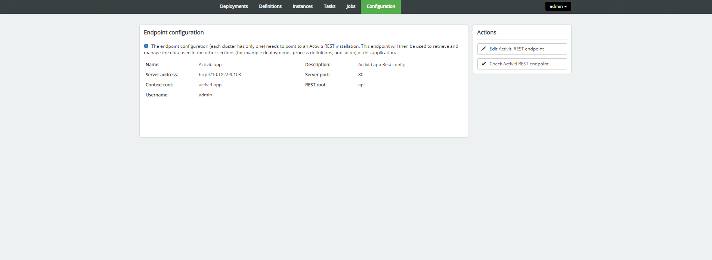
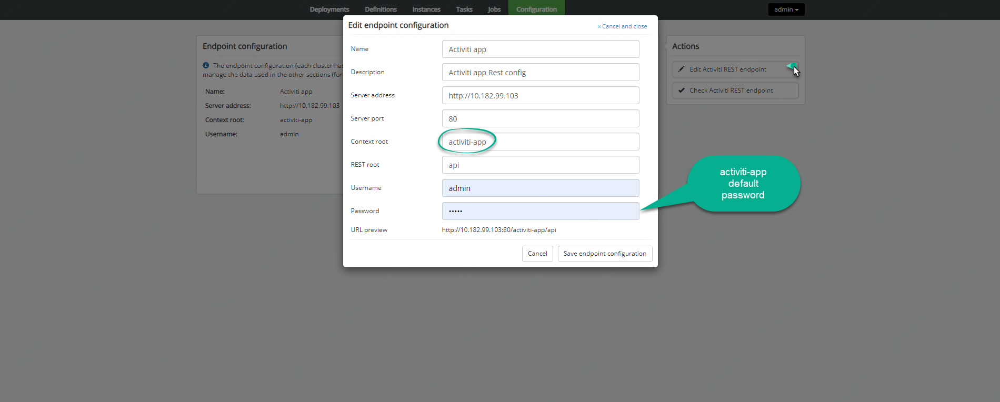

### Activiti Admin

#### DB Configuration

Default location: `activiti-admin/WEB-INF/classes/META-INF/activiti-admin/activiti-admin.properties`

```properties
# security configuration (this key should be unique for your application, and kept secret)
security.rememberme.key=activitis3cr3tk3y


# H2 example (default)

#datasource.driver=org.h2.Driver
#datasource.url=jdbc:h2:tcp://localhost/activitiadmin

# MySQL example

datasource.driver=com.mysql.jdbc.Driver
datasource.url=jdbc:mysql://10.182.88.74:3306/activiti_app?characterEncoding=UTF-8

#datasource.driver=org.postgresql.Driver
#datasource.url=jdbc:postgresql://localhost:5432/activitiadmin

#datasource.driver=com.microsoft.sqlserver.jdbc.SQLServerDriver
#datasource.url=jdbc:sqlserver://localhost:1433;databaseName=activitiadmin

#datasource.driver=oracle.jdbc.driver.OracleDriver
#datasource.url=jdbc:oracle:thin:@localhost:1521:ACTIVITIADMIN

#datasource.driver=com.ibm.db2.jcc.DB2Driver
#datasource.url=jdbc:db2://localhost:50000/activitiadmin

datasource.username=activiti_admin
datasource.password=Admin_1473

# JNDI CONFIG

# If uncommented, the datasource will be looked up using the configured JNDI name.
# This will have preference over any datasource configuration done below that doesn't use JNDI
#
# Eg for JBoss: java:jboss/datasources/activitiDS
#
#datasource.jndi.name=jdbc/activitiDS

# Set whether the lookup occurs in a J2EE container, i.e. if the prefix "java:comp/env/" needs to be added if the JNDI
# name doesn't already contain it. Default is "true".
#datasource.jndi.resourceRef=true

#hibernate.dialect=org.hibernate.dialect.H2Dialect
#hibernate.dialect=org.hibernate.dialect.MySQLDialect
#hibernate.dialect=org.hibernate.dialect.Oracle10gDialect
#hibernate.dialect=org.hibernate.dialect.SQLServerDialect
#hibernate.dialect=org.hibernate.dialect.DB2Dialect
#hibernate.dialect=org.hibernate.dialect.PostgreSQLDialect
#hibernate.show_sql=false
#hibernate.generate_statistics=false

#
# Connection pool (see http://www.mchange.com/projects/c3p0/#configuration)
#

#datasource.min-pool-size=5
#datasource.max-pool-size=100
#datasource.acquire-increment=5
# test query for H2, MySQL, PostgreSQL and Microsoft SQL Server
#datasource.preferred-test-query=select 1
# test query for Oracle
#datasource.preferred-test-query=SELECT 1 FROM DUAL
# test query for DB2
#datasource.preferred-test-query=SELECT current date FROM sysibm.sysdummy1
#datasource.test-connection-on-checkin=true
#datasource.test-connection-on-checkout=true
#datasource.max-idle-time=1800
#datasource.max-idle-time-excess-connections=1800

#
# Cluster settings
#

# This a period of time, expressed in milliseconds, that indicates
# when a node is deemed to be inactive and is removed from the list
# of nodes of a cluster (nor will it appear in the 'monitoring' section of the application).
#
# When a node is properly shut down, it will send out an event indicating
# it is shut down. From that point on, the data will be kept in memory for the amount
# of time indicated here.
# When a node is not properly shut down (eg hardware failure), this is the period of time
# before removal, since the time the last event is received.
#
# Make sure the value here is higher than the sending interval of the nodes, to avoid
# that nodes incorrectly removed.
#
# By default 10 minutes
cluster.monitoring.max.inactive.time=600000

# A cron expression that configures when the check for inactive nodes is made.
# When executed, this will mark any node that hasn't been active for 'cluster.monitoring.max.inactive.time'
# seconds, as an inactive node. Default: every 5 minutes.
cluster.monitoring.inactive.check.cronexpression=0 0/5 * * * ?

# REST endpoint config
rest.app.name=Activiti app
rest.app.description=Activiti app Rest config
rest.app.host=http://localhost
rest.app.port=9999
rest.app.contextroot=activiti-app
rest.app.restroot=api
rest.app.user=admin
rest.app.password=test

# Passwords for rest endpoints and master configs are stored encrypted in the database using AES/CBC/PKCS5PADDING
# It needs a 128-bit initialization vector (http://en.wikipedia.org/wiki/Initialization_vector)
# and a 128-bit secret key represented as 16 ascii characters below
#
# Do note that if these properties are changed after passwords have been saved, all existing passwords
# will not be able to be decrypted and the password would need to be reset in the UI.
security.encryption.credentialsIVSpec=j8kdO2hejA9lKmm6
security.encryption.credentialsSecretSpec=9FGl73ngxcOoJvmL

# BPMN 2.0 Modeler config

modeler.url=https://activiti.alfresco.com/activiti-app/api/

# Enable multi tenant support, disabled by default
#multi-tenant.enabled=true 

```


### Activiti App

#### DB Configuration

Default location: `activiti-app/WEB-INF/classes/META-INF/activiti-app//activiti-app.properties`

```properties
#
# SECURITY
#
security.rememberme.key=testkey

#
# DATABASE
#

#datasource.driver=org.h2.Driver
#datasource.url=jdbc:h2:mem:activiti;DB_CLOSE_DELAY=-1

datasource.driver=com.mysql.jdbc.Driver
datasource.url=jdbc:mysql://10.182.88.74:3306/activiti_app?characterEncoding=UTF-8

datasource.username=activiti_admin
datasource.password=Admin_1473

hibernate.dialect=org.hibernate.dialect.H2Dialect
#hibernate.dialect=org.hibernate.dialect.MySQLDialect
#hibernate.dialect=org.hibernate.dialect.Oracle10gDialect
#hibernate.dialect=org.hibernate.dialect.SQLServerDialect
#hibernate.dialect=org.hibernate.dialect.DB2Dialect
#hibernate.dialect=org.hibernate.dialect.PostgreSQLDialect

# 
# EMAIL
# 

#email.enabled=true
#email.host=localhost
#email.port=1025
#email.useCredentials=false
#email.username=
#email.password=

# The base url that will be used to create urls in emails.
#email.base.url=http://localhost:9999/activiti-app

#email.from.default=no-reply@activiti.alfresco.com
#email.from.default.name=Activiti
#email.feedback.default=activiti@alfresco.com
        
#
# ACTIVITI
#

activiti.process-definitions.cache.max=500

#
# DEFAULT ADMINISTRATOR ACCOUNT
#

admin.email=admin
admin.password=test
admin.lastname=Administrator

admin.group=Superusers

# The maximum file upload limit. Set to -1 to set to 'no limit'. Expressed in bytes
file.upload.max.size=104857600

# For development purposes, data folder is created inside the sources ./data folder
contentstorage.fs.rootFolder=data/
contentstorage.fs.createRoot=true
contentstorage.fs.depth=4
contentstorage.fs.blockSize=1024

```


### 







