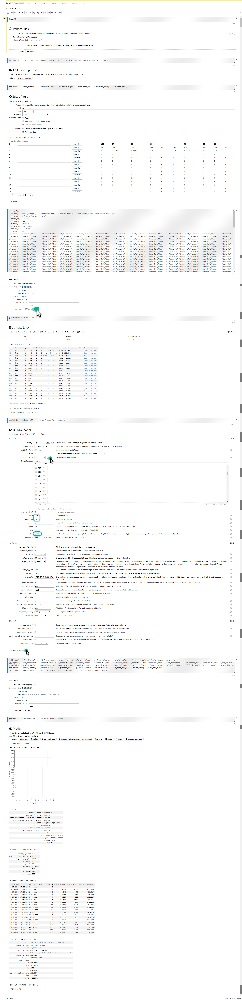

Tutorial
========


#### Distributed Random Forest

> Importing Data

```
https://s3.amazonaws.com/h2o-public-test-data/smalldata/flow_examples/ad.data.gz
```

> Parsing Data


>Building a Model





[Step by step tutorial.](samples/DistributedRandomForest/Distributed-RF.png)


